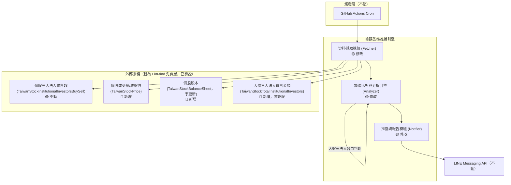
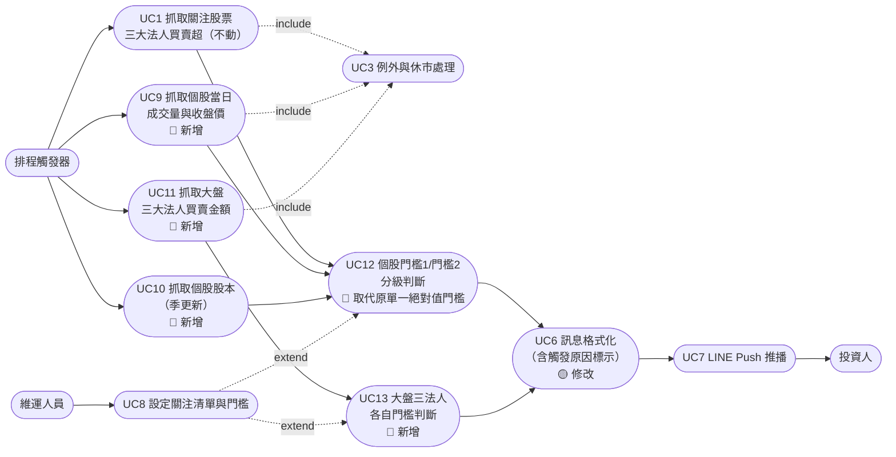
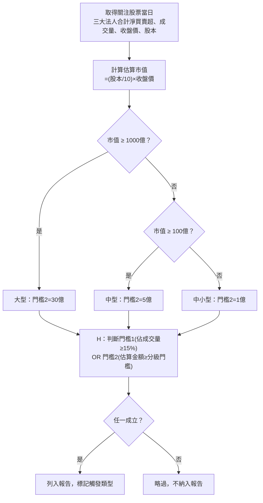
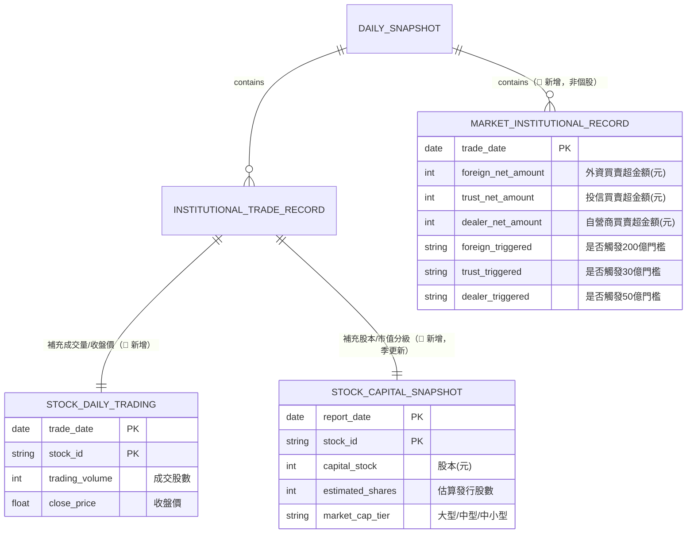

# SA-三大法人分級告警機制-功能模組分析

## 0. 文件資訊與需求摘要

| 項目 | 內容 |
| :--- | :--- |
| 文件類型 | 系統分析（功能模組分析）文件 / SA 需求規格書（既有系統之異動分析，第二輪） |
| 分析範疇 | 在 [SA-三大法人買賣超關注清單通知-功能模組分析.md](./SA-三大法人買賣超關注清單通知-功能模組分析.md) 已定案之「三大法人合計買賣超單一絕對值門檻」基礎上，擴充為**個股多維度分級門檻**＋**大盤三大法人金額門檻**之雙軌告警機制；範疇涉及 Fetcher／Analyzer／Notifier／Config 之進一步異動 |
| 對象讀者 | PO / SA / SD / 開發人員 / 維運人員 |
| 建立日期 | 2026-08-05 |
| 作者 | Claude Code（依 Roy Chiang 提供之門檻分級規則整理） |
| 分析階段 | 本次僅到**功能模組層級**分析；資料表 DDL、API 詳細規格屬後續 SD 階段產出（本次為 SD 過程中發現範疇擴增而回頭補做的 SA） |
| 設計依據 | [SA-三大法人買賣超關注清單通知-功能模組分析.md](./SA-三大法人買賣超關注清單通知-功能模組分析.md)、[SD-三大法人買賣超關注清單通知-系統設計書.md](../../design/architecture/SD-三大法人買賣超關注清單通知-系統設計書.md)（前次 SA/SD，本文件為其進一步異動分析） |

### 名詞定義

| 名詞 | 英文/代碼 | 定義 |
| :--- | :--- | :--- |
| 大盤 | Market-wide | 台灣證券市場整體（加權指數層級），本次新增之監控對象，**不屬於 `watchlist.json.stocks` 個股清單**，為獨立的市場層級監控 |
| 個股法人買賣超金額（估算） | Estimated Institutional Net Amount | 因 FinMind 免費層僅提供買賣「股數」而非「金額」，本次以「買賣超股數 × 當日收盤價」估算金額，非官方精確成交金額，僅供門檻比較使用 |
| 股本 | Capital Stock | 公司發行股份之面額總額，取自 FinMind `TaiwanStockBalanceSheet` 資料集之 `CapitalStock` 科目；發行股數 ≈ 股本 ÷ 面額（台股面額多為 10 元） |
| 市值（估算） | Estimated Market Cap | 本次以「發行股數（依股本換算）× 當日收盤價」估算，非官方精確市值（官方 `TaiwanStockMarketValue` 為付費資料集） |
| 市值分級 | Market Cap Tier | 依估算市值將個股分為大型（≥1,000 億元）、中型（100 億～1,000 億元）、中小型（<100 億元）三級，各級適用不同的門檻 2 絕對金額 |
| 門檻 1（成交量佔比） | Volume Ratio Threshold | 三大法人合計買賣超股數，佔個股當日成交量之比例，達 15% 以上觸發 |
| 門檻 2（分級金額） | Tiered Amount Threshold | 三大法人合計買賣超估算金額，依市值分級適用不同絕對金額門檻（大型 ≥30 億／中型 ≥5 億／中小型 ≥1 億），達標觸發 |
| 大盤三大法人金額門檻 | Market-wide Institutional Threshold | 外資／投信／自營商三類法人**各自獨立**之單日買賣超金額（絕對值）門檻：外資 ≥200 億、投信 ≥30 億、自營商（自行買賣＋避險合計）≥50 億 |

### 需求摘要

前次 [SA-三大法人買賣超關注清單通知](./SA-三大法人買賣超關注清單通知-功能模組分析.md) 將門檻篩選機制定義為「三大法人合計淨買賣超 ≥ 單一絕對值門檻（暫定 500 張）」，此設計在後續 SD 討論中被指出**無法反映不同規模股票的合理波動基準**（500 張門檻對台積電這種千億市值股票幾乎每日觸發、失去篩選意義），且**缺乏大盤整體動能的監控**（僅有個股層級資料，無法掌握外資/投信/自營商當日對整體市場的多空態度）。

因此本次需求為：**將門檻機制擴充為「個股多維度分級門檻」＋「大盤三大法人金額門檻」雙軌並行**：

1. **個股維度**：改用「佔成交量比例」與「依市值分級的絕對金額」兩個門檻，任一達標即觸發（取代原單一絕對值門檻）。
2. **大盤維度**：新增獨立於個股清單之外的「大盤三大法人買賣金額」監控，外資/投信/自營商三者各自獨立判斷是否達標。

經逐一驗證，本次所需的額外資料（個股成交量、個股股本、大盤三大法人買賣金額）**皆可透過 FinMind 免費層取得**，其中大盤金額資料甚至可直接取得官方加總數字，無需額外估算；僅個股法人買賣超金額因免費層無原生金額欄位，需以「股數 × 收盤價」估算。

| 子模組 | 本次異動類型 | 異動摘要 |
| :--- | :--- | :--- |
| 資料抓取模組 (Fetcher) | 🟡 修改 | 新增抓取個股當日成交量、個股股本（季）、大盤三大法人買賣金額三條資料流 |
| 籌碼比對與分析引擎 (Analyzer) | 🟡 修改 | 門檻篩選邏輯由單一絕對值改為「個股雙門檻 OR 判斷」＋「大盤三法人各自獨立判斷」 |
| 推播與報告模組 (Notifier) | 🟡 修改 | 新增「大盤三大法人動態」區塊；個股區塊需標示觸發的是門檻 1 或門檻 2（差異化告警訊息，具體文案留 SD 階段設計） |
| 設定檔 (Config) | 🟡 修改 | 新增市值分級門檻、大盤門檻等設定項 |

---

## 一、關鍵設計原則

| 項目 | 結論 |
| :--- | :--- |
| 新增資料來源（皆已驗證免費可用） | ① `TaiwanStockPrice`（個股當日成交量 `Trading_Volume`）② `TaiwanStockBalanceSheet`（個股股本 `CapitalStock` 科目，季更新）③ `TaiwanStockTotalInstitutionalInvestors`（大盤三大法人買賣金額，含 `total` 加總列，**直接為金額，無需估算**）。三者皆已對 `2330` 實測回傳 `200 success` |
| 個股金額為估算值，需標註 | FinMind 免費層個股三大法人資料（`TaiwanStockInstitutionalInvestorsBuySell`）僅有股數，無金額；官方精確市值資料集 `TaiwanStockMarketValue` 為付費限定。本次個股金額／市值一律以「股數 × 當日收盤價」「股本 ÷ 面額 × 收盤價」**估算**，訊息呈現時需標示為估算值，不對外聲稱為官方精確數字 |
| 市值分級臨界點（已定案） | 大型：估算市值 ≥1,000 億元；中型：100 億～1,000 億元；中小型：<100 億元。三檔連續無缺口 |
| 個股門檻邏輯（已定案） | 門檻 1（佔當日成交量 ≥15%）與門檻 2（依市值分級之絕對金額門檻）為 **OR 關係**，任一達標即觸發列入報告；門檻 2 僅使用分級絕對金額，不另外疊加「佔股本 0.5%」規則（避免同時維護兩套邏輯造成不一致） |
| 個股門檻 2 分級金額（已定案） | 大型 ≥30 億元；中型 ≥5 億元；中小型 ≥1 億元（皆取使用者提供區間之下緣，維持較高敏感度） |
| 大盤門檻（已定案） | 外資單日買賣超絕對值 ≥200 億元；投信 ≥30 億元；自營商（自行買賣＋避險合計）≥50 億元；三者**各自獨立判斷**，不互相要求同時成立，任一類別達標即針對該類別觸發告警 |
| 大盤為全新監控對象 | 大盤資料**不屬於** `config/watchlist.json.stocks`，性質是「市場層級」而非「個股層級」，每次執行僅需呼叫一次（不隨監控股票數量增加而增加呼叫次數），需在資料模型與 Fetcher 邏輯中明確與個股資料分開 |
| 股本資料快取策略 | 股本為季更新資料，不需每日重新呼叫 `TaiwanStockBalanceSheet`；沿用既有快照機制精神，但快取有效期與更新時機屬 SD 階段細化事項（見第六章） |
| 差異化告警訊息 | 個股觸發門檻 1（量能異常）與門檻 2（大額進出）、大盤觸發外資/投信/自營商门檻，訊息呈現上應可區分「觸發的是哪一種情況」；具體文案與嚴重度分級留待 SD 階段設計，本次僅在 FR 層級定義「需可區分」之需求 |

---

## 二、現行系統分析（As-Is）

### 現況

延續前次 SA/SD 已定案之設計：`Analyzer` 的三大法人門檻篩選目前僅實作為「合計淨買賣超絕對值 ≥ 單一門檻（`thresholds.json.default.institutional_net_volume`）」，且監控範圍僅限 `watchlist.json.stocks` 內的個股，無市場整體（大盤）層級的判斷邏輯。

**缺口對照：**

| 缺口 | 現況影響 |
| :--- | :--- |
| 單一絕對值門檻不分股票規模 | 大型權值股（如台積電）三大法人合計買賣超動輒上萬張，500 張門檻幾乎「天天觸發」，失去篩選顯著事件的意義；中小型股則可能反過來「500 張門檻過高」，錯失真正的主力進出訊號 |
| 無大盤層級監控 | 使用者無法從既有簡報得知當日外資/投信/自營商對整體市場的多空態度，僅能看到個股層級碎片資訊 |
| 門檻觸發原因不可區分 | 現行設計僅有單一 boolean 式門檻判斷，無法讓使用者一眼看出「這檔股票是量能異常還是大額進出被列入報告」 |

### 可複用的現行機制

| 機制 | 現行元件 | To-Be 用途 |
| :--- | :--- | :--- |
| `InstitutionalTradeRecord` 與快照存取模式 | `src/models.py`、`src/storage.py`（前次 SD 已定義） | 沿用同一套快照存取模式，擴充欄位／新增檔案類型以承載成交量、股本、大盤資料 |
| `Fetcher` 逐股迴圈呼叫模式 | `src/fetcher.py`（前次 SD 已定義 `fetch_institutional_trades`） | 個股成交量／股本抓取沿用同一迴圈；大盤資料因不屬個股清單，另立獨立呼叫（每次執行一次） |
| `InstitutionalFilter` 門檻篩選骨架 | `src/analyzer.py`（前次 SD 已定義） | 篩選邏輯由單一絕對值改為雙門檻 OR 判斷，骨架（讀取 `ConfigLoader` 門檻設定 → 比對 → 回傳達標清單）沿用 |
| `MessageFormatter` 簡報組版機制 | `src/notifier.py`（前次 SD 已定義） | 沿用組版框架，新增大盤區塊與觸發原因標示邏輯 |
| Fetcher 例外容錯模式 | `try/except` 不中斷、記錄 Log、`SourceStatus` 標記 | 完全沿用於三個新資料源 |

---

## 三、目標系統分析（To-Be）

### 模組總覽



### 使用案例圖（Use Case Diagram）

**參與角色（Actor）：** 排程觸發器、投資人、維運人員（沿用前次定義）



### 3.1 資料抓取模組（對應 UC9、UC10、UC11、UC3）

| 編號 | 功能 | 說明 |
| :--- | :--- | :--- |
| FR-1.4（🔴 新增） | 個股當日成交量與收盤價抓取 | 依 `watchlist.json.stocks` 逐股呼叫 FinMind `TaiwanStockPrice`，取得 `Trading_Volume`（成交股數）與 `close`（收盤價），供門檻 1 與金額估算使用 |
| FR-1.5（🔴 新增） | 個股股本抓取（季更新） | 逐股呼叫 FinMind `TaiwanStockBalanceSheet`，取得 `CapitalStock` 科目換算發行股數與估算市值，供市值分級判斷使用；因屬季更新資料，抓取頻率與快取策略見第六章 |
| FR-1.6（🔴 新增） | 大盤三大法人買賣金額抓取 | 呼叫 FinMind `TaiwanStockTotalInstitutionalInvestors`（**不逐股，每次執行僅呼叫一次**），取得外資／投信／自營商（自行買賣＋避險）當日買賣金額 |
| FR-1.3（🟢 沿用） | 異常與休市處理 | 三個新資料源比照既有機制辦理 |

**特殊規則：新增資料來源對照表**

| 資料類型 | 來源 | 驗證狀態 | 輸入參數 | 輸出關鍵欄位 |
| :--- | :--- | :--- | :--- | :--- |
| 個股成交量/收盤價 | FinMind `TaiwanStockPrice` | ✅ 已對 `2330` 實測 `200 success` | `data_id`、日期區間 | `Trading_Volume`（股）、`Trading_money`、`close` |
| 個股股本 | FinMind `TaiwanStockBalanceSheet` | ✅ 已對 `2330` 實測 `200 success`，`CapitalStock` 科目確認可取得 | `data_id`、日期區間 | `type="CapitalStock"` 對應 `value`（元），季更新（`date` 為財報季底） |
| 大盤三大法人買賣金額 | FinMind `TaiwanStockTotalInstitutionalInvestors` | ✅ 已實測 `200 success`，含 `Foreign_Investor`／`Investment_Trust`／`Dealer_self`／`Dealer_Hedging`／`Foreign_Dealer_Self`／`total` 六類 | 日期區間（**不需 `data_id`**） | `buy`（元）、`sell`（元），單位已是金額非股數 |

### 3.2 籌碼比對與分析引擎（對應 UC12、UC13）

| 編號 | 功能 | 說明 |
| :--- | :--- | :--- |
| FR-2.3（🔴 新增） | 個股法人買賣超金額估算 | `估算金額 = 三大法人合計淨買賣超股數 × 當日收盤價`；估算市值 `= (股本 ÷ 10) × 收盤價` |
| FR-2.4（🔴 新增） | 個股市值分級判斷 | 依估算市值歸類為大型／中型／中小型（臨界點見第一章），決定門檻 2 適用之絕對金額 |
| FR-2.5（🔴 取代原 FR-2.1 單一絕對值門檻） | 個股雙門檻 OR 判斷 | 門檻 1：合計買賣超股數 ÷ 當日成交量 ≥15%；門檻 2：估算金額絕對值 ≥ 該股市值分級對應門檻；兩者 **OR**，任一達標即列入報告，並標記觸發的是門檻 1 或門檻 2（供 Notifier 顯示不同措辭） |
| FR-2.6（🔴 新增） | 大盤三法人各自門檻判斷 | 外資／投信／自營商三者**各自獨立**與對應門檻（200 億／30 億／50 億）比較，各自判斷是否觸發，不要求三者同時成立 |

**個股雙門檻判斷規則：**

| 門檻 | 判定條件 |
| :--- | :--- |
| 門檻 1（量能異常） | `abs(三大法人合計淨買賣超股數) / 當日成交量 ≥ 0.15` |
| 門檻 2（大額進出） | `abs(三大法人合計淨買賣超股數 × 收盤價)` ≥ 依市值分級門檻：大型 30 億／中型 5 億／中小型 1 億 |
| 觸發結果 | 門檻 1 OR 門檻 2 任一成立 → 列入報告，並記錄觸發類型（`VOLUME_RATIO` / `TIERED_AMOUNT` / 兩者皆觸發） |



**大盤三法人門檻判斷規則：**

| 法人別 | 門檻（絕對值） | 資料欄位 |
| :--- | :--- | :--- |
| 外資 | ≥200 億元 | `Foreign_Investor.buy - sell`（＋`Foreign_Dealer_Self`，比照前次 SA 合併顯示決策） |
| 投信 | ≥30 億元 | `Investment_Trust.buy - sell` |
| 自營商 | ≥50 億元 | `Dealer_self.buy - sell` + `Dealer_Hedging.buy - sell` |

### 3.3 推播與報告產出模組（訊息格式化異動）

| 編號 | 功能 | 說明 |
| :--- | :--- | :--- |
| FR-3.3（🟡 修改） | 差異化告警訊息格式化 | 個股區塊需標示觸發原因（量能異常／大額進出）；新增「◆ 大盤三大法人動態」獨立區塊，僅列出當日**有觸發門檻**的法人類別（例如僅外資達標時，只顯示外資該行，不強制列出三行） |

**簡報格式草案（示意，具體文案留 SD 階段設計）：**

```
【籌碼監控日報】2026-08-05

◆ 大盤三大法人動態
  外資單日賣超 235 億元（達門檻 200 億）

◆ 三大法人買賣超（個股）
  2330 台積電［大額進出］
    外資 -5,731 張／投信 +85 張／自營商 -178 張（估算金額：賣超 57.3 億元，市值分級：大型）
  2454 聯發科［量能異常］
    法人合計買賣超佔當日成交量 18.2%

（本訊息由籌碼監控引擎自動產生，個股金額為估算值）
```

### To-Be 資料模型（概念層，新增部分）



---

## 四、非功能性需求與驗收標準（NFR & Acceptance Criteria）

| 類別 | 需求內容 |
| :--- | :--- |
| 資料一致性 | 個股金額／市值為估算值，需在訊息與內部資料中明確標註「估算」性質，不得誤導為官方精確數字 |
| 效能／額度控管 | 新增三個 FinMind 資料源呼叫，`TaiwanStockPrice`／`TaiwanStockInstitutionalInvestorsBuySell` 隨監控股票數線性增加（逐股呼叫），`TaiwanStockBalanceSheet` 建議依季更新頻率快取、不需每日呼又，`TaiwanStockTotalInstitutionalInvestors` 每次執行僅需 1 次，額度風險低 |
| 可維護性 | 市值分級臨界點、個股/大盤門檻金額集中於設定檔管理，不寫死於程式碼，便於日後調整 |
| 語系 | 訊息內容一律繁體中文，本次不異動 |

### 驗收標準（Acceptance Criteria）

| 驗收項目 | 驗收條件 | 驗收方式 |
| :--- | :--- | :--- |
| 個股雙門檻判斷正確性 | 給定測試資料集（含大型/中型/中小型各一檔），門檻 1／門檻 2 判斷結果與人工試算一致 | 單元測試 |
| 大盤三法人各自判斷正確性 | 給定測試資料集，三個法人類別各自的觸發判斷與人工試算一致（含僅部分類別觸發之情境） | 單元測試 |
| 市值分級正確性 | 給定股本與收盤價測試資料，估算市值與分級結果符合第一章定義之臨界點 | 單元測試 |
| 觸發原因可追溯 | 報告內容可區分「量能異常」與「大額進出」，且金額標示為估算值 | 人工於實機 LINE 檢視 |
| 股本快取有效性 | 股本資料不需每日重新呼叫 API 仍能正確判斷市值分級 | 單元測試（模擬快取命中/未命中情境） |

---

## 五、需求追溯表（Traceability）

| 來源需求 | To-Be 對應章節/FR | 受影響元件（概念層） |
| :--- | :--- | :--- |
| 缺口：單一絕對值門檻不分股票規模 | §二 現況、§3.2 FR-2.4／FR-2.5 | Analyzer（市值分級器、雙門檻篩選器） |
| 缺口：無大盤層級監控 | §3.1 FR-1.6、§3.2 FR-2.6 | Fetcher（大盤資料抓取）、Analyzer（大盤門檻判斷） |
| 決策：個股門檻1 OR 門檻2 | §3.2 個股雙門檻判斷規則 | Analyzer |
| 決策：市值分級臨界點（1000億/100億） | §一 關鍵設計原則、§3.2 | Analyzer（市值分級器） |
| 決策：大盤門檻（200億/30億/50億） | §一 關鍵設計原則、§3.2 大盤三法人門檻判斷規則 | Analyzer |
| FR-1.4/1.5/1.6 新資料抓取 | §3.1 | Fetcher |
| FR-3.3 差異化告警訊息 | §3.3 | Notifier（`MessageFormatter`） |

---

## 六、SD 階段待細化事項

- **股本資料快取策略**：`TaiwanStockBalanceSheet` 季更新，SD 階段需設計快取有效期（例如：以財報季度 `date` 判斷是否需要重新呼叫）與快照檔案結構。
- **市值分級的股本→股數換算面額假設**：本次假設面額均為 10 元，實務上是否所有監控股票皆為面額 10 元需 SD 階段核實（多數台股為 10 元，但不可完全排除例外）。
- **差異化告警訊息具體文案與嚴重度分級**：「量能異常」「大額進出」之實際顯示文字、emoji／顏色標示（LINE 純文字訊息的視覺區分手法）留待 SD 階段設計。
- **大盤區塊在簡報中的呈現順序**：置於個股區塊之前或之後，需與維運人員確認閱讀習慣偏好。
- **金額估算基準**：目前採「收盤價」估算，是否改採「均價」（`Trading_money / Trading_volume`）更準確，留待 SD 階段決定（`TaiwanStockPrice` 已同時提供兩者所需欄位）。
- **市值分級臨界點與門檻金額之設定檔化細節**：`thresholds.json` schema 擴充方式（新增巢狀結構或扁平鍵值）留待 SD 階段設計。

---

## 七、來源檔案索引

- [SA-三大法人買賣超關注清單通知-功能模組分析.md](./SA-三大法人買賣超關注清單通知-功能模組分析.md)（前次 SA，本文件之基礎）
- [SD-三大法人買賣超關注清單通知-系統設計書.md](../../design/architecture/SD-三大法人買賣超關注清單通知-系統設計書.md)（前次 SD，本文件為其進一步異動分析）
- `f:\projects\FinanceTracker\src\fetcher.py`、`src\analyzer.py`、`src\notifier.py`、`src\models.py`、`src\config.py`、`src\storage.py`（現行實作，待後續 SD 調整）
- 本次對話中對 FinMind `TaiwanStockPrice`／`TaiwanStockBalanceSheet`／`TaiwanStockTotalInstitutionalInvestors` 之即時驗證呼叫紀錄（皆為 `200 success`）
