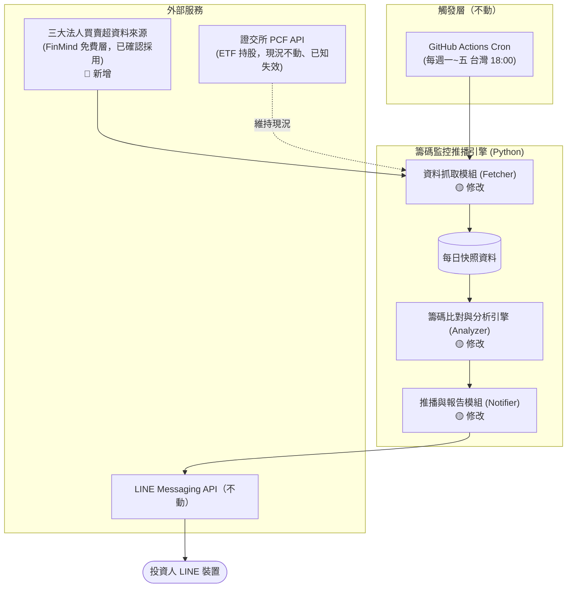
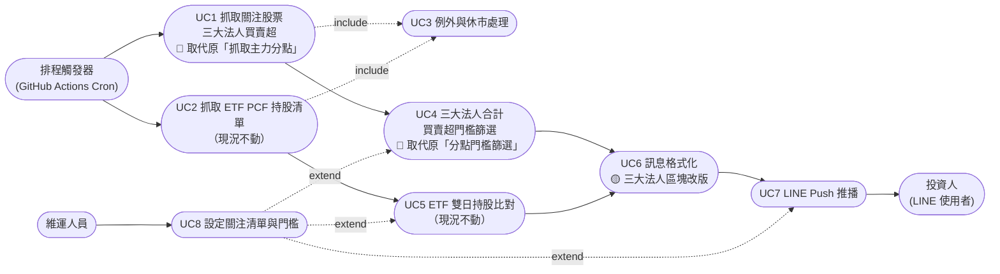
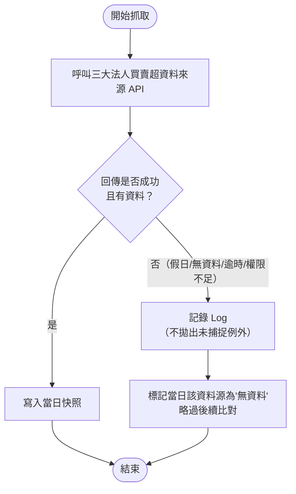
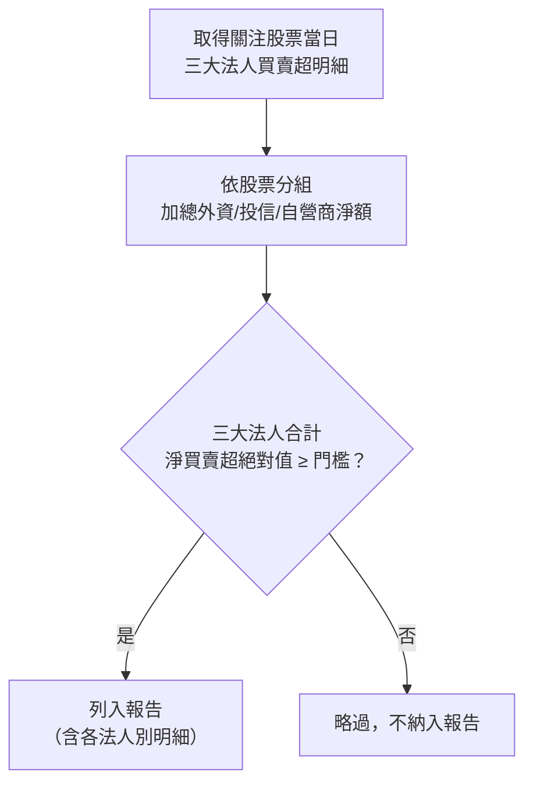
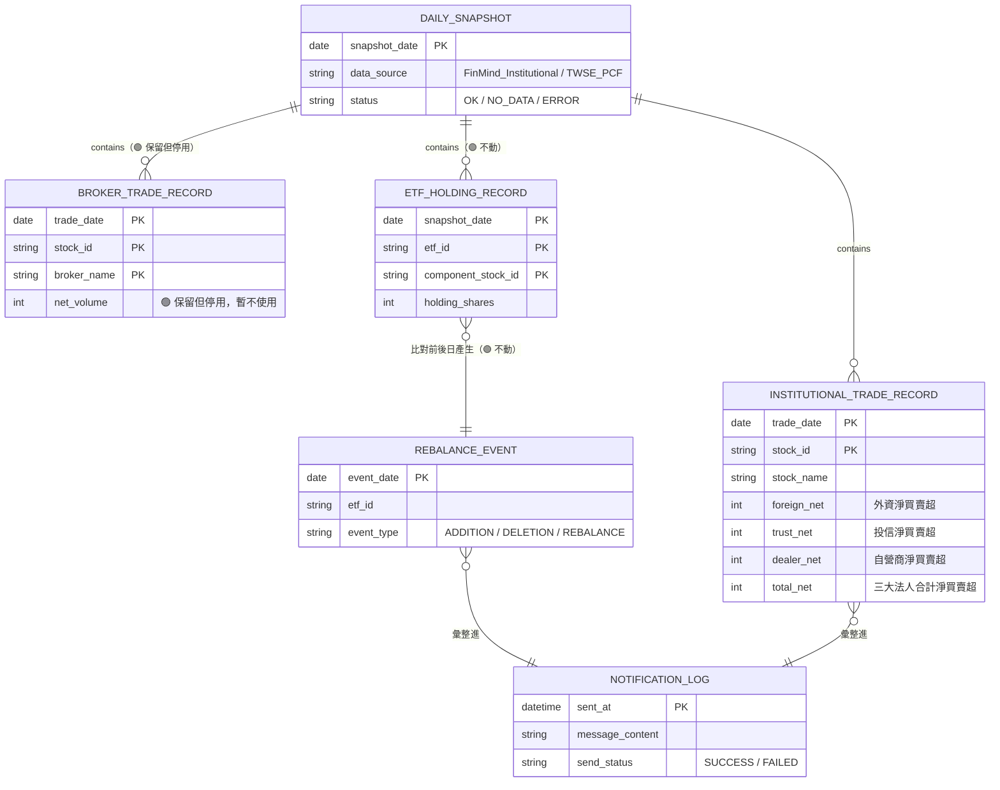

# SA-三大法人買賣超關注清單通知-功能模組分析

## 0. 文件資訊與需求摘要

| 項目 | 內容 |
| :--- | :--- |
| 文件類型 | 系統分析（功能模組分析）文件 / SA 需求規格書（既有系統之異動分析） |
| 分析範疇 | `FinanceTracker` 專案「籌碼監控推播引擎」之**主力分點監控模組改版為三大法人買賣超監控模組**，涉及 Fetcher／Analyzer／Notifier／Config 四個既有元件之異動；**ETF PCF 換倉監控模組不在本次範疇內**，維持現況 |
| 對象讀者 | PO / SA / SD / 開發人員 / 維運人員 |
| 建立日期 | 2026-08-05 |
| 作者 | Claude Code（依 Roy Chiang 提供之需求確認項目整理） |
| 分析階段 | 本次僅到**功能模組層級**分析；資料表 DDL、API 詳細規格（Request/Response Schema）、類別圖屬後續 SD 階段產出 |
| 設計依據 | [SA-籌碼監控推播引擎-功能模組分析.md](./SA-籌碼監控推播引擎-功能模組分析.md)（原始 SA 文件，本文件為其異動分析）、現行程式碼 `src/`、`config/` |

### 名詞定義

| 名詞 | 英文/代碼 | 定義 |
| :--- | :--- | :--- |
| 三大法人 | Institutional Investors | 外資及陸資（含外資自營商）、投信、自營商（自行買賣＋避險）三類機構投資人之合稱 |
| 外資 | Foreign_Investor | 外資及陸資買賣超（不含外資自營商） |
| 投信 | Investment_Trust | 證券投資信託公司買賣超 |
| 自營商 | Dealer_self / Dealer_Hedging | 證券自營商自行買賣（Dealer_self）與避險（Dealer_Hedging）買賣超 |
| 三大法人合計買賣超 | Institutional Net Total | 同一檔股票、同一交易日，外資＋投信＋自營商三類買賣超加總後之淨值，本次作為門檻篩選之判斷基準 |
| 關注清單 | Watchlist | 使用者於 `config/watchlist.json` 設定之監控股票代碼清單，本次沿用作為三大法人買賣超之監控對象範圍 |
| 分點買賣超 | Broker Net Buy/Sell | 既有功能，特定券商分點於特定股票的買進張數－賣出張數；本次**降級為停用狀態**，見第一章 |
| FinMind | — | 提供台股籌碼面資料的第三方 API 服務；**本次已確認採用**其免費層之 `TaiwanStockInstitutionalInvestorsBuySell` 資料集作為三大法人買賣超之唯一資料來源，見第六章驗證紀錄 |
| TEJ API | — | 台灣經濟新報提供之金融資料 API 服務，另設有試用資料庫（Trial DB），資料表 `TWN/TATINST1`（三大法人買賣超）名列試用資料庫表單內，但目前測試金鑰對所有表格皆無存取權限；**本次不採用**，僅列為日後 FinMind 失效時的備選方案，見第六章 |

### 需求摘要

現行「籌碼監控推播引擎」的主力分點監控功能（[fetcher.py](../../../src/fetcher.py) 呼叫 FinMind `dataset=TaiwanStockTradingDailyReportSecIdAgg`）經實際呼叫 FinMind API 驗證後確認**該 dataset 名稱本身不存在**（422 錯誤，回傳合法 dataset enum 清單中並無此值），且即便更正為正確名稱 `TaiwanStockTradingDailyReport`，該資料集仍**須付費 Sponsor 會員**才能存取（免費 token 回傳 `400 Your level is free`）。經進一步排查 TWSE 官方 OpenAPI、FinMind 免費層、TEJ 試用資料庫、永豐金 Shioaji API、第三方網站 etfcross.com 共五個管道，確認「券商分點買賣超」在台灣公開生態中普遍為商業授權資料（TWSE 自身即以 NT$80,000+/月販售），無真正免費替代管道。

因此本次需求為：**將「主力分點監控」改版為「三大法人買賣超監控」**。資料來源已**確認採用 FinMind 免費層 `TaiwanStockInstitutionalInvestorsBuySell` 資料集**——針對關注清單內的 `2330`、`2454` 分別實測單股查詢，皆回傳 `200 success`，資料涵蓋外資／外資自營商／投信／自營商（自行買賣＋避險）五個類別，且日期涵蓋至查詢當下最新交易日（無明顯延遲），免 token 亦可呼叫成功；監控對象沿用既有 `config/watchlist.json` 的股票清單設定機制，維持每日盤後定時推播與門檻篩選精神；既有分點監控之程式碼與設定**保留但停用**，ETF PCF 換倉監控模組**維持現況不予異動**。TEJ 因金鑰權限尚未開通，本次不採用，列為備選方案（見第六章）。

| 子模組 | 本次異動類型 | 異動摘要 |
| :--- | :--- | :--- |
| 資料抓取模組 (Fetcher) | 🟡 修改 | 主力分點資料來源改為三大法人買賣超資料來源；ETF PCF 抓取邏輯不動 |
| 籌碼比對與分析引擎 (Analyzer) | 🟡 修改 | 分點門檻篩選改為三大法人合計買賣超門檻篩選；ETF 雙日持股比對邏輯不動 |
| 推播與報告模組 (Notifier) | 🟡 修改 | 簡報格式中「主力分點顯著買賣超」區塊改為「三大法人買賣超」區塊；LINE 推播機制不動 |
| 設定檔 (Config) | 🟡 修改 | 新增三大法人門檻設定；`broker_branches.json` 與分點相關監控設定保留但新增停用旗標 |

---

## 一、關鍵設計原則

| 項目 | 結論 |
| :--- | :--- |
| 資料來源已確定並可替換 | **本次確認採用 FinMind 免費層 `TaiwanStockInstitutionalInvestorsBuySell`**（已對關注清單股票實測 `200 success`，見第二章），Fetcher 仍依既有「可替換模組介面」設計原則實作（沿用原 SA 文件關鍵設計原則），不得將 Analyzer／Notifier 邏輯與 FinMind 綁死，以便日後 FinMind 政策變動時可切換至 TEJ 等備選來源 |
| 監控對象沿用既有機制 | 直接沿用 `config/watchlist.json` 之 `stocks` 清單作為三大法人監控股票範圍，**不新增獨立設定檔**；既有 `brokers` 欄位與分點監控相關保留但不再使用於本次功能 |
| 逐股查詢，不做全市場批次呼叫 | 已實測確認 FinMind 免費層**不支援省略 `data_id` 的全市場批次查詢**（回傳 `400 Your level is free`），僅能逐檔股票代碼查詢；沿用現行 `fetcher.py` 既有的「逐股迴圈呼叫」模式，不需批次化設計 |
| 三大法人合計口徑（暫定，待確認） | 以「外資（`Foreign_Investor`）＋ 外資自營商（`Foreign_Dealer_Self`）＋ 投信（`Investment_Trust`）＋ 自營商自行買賣（`Dealer_self`）＋ 自營商避險（`Dealer_Hedging`）」五個欄位加總後之合計淨買賣超，作為門檻篩選之判斷基準；訊息內文仍列出各法人別明細供判讀。**加總口徑細節（外資自營商是否併入外資顯示）待 SD 階段財務邏輯確認**，見第六章 |
| 數量單位換算 | 已實測確認 FinMind 回傳之 `buy`／`sell` 單位為**股**（非既有分點功能慣用的「張」），例如 2330 單日買超可達千萬股等級；訊息格式化如需比照原「張」為單位呈現，**須除以 1,000 換算**，細節見第六章 |
| 分點功能降級但不刪除 | `broker_branches.json`、`BrokerTradeRecord`、`BrokerFilter`、分點相關 FR 之程式碼與設定**保留但新增停用旗標**，本次預設關閉；避免日後找到可行分點資料源或升級付費方案時需重寫 |
| ETF 模組零異動 | ETF PCF 換倉監控模組（`EtfHoldingRecord`、`RebalanceEvent`、`RebalanceClassifier`、`TwsePcfClient`）**本次不予變動**，維持現況（含既有已知的資料源失效問題），不納入本次驗收範圍 |
| 門檻延續設計 | 沿用原 SA 文件「門檻可設定化」原則，於 `thresholds.json` 新增三大法人合計買賣超門檻設定項，語意比照既有 `broker_net_volume`，但作用對象改為三大法人合計淨值 |
| 例外容錯策略沿用 | 沿用既有 Fetcher 例外容錯模式（try/except 不中斷、記錄 Log、`SourceStatus` 標記），套用於新資料源 |

---

## 二、現行系統分析（As-Is）

### 現況

與原始 SA 文件不同，本次分析對象已是**實際落地的程式系統**（`src/fetcher.py`、`src/analyzer.py`、`src/notifier.py`、`src/models.py`、`src/config.py`、`src/storage.py` 均已實作完成），而非人工作業流程。現況問題聚焦於：**主力分點資料源已證實無法使用**。

- 現行 [`FinMindClient.fetch_broker_trades`](../../../src/fetcher.py) 呼叫 `dataset=TaiwanStockTradingDailyReportSecIdAgg`；經直接呼叫 FinMind API 驗證，此 dataset 名稱**不存在**於官方合法 enum 清單內，回傳 `422 Unprocessable Entity`。
- 即便修正為正確名稱 `TaiwanStockTradingDailyReport`，該資料集仍屬**付費 Sponsor 會員專屬**，免費 token 呼叫回傳 `400 {"msg":"Your level is free..."}`。
- 因此，現行系統**每次執行「主力分點」抓取皆會失敗**，`run.sh` 執行紀錄可見 `[WARNING] FinMind 抓取失敗：422 Client Error`，最終每日簡報的「◆ 主力分點顯著買賣超」區塊固定顯示「（無達門檻標的）」，功能形同虛設。
- 已排查 TWSE 官方 OpenAPI（`openapi.twse.com.tw`，143 個端點內無分點資料端點）、FinMind 免費層（分點資料集一律付費限定）、TEJ 試用資料庫（`db=TRAIL` 僅 25 張表，分點相關表格 `AMTOP`／`ABSR20` 等**皆不在試用範圍**）、永豐金 Shioaji API（官方功能清單無分點資料）、第三方網站 etfcross.com（無公開 API，資料為其私有 Firebase 後端）共五個管道，證實分點買賣超於台灣公開生態中普遍為商業授權資料，無真正免費替代管道。
- 另一方面，已針對關注清單股票逐一實測 FinMind 免費層 `TaiwanStockInstitutionalInvestorsBuySell` 資料集：
  - `2330`（2026-07-27 ~ 2026-07-31 共 5 個交易日）與 `2454`（單日）皆回傳 `200 success`，且免帶 `token` 參數即可成功呼叫；
  - 加測至最新交易日 `2026-08-04`（查詢當下之前一交易日）同樣回傳有效資料，確認**無明顯資料延遲**，足以支援每日盤後即時推播；
  - 回傳資料含 `Foreign_Investor`（外資）、`Foreign_Dealer_Self`（外資自營商）、`Investment_Trust`（投信）、`Dealer_self`（自營商自行買賣）、`Dealer_Hedging`（自營商避險）五個類別，單位為**股**（非「張」）；
  - 唯獨**省略 `data_id`、嘗試一次抓全市場**時回傳 `400 Your level is free`，證實免費層僅支援逐股查詢，與現行程式碼既有的「逐股迴圈呼叫」模式相符，不需改動呼叫模式。
  - **結論：FinMind 免費層足以達成本次需求，本次確定採用**，不需依賴 TEJ。TEJ 試用資料庫表單中雖亦列有對應表 `TWN/TATINST1`，但目前測試金鑰對所有資料表（含此表）均回傳 `PDB003 您沒有存取資料表的權限`，故僅列為備選方案，不阻塞本次開發。

**痛點對照：**

| 痛點 | 現況影響 |
| :--- | :--- |
| 分點資料源失效 | 現行程式每次執行皆記錄 WARNING、無任何分點資料可用，「主力分點顯著買賣超」區塊永遠顯示「無達門檻標的」，功能形同虛設 |
| 免費替代方案存在但未串接 | FinMind 免費層已提供可正常運作的三大法人買賣超資料集，現行程式碼尚未對接此資料源 |
| 分點與三大法人資料結構不同 | 現行 `BrokerFilter`／`MessageFormatter` 假設每筆記錄為 `(股票, 分點名稱, 淨買賣超)` 單一維度；三大法人資料則是同一股票下並存「外資／投信／自營商」多個類別，需另設計聚合邏輯才能沿用既有門檻篩選架構 |

### 可複用的現行機制

| 機制 | 現行元件 | To-Be 用途 |
| :--- | :--- | :--- |
| 監控股票清單設定 | `ConfigLoader.get_watchlist_stocks()`（`config/watchlist.json.stocks`） | 直接沿用作為三大法人買賣超監控股票範圍，不需新增設定檔 |
| 快照存取模式 | `SnapshotRepository`（`snapshot_date` 目錄＋JSON 檔案慣例，如 `write_broker_trades`） | 沿用同一套存取模式，新增對應之三大法人快照讀寫方法 |
| 門檻比對邏輯骨架 | `BrokerFilter.filter_significant_trades`（`abs(net_volume) >= threshold`） | 邏輯骨架沿用，比對對象改為三大法人合計淨買賣超 |
| 簡報組版與推播機制 | `MessageFormatter`、`LineClient`、`Notifier`（含重試機制） | 完全沿用，僅新增三大法人區塊的組版函式，區塊標題／內容置換 |
| Fetcher 例外容錯模式 | `try/except` 不中斷、記錄 Log、`SourceStatus` 狀態標記 | 完全沿用於新資料源之異常處理 |
| 門檻可設定化機制 | `thresholds.json`（`default`／`overrides` 結構） | 沿用相同 schema 慣例，新增三大法人合計門檻鍵值 |

---

## 三、目標系統分析（To-Be）

### 模組總覽



### 使用案例圖（Use Case Diagram）

**參與角色（Actor）：**
- 排程觸發器（GitHub Actions Cron）：以系統角色觸發整體流程，非人類使用者
- 投資人（LINE 使用者）：被動接收推播簡報
- 維運人員（Maintainer）：設定關注清單、門檻參數與收訊名單



### 3.1 資料抓取模組（對應 UC1、UC3；UC2 現況不動）

| 編號 | 功能 | 說明 |
| :--- | :--- | :--- |
| FR-1.1（🔴 取代原 FR-1.1 主力分點資料抓取） | 三大法人買賣超資料抓取 | 依 `config/watchlist.json.stocks` 清單，逐檔股票呼叫 **FinMind API `TaiwanStockInstitutionalInvestorsBuySell`**（免費層，已確認採用），取得當日「外資」「外資自營商」「投信」「自營商（自行買賣／避險）」五類買進股數／賣出股數 |
| FR-1.2（🟢 不動） | ETF PCF 持股清單抓取 | 維持現況，本次不予異動（含既有已知的資料源失效問題） |
| FR-1.3（🟢 沿用） | 異常與休市處理 | 遇假日、颱風假或 API 暫時無資料時，自動捕捉例外、不中斷程式、並記錄 Log；新資料源比照既有機制辦理 |

**特殊規則：資料來源對照表（更新，已確定採用 FinMind）**

| 資料類型 | 採用來源 | 驗證狀態 | 輸入參數 | 輸出關鍵欄位 |
| :--- | :--- | :--- | :--- | :--- |
| 三大法人買賣超 | ✅ **FinMind API `TaiwanStockInstitutionalInvestorsBuySell`（免費層，本次確定採用）** | 已對關注清單股票 `2330`／`2454` 逐股實測，多個交易日（含最新交易日 `2026-08-04`）皆回傳 `200 success`，免 `token` 亦可呼叫成功；僅省略 `data_id` 做全市場批次查詢時才需付費（`400`），與現行逐股呼叫模式相符 | `data_id`（股票代碼，逐股呼叫）、`start_date`／`end_date`（日期區間） | 股票代碼、日期、法人類別（`Foreign_Investor`／`Foreign_Dealer_Self`／`Investment_Trust`／`Dealer_self`／`Dealer_Hedging`）、買進股數（`buy`）、賣出股數（`sell`）**（單位：股，非張）** |
| 三大法人買賣超（備選，本次不採用） | TEJ API `TWN/TATINST1`（試用資料庫） | ⚠️ 表列於試用資料庫清單內，但目前測試金鑰回傳 `PDB003 無權限`，待使用者確認金鑰啟用狀態；不阻塞本次開發，僅作為 FinMind 未來失效時的備援選項 | `coid`（股票代碼）、`mdate`（日期）、`api_key` | 依 TEJ 官方欄位定義（待金鑰驗證通過後取得完整欄位清單） |
| ETF PCF 持股（現況不動） | 證交所 PCF API | ❌ 現行 URL 已驗證為不存在路徑（302 導向 404 頁），現況維持不處理 | — | — |

**例外處理流程（沿用原架構，新資料源比照辦理）：**



### 3.2 籌碼比對與分析引擎（對應 UC4；UC5 現況不動）

| 編號 | 功能 | 說明 |
| :--- | :--- | :--- |
| FR-2.1（🔴 取代原 FR-2.1 分點買賣超門檻篩選） | 三大法人合計買賣超門檻篩選 | 先將同一檔股票之外資／投信／自營商淨買賣超加總為「三大法人合計淨買賣超」，再與可設定門檻比較，達門檻者列入報告；報告內容同時保留各法人別明細 |
| FR-2.2（🟢 不動） | ETF 雙日持股比對 | 維持現況，本次不予異動 |

**三大法人合計計算規則（欄位已依 FinMind 實測結果確認，加總範圍暫定待 SD 階段拍板）：**

| 法人別 | 納入加總之 FinMind 欄位 | 單位 |
| :--- | :--- | :--- |
| 外資 | `Foreign_Investor`（＋是否併入 `Foreign_Dealer_Self` 待確認，見第六章） | 股 |
| 投信 | `Investment_Trust` | 股 |
| 自營商 | `Dealer_self` ＋ `Dealer_Hedging` | 股 |
| 三大法人合計淨買賣超 | 上列各欄位「買進股數（`buy`）－賣出股數（`sell`）」之總和 | 股（訊息呈現時是否換算為「張」待 SD 階段確認，見第六章） |



### 3.3 推播與報告產出模組（對應 UC6、UC7）

| 編號 | 功能 | 說明 |
| :--- | :--- | :--- |
| FR-3.1（🟡 修改） | 訊息格式化 | 原「◆ 主力分點顯著買賣超」區塊改為「◆ 三大法人買賣超」，每筆列出股票代碼、名稱、外資／投信／自營商細項與合計淨額 |
| FR-3.2（🟢 不動） | LINE Push Message | 透過 LINE Messaging API 將簡報推送至指定 LINE User/Group，機制不變 |

**簡報格式草案（更新，數值以 FinMind 原始「股」換算為「張」示意，換算規則待第六章確認）：**

```
【籌碼監控日報】2026-08-05

◆ 三大法人買賣超（門檻 500 張）
  2330 台積電
    外資 -18,516 張／投信 +1,189 張／自營商 +472 張
    合計：賣超 16,855 張
  2454 聯發科
    外資 +3,200 張／投信  -450 張／自營商  -80 張
    合計：買超 2,670 張

（本訊息由籌碼監控引擎自動產生）
```

> 註：FinMind 原始回傳單位為「股」，上例為除以 1,000 換算為「張」後之示意值；是否維持換算為張或直接以股呈現，待第六章 SD 階段確認。

**推播失敗處理：** 沿用既有機制（最多重試 3 次，仍失敗則記錄 Log，不無限重試），本次不異動。

### 3.4 排程與自動化執行（Orchestration）

🟢 不動。沿用既有 GitHub Actions Cron（每週一至週五台灣時間 18:00，UTC `0 10 * * 1-5`）觸發機制。

### To-Be 資料模型（概念層，更新）

> 註：以下為邏輯資料模型，供理解模組間資料流向；實際儲存媒介與欄位型別由 SD 階段決定。灰色標示為 🟢 不動之既有實體。



### 排程引擎整合說明

本次異動沿用既有 GitHub Actions／LINE Messaging API／`SnapshotRepository` 快照存取機制，無新增外部基礎設施。「直接沿用 vs 新增實作」對照如下：

| 機制 | 異動類型 |
| :--- | :--- |
| GitHub Actions Cron 排程 | 🟢 直接沿用 |
| LINE Messaging API 推播 | 🟢 直接沿用 |
| `SnapshotRepository` 快照存取模式 | 🟢 直接沿用（新增對應資料類型之讀寫方法） |
| 三大法人買賣超資料來源串接 | 🔴 新增實作 |
| 分點資料來源串接 | 🟡 保留程式碼但停用 |
| ETF PCF 資料來源串接 | 🟢 維持現況不動 |

---

## 四、非功能性需求與驗收標準（NFR & Acceptance Criteria）

| 類別 | 需求內容 |
| :--- | :--- |
| 相容性 | 沿用既有 Python 3.x／GitHub Actions `ubuntu-latest` 執行環境，本次不異動 |
| 資料一致性 | 三大法人合計淨買賣超之加總邏輯需與 SD 階段確認之口徑一致，避免外資自營商重複計算或漏計 |
| 資料來源可替換性 | Fetcher 對三大法人資料來源（本次採用 FinMind）之串接需維持介面抽象化，未來如需切換至 TEJ 等備選來源不得需要改動 Analyzer／Notifier 程式碼 |
| 免費額度控管 | 採 FinMind 免費層，需確保呼叫頻率在 300 次/小時（未帶 token）或 600 次/小時（已註冊帶 token）額度內；依 `watchlist.json.stocks` 目前 2 檔規模，每日呼叫次數遠低於額度上限，額度風險低 |
| 可維護性/一致性 | 沿用既有模組化目錄結構，新增三大法人資料源不需重構 Analyzer／Notifier 核心邏輯 |
| 安全性 | 沿用既有金鑰管理原則，`FINMIND_TOKEN` 一律透過環境變數／GitHub Repository Secrets 管理，不得寫死於程式碼（雖已實測免 token 亦可呼叫成功，仍建議帶 token 以取得較高額度並利於用量追蹤） |
| 語系 | 推播訊息內容一律採繁體中文，本次不異動 |
| 可觀測性 | 沿用既有 Log 記錄機制，三大法人資料源之成功/失敗/無資料狀態需可追查 |
| 成本 | 資料來源維持免費（FinMind 免費層），本次不產生額外費用 |

### 驗收標準（Acceptance Criteria）

| 驗收項目 | 驗收條件 | 驗收方式 |
| :--- | :--- | :--- |
| 三大法人資料抓取成功 | 針對 `watchlist.json.stocks` 內每檔股票，於交易日皆可成功取得外資/投信/自營商買賣超資料 | 執行紀錄檢視 + 快照檔案內容檢查 |
| 三大法人合計門檻篩選正確性 | 給定測試資料集，合計淨買賣超與門檻比對結果與人工試算結果一致 | 單元測試（固定輸入/預期輸出比對） |
| 分點功能停用後不影響整體流程 | 分點資料源停用旗標關閉時，程式不呼叫分點相關 API，且簡報中不出現分點區塊，也不因此中斷流程 | 單元測試 + 人工模擬執行 |
| ETF 模組零回歸 | 本次異動不影響 ETF PCF 相關程式碼行為（含既有已知失效狀態） | 比對異動前後 `fetcher.py`／`analyzer.py` 中 ETF 相關程式碼無變更 |
| 推播內容可讀性 | 簡報三大法人區塊含股票代碼、名稱、外資/投信/自營商細項與合計淨額，且於手機 LINE 畫面內單則訊息可完整顯示 | 人工於實機 LINE 檢視 |
| 資料來源可替換性驗證 | 模擬切換 FinMind ↔ TEJ 資料來源（透過 Provider 介面），Analyzer／Notifier 程式碼無需修改 | Code Review + 單元測試（以假資料來源替身測試） |

---

## 五、需求追溯表（Traceability）

| 來源需求 | To-Be 對應章節/FR | 受影響元件（概念層） |
| :--- | :--- | :--- |
| 主力分點資料源已證實無法使用（422／付費限定） | §二 現況、§一 關鍵設計原則 | Fetcher（`FinMindClient`） |
| 需求：透過關注清單，每日通知三大法人買賣超 | §3.1 FR-1.1、§3.2 FR-2.1、§3.3 FR-3.1 | Fetcher／Analyzer／Notifier |
| 決策：維持門檻篩選精神 | §3.2 FR-2.1、三大法人合計計算規則 | Analyzer（三大法人合計篩選器） |
| 決策：分點功能保留設定但停用 | §一 關鍵設計原則、§三 To-Be 資料模型 | Config／Models（`BrokerTradeRecord` 等） |
| 決策：ETF PCF 模組維持現況不處理 | §一 關鍵設計原則、§3.1 FR-1.2、§3.2 FR-2.2 | Fetcher（`TwsePcfClient`）／Analyzer（`RebalanceClassifier`） |
| FR-1.1 三大法人買賣超資料抓取 | §3.1 | Fetcher（新增 `InstitutionalInvestorClient`） |
| FR-2.1 三大法人合計買賣超門檻篩選 | §3.2 | Analyzer（`BrokerFilter` 改版或新增對應類別） |
| FR-3.1 訊息格式化（三大法人區塊） | §3.3 | Notifier（`MessageFormatter`） |
| NFR 資料來源可替換性 | §四 NFR | Fetcher（Provider 介面設計） |
| NFR 免費額度控管 | §四 NFR | Fetcher（呼叫頻率控制） |

---

## 六、SD 階段待細化事項

> **資料來源已於本次 SA 階段確認並定案**：採用 **FinMind 免費層 `TaiwanStockInstitutionalInvestorsBuySell`**，已對關注清單股票（`2330`、`2454`）逐股實測多個交易日皆回傳 `200 success`，且無明顯資料延遲、免 token 亦可呼叫成功，SD 階段可直接依此對象設計 `InstitutionalInvestorClient`，**不需再等待 TEJ 金鑰驗證**。TEJ `TWN/TATINST1` 保留為日後備選（Provider 介面仍需維持可替換設計，見第一章），非本次阻塞項。

- **三大法人合計口徑細節**：外資自營商（`Foreign_Dealer_Self`）是否併入外資或自營商合計計算，需 SD 階段依財務邏輯慣例確認。
- **股→張單位換算**：FinMind 回傳單位為股，訊息呈現是否換算為「張」（除以 1,000，比照既有分點功能習慣）或直接以「股」呈現，待 SD 階段與維運人員確認。
- **三大法人合計門檻（`institutional_net_volume`）預設值**：沿用原 `broker_net_volume: 500`（張，換算後）或另訂新值，待維運人員決定。
- **`broker_branches.json` 停用旗標設計**：設定檔 schema 新增啟用/停用欄位之命名方式與 `ConfigLoader._validate()` 驗證邏輯調整細節。
- **FinMind Token 環境變數處置**：現行 `FINMIND_TOKEN` 是否延用同一組憑證即可，或需重新於 FinMind 會員後台確認額度與有效期限。
- **快照資料結構調整**：`SnapshotRepository` 是否新增獨立的 `institutional_trades.json` 檔案（比照現行 `broker_trades.json` 命名慣例），或重構既有方法命名。

---

## 七、來源檔案索引

- [`src/fetcher.py`](../../../src/fetcher.py) — 現行資料抓取模組實作，含已驗證失效的 `FinMindClient.fetch_broker_trades`（`TaiwanStockTradingDailyReportSecIdAgg`）與 `TwsePcfClient`
- [`src/analyzer.py`](../../../src/analyzer.py) — 現行 `BrokerFilter`／`RebalanceClassifier` 實作
- [`src/notifier.py`](../../../src/notifier.py) — 現行 `MessageFormatter`／`LineClient`／`Notifier` 實作
- [`src/models.py`](../../../src/models.py) — 現行資料結構定義（`BrokerTradeRecord`、`EtfHoldingRecord` 等）
- [`src/config.py`](../../../src/config.py) — 現行設定檔載入與驗證邏輯
- [`src/storage.py`](../../../src/storage.py) — 現行快照存取模式
- `config/watchlist.json`、`config/thresholds.json`、`config/broker_branches.json`、`config/recipients.json` — 現行設定檔範例
- [SA-籌碼監控推播引擎-功能模組分析.md](./SA-籌碼監控推播引擎-功能模組分析.md) — 原始 SA 文件（本文件之異動分析基準）
- 本次對話中對 FinMind API、TWSE OpenAPI、TEJ API、永豐金 Shioaji API 之即時驗證呼叫紀錄（422／400／200／PDB003 等實測回應）
