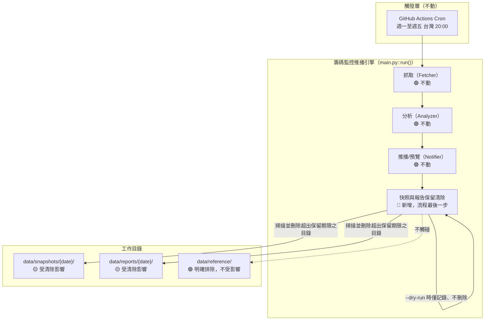
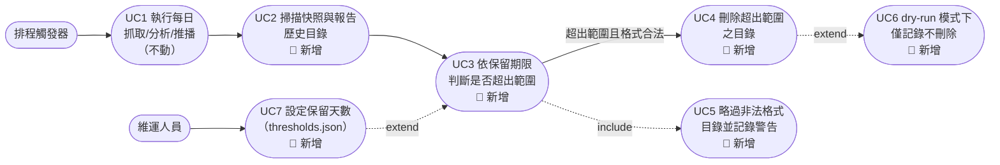
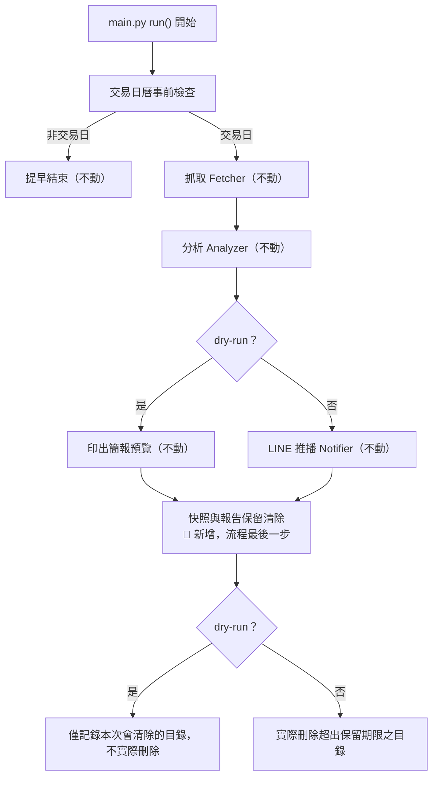

# SA-快照資料保留清除機制-功能模組分析

## 0. 文件資訊與需求摘要

| 項目 | 內容 |
| :--- | :--- |
| 文件類型 | 系統分析（功能模組分析）文件 / SA 需求規格書（既有系統之新增能力分析） |
| 分析範疇 | 在既有「籌碼監控推播引擎」每日排程批次的最後，新增「快照與報告資料保留清除」邏輯：超出保留期限（目前設定 1 年）的歷史資料目錄，於排程本次執行時同步清除，不需要另開一個排程或人工介入 |
| 對象讀者 | PO / SA / SD / 開發人員 / 維運人員 |
| 建立日期 | 2026-08-24 |
| 作者 | Claude Code（依 Roy Chiang 需求整理） |
| 分析階段 | 本次僅到**功能模組層級**分析；`SnapshotRepository` 方法簽章、`config/thresholds.json` schema 擴充細節屬後續 SD 階段產出 |
| 設計依據 | 使用者提出「排程存取快照的最後步驟，同步清除超出時間設定範圍（先設定 1 年）的快照檔，目前想不到有保留超出此範圍紀錄的必要」 |

### 名詞定義

| 名詞 | 英文/代碼 | 定義 |
| :--- | :--- | :--- |
| 每日快照 | Daily Snapshot | `data/snapshots/{date}/` 底下的原始抓取資料（三大法人、成交量、大盤、ETF 持股等），按日期分目錄存放 |
| 每日報告 | Daily Report | `data/reports/{date}/` 底下的分析結果與推播紀錄（換倉事件、告警清單、推播 log），按日期分目錄存放 |
| 參考快取 | Reference Cache | `data/reference/capital_stock/{stock_id}.json`，股本快取，**不分日期、單檔覆寫**，代表「目前最新已知值」而非歷史紀錄 |
| 保留期限 | Retention Period | 資料自其代表日期起，允許保留在工作目錄中的天數，目前設定 365 天（1 年） |
| 保留截止日 | Cutoff Date | `今日 − 保留期限`，早於此日期的每日快照／報告目錄視為超出範圍 |
| 排程本次執行日 | Target Date | `main.py --date` 指定或預設今日的查詢日期，即本次批次實際抓取/分析的對象日期，與「保留截止日」計算基準不同（見第一章） |

### 需求摘要

現行系統（見 §二 現行系統分析）**完全沒有任何資料清除機制**：`data/snapshots/`、`data/reports/` 下的每日目錄自系統上線起持續累積，全部永久保留在工作目錄與版控歷史中；`docs/design/architecture/SD-籌碼監控推播引擎-系統設計書.md` 當初評估容量成長速度緩慢（全年 <20MB），因此刻意選擇「不清除」，並註記「待監控標的大幅擴增時再評估封存策略」。

使用者本次明確表示：**目前想不到有保留超過 1 年紀錄的必要**，希望在既有每日排程批次的最後一步，新增「同步清除超出保留期限（先設定 1 年）之快照/報告目錄」的邏輯，不另開新排程、不需要人工定期介入。

| 子模組 | 本次異動類型 | 異動摘要 |
| :--- | :--- | :--- |
| 快照存取模組（`SnapshotRepository`） | 🟡 修改 | 新增「掃描並刪除超出保留期限之每日目錄」方法，比照既有 `find_previous_trading_day()` 用資料夾名稱做日期比對的模式 |
| 進入點（`main.py`） | 🟡 修改 | `run()` 於既有流程（抓取 → 分析 → 推播）**全部完成之後**，新增呼叫清除邏輯做為最後一步；`--dry-run` 不觸發實際刪除，僅記錄「本次會清除哪些目錄」 |
| 設定檔（`config/thresholds.json`） | 🟡 修改 | 新增保留天數設定項（預設 365），避免天數寫死在程式碼中，日後要調整不需改程式 |

---

## 一、關鍵設計原則

| 項目 | 結論 |
| :--- | :--- |
| 清除範圍 | 僅涵蓋 `data/snapshots/{date}/` 與 `data/reports/{date}/` 兩個**按日期分目錄**的路徑；`data/reference/`（股本快取等）**明確排除**，因其不代表歷史紀錄，而是「目前最新已知值」的單檔覆寫快取，清除會直接影響現行功能（股本快取失效需重新呼叫 API），與本次「清除過期歷史紀錄」的目的無關 |
| 截止日計算基準 | 保留截止日以**執行當下的實際日期（`date.today()`）**回推 365 天計算，**不**以 `main.py --date` 指定的查詢日期（`target_date`）為基準。理由：若以 `target_date` 為基準，手動補跑一個很久以前的日期時，會依那個舊日期回推出一個離現在更久遠的截止日，導致「應該清除但還沒到 1 年」的近期資料被誤判為安全、跳過清除（而非誤刪，方向是保守安全的低估，但仍會讓清除邏輯的實際生效時間點難以預期）；以真正的「今天」為基準，不管本次是抓當日資料還是手動補跑歷史資料，保留範圍的定義永遠一致 |
| 執行時機 | 每日排程批次（抓取 → 分析 → 推播）**全部完成之後**，做為 `main.py` 這次執行的**最後一步**；不另開獨立的 GitHub Actions 排程/workflow，理由是使用者明確要求「同步」於既有排程中處理，且清除動作本身極輕量（僅是掃資料夾名稱＋刪除），沒有必要為此獨立起一個排程增加維運複雜度 |
| `--dry-run` 行為 | **不觸發實際刪除**，僅記錄/印出「若非 dry-run，本次會清除哪些目錄」；比照既有 `--dry-run` 的定位（只預覽、不產生真實副作用），刪除檔案是比 LINE 推播更不可逆的操作，沒有理由讓 dry-run 模式下反而動了真實檔案 |
| 非日期格式目錄一律略過、不處理 | 開發過程中實測發現 `data/snapshots/` 底下目前存在一個非預期的殘留目錄 `data/snapshots/2026/08/24/`（並非合法的 `YYYY-MM-DD` 格式，推測為先前一次以斜線格式日期字串誤呼叫寫入函式所產生的殘留資料，屬已修正之舊缺陷遺留的垃圾資料，見 §二現況）。本次清除邏輯**只對完全符合 `YYYY-MM-DD` 格式的目錄名稱做日期比對**，格式不符的一律略過不動作、並記錄警告 log 供人工檢視，不嘗試「猜測」或「連坐清除」不符格式的目錄，避免防呆邏輯本身反而誤刪不明資料 |
| 刪除失敗容錯 | 單一目錄刪除失敗（例如檔案被鎖定）不得中斷整個排程或影響本次已完成的抓取/分析/推播結果；比照全專案既有「單一資料源失敗不中斷整體流程」的一貫設計原則，記錄警告 log、略過該目錄，並繼續處理其餘待清除目錄 |
| 保留天數設定化 | 保留天數（目前 365）納入 `config/thresholds.json`，而非寫死於程式碼常數；因為「要保留多久」屬於業務／稽核政策決策，日後可能因法規或使用習慣調整，設定檔化才不需要改程式碼即可調整（區別於 `_ANNOUNCEMENT_LOOKAHEAD_DAYS_MAX` 這類純技術性容錯常數，性質不同） |
| **本次不涉及 git 歷史本身的清理** | 清除動作只刪除**工作目錄**中的檔案；既有 GitHub Actions 排程既有的 `git add data/` + `git commit` 步驟會把這次的刪除也一併提交（`git add <path>` 本來就會連同刪除一起加入暫存區），使「未來的 commit」不再包含這些檔案，**但這些檔案的內容仍完整保留在 Git 歷史紀錄中**（過去的 commit 仍可還原、`git log`/`git show` 仍查得到），並不會縮減 `.git` 儲存庫本身的實際大小。若使用者的目的除了「工作目錄不要看到舊資料」之外，還包含「真正從版控歷史抹除、縮減 repo 大小」，需要額外的 git 歷史重寫操作（如 `git filter-repo`），性質上是**破壞性、會改寫共享歷史**的操作，本次不在範圍內，見 §六待確認事項 |

---

## 二、現行系統分析（As-Is）

### 現況

排程（`.github/workflows/daily-chip-monitor.yml`）每個交易日執行一次 `python main.py --date "$TARGET_DATE"`，完整跑完「抓取 → 分析 → 推播」後，直接 `git add data/` + `git commit` + `git push`，**流程中沒有任何一步會刪除舊資料**。`data/snapshots/{date}/` 與 `data/reports/{date}/` 兩個目錄從系統第一次執行起持續累積，永久保留在工作目錄與版控歷史中，沒有任何生命週期管理。

**缺口對照：**

| 缺口 | 現況影響 |
| :--- | :--- |
| 無資料保留期限機制 | 快照/報告目錄無限期累積，即使使用者已明確認定「沒有保留超過 1 年的必要」，系統仍會持續保留所有歷史資料 |
| 需要人工才能清理 | 若要縮減工作目錄內容，目前只能靠人工手動找出並刪除舊資料夾，容易遺漏或誤刪，且每次執行排程都要重新確認一次，不具重複性與可預期性 |
| **既有資料完整性已有瑕疵，缺乏防呆** | 實測發現 `data/snapshots/2026/08/24/` 這個非 `YYYY-MM-DD` 格式的殘留目錄（內含 `_meta.json`、`etf_holdings/00878.json`），推測為修正日期格式驗證之前，一次以斜線格式（`2026/08/24`）誤呼叫 `SnapshotRepository` 寫入函式時，字串被直接當成路徑片段組出的巢狀資料夾。這代表：① 現行系統對「快照目錄名稱是否為合法日期格式」完全沒有防呆，未來若再發生類似輸入異常，仍可能產生更多這類垃圾資料；② 這正是本次清除邏輯**必須明確排除非法格式目錄**的直接動機，而非憑空假設的邊界情境 |

### 可複用的現行機制

| 機制 | 現行元件 | To-Be 用途 |
| :--- | :--- | :--- |
| 按資料夾名稱做日期字串比對 | `SnapshotRepository.find_previous_trading_day()`（`src/storage.py`），利用 `YYYY-MM-DD` 字典序等於時間序的特性排序比對 | 清除邏輯沿用同一種「掃描 `iterdir()` → 過濾合法日期目錄 → 字串比較」模式，不需要另外解析日期格式或引入日期函式庫以外的邏輯 |
| 單一項目失敗不中斷整體流程 | `Fetcher` 全模組一貫採用的 `try/except` + 記錄 Log + 略過模式 | 清除邏輯的單一目錄刪除失敗處理沿用同一設計原則 |
| `run()` 流程尾端可插入新步驟 | `main.py::run()` 既有「抓取 → 分析 → 推播/dry-run 預覽」的線性流程 | 清除邏輯以「流程最後一步」的形式插入，不需重構既有流程結構 |
| `thresholds.json.default` 存放可調整數值型設定 | `config/thresholds.json`、`ConfigLoader` 既有讀取介面 | 保留天數比照既有 `etf_holding_drop_pct` 等設定項的存放方式與讀取模式 |
| GitHub Actions 既有 `git add data/` + commit 流程 | `.github/workflows/daily-chip-monitor.yml` | 不需異動：實體檔案被清除邏輯刪除後，既有的 `git add data/` 已能正確把刪除一併納入下次 commit，不需新增額外的 git 操作步驟 |

---

## 三、目標系統分析（To-Be）

### 模組總覽

### 使用案例圖（Use Case Diagram）

**參與角色（Actor）：** 排程觸發器、維運人員

### 3.1 快照存取模組（對應 UC2、UC3、UC4、UC5）

| 編號 | 功能 | 說明 |
| :--- | :--- | :--- |
| FR-1.1（🔴 新增） | 掃描歷史目錄 | 分別掃描 `data/snapshots/` 與 `data/reports/` 底下的第一層子目錄名稱，比照 `find_previous_trading_day()` 既有的 `iterdir()` 模式 |
| FR-1.2（🔴 新增） | 合法日期格式驗證 | 僅將完全符合 `YYYY-MM-DD` 格式（可正確解析為日期）的目錄名稱視為候選；格式不符者一律略過，記錄警告 log（含目錄路徑），不嘗試刪除、不中斷流程 |
| FR-1.3（🔴 新增） | 保留範圍判斷 | 合法日期 < 保留截止日（= 執行當下 `date.today()` − 保留天數）即視為超出範圍；保留天數讀自 `config/thresholds.json`，預設 365 |
| FR-1.4（🔴 新增） | 刪除超出範圍目錄 | 對判定超出範圍的目錄執行遞迴刪除；單一目錄刪除失敗記錄警告 log 並繼續處理其餘目錄，不中斷整體流程 |
| FR-1.5（🔴 新增） | 執行結果彙總記錄 | 本次清除完成後，記錄一筆彙總 log（清除目錄數、略過的非法格式目錄數、失敗數），供排程執行紀錄與維運人員事後查核 |

**特殊規則：清除範圍對照表**

| 路徑 | 是否納入本次清除 | 理由 |
| :--- | :--- | :--- |
| `data/snapshots/{date}/`（含底下 `etf_holdings/` 子目錄） | ✅ 納入 | 按日期分目錄之歷史原始資料 |
| `data/reports/{date}/` | ✅ 納入 | 按日期分目錄之歷史分析/推播結果 |
| `data/reference/capital_stock/{stock_id}.json` | ❌ 明確排除 | 非按日期分目錄，是「目前最新已知值」的單檔快取，不屬於歷史紀錄性質 |
| 格式不符 `YYYY-MM-DD` 之殘留目錄（如已知的 `data/snapshots/2026/`） | ❌ 本次邏輯略過，需人工另行處理 | 見第一章「非日期格式目錄一律略過」原則；是否要在本次一併手動清掉這個已知的殘留垃圾目錄，留待 §六 待確認事項與使用者確認 |

### 3.2 進入點（對應 UC1、UC6）

| 編號 | 功能 | 說明 |
| :--- | :--- | :--- |
| FR-2.1（🔴 新增） | 排程流程尾端觸發清除 | `main.py::run()` 於既有「抓取 → 分析 → 推播/dry-run 預覽」全部完成後，呼叫快照存取模組之清除邏輯，做為本次執行的最後一步 |
| FR-2.2（🔴 新增） | dry-run 不觸發實際刪除 | `--dry-run` 模式下，清除邏輯僅計算並記錄「本次會清除哪些目錄」，不執行真正的刪除動作 |

### To-Be 資料模型

本次**不新增任何資料表／持久化結構**，僅新增「刪除既有目錄」的行為邏輯與一項設定值（保留天數）。既有 `DAILY_SNAPSHOT`／各 `*_RECORD` 資料結構本身完全不變，僅其生命週期（何時從工作目錄消失）受本次異動影響。

---

## 四、非功能性需求與驗收標準（NFR & Acceptance Criteria）

| 類別 | 需求內容 |
| :--- | :--- |
| 資料安全 | 刪除為**遞迴且不可逆**的操作（工作目錄層級），必須嚴格限制在合法 `YYYY-MM-DD` 格式且明確判定超出保留期限的目錄，任何格式不符或無法確定日期的目錄一律不得刪除 |
| 一致性 | 保留截止日之計算基準（執行當下 `date.today()`）需與 `target_date`／backfill 情境明確區隔，避免因手動補跑舊日期而讓保留範圍的判斷結果不可預期（見 §一關鍵設計原則） |
| 容錯 | 單一目錄刪除失敗不得中斷本次排程已完成的抓取/分析/推播結果，比照既有 Fetcher 容錯模式記錄 Log 並繼續 |
| 可觀測性 | 清除結果（刪除數量、略過數量、失敗數量）需記錄於排程執行 log，供事後查核；不需要另外落地成獨立的快照/報告檔案（清除紀錄本身若也落地存檔，會產生「需要多久之後清除清除紀錄」的遞迴問題，不必要地增加複雜度） |
| 可維護性 | 保留天數設定化於 `config/thresholds.json`，不寫死於程式碼常數 |
| 效能 | 掃描與刪除僅在排程既有的每交易日一次執行中附帶進行，資料量級為「每年一次全量掃描 data/snapshots 與 data/reports 兩層目錄」，不需要索引或額外資料結構輔助 |
| 語系 | 記錄之 log 訊息一律繁體中文，比照全專案既有慣例 |

### 驗收標準（Acceptance Criteria）

| 驗收項目 | 驗收條件 | 驗收方式 |
| :--- | :--- | :--- |
| 保留範圍判斷正確性 | 給定一組混合日期（部分早於截止日、部分晚於截止日）的測試目錄，僅早於截止日者被判定應清除 | 單元測試 |
| 非法格式目錄防呆 | 給定非 `YYYY-MM-DD` 格式的目錄名稱（如 `2026`、`2026/08/24`、`archive`），一律不被刪除，且有對應警告 log | 單元測試 |
| 截止日計算基準正確性 | 以固定的「今日」與不同的 `target_date`（含遠早於今日之補跑日期）組合測試，確認截止日計算永遠以「今日」為基準，不受 `target_date` 影響 | 單元測試 |
| `data/reference/` 不受影響 | 清除執行前後，`data/reference/` 底下檔案內容與存在與否皆不變 | 單元測試 |
| dry-run 不觸發實際刪除 | `--dry-run` 執行前後，超出保留期限之目錄仍實際存在於檔案系統上 | 單元測試 |
| 單一目錄刪除失敗容錯 | 模擬其中一個目錄刪除拋出例外，其餘應清除之目錄仍正常被刪除，且本次排程仍正常完成（不影響已產出的推播/預覽結果） | 單元測試 |
| 端到端驗證 | 以正式（或本機模擬）環境跑一次完整 `main.py --date <日期>`，確認流程最後確實執行了清除步驟且結果與預期一致 | 人工於實機驗證 |

---

## 五、需求追溯表（Traceability）

| 來源需求 | To-Be 對應章節/FR | 受影響元件（概念層） |
| :--- | :--- | :--- |
| 「排程存取快照的最後步驟，同步清除超出時間設定範圍的快照檔」 | §3.2 FR-2.1 | `main.py::run()` |
| 「目前先設定 1 年」 | §一 保留天數設定化、§3.1 FR-1.3 | `config/thresholds.json`、`SnapshotRepository` |
| 「想不到有何必要保留紀錄超出這個範圍」（隱含：不需要另外封存，直接刪除即可，非本次要求「封存到別處」） | §一 關鍵設計原則、§3.1 清除範圍對照表 | `SnapshotRepository` |
| （既有系統缺口）現行完全無清除機制 | §二 現況、§3.1 全部 FR | `SnapshotRepository` |
| （實測發現之既有缺陷）非法格式殘留目錄 `data/snapshots/2026/` | §一 非日期格式目錄略過原則、§3.1 FR-1.2 | `SnapshotRepository` |

---

## 六、SD 階段待細化事項

- **`SnapshotRepository` 新增方法之確切簽章與回傳型別**：例如 `purge_expired_snapshots(retention_days: int, as_of_date: date) -> PurgeResult`，`PurgeResult` 是否需要是具名結構（dataclass）或簡單回傳三個計數值，留待 SD 階段決定。
- **`config/thresholds.json` schema 擴充位置**：新增鍵放在 `default` 區塊（如 `snapshot_retention_days`）或另立獨立區塊（如 `retention`），留待 SD 階段決定；需同步更新 `ConfigLoader._validate()` 是否要求此欄位必填（建議選填、預設 365，避免既有設定檔缺少此欄位就啟動失敗）。
- **已知的 `data/snapshots/2026/` 殘留垃圾目錄如何處理**：本次清除邏輯依設計會略過不動（格式不符），是否要在本次實作時一併手動刪除這個已知的既有垃圾資料（一次性動作，非本次功能邏輯的一部分），需與使用者確認。
- **清除彙總 log 的確切格式與觸發時機**：是否需要在 `_meta.json` 或其他既有結構中留下「本次執行清除過哪些目錄」的紀錄，或純粹只印在執行 log／GitHub Actions 執行紀錄中即可，留待 SD 階段決定（本次 NFR 傾向後者，避免遞迴複雜度）。
- **是否需要另外提供一個獨立的手動清除指令**（例如 `main.py --purge-only`，不跑抓取/分析/推播，僅執行清除），供維運人員需要時單獨觸發，而不用等到下次排程，留待 SD 階段依實際需求決定是否納入。

---

## 七、來源檔案索引

- [SD-籌碼監控推播引擎-系統設計書.md](../../design/architecture/SD-籌碼監控推播引擎-系統設計書.md)（既有「資料保留策略：目前不主動清除」之原始決策記錄）
- `f:\projects\FinanceTracker\src\storage.py`（`SnapshotRepository` 現行實作，待 SD 階段調整）
- `f:\projects\FinanceTracker\main.py`（`run()` 現行流程，待 SD 階段調整）
- `f:\projects\FinanceTracker\config\thresholds.json`（現行設定檔結構，待 SD 階段擴充）
- `f:\projects\FinanceTracker\.github\workflows\daily-chip-monitor.yml`（現行排程 workflow，本次確認不需異動 git 相關步驟）
- 實測查證：`data/snapshots/` 目錄結構現況掃描（16 個日期目錄＋1 個非法格式殘留目錄 `2026/`，總計約 526KB）
