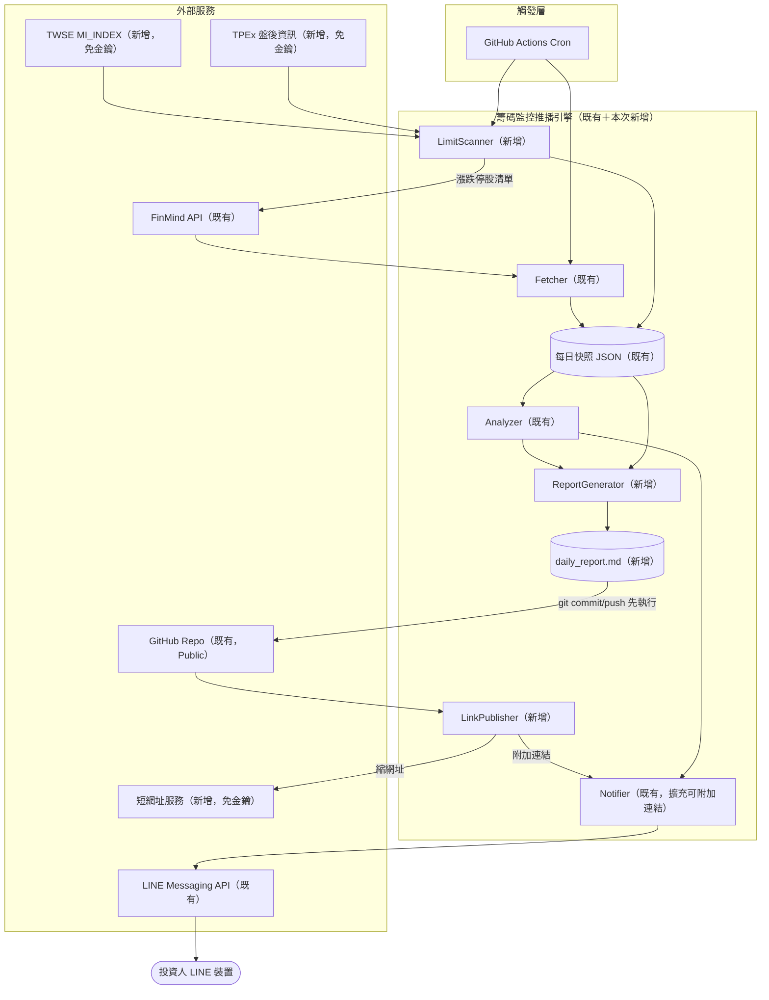
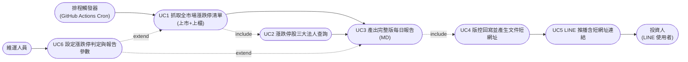
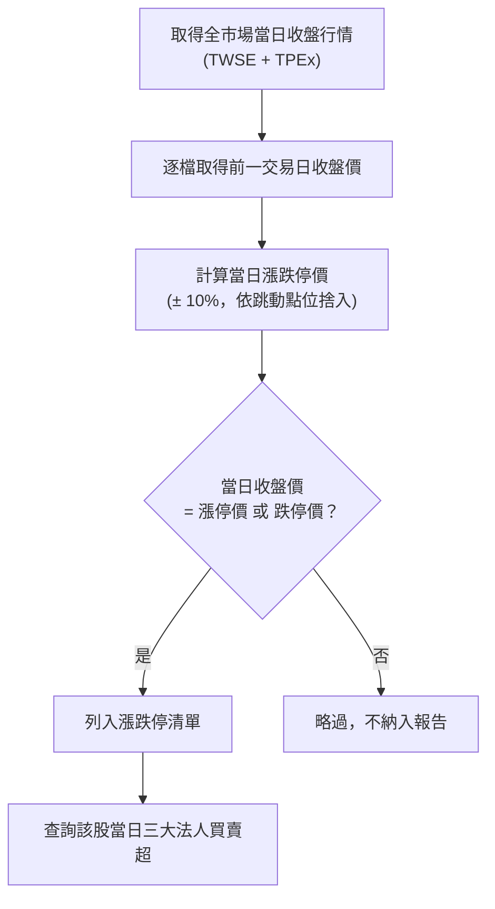
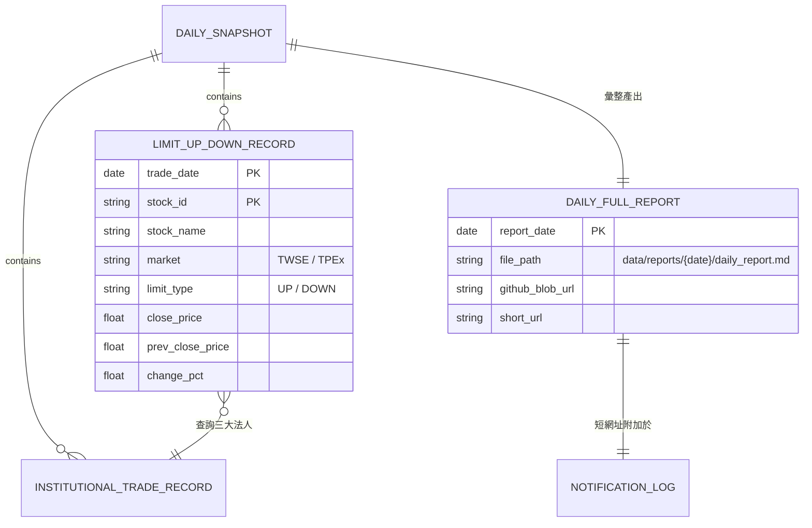

# SA-每日完整籌碼報告與漲跌停監控-功能模組分析

## 0. 文件資訊與需求摘要

| 項目 | 內容 |
| :--- | :--- |
| 文件類型 | 系統分析（功能模組分析）文件 / SA 需求規格書 |
| 分析範疇 | 既有專案 `FinanceTracker`（籌碼監控推播引擎）之功能擴充：每日完整版籌碼報告、全市場漲跌停監控、報告文件短網址推播 |
| 對象讀者 | PO / SA / SD / 開發人員 / 維護人員 |
| 建立日期 | 2026-09-02 |
| 作者 | Claude Code（依 Roy Chiang 提供之需求確認項目整理，並實際驗證外部資料源可行性） |
| 分析階段 | 本次僅到**功能模組層級**分析；漲跌停精確判定規則、短網址失敗降級細節、Markdown 報告版面屬後續 SD 階段產出（見第六章） |
| 前置文件 | [SA-籌碼監控推播引擎-功能模組分析.md](./SA-籌碼監控推播引擎-功能模組分析.md)（原始系統分析，本文件為其功能擴充） |

### 名詞定義

| 名詞 | 英文/代碼 | 定義 |
| :--- | :--- | :--- |
| Watchlist | `config/watchlist.json` | 目前每日固定監控的個股／ETF／分點清單 |
| 三大法人 | Institutional Investors | 外資、投信、自營商三類機構投資人買賣超合計 |
| 漲停／跌停 | Limit Up / Limit Down | 個股當日收盤價觸及依前一交易日收盤價計算之當日漲跌幅上下限（台股一般為 ±10%） |
| 上市 | TWSE-listed | 於台灣證券交易所掛牌之股票 |
| 上櫃 | TPEx-listed | 於證券櫃檯買賣中心（TPEx）掛牌之股票 |
| TWSE Open Data | — | 證券交易所提供之免費公開資料介面（本文件採用 `MI_INDEX` 端點），免金鑰即可查詢全市場當日／指定歷史日期收盤行情 |
| TPEx 盤後資訊 | — | 櫃買中心提供之免費公開資料介面，功能對等於 TWSE Open Data，涵蓋上櫃個股 |
| 短網址 | Short URL | 將較長的 GitHub 文件網址轉換為精簡連結，本文件採用免金鑰公用服務（如 TinyURL、is.gd） |
| 完整版報告 | Daily Full Report | 不經過門檻篩選、涵蓋當日 watchlist 全部個股三大法人資料與漲跌停清單的人類可讀 Markdown 文件 |
| 快照（Snapshot） | — | 既有系統每日落地存於 `data/snapshots/{date}/` 的原始資料，詳見前置 SA 文件 |

### 需求摘要

現行「籌碼監控推播引擎」（見前置 SA/SD 文件）已上線運作數週，每日盤後自動抓取 watchlist 個股三大法人買賣超與 ETF 換倉動態，並依門檻篩選後透過 LINE 推播精簡版簡報。實際使用後浮現三項新需求：(1) LINE 簡報因門檻篩選只顯示「達標」項目，但使用者也想要保留**當日 watchlist 全部個股**（不論是否達標）的完整紀錄供事後回顧；(2) 目前只監控固定的 watchlist 名單，無法捕捉**清單外**當日爆量漲跌停的意外標的；(3) 每日快照皆已 commit 進版控，但格式是給程式讀的 JSON，使用者若想回顧完整資料，必須自行 clone repo 或在 GitHub 上翻找檔案，沒有直接入口。

本次擴充新增三個子模組：

| 子模組 | 核心職責 | 是否需人工審核/介入 |
| :--- | :--- | :--- |
| 漲跌停掃描模組（LimitScanner） | 抓取當日全市場（上市＋上櫃）收盤行情，判定漲停／跌停股票，並查詢其三大法人買賣超 | 否，全自動排程觸發 |
| 完整版報告產出模組（ReportGenerator） | 彙整「watchlist 全量三大法人（不篩門檻）」＋「漲跌停清單」＋既有換倉事件，輸出人類可讀的 Markdown 報告 | 否，純格式化邏輯 |
| 文件連結模組（LinkPublisher） | 於資料回寫版控後，產生報告文件的短網址，附加於 LINE 推播內容中 | 否，全自動；短網址服務為免金鑰公用服務 |

---

## 一、關鍵設計原則

| 項目 | 結論 |
| :--- | :--- |
| 需求 1（watchlist 完整清單）的資料來源 | **無需新開發抓取邏輯**：既有 `data/snapshots/{date}/institutional_trades.json` 本來就是 watchlist 全量、未經門檻篩選的原始資料（詳見第二章「可複用的現行機制」）。本次僅需新增「呈現層」，將其轉為人類可讀格式 |
| 漲跌停資料來源 | 不使用 FinMind（免費 register 層不支援全市場批次查詢，已實測回傳 HTTP 400 需升級付費 Sponsor 方案）；改用 **TWSE `MI_INDEX`＋TPEx 盤後資訊** 兩個免金鑰公開端點，各一次 API 呼叫取得全市場當日收盤行情，兩者皆已實測支援指定歷史日期查詢，與既有 `--date` 補跑機制相容 |
| 漲跌停股的三大法人查詢 | 沿用既有 `FinMindClient.fetch_institutional_trades()`，僅針對「當日實際觸及漲跌停」的股票逐檔查詢（預期每日僅個位數至十餘檔），不新增 API 用戶端 |
| 報告文件格式策略 | **新增不取代**：既有 JSON 快照/報告檔案原封不動保留（Analyzer/Notifier 仍依賴其精確欄位），另外新增一份 `data/reports/{date}/daily_report.md`，作為短網址連結的目標文件 |
| 短網址服務 | 採免金鑰、免申請帳號之公用服務（TinyURL `tinyurl.com/api-create.php` 或 is.gd `is.gd/create.php`），不新增 GitHub Secrets；服務呼叫失敗時降級為使用完整網址或省略連結，不得因此讓整體推播流程失敗 |
| 連結指向的網址格式 | 指向 GitHub **網頁 blob 檢視網址**（`github.com/.../blob/...`），而非 `raw.githubusercontent.com`，讓 `.md` 檔案能以 GitHub 原生 Markdown 渲染顯示，適合手機瀏覽器閱讀 |
| 執行順序調整 | 既有 workflow 為「main.py（含推播）→ purge → commit/push」；本次**必須調整為「main.py（抓取/分析/產出報告，不推播）→ commit/push → 產生短網址 → 推播（含連結）→ purge」**，否則推播當下連結指向的檔案尚未存在於 GitHub 上 |
| `--dry-run` 相容性 | Dry-run 模式僅預覽訊息內容，不應實際呼叫短網址服務或依賴尚未發生的 push，訊息中以佔位文字（如 `[短網址：dry-run 不產生]`）替代真實連結 |
| 涵蓋範圍 | 依使用者確認，漲跌停監控涵蓋**上市（TWSE）＋上櫃（TPEx）**，不含興櫃 |

---

## 二、現行系統分析（As-Is）

### 現況

「籌碼監控推播引擎」目前已是**營運中的系統**（非 greenfield），每個交易日台灣時間 19:30（`.github/workflows/daily-chip-monitor.yml`）自動執行：

1. `Fetcher` 逐檔查詢 watchlist（`config/watchlist.json`，目前 40 檔個股、10 檔 ETF）之三大法人買賣超、成交量收盤價、股本，並查詢大盤三大法人金額、ETF PCF 持股，寫入 `data/snapshots/{date}/`。
2. `InstitutionalTieredFilter`／`MarketInstitutionalFilter` 依 `config/thresholds.json` 雙門檻（成交量佔比、依市值分級之金額）篩選「達標」個股與大盤動態，`RebalanceClassifier` 比對 ETF 前後日持股分類換倉事件，結果寫入 `data/reports/{date}/institutional_alerts.json`、`rebalance_events.json`。
3. `Notifier` 將**篩選後**的結果格式化為 LINE 簡報，推播給 `config/recipients.json` 內啟用中的收訊者，並記錄 `notification_log.json`。
4. Workflow 最後一步將 `data/` 目錄變更 commit 回版控。

**痛點對照：**

| 痛點 | 現況影響 |
| :--- | :--- |
| LINE 簡報僅顯示達門檻項目 | 使用者若想確認「沒達標的股票今天實際數字是多少」，只能自行到版控翻 JSON 檔案，無法直接從通知回溯 |
| 監控範圍侷限於固定 watchlist | 清單外的個股即使當日爆量漲跌停，也完全不會被捕捉，可能錯過重大訊號 |
| 快照/報告皆為 JSON | 格式對程式友善，但人不易直接閱讀；且推播訊息中沒有任何指向這些檔案的連結，「已經有資料」與「使用者找得到」之間有落差 |

### 可複用的現行機制

| 機制 | 現行元件 | To-Be 用途 |
| :--- | :--- | :--- |
| Watchlist 全量三大法人原始資料 | `SnapshotRepository.write_institutional_trades()` / `read_institutional_trades()`（[storage.py](../../../src/storage.py)） | **需求1 的資料已存在**，完整版報告直接讀取此既有快照，不需修改 Fetcher |
| 個股三大法人查詢用戶端 | `FinMindClient.fetch_institutional_trades()`（[fetcher.py](../../../src/fetcher.py)） | 沿用查詢漲跌停股票的三大法人買賣超，介面與呼叫方式不變 |
| 「前一交易日」查找邏輯 | `SnapshotRepository.find_previous_trading_day()` | 漲跌停判定需要前一交易日收盤價，沿用既有邏輯，不另建交易日曆 |
| 快照/報告讀寫模式 | `SnapshotRepository` 各 `write_*`/`read_*` 方法 | 新增漲跌停清單、完整版報告時比照既有模式擴充，維持既有目錄結構慣例 |
| GitHub Actions 排程與 commit 機制 | `.github/workflows/daily-chip-monitor.yml` | 沿用既有排程與 `git commit/push` 步驟，僅調整執行順序（見第一章） |
| 例外容錯策略 | 各 Fetcher 方法 per-source try/except 包裹 | 新增的 TWSE／TPEx 呼叫比照既有模式，單一來源失敗不中斷整體流程 |

---

## 三、目標系統分析（To-Be）

### 模組總覽



### 使用案例圖（Use Case Diagram）

**參與角色（Actor）：** 沿用前置 SA 文件定義——排程觸發器、投資人、維運人員。



### 3.1 漲跌停掃描模組（對應 UC1、UC2）

| 編號 | 功能 | 說明 |
| :--- | :--- | :--- |
| FR-1.1 | 上市（TWSE）全市場漲跌停掃描 | 呼叫 TWSE `MI_INDEX` 端點取得當日全部上市個股收盤行情，依前一交易日收盤價計算漲跌停價，比對當日收盤是否觸及 |
| FR-1.2 | 上櫃（TPEx）全市場漲跌停掃描 | 呼叫 TPEx 對等端點取得當日全部上櫃個股收盤行情，比對方式同 FR-1.1 |
| FR-1.3 | 漲跌停股三大法人查詢 | 對 FR-1.1／FR-1.2 判定出的漲跌停股票，逐檔沿用既有 `FinMindClient.fetch_institutional_trades()` 查詢當日三大法人買賣超 |
| FR-1.4 | 異常與無資料處理 | 比照既有 Fetcher 例外容錯策略：任一資料源失敗僅記錄 Log，不中斷整體流程；查無漲跌停股票時視為正常結果（非錯誤） |

**特殊規則：資料來源對照表**

| 資料類型 | 來源 | 是否需金鑰 | 是否支援歷史日期查詢 | 涵蓋範圍 |
| :--- | :--- | :--- | :--- | :--- |
| 上市當日收盤行情（全市場） | TWSE `MI_INDEX`（`https://www.twse.com.tw/rwd/zh/afterTrading/MI_INDEX`） | 否 | 是（已實測 `date=20260831` 正常回傳） | 上市個股 |
| 上櫃當日收盤行情（全市場） | TPEx 盤後資訊（`https://www.tpex.org.tw/web/stock/aftertrading/otc_quotes_no1430/...`） | 否 | 是（已實測 ROC 日期格式查詢正常回傳） | 上櫃個股 |
| 漲跌停股三大法人買賣超 | FinMind `TaiwanStockInstitutionalInvestorsBuySell`（既有） | 是（既有 `FINMIND_TOKEN`） | 是（既有機制） | 僅限已判定為漲跌停的股票 |

**漲跌停判定流程：**



> 精確的跳動點位捨入規則、是否排除注意股/處置股等特殊漲跌幅限制標的，屬 SD 階段待確認事項（見第六章）。

### 3.2 完整版每日報告產出模組（對應 UC3）

| 編號 | 功能 | 說明 |
| :--- | :--- | :--- |
| FR-2.1 | Watchlist 全量三大法人呈現 | 讀取既有 `institutional_trades.json`（未經門檻篩選），全數列入報告，不排除未達標項目 |
| FR-2.2 | 漲跌停清單呈現 | 將 3.1 節產出的漲跌停股票（含三大法人買賣超）列入報告 |
| FR-2.3 | ETF 換倉事件呈現 | 沿用既有 `rebalance_events.json`，格式比照 LINE 簡報但不受長度分頁限制 |
| FR-2.4 | Markdown 格式輸出 | 輸出 `data/reports/{date}/daily_report.md`，既有 JSON 檔案不變、兩者並存 |

**報告章節草案（示意）：**

```
# 籌碼監控完整日報 2026-09-02

## Watchlist 三大法人買賣超（全量，不篩門檻）
| 股票代碼 | 名稱 | 外資買賣超 | 投信買賣超 | 自營商買賣超 | 合計 |
|---|---|---|---|---|---|
| 2330 | 台積電 | +5,965 張 | ... | ... | ... |
（40 檔全部列出）

## 今日漲跌停股票
| 股票代碼 | 名稱 | 市場 | 漲/跌停 | 三大法人買賣超 |
|---|---|---|---|---|
| xxxx | xxxx | 上市/上櫃 | 漲停/跌停 | ... |

## ETF 換倉動態
（沿用既有分類邏輯）
```

### 3.3 文件連結模組（對應 UC4、UC5）

| 編號 | 功能 | 說明 |
| :--- | :--- | :--- |
| FR-3.1 | 執行順序調整 | Workflow 改為「main.py（不推播）→ commit/push → 產生短網址 → 推播」，確保連結指向的檔案已存在於 GitHub |
| FR-3.2 | 短網址產生 | 以完整版報告的 GitHub blob 網址呼叫免金鑰短網址服務（TinyURL 或 is.gd），取得精簡連結 |
| FR-3.3 | LINE 訊息附加連結 | 於既有簡報末尾附加一行「📄 完整資料：{短網址}」 |
| FR-3.4 | 短網址服務降級策略 | 短網址服務呼叫失敗（逾時/非預期回應）時，改用完整 GitHub 網址；仍失敗則省略連結、僅記錄 Log，不得讓整體推播流程失敗 |

**推播失敗處理：** 沿用既有 LINE 推播重試策略（3 次、指數退避），短網址產生失敗不計入 LINE 推播失敗，兩者為獨立的例外邊界。

### 3.4 排程與自動化執行（Orchestration，異動）

| 步驟 | 現行順序 | 本次調整後順序 |
| :--- | :--- | :--- |
| 1 | `main.py`（抓取→分析→推播） | `main.py`（抓取→分析→產出完整版報告，不推播） |
| 2 | `main.py --purge` | `git add && git commit && git push`（含 `daily_report.md`） |
| 3 | `git commit/push` | 產生短網址（呼叫免金鑰服務） |
| 4 | — | `main.py --notify-only --link {短網址}`（或等效介面，實際呼叫方式屬 SD 階段設計） |
| 5 | — | `main.py --purge` |

### To-Be 資料模型（概念層）



> `LIMIT_UP_DOWN_RECORD` 為本次新增實體；`DAILY_FULL_REPORT` 為報告文件本身的中繼資料（用於記錄短網址對應關係），實際落地方式（獨立 JSON 或內嵌於 `notification_log.json`）屬 SD 階段決定。

### 排程引擎整合說明

| 機制 | 直接沿用（無需改動） | 新增實作 |
| :--- | :--- | :--- |
| Watchlist 三大法人抓取 | ✅ `Fetcher._fetch_institutional_trades()` | — |
| 三大法人查詢用戶端 | ✅ `FinMindClient.fetch_institutional_trades()` | — |
| 前一交易日查找 | ✅ `SnapshotRepository.find_previous_trading_day()` | — |
| ETF 換倉分類 | ✅ `RebalanceClassifier` | — |
| GitHub Actions Cron／commit 機制 | ✅（僅調整步驟順序） | — |
| 漲跌停全市場掃描 | — | 🔴 `LimitScanner`（TWSE／TPEx Provider） |
| 完整版 Markdown 報告產出 | — | 🔴 `ReportGenerator` |
| 短網址產生與附加 | — | 🔴 `LinkPublisher` |

---

## 四、非功能性需求與驗收標準（NFR & Acceptance Criteria）

| 類別 | 需求內容 |
| :--- | :--- |
| 相容性 | TWSE／TPEx 呼叫方式須與既有 `requests` 用法一致，於 GitHub Actions `ubuntu-latest` 環境執行；本機開發環境曾出現 TPEx TLS 憑證鏈結問題（`Missing Subject Key Identifier`），需於 SD 階段確認 `ubuntu-latest` 是否重現，若重現須有正式解法（不得直接停用憑證驗證） |
| 效能 | 新增 TWSE／TPEx 各 1 次批次呼叫＋漲跌停股逐檔查三大法人（預估數十檔以內），須於既有數分鐘執行時限內完成 |
| 資料一致性 | 漲跌停判定須以「前一交易日」（沿用既有查找邏輯）收盤價為基準，避免假日/颱風假造成誤判 |
| 可維護性/一致性 | 新增模組遵循既有 `src/` 目錄慣例與 per-source try/except 例外容錯模式，不修改既有 Fetcher/Analyzer 對外介面 |
| 安全性 | 短網址服務與 TWSE/TPEx 端點皆為免金鑰公開服務，不新增密鑰管理負擔；既有 `FINMIND_TOKEN`／`LINE_CHANNEL_ACCESS_TOKEN` 管理方式不變 |
| 檔案儲存 | 新增 `daily_report.md` 與既有 JSON 快照/報告並存，皆納入既有 `snapshot_retention_days` 保留清除機制 |
| 語系 | 完整版報告與 LINE 訊息附加連結內容一律採繁體中文 |
| 可靠性 | 短網址服務失敗需有明確降級策略（完整網址 → 省略連結），任一階段失敗皆不得讓 LINE 推播整體失敗 |
| 可觀測性 | 漲跌停掃描、報告產出、短網址產生皆須記錄成功/失敗/無資料 Log，格式比照既有慣例 |
| 成本 | 新增資料源與短網址服務皆為免費（TWSE/TPEx 公開資料、TinyURL/is.gd 免金鑰），不影響既有「零維護成本」設計原則 |

### 驗收標準（Acceptance Criteria）

| 驗收項目 | 驗收條件 | 驗收方式 |
| :--- | :--- | :--- |
| Watchlist 完整清單呈現正確性 | `daily_report.md` 內三大法人明細筆數與 `institutional_trades.json` 筆數一致，且不因門檻篩選而缺漏 | 單元測試（比對筆數與內容） |
| 漲跌停判定正確性 | 給定測試用前後日收盤價資料，判定結果（是否漲跌停）與人工試算一致 | 單元測試 |
| 漲跌停股三大法人查詢完整性 | 判定出的每一檔漲跌停股票，皆能在報告中看到對應三大法人買賣超（或明確標示查無資料） | 單元測試＋人工模擬執行 |
| 連結有效性 | LINE 訊息內短網址點擊後，能開啟對應日期之 `daily_report.md` GitHub 渲染頁面 | 人工於實機 LINE 點擊驗證 |
| 執行順序正確性 | 實際執行時，`git push` 完成後才呼叫 LINE 推播，且推播內容含正確短網址 | 檢查 GitHub Actions 執行紀錄的步驟時間戳與 LINE 訊息接收時間 |
| 降級策略有效性 | 模擬短網址服務逾時，仍能正常完成推播（改用完整網址或省略連結） | 單元測試（Mock 短網址服務失敗） |
| 零維護成本 | 一個月內 TWSE/TPEx/短網址服務呼叫量在其免費限制內，且未觸發任何額外費用 | 人工檢查一個月執行紀錄 |

---

## 五、需求追溯表（Traceability）

| 來源需求 | To-Be 對應章節/FR | 受影響元件（概念層） |
| :--- | :--- | :--- |
| 需求1：Watchlist 完整清單（不排除未達門檻） | §3.2 FR-2.1 | ReportGenerator（讀取既有 `institutional_trades.json`，無需改動 Fetcher） |
| 需求2：漲跌停清單＋三大法人 | §3.1 FR-1.1～FR-1.4 | LimitScanner（新增 TWSE/TPEx Provider）、FinMindClient（沿用） |
| 需求3：LINE 通知附短網址連結 | §3.3 FR-3.1～FR-3.4、§3.4 | LinkPublisher（新增）、Notifier（擴充）、GitHub Actions Workflow（順序調整） |
| 需求4：JSON → MD 可讀格式 | §3.2 FR-2.4 | ReportGenerator（新增 Markdown 輸出，既有 JSON 不變） |
| NFR 安全性（無新增密鑰） | §四 NFR | LimitScanner、LinkPublisher（皆呼叫免金鑰服務） |
| NFR 可靠性（降級策略） | §3.3 FR-3.4、§四 NFR | LinkPublisher |

---

## 六、SD 階段待細化事項

- **漲跌停精確判定規則**：台股跳動點位（Tick Size）依價格區間不同，漲跌停價需依規則捨入（非單純 ×1.1／×0.9）；另需確認是否要排除注意股/處置股（可能有不同漲跌幅限制）等特殊情況。
- **TPEx TLS 憑證問題**：本機開發環境測試 TPEx 端點時出現 `SSLCertVerificationError: Missing Subject Key Identifier`，需於 GitHub Actions `ubuntu-latest` 環境實際驗證是否重現；若重現須找出正式解法（如更新憑證套件版本），不得以停用憑證驗證（`verify=False`）作為正式方案。
- **短網址服務選定與容錯細節**：TinyURL／is.gd 兩者擇一（或依可用性動態切換）、逾時秒數、失敗降級的具體判斷邏輯。
- **`main.py` CLI 介面調整**：如何拆分「抓取/分析/產出報告」與「推播」兩階段（例如新增 `--notify-only` 搭配 `--link` 參數，或改為兩支獨立進入點），須與現有 `--date`／`--dry-run`／`--purge` 參數相容設計。
- **`daily_report.md` 具體版面與內容順序**：是否比照 LINE 簡報的產業分組呈現方式、是否需要目錄（TOC）方便長報告內快速跳轉。
- **漲跌停清單與 watchlist 重複標的之呈現方式**：若某檔股票同時是 watchlist 成分股又當日漲跌停，是否需要在完整版報告中特別標註或去重。
- **`DAILY_FULL_REPORT`／短網址對應關係的落地方式**：獨立 JSON 檔案，或內嵌於既有 `notification_log.json`。
- **TPEx 端點的正式資料集選型**：本次驗證使用之端點（`otc_quotes_no1430`）是否為 TPEx 官方建議之穩定公開介面，需於開發階段確認是否有更適合的正式 Open Data API。

---

## 七、來源檔案索引

- [SA-籌碼監控推播引擎-功能模組分析.md](./SA-籌碼監控推播引擎-功能模組分析.md)（前置系統分析文件）
- [SD-籌碼監控推播引擎-系統設計書.md](../../design/architecture/SD-籌碼監控推播引擎-系統設計書.md)（前置系統設計文件）
- `f:\projects\FinanceTracker\src\fetcher.py`（現行 Fetcher／FinMindClient 實作）
- `f:\projects\FinanceTracker\src\storage.py`（現行 SnapshotRepository 實作）
- `f:\projects\FinanceTracker\src\analyzer.py`（現行門檻篩選與換倉分類邏輯）
- `f:\projects\FinanceTracker\src\notifier.py`（現行訊息格式化與 LINE 推播邏輯）
- `f:\projects\FinanceTracker\src\config.py`（現行設定檔載入邏輯）
- `f:\projects\FinanceTracker\config\watchlist.json`（現行監控清單）
- `f:\projects\FinanceTracker\config\thresholds.json`（現行門檻設定）
- `f:\projects\FinanceTracker\.github\workflows\daily-chip-monitor.yml`（現行排程 Workflow）
- 外部資料源驗證記錄（本次分析過程中實際呼叫確認）：
  - FinMind 全市場批次查詢（`TaiwanStockPrice` 不帶 `data_id`）於免費 register 層回傳 HTTP 400，需付費 Sponsor 方案
  - TWSE `MI_INDEX`（`https://www.twse.com.tw/rwd/zh/afterTrading/MI_INDEX?date=20260831&type=ALLBUT0999`）實測正常回傳全市場上市個股收盤行情
  - TPEx 盤後資訊（`https://www.tpex.org.tw/web/stock/aftertrading/otc_quotes_no1430/stk_wn1430_result.php?d=115/08/31`）實測正常回傳全市場上櫃個股收盤行情
  - `github.com/r41nCh14n9/FinanceTracker` 經 GitHub API 確認 `visibility: public`
