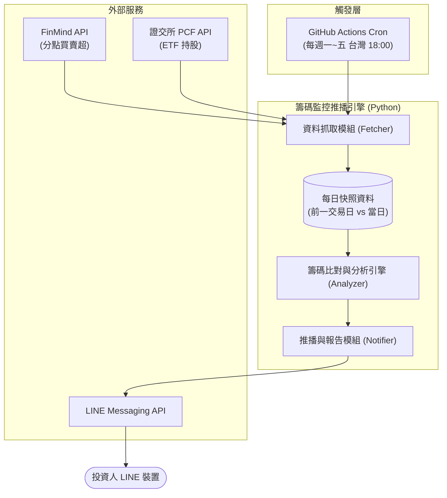
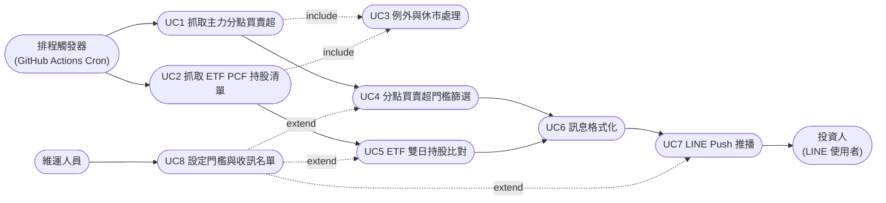
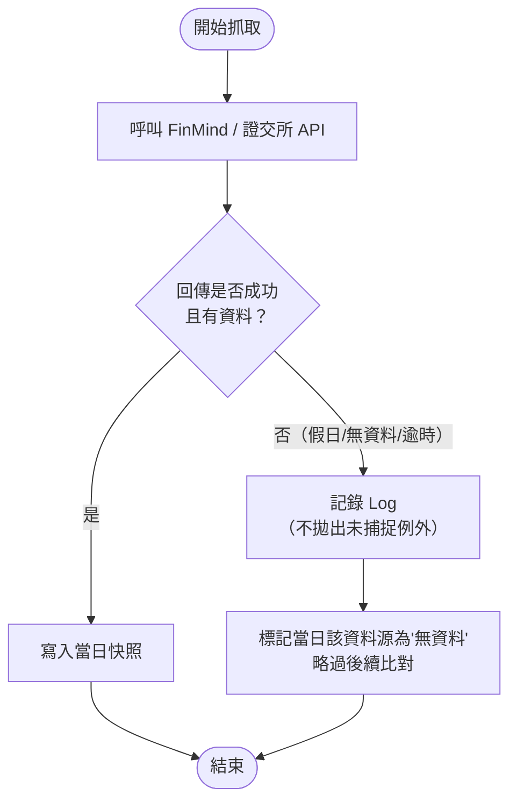
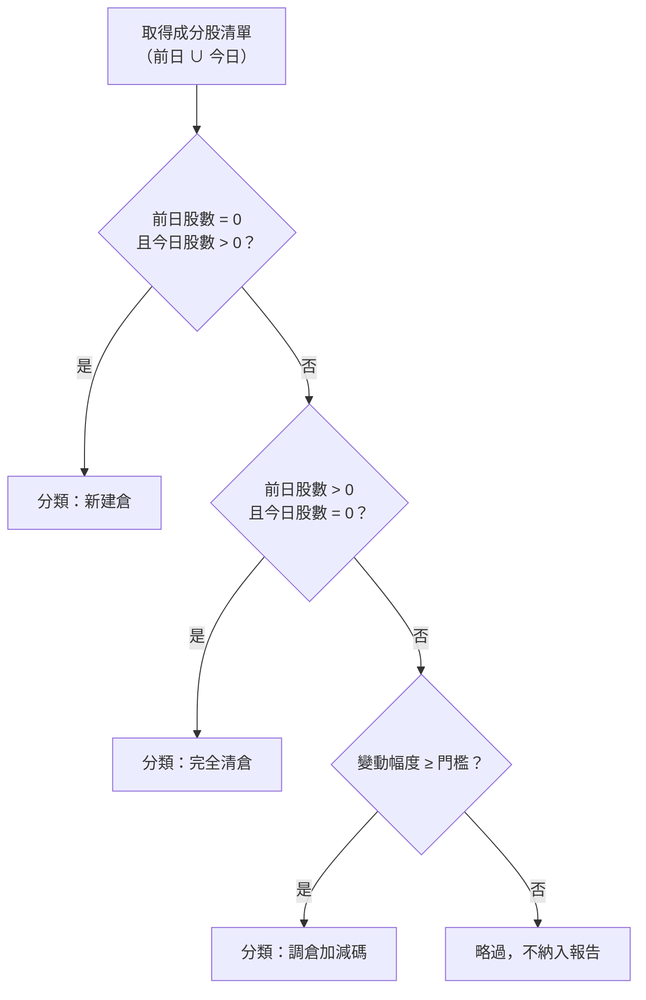
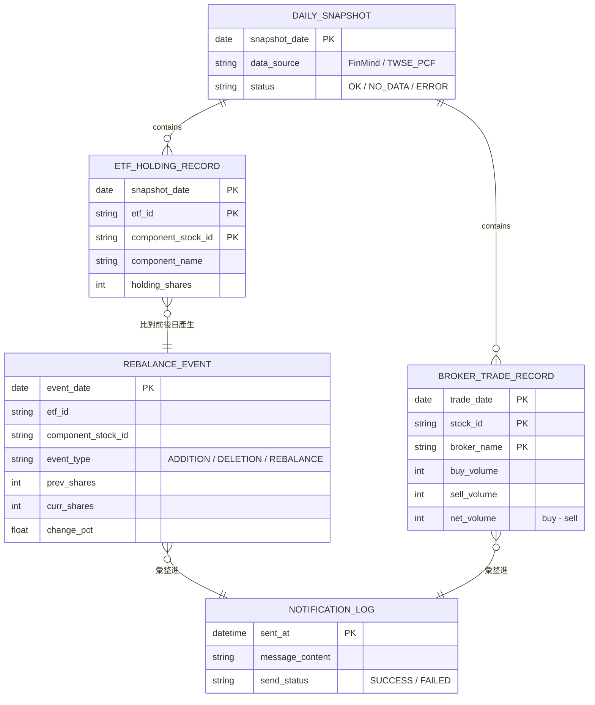

# SA-籌碼監控推播引擎-功能模組分析

## 0. 文件資訊與需求摘要

| 項目 | 內容 |
| :--- | :--- |
| 文件類型 | 系統分析（功能模組分析）文件 / SA 需求規格書 |
| 分析範疇 | 全新（greenfield）專案 `FinanceTracker`：籌碼監控推播引擎，涵蓋資料抓取、換倉比對分析、LINE 推播三大模組 |
| 對象讀者 | PO / SA / SD / 開發人員 / 維護人員 |
| 建立日期 | 2026-07-29 |
| 作者 | Claude Code（依 Roy Chiang 提供之需求確認項目整理） |
| 分析階段 | 本次僅到**功能模組層級**分析；資料表 DDL、API 詳細規格（Request/Response Schema）、類別圖屬後續 SD 階段產出 |

### 名詞定義

| 名詞 | 英文/代碼 | 定義 |
| :--- | :--- | :--- |
| 主力分點 | Broker Branch | 證券商分公司（分點），可依買賣超張數判斷特定資金部位的進出動向 |
| 分點買賣超 | Broker Net Buy/Sell | 特定分點於特定股票的「買進張數 - 賣出張數」 |
| PCF | Portfolio Composition File | ETF 每日申購/贖回清單，揭露 ETF 基金的完整成分股與股數，可用於推算主動/被動 ETF 經理人的實際持股與換倉動作 |
| 新建倉 | Addition | 前一交易日持股為 0，當日持股 > 0 的成分股 |
| 完全清倉 | Deletion | 前一交易日持股 > 0，當日持股為 0 的成分股 |
| 調倉/加減碼 | Rebalancing | 前後兩個交易日皆有持股，但股數變動幅度超過設定門檻 |
| 門檻 | Threshold | 使用者可設定的張數或百分比篩選條件，用於過濾非顯著變動 |
| FinMind | — | 提供台股籌碼面（含分點買賣超）資料的第三方 API 服務 |
| LINE Messaging API | — | LINE 官方提供的伺服器對使用者推播訊息介面，取代已於 2025/03 終止服務的 LINE Notify |
| Push Message | — | LINE Messaging API 中，由伺服器主動推送給指定 User/Group 的訊息類型 |
| Cron 排程 | — | GitHub Actions 內建的定時觸發機制，語法同 Linux crontab |

### 需求摘要

現行以「主力分點」「主動型 ETF 經理人」籌碼動向作為選股依據的投資人，每日盤後需手動至證交所、櫃買中心、投信官網、FinMind 等多個來源下載資料並以 Excel 比對兩日差異，耗時 30~60 分鐘且缺乏「新建倉／清倉／調倉」的動態指標；同時原有依賴 LINE Notify 的自動化推播管道已於 2025/03 停止服務，導致既有腳本失效。本次要建置一套**低成本、零維護、高度自動化**的籌碼監控推播引擎，於每日盤後（台灣時間 18:00）自動抓取 FinMind 分點資料與證交所 PCF 資料、比對前後日差異並依門檻篩選，最終以結構化文字簡報透過 LINE Messaging API 推播給投資人，整體運行於 GitHub Actions（免費額度），無需自建主機。

| 子模組 | 核心職責 | 是否需人工審核/介入 |
| :--- | :--- | :--- |
| 資料抓取模組 (Fetcher) | 對接 FinMind API 與證交所 PCF API，抓取分點買賣超與 ETF 持股資料，處理休市例外 | 否，全自動排程觸發 |
| 籌碼比對與分析引擎 (Analyzer) | 依門檻篩選分點買賣超，比對 ETF 雙日持股差異並分類為新建倉/清倉/調倉 | 否，純運算邏輯 |
| 推播與報告模組 (Notifier) | 將分析結果格式化為手機易讀簡報，透過 LINE Messaging API 推播 | 否，全自動；User/Group 名單由維運人員預先設定 |

---

## 一、關鍵設計原則

| 項目 | 結論 |
| :--- | :--- |
| 執行架構 | 無伺服器（Serverless）：以 GitHub Actions 排程觸發單次 Python 執行，不維持常駐服務，執行完畢即結束 |
| 狀態持久化策略 | GitHub Actions 每次執行環境為全新容器，無本地磁碟延續性；「前一交易日」快照資料需外部化保存（候選方案：commit 進 repo 的 `data/` 目錄、GitHub Actions Cache、或外部免費儲存），**確切方案留待 SD 階段決定**（見第六章） |
| 比對基準 | 一律以「前一個交易日」而非「前一個日曆日」作為比對基準，需排除假日/颱風假等無資料日期 |
| 識別鍵策略 | 分點買賣超記錄鍵：`(日期, 股票代碼, 分點名稱)`；ETF 持股記錄鍵：`(日期, ETF代碼, 成分股代碼)` |
| 門檻可配置化 | 分點買賣超張數門檻、ETF 調倉幅度門檻均由設定檔（非程式碼寫死）控制，供未來調整而不需改動程式邏輯 |
| 例外容錯策略 | 任何單一資料來源失敗或無資料（假日/API 異常）均需被捕捉並記錄 Log，不得中斷整體流程；其餘模組仍應嘗試完成當日可用的分析與推播 |
| 密鑰管理策略 | FinMind Token、LINE Channel Access Token 一律透過環境變數（本地 `.env`、雲端 GitHub Repository Secrets）注入，程式碼與版控中不得出現明文金鑰 |
| 擴充性策略 | 資料來源（Data Provider）與推播管道（Notifier）皆須以可替換的模組介面設計，未來新增資料源或改接 Telegram 等推播管道時，不需重構 Analyzer 核心邏輯 |

---

## 二、現行系統分析（As-Is）

### 現況

本專案為全新（greenfield）專案，程式碼庫（`main.py`、`requirements.txt`、`.env.example`、`src/`）目前皆為空白骨架，尚無任何既有系統實作。現況指的是**投資人目前的人工作業流程**，而非既有程式系統：

- 每日盤後（15:30–18:00）需手動開啟證交所、櫃買中心、各投信官網、FinMind 等多個網頁分頁。
- 手動下載 PCF 檔案／分點買賣超資料，複製貼上至 Excel，再以人工方式比對前後兩日差異，判斷是否為新建倉、清倉或加減碼。
- 過去部分投資人以個人腳本串接 LINE Notify 進行推播，但該服務已於 2025 年 3 月底終止，相關自動化管道已全數失效，需改以 LINE Messaging API 重建。

**痛點對照：**

| 痛點 | 現況影響 |
| :--- | :--- |
| 資料來源分散 | 每日 30~60 分鐘重複性人工整理，易錯失第一時間進出場訊號 |
| 缺乏動態換倉指標 | 僅能看到單日買賣超排行，無法區分新建倉/清倉/持續加碼，易誤判隔日沖為長期建倉 |
| LINE Notify 停用 | 既有自動化推播管道全面中斷，無法於盤後自動收到結構化簡報 |

### 可複用的現行機制

由於是全新專案，尚無內部程式碼機制可沿用；但可沿用/依賴以下**外部免費服務**作為基礎設施，避免自建對應能力：

| 機制 | 現行元件 | To-Be 用途 |
| :--- | :--- | :--- |
| 定時排程執行 | GitHub Actions Cron（`schedule` trigger） | 取代自建排程主機，每日台灣時間 18:00 觸發整體流程 |
| 訊息推播管道 | LINE Messaging API（Push Message） | 取代已停用的 LINE Notify，作為唯一推播出口 |
| 籌碼原始資料 | FinMind API、證交所 PCF API | 作為 Fetcher 模組的唯一資料來源，不需自建資料爬蟲對接交易所底層系統 |
| 密鑰保存 | GitHub Repository Secrets | 取代雲端主機上的環境變數檔，供 Actions 執行時安全注入金鑰 |

---

## 三、目標系統分析（To-Be）

### 模組總覽



### 使用案例圖（Use Case Diagram）

**參與角色（Actor）：**
- 排程觸發器（GitHub Actions Cron）：以系統角色觸發整體流程，非人類使用者
- 投資人（LINE 使用者）：被動接收推播簡報
- 維運人員（Maintainer）：設定門檻參數、管理密鑰與 LINE 收訊名單



### 3.1 資料抓取模組（對應 UC1、UC2、UC3）

| 編號 | 功能 | 說明 |
| :--- | :--- | :--- |
| FR-1.1 | 主力分點資料抓取 | 支援輸入指定日期與主力分點名稱（如「摩根大通」「凱基-台北」），透過 FinMind API 抓取個股當日買進/賣出張數 |
| FR-1.2 | ETF PCF 持股清單抓取 | 支援輸入 ETF 代碼（如 0050、00980A），透過證交所 API 抓取當日完整成分股與股數清單 |
| FR-1.3 | 異常與休市處理 | 遇假日、颱風假或 API 暫時無資料時，自動捕捉例外、不中斷程式、並記錄 Log |

**特殊規則：資料來源對照表**

| 資料類型 | 來源 API | 輸入參數 | 輸出關鍵欄位 |
| :--- | :--- | :--- | :--- |
| 分點買賣超 | FinMind API | 日期、股票代碼（可選）、分點名稱 | 股票代碼、分點名稱、買進張數、賣出張數、買賣超張數 |
| ETF PCF 持股 | 證交所 PCF API | 日期、ETF 代碼 | ETF 代碼、成分股代碼、成分股名稱、持股股數 |

**例外處理流程：**



### 3.2 籌碼比對與換倉分析引擎（對應 UC4、UC5）

| 編號 | 功能 | 說明 |
| :--- | :--- | :--- |
| FR-2.1 | 分點買賣超門檻篩選 | 依可設定張數門檻（例：500 張）過濾，僅保留達門檻的顯著換入/換出標的 |
| FR-2.2 | ETF 雙日持股比對 | 比對前一交易日與當日持股，分類為新建倉、完全清倉、調倉加減碼三類事件 |

**ETF 雙日持股分類規則：**

| 事件類型 | 判定條件 |
| :--- | :--- |
| 新建倉（Addition） | 前日股數 = 0 且今日股數 > 0 |
| 完全清倉（Deletion） | 前日股數 > 0 且今日股數 = 0 |
| 調倉加減碼（Rebalancing） | 前日股數 > 0 且今日股數 > 0，且變動幅度超過設定門檻 |
| 無顯著變動（略過，不納入報告） | 雙日皆有持股，但變動幅度未達門檻 |



### 3.3 推播與報告產出模組（對應 UC6、UC7）

| 編號 | 功能 | 說明 |
| :--- | :--- | :--- |
| FR-3.1 | 訊息格式化 | 將篩選/分類後的分析結果組成手機易讀文字簡報，含標的代碼、名稱、買賣超張數與變化量 |
| FR-3.2 | LINE Push Message | 透過 LINE Messaging API 將簡報推送至指定 LINE User/Group |

**簡報格式草案（文字排版示意）：**

```
【籌碼監控日報】2026-07-29

◆ 主力分點顯著買賣超（門檻 500 張）
  2330 台積電  凱基-台北  買超 1,203 張
  2454 聯發科  摩根大通  賣超  876 張

◆ 0050 ETF 換倉動態
  新建倉：3231 緯創（+520 張）
  完全清倉：2408 南亞科
  調倉加碼：2317 鴻海（+1,150 張，+18%）

（本訊息由籌碼監控引擎自動產生）
```

**推播失敗處理：** LINE API 呼叫失敗時記錄 Log，不重試造成頻率過高被限流；重試策略細節留待 SD 階段定義（見第六章）。

### 3.4 排程與自動化執行（Orchestration）

由 GitHub Actions Cron 於每週一至週五台灣時間 18:00（UTC `0 10 * * 1-5`）觸發單一 Python 進程，依序執行 Fetcher → Analyzer → Notifier，執行完畢即結束容器，不維持常駐服務。

### To-Be 資料模型（概念層）

> 註：以下為邏輯資料模型，供理解模組間資料流向；實際儲存媒介（DB / JSON 檔 / Actions Cache）與欄位型別由 SD 階段決定。



### 排程引擎整合說明

本專案無既有審核流程或共用推播機制可整合，屬全新建置，故無「直接沿用 vs 新增實作」對照表；所有模組（Fetcher / Analyzer / Notifier）均為新增實作，僅底層基礎設施（GitHub Actions、LINE Messaging API、FinMind/證交所 API）為外部沿用服務，詳見第二章「可複用的現行機制」。

---

## 四、非功能性需求與驗收標準（NFR & Acceptance Criteria）

| 類別 | 需求內容 |
| :--- | :--- |
| 相容性 | Python 3.x，於 GitHub Actions `ubuntu-latest` 環境執行 |
| 資料一致性 | 雙日比對須以「前一交易日」為基準，正確排除假日/颱風假等無資料日期，避免誤判 |
| 效能 | 單次排程執行（抓取 + 分析 + 推播）須於數分鐘內完成，遠低於 GitHub Actions 免費方案 Job 執行時限 |
| 可維護性/一致性 | 採模組化目錄結構 `config/`、`src/fetcher.py`、`src/analyzer.py`、`src/notifier.py`，新增資料來源或推播管道不需重構既有邏輯 |
| 安全性 | FinMind Token、LINE Channel Access Token 一律透過 `.env`（本機）/ GitHub Repository Secrets（雲端）管理，禁止寫死於程式碼或提交至版控 |
| 檔案儲存 | 每日快照資料需可供下一交易日比對讀取（實際儲存位置與保存期限留待 SD 階段） |
| 語系 | 推播訊息內容一律採繁體中文 |
| 可觀測性 | 各模組執行結果（成功/失敗/無資料）須記錄 Log，供事後排查 |
| 排程可靠性 | 觸發時機固定為週一至週五台灣時間 18:00（Cron `0 10 * * 1-5`），須考量 GitHub Actions Cron 偶發延遲的容忍度 |
| 成本 | 完全使用 GitHub Actions 與 LINE Messaging API 免費額度，營運費用為 0 元 |

### 驗收標準（Acceptance Criteria）

| 驗收項目 | 驗收條件 | 驗收方式 |
| :--- | :--- | :--- |
| 排程準時執行 | 週一至週五台灣時間 18:00 起算，10 分鐘內於 LINE 收到當日簡報 | 檢查 GitHub Actions 執行紀錄時間戳與 LINE 訊息接收時間 |
| 分點門檻篩選正確性 | 給定測試資料集，篩選結果（達門檻標的清單）與人工試算結果一致 | 單元測試（固定輸入/預期輸出比對） |
| ETF 換倉分類正確性 | 給定前後兩日持股測試資料，新建倉/清倉/調倉分類結果與規則定義一致 | 單元測試 |
| 例外不中斷流程 | 模擬假日/API 無資料情境，程式正常結束並記錄 Log，未拋出未捕捉例外 | 單元測試 + 人工模擬執行 |
| 金鑰不外洩 | 版控歷史與程式碼中查無明文 Token | 程式碼掃描（`git log -p` / grep 關鍵字） |
| 推播內容可讀性 | 簡報格式包含標的代碼、名稱、買賣超張數、變化量，且於手機 LINE 畫面內單則訊息可完整顯示 | 人工於實機 LINE 檢視 |
| 零維護成本 | 一個月內 GitHub Actions 用量與 LINE API 呼叫量均在免費額度內 | 檢查 GitHub Actions 用量報表與 LINE Developers Console 用量 |

---

## 五、需求追溯表（Traceability）

| 來源需求 | To-Be 對應章節/FR | 受影響元件（概念層） |
| :--- | :--- | :--- |
| 痛點一：盤後資料分散且查詢耗時 | §3.1 FR-1.1、FR-1.2 | Fetcher 模組 |
| 痛點二：缺乏動態換倉/調倉指標 | §3.2 FR-2.1、FR-2.2 | Analyzer 模組 |
| 痛點三：LINE Notify 停用，推播中斷 | §3.3 FR-3.1、FR-3.2 | Notifier 模組 |
| FR-1.1 主力分點資料 | §3.1 | Fetcher（FinMind Client） |
| FR-1.2 ETF PCF 申購清單 | §3.1 | Fetcher（TWSE PCF Client） |
| FR-1.3 異常與休市處理 | §3.1、§三 例外處理流程圖 | Fetcher（例外處理層） |
| FR-2.1 分點買賣超門檻篩選 | §3.2 | Analyzer（Broker Filter） |
| FR-2.2 ETF 雙日持股比對 | §3.2 | Analyzer（Rebalance Classifier） |
| FR-3.1 訊息格式化 | §3.3 | Notifier（Message Formatter） |
| FR-3.2 LINE Push Message | §3.3 | Notifier（LINE Client） |
| NFR 安全性（金鑰管理） | §四 NFR | 全模組（Config Loader） |
| NFR 維護性（模組化目錄） | 第一章關鍵設計原則、§四 NFR | 專案目錄結構 |
| NFR 成本與可靠性（GitHub Actions 排程） | §3.4、§四 NFR | GitHub Actions Workflow |

---

## 六、SD 階段待細化事項

- **快照資料實際儲存方式**：committed JSON/CSV 進 repo `data/` 目錄、GitHub Actions Cache，或外部免費儲存（如 Gist）三者的取捨與實作細節。
- **FinMind API 詳細欄位對應與分點名稱清單維護方式**：如何取得/維護完整分點代碼與中文名稱對照表（是否需另建靜態對照檔）。
- **證交所 PCF API 精確路徑與參數差異**：主動式 ETF（如 00980A）與被動式 ETF（如 0050）資料來源/欄位是否一致，需分別確認。
- **調倉幅度門檻的預設值與粒度**：是否依 ETF 別分別設定門檻，或全域統一一組門檻值。
- **LINE User/Group ID 清單管理方式**：單一收訊者 or 多人群發；是否需要簡易設定檔或後台供維運人員新增/移除收訊對象。
- **推播失敗重試策略**：LINE API 呼叫失敗時是否重試、重試次數與間隔、是否額外通知維運人員。
- **Cron 排程延遲/容錯窗口**：GitHub Actions Cron 存在分鐘級延遲的已知限制，是否需要設計「執行時間漂移」的容忍區間或監控告警。
- **是否需要輔助 CLI/手動觸發介面**：供維運人員在排程外手動重跑特定日期的抓取與比對（例如補跑遺漏的假日資料）。

---

## 七、來源檔案索引

- `f:\projects\FinanceTracker\main.py`（現為空檔，待實作程式進入點）
- `f:\projects\FinanceTracker\requirements.txt`（現為空檔）
- `f:\projects\FinanceTracker\.env.example`（現為空檔）
- `f:\projects\FinanceTracker\src\__init__.py`
- 本文件無其他既有系統分析文件可參考（全新 greenfield 專案），分析依據為使用者於本次對話提供之「需求確認項目」原始文字內容。
