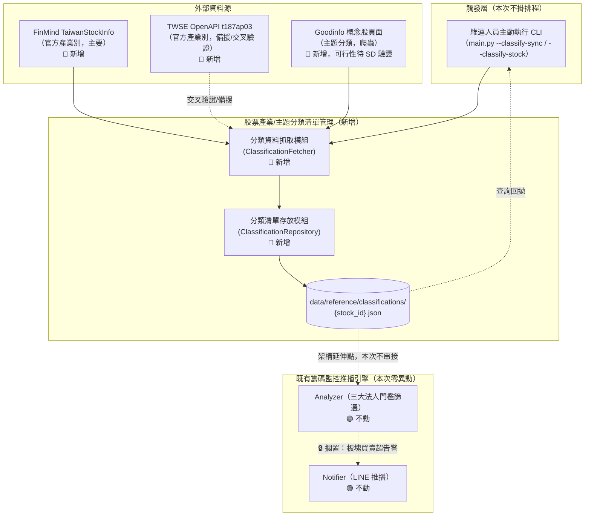
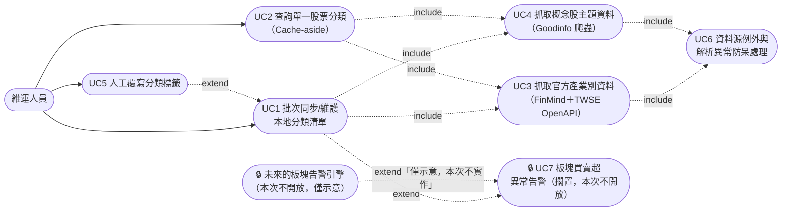
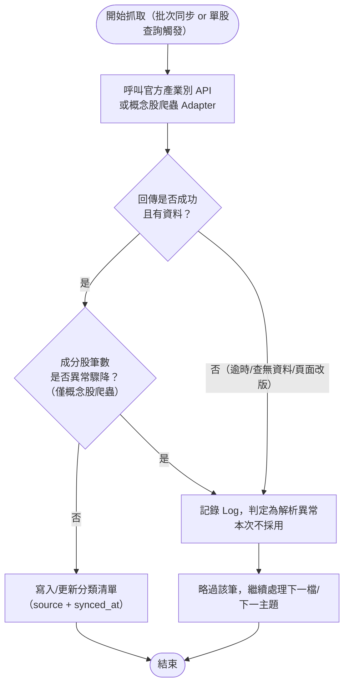

# SA-股票產業主題分類清單管理-功能模組分析

## 0. 文件資訊與需求摘要

| 項目 | 內容 |
| :--- | :--- |
| 文件類型 | 系統分析（功能模組分析）文件 / SA 需求規格書（新增功能模組） |
| 分析範疇 | `FinanceTracker` 專案新增「股票產業/主題分類清單管理」模組，涉及新增資料抓取元件（官方產業別 API Client ＋ 概念股爬蟲 Adapter）、新增本地分類清單存放機制、`main.py` 新增主動呼叫用 CLI 操作模式；**不涉及**既有籌碼監控推播引擎（Fetcher／Analyzer／Notifier）之每日排程流程，亦**不涉及**每日通知內容異動 |
| 對象讀者 | PO / SA / SD / 開發人員 / 維運人員 |
| 建立日期 | 2026-08-25 |
| 作者 | Claude Code（依 Roy Chiang 提供之需求整理） |
| 分析階段 | 本次僅到**功能模組層級**分析；資料表 DDL、API 詳細規格（Request/Response Schema）、類別圖屬後續 SD 階段產出 |
| 設計依據 | 現行程式碼 `src/`、`config/`（尤其 [`src/issuer_pcf/`](../../../src/issuer_pcf/) 之可替換爬蟲 Provider 架構）、本次對話中對 FinMind／TWSE OpenAPI／Goodinfo 之即時研究與驗證紀錄（見第七章） |

### 名詞定義

| 名詞 | 英文/代碼 | 定義 |
| :--- | :--- | :--- |
| 產業分類 | Industry Category | 證交所／櫃買中心官方認定之上市櫃公司產業別（33 大類，如「半導體業」「金融保險業」），為法定、單一歸屬之分類 |
| 主題／概念股分類 | Thematic / Concept Classification | 市場慣用、跨產業之分類方式（如「AI 概念股」「電動車概念股」「CPO 概念股」），無官方標準，同一檔股票可同時歸屬多個主題，各資訊平台各自定義且可能不一致 |
| 分類清單 | Classification Registry | 本模組於本地維護的「股票 → 分類」對照清單，含產業與主題兩個維度，儲存於 `data/reference/classifications/` |
| FinMind `TaiwanStockInfo` | — | FinMind 提供的台股基本資料集，含股票代碼、名稱、官方產業別（`industry_category`）、上市/上櫃/興櫃別；免費層可用，**本次確認採用**作為產業分類主要來源 |
| TWSE OpenAPI `t187ap03` | — | 證交所「公開資訊觀測站」開放資料集（`mopsfin.twse.com.tw/opendata/t187ap03_L.csv`），提供上市公司基本資料含官方產業別，**本次列為交叉驗證／備援來源** |
| Goodinfo 概念股頁面 | Goodinfo Concept Page | Goodinfo!台灣股市資訊網之「概念股」分類頁面（`StockList.asp?MARKET_CAT=概念股&INDUSTRY_CAT={主題名稱}`），提供主題顆粒度分類，**無官方 API**，需以網頁爬蟲取得，比照現行 ETF PCF 投信官網爬蟲模式辦理 |
| `ConceptAdapter` | — | 比照現行 [`IssuerPcfProvider`](../../../src/issuer_pcf/base.py) 介面設計之可替換爬蟲元件，負責解析概念股主題頁面，取得「主題 → 成分股」對照 |
| Cache-aside 查詢 | — | 查詢股票分類時，本地清單已有資料則直接回拋；沒有則即時呼叫資料源取得、寫入清單後再回拋的存取模式 |

### 需求摘要

現行「籌碼監控推播引擎」的告警能力僅能對「個股」與「大盤整體」兩個層級做買賣超門檻判斷（見 [SA-三大法人分級門檻告警機制-功能模組分析.md](./SA-三大法人分級門檻告警機制-功能模組分析.md)），中間缺少「板塊／主題」的中介層級，導致同一主題下多檔個股同時出現訊號時，使用者仍須逐股比對才能察覺板塊性資金流向。要做到板塊/主題層級的市場情緒關注，前提是要先有「個股屬於哪個分類」的資料，因此本次新增「股票產業/主題分類清單管理」模組，作為**主動呼叫、非排程**的獨立維護工具。

已針對免費/開源資料源進行評估，結論分為兩層：

1. **官方產業分類**：台灣公開生態中有可靠免費來源——**FinMind 免費層 `TaiwanStockInfo`**（主要）與**證交所 OpenAPI `t187ap03` 開放資料集**（交叉驗證／備援），兩者皆為官方 33 大類產業別，顆粒度較粗但資料權威、免費、穩定。
2. **主題／概念股分類**：經查證 FinMind、TWSE OpenAPI、TPEx OpenAPI 及一般公開 API 生態，**查無提供此顆粒度的官方免費 API**；僅 Goodinfo、CMoney、MoneyDJ 等商業資訊網站有「概念股」分類頁面，且皆**無官方 API、僅能以網頁爬蟲取得**，服務條款是否允許需人工審視——性質上與本專案既有「投信官網 PCF 爬蟲」（[SD-ETF換倉資料來源方案評估-投信官網爬蟲-系統設計書.md](../../design/architecture/SD-ETF換倉資料來源方案評估-投信官網爬蟲-系統設計書.md)）完全相同：屬公開可瀏覽資訊，但條款合規性待人工確認、非本次開發阻塞項。

本次確認之開發方向：產業分類串接官方 API 自動化；主題/概念股比照 `issuer_pcf` 之可替換 Provider 架構，建立 `ConceptAdapter` 介面與 Goodinfo 第一版 Adapter，服務條款審視列為 SD 階段待辦、不阻塞本次架構開發（比照既有 ETF PCF 模組先例）。「本地分類清單建立與維護」「單股查詢」為本次交付範圍；「板塊買賣超異常納入每日通知告警」使用者已明確表示**本次擱置、不開放**，僅在架構上預留延伸點。

| 子模組 | 本次異動類型 | 異動摘要 |
| :--- | :--- | :--- |
| 分類資料抓取模組 (ClassificationFetcher) | 🔴 新增 | 呼叫官方產業別 API（FinMind／TWSE OpenAPI）＋ 概念股爬蟲 `ConceptAdapter`（Goodinfo） |
| 分類清單存放模組 (ClassificationRepository) | 🔴 新增 | 本地 JSON 清單讀寫，比照既有股本快取「目前最新值、單檔覆寫」模式 |
| 分類查詢/維護 CLI (`main.py` 新增操作模式) | 🔴 新增 | 新增「批次同步」與「單股查詢」兩種主動呼叫入口，不掛進每日排程 |
| 板塊/主題買賣超告警整合 | ⚪ 擱置（本次不開放） | 使用者明確表示暫時擱置，僅記錄為未來架構延伸點（見 §3.4、§六） |

---

## 一、關鍵設計原則

| 項目 | 結論 |
| :--- | :--- |
| 產業分類資料源已確定 | **本次確認採用 FinMind 免費層 `TaiwanStockInfo`** 作為主要來源，**TWSE OpenAPI `t187ap03_L.csv`** 作為交叉驗證／備援來源；兩來源不一致時的處理規則屬 SD 階段待確認事項（見第六章），不阻塞本次架構設計 |
| 主題/概念股無官方 API，比照既有爬蟲模式辦理 | 已確認台灣公開生態查無官方免費主題分類 API；比照 [`IssuerPcfProvider`](../../../src/issuer_pcf/base.py)／`ADAPTER_REGISTRY` 之可替換介面設計精神，新增 `ConceptAdapter` 基底類別與獨立 `ConceptAdapterRegistry`，第一版實作 Goodinfo Adapter；服務條款合規性列為待人工法律審視事項，比照現行兩份投信官網條款審視之既有先例（非阻塞、上線前需完成） |
| 本次不掛進每日排程 | 使用者明確要求「先無須將此功能加入每日排程」，本模組**不**新增至 `.github/workflows/daily-chip-monitor.yml`，也**不**參與 `Fetcher.fetch_all()` 既有流程；改為 `main.py` 新增獨立 CLI 操作模式，比照既有 `--purge` 模式「與主流程互不影響」之設計 |
| 分類清單為「目前最新值」，非逐日快照 | 比照現行股本快取（[`StockCapitalSnapshot`](../../../src/models.py)／`data/reference/capital_stock/{stock_id}.json`）之存放慣例，分類清單存放於 `data/reference/classifications/{stock_id}.json`，不分日期、單檔覆寫——股票的產業/主題歸屬是相對穩定的參考資料，不是逐日變動的市場數據，不需要也不應該比照 `data/snapshots/{date}/` 逐日存放 |
| Cache-aside 查詢，兩種操作路徑共用同一份寫入邏輯 | 「批次同步」與「單股查詢（清單無資料時）」皆呼叫同一組 Fetch → 寫入清單的邏輯，避免兩條路徑各自實作、日後行為分岔 |
| 人工覆寫優先於自動同步 | 每筆分類記錄需標記 `source`（`FINMIND` / `TWSE_OPENAPI` / `GOODINFO_CONCEPT` / `MANUAL`）；批次同步預設**不覆蓋** `MANUAL` 來源的既有記錄，避免自動化同步蓋掉維運人員手動修正過的分類標籤 |
| 板塊/主題告警本次不開放，僅留架構延伸點 | 使用者已明確表示「此功能先不開放，暫時擱置」；Analyzer／Notifier／`thresholds.json` 本次**零異動**，僅在 §3.4、第六章記錄未來若要開放所需的前置條件，不視為本次未完成事項 |
| 例外容錯策略沿用 | 沿用既有 Fetcher `try/except` 不中斷、記錄 Log 之模式，套用於官方 API 與概念股爬蟲兩種新資料源 |
| 解析異常防呆沿用 | 概念股爬蟲頁面結構若局部改版，比照現行 [`Fetcher._is_holding_count_anomaly`](../../../src/fetcher.py) 精神，對「同一主題成分股筆數較前次同步驟降」做防呆判斷，不照單全收殘缺資料 |

---

## 二、現行系統分析（As-Is）

### 現況

- 現行系統完全沒有股票分類能力，`config/watchlist.json` 僅有股票代碼／分點名稱／ETF 代碼三份純清單，無任何產業或主題標籤。
- `InstitutionalTradeRecord`、`InstitutionalAlert`（見 [`src/models.py`](../../../src/models.py)）皆以單一股票（`stock_id`）為判斷單位；`InstitutionalTieredFilter` 與 `MarketInstitutionalFilter`（見 [`src/analyzer.py`](../../../src/analyzer.py)）分別只做「個股」與「大盤整體」兩個層級的門檻篩選，中間沒有「板塊/主題」的中介層級。即便同一主題（例如「AI 概念股」）下有多檔關注股票同時出現三大法人買賣超訊號，使用者也只能一檔一檔看告警，難以直接察覺這是板塊性資金流向還是單一個股事件。
- 已針對免費/開源分類資料源逐一查證：
  - **FinMind `TaiwanStockInfo`**：含股票代碼、名稱、官方產業別（`industry_category`）、上市/上櫃/興櫃別，免費層可用，與現行專案已使用之 FinMind 生態一致，不需新增憑證管理。
  - **TWSE OpenAPI `t187ap03_L.csv`**：證交所公開資訊觀測站開放資料，官方產業別，免金鑰、CSV 格式直接下載，可作為交叉驗證或 FinMind 失效時的備援。
  - **主題/概念股分類**：Goodinfo「概念股」分類頁面（`StockList.asp?MARKET_CAT=概念股&INDUSTRY_CAT={主題}`）有此顆粒度資料，但**無官方 API**；實測直接以工具擷取該頁面內容回傳為空白，研判為動態載入或有防爬機制，實際可爬性需 SD 階段以瀏覽器層級請求重新驗證（見第六章）。CMoney、MoneyDJ「概念股表現」頁面性質相同，皆僅能爬蟲取得、無官方 API。政府資料開放平臺（data.gov.tw）僅將 Goodinfo 列為「政府開放資料應用案例」，其推薦連結對應的官方資料集（個股日/月/年成交資訊）本身**不含**主題/概念股分類欄位，並非可直接取用的分類資料源。
  - **結論**：官方產業分類（33 大類）有可靠免費來源，可直接自動化串接；主題/概念股顆粒度在台灣公開生態中無官方免費 API，只能透過網頁爬蟲取得，且合規性（服務條款）待人工審視——這點與專案既有 ETF PCF 投信官網爬蟲模組面臨的處境一致，也因此本次比照同一套「可替換 Provider 架構＋非阻塞式條款待審視」的模式辦理，而非等待條款審視完成才開始開發。

**痛點對照：**

| 痛點 | 現況影響 |
| :--- | :--- |
| 個股與大盤間缺少板塊層級 | 三大法人告警只能逐股或看大盤整體，主題性資金動向需人工彙整多檔個股訊號才能察覺，見 §一 |
| 完全無股票分類資料 | 若要做板塊/主題告警，第一步「股票屬於哪個分類」目前完全空白，必須先補齊，此即本次模組之目的 |
| 主題分類無官方資料源 | 未來若要支援主題顆粒度告警，資料源本身須靠爬蟲取得，需先比照既有 ETF PCF 模式建立可替換架構才能對接，且爬取可行性尚待 SD 階段實測驗證 |

### 可複用的現行機制

| 機制 | 現行元件 | To-Be 用途 |
| :--- | :--- | :--- |
| 可替換 Provider 介面設計 | [`IssuerPcfProvider`](../../../src/issuer_pcf/base.py)、[`ADAPTER_REGISTRY`](../../../src/issuer_pcf/registry.py) | 概念股爬蟲比照同一介面設計模式，新增 `ConceptAdapter` 基底類別與獨立 `ConceptAdapterRegistry`，不與既有 ETF PCF registry 混用 |
| 官網爬蟲解析異常防呆 | [`Fetcher._is_holding_count_anomaly`](../../../src/fetcher.py) | 概念股清單筆數異常驟降時比照同一精神判定為解析異常，不採用 |
| 「目前最新值」單檔覆寫快取模式 | `StockCapitalSnapshot` / `data/reference/capital_stock/{stock_id}.json` | 分類清單比照同一存放模式，落在 `data/reference/classifications/{stock_id}.json` |
| `ConfigLoader` 設定檔驗證與查表模式 | `_validate_issuer_registry()`、`get_issuer_mapping()`、`get_issuer_name()` | 新增 `concept_registry.json`（主題 → 爬蟲 Adapter／頁面網址對照）比照同一驗證/查表模式 |
| CLI 獨立操作模式（與每日主流程互不影響） | `main.py --purge` | 新增 `--classify-sync` / `--classify-stock` 比照同一「獨立於抓取/分析/推播主流程」之設計 |
| 例外容錯 `try/except` 不中斷 + Log | Fetcher 全模組既有慣例 | 新資料源（官方 API、概念股爬蟲）沿用 |

---

## 三、目標系統分析（To-Be）

### 模組總覽



### 使用案例圖（Use Case Diagram）

**參與角色（Actor）：**
- 維運人員（Maintainer）：本模組唯一的觸發角色，以 CLI 主動呼叫，非排程觸發
- （未來、本次不實作）告警引擎：僅作為架構延伸點於圖上標示，說明本模組資料未來可能的消費者，本次不開放



> 說明：UC7 與「未來的板塊告警引擎」為**架構延伸點示意**，不對應本次任何 FR，詳見 §3.4 與第六章；本文件後續 FR 僅逐一對應 UC1～UC6。

### 3.1 分類資料抓取模組（對應 UC3、UC4、UC6）

| 編號 | 功能 | 說明 |
| :--- | :--- | :--- |
| FR-1.1 | 官方產業別資料抓取 | 呼叫 **FinMind API `TaiwanStockInfo`**（免費層，主要來源），取得股票代碼、股票名稱、官方產業別（`industry_category`）、上市/上櫃/興櫃別 |
| FR-1.2 | 官方產業別交叉驗證/備援 | 呼叫 **TWSE OpenAPI `t187ap03_L.csv`**，於 FinMind 查無資料或回應異常時作為備援來源；正常情況下亦可用於交叉比對兩來源產業別是否一致（比對規則見第六章） |
| FR-1.3 | 概念股主題資料抓取（爬蟲） | 透過 `ConceptAdapter` 介面（比照 [`IssuerPcfProvider`](../../../src/issuer_pcf/base.py)）呼叫 Goodinfo 概念股頁面（依 `concept_registry.json` 登記之主題清單逐一抓取），每個主題頁面回傳「該主題下的成分股清單」，再反向彙整為「某股票屬於哪些主題」 |
| FR-1.4 | 資料來源標記 | 每筆分類記錄需標記 `source`（`FINMIND` / `TWSE_OPENAPI` / `GOODINFO_CONCEPT` / `MANUAL`）與 `synced_at`，供追溯與 FR-2.3 人工覆寫優先權判斷使用 |
| FR-1.5 | 例外與解析異常防呆 | 官方 API 逾時/查無資料、爬蟲頁面結構改版導致解析結果為空或成分股筆數異常驟減，皆記錄 Log 且不中斷整體同步流程，比照既有 [`_is_holding_count_anomaly`](../../../src/fetcher.py) 精神處理 |

**特殊規則：資料來源對照表**

| 資料類型 | 採用來源 | 驗證狀態 | 輸入參數 | 輸出關鍵欄位 |
| :--- | :--- | :--- | :--- | :--- |
| 官方產業分類（主要） | ✅ FinMind API `TaiwanStockInfo`（免費層） | 已確認資料集存在且含 `industry_category` 欄位，與專案既有 FinMind 生態一致，免新增憑證 | 不需 `data_id` 亦可查全清單，或逐股查詢 | `stock_id`、`stock_name`、`industry_category`、`type`（上市/上櫃/興櫃） |
| 官方產業分類（備援/交叉驗證） | ✅ TWSE OpenAPI `t187ap03_L.csv` | 官方開放資料，免金鑰，CSV 格式直接下載 | 無（整份 CSV） | 公司代號、公司名稱、產業別 |
| 主題/概念股分類 | ⚠️ Goodinfo 概念股頁面（`StockList.asp?MARKET_CAT=概念股&INDUSTRY_CAT={主題}`） | 查無官方 API；本次以一般 HTTP 請求擷取頁面內容回傳空白，研判為動態載入或防爬機制，**實際可爬性待 SD 階段以瀏覽器層級請求重新驗證**；服務條款合規性待人工法律審視 | 主題名稱（`INDUSTRY_CAT`，需於 `concept_registry.json` 逐一登記） | 主題名稱、成分股代碼、成分股名稱 |

**例外處理流程（沿用既有架構）：**



### 3.2 分類清單存放與查詢模組（對應 UC1、UC2、UC5）

| 編號 | 功能 | 說明 |
| :--- | :--- | :--- |
| FR-2.1 | Cache-aside 單股查詢 | 輸入股票代碼 → 本地清單（`data/reference/classifications/{stock_id}.json`）已有資料則直接回拋；不存在則呼叫 FR-1.1～1.3 取得後寫入清單、再回拋，兩種情況皆回傳相同格式的分類資訊 |
| FR-2.2 | 批次同步維護 | 對指定股票清單（預設為 `watchlist.json.stocks`，可用參數覆寫）逐檔重新呼叫官方 API 與概念股爬蟲，更新既有分類資料 |
| FR-2.3 | 人工覆寫優先權 | 若某股票的既有分類記錄 `source=MANUAL`，批次同步時預設**不覆蓋**該筆資料，除非明確加上強制覆寫參數；避免自動化同步蓋掉維運人員手動修正過的分類標籤 |
| FR-2.4 | 分類清單查詢輸出 | 查詢結果輸出股票代碼、名稱、產業分類、主題標籤清單（可能多個）、各欄位資料來源與最後同步時間 |

**CLI 輸出格式草案（示意）：**

```
$ python main.py --classify-stock 2330

股票代碼：2330
股票名稱：台積電
產業分類：半導體業（來源：FINMIND，同步於 2026-08-25T09:00:00+08:00）
主題標籤：
  - AI 概念股（來源：GOODINFO_CONCEPT，同步於 2026-08-25T09:00:00+08:00）
  - 先進封裝概念股（來源：GOODINFO_CONCEPT，同步於 2026-08-25T09:00:00+08:00）

（本地清單已存在此股票資料，直接回拋；未重新呼叫外部資料源）
```

**分類衝突處理：** FinMind 與 TWSE OpenAPI 兩官方來源之產業別若不一致，比對與優先權規則屬 SD 階段待確認事項（見第六章），本次不預設任一方絕對優先。

### 3.3 分類清單維護 CLI（對應 UC1、UC2）

| 編號 | 功能 | 說明 |
| :--- | :--- | :--- |
| FR-3.1 | 批次同步指令 | `main.py --classify-sync [--stocks 2330,2454]`：對 `watchlist.json.stocks`（預設）或 `--stocks` 指定的股票代碼清單，批次執行 FR-2.2 |
| FR-3.2 | 單股查詢指令 | `main.py --classify-stock {股票代碼}`：對單一股票執行 FR-2.1 |
| FR-3.3 | `--dry-run` 相容 | 沿用既有旗標語意，僅預覽本次會抓取／覆寫的內容，不實際寫入清單檔案 |
| FR-3.4 | 獨立於每日主流程 | 上述指令**不**新增至 `.github/workflows/daily-chip-monitor.yml`，也**不**參與 `run()`／`fetch_all()` 既有流程，僅供維運人員手動觸發 |

### 3.4 板塊/主題買賣超告警整合（🔒 擱置，本次不開放）

使用者已於需求中明確表示「此功能先不開放，暫時擱置」，本節僅記錄未來若要開放所需的前置條件，**不屬於本次交付範圍，不納入驗收**：

1. 本模組需先穩定產出「主題 → 成分股」清單（本次交付範圍）。
2. Analyzer 需新增依主題分組、加總關注股票三大法人買賣超的篩選器（比照現行 `MarketInstitutionalFilter` 精神，但作用對象改為主題分組而非大盤整體）。
3. Notifier／`MessageFormatter` 需新增主題告警訊息格式區塊。
4. `thresholds.json` 需新增主題層級門檻設定。

以上四項**本次均不實作**，Analyzer／Notifier／`thresholds.json` 本次零異動。

### To-Be 資料模型（概念層）

> 註：以下為邏輯資料模型，供理解模組間資料流向；實際欄位型別與檔案 schema 細節由 SD 階段決定。

```mermaid
erDiagram
    STOCK_CLASSIFICATION ||--o{ STOCK_THEME_TAG : has

    STOCK_CLASSIFICATION {
        string stock_id PK
        string stock_name
        string industry_category "官方產業別，單一歸屬"
        string industry_source "FINMIND / TWSE_OPENAPI / MANUAL"
        string industry_synced_at
    }
    STOCK_THEME_TAG {
        string stock_id PK_FK
        string theme_name PK "同一股票可有多筆，如 AI概念股/電動車概念股"
        string source "GOODINFO_CONCEPT / MANUAL"
        bool is_manual_override
        string synced_at
    }
```

- 每檔股票落地為單一檔案 `data/reference/classifications/{stock_id}.json`，比照現行 `StockCapitalSnapshot` 之「目前最新值、單檔覆寫」存放模式，不落在 `data/snapshots/{date}/` 逐日快照目錄下。
- `STOCK_THEME_TAG` 為一對多關係（一檔股票可同時屬於多個主題），落地時以陣列形式存放於同一份 `{stock_id}.json` 內，不另外拆檔。

### 排程引擎整合說明

本次新增模組完全獨立於既有排程與推播流程，「直接沿用 vs 新增實作」對照如下：

| 機制 | 異動類型 |
| :--- | :--- |
| GitHub Actions 每日排程 (`daily-chip-monitor.yml`) | 🟢 不涉及，本次不新增排程項目 |
| `main.py` 既有 `run()` / `fetch_all()` 主流程 | 🟢 不涉及，本模組為獨立 CLI 操作模式 |
| `ConfigLoader` 設定檔載入/驗證模式 | 🟢 直接沿用（新增 `concept_registry.json` 比照同一驗證慣例） |
| `IssuerPcfProvider` 可替換介面設計精神 | 🟢 直接沿用其設計原則（新增獨立的 `ConceptAdapter` 介面與 registry，不與既有 ETF 爬蟲共用同一介面/registry） |
| 官方產業別 API 串接 | 🔴 新增實作 |
| 概念股爬蟲 Adapter 串接 | 🔴 新增實作（可行性待 SD 階段驗證） |
| Analyzer／Notifier／`thresholds.json` | 🟢 零異動（板塊告警本次擱置） |

---

## 四、非功能性需求與驗收標準（NFR & Acceptance Criteria）

| 類別 | 需求內容 |
| :--- | :--- |
| 相容性 | 沿用既有 Python 3.x 執行環境，本次不新增執行環境需求 |
| 資料一致性 | FinMind 與 TWSE OpenAPI 兩官方產業別來源不一致時的合併/優先權規則需於 SD 階段確認，避免同一股票在不同次同步後產業別互相打架 |
| 資料來源可替換性 | 概念股爬蟲之 `ConceptAdapter` 需維持介面抽象化，比照 `IssuerPcfProvider` 精神，未來如需切換/新增其他概念股資料源（如 CMoney、MoneyDJ）不得需要改動分類清單存放/查詢邏輯 |
| 免費額度控管 | FinMind `TaiwanStockInfo` 為整份清單查詢，不逐股呼叫，額度風險低；概念股爬蟲需比照既有投信官網爬蟲慣例，避免短時間高頻請求同一網站 |
| 非排程獨立性 | 本模組所有操作皆為主動呼叫，不得影響既有每日排程（抓取/分析/推播）之執行時間或成功率 |
| 資料合規性（非阻塞） | Goodinfo 網頁爬蟲之服務條款合規性列為 SD 階段待人工法律審視事項，比照現行兩份投信官網條款審視之既有先例，非本次開發阻塞項，但上線前需完成 |
| 可維護性/一致性 | 沿用既有模組化目錄結構與 Provider 介面設計慣例，新增分類模組不需重構既有 Fetcher／Analyzer／Notifier 核心邏輯 |
| 安全性 | 不新增金鑰管理需求，沿用既有 `FINMIND_TOKEN`；Goodinfo 爬蟲無需憑證 |
| 語系 | 分類清單與 CLI 輸出內容一律採繁體中文，本次不涉及外語需求 |
| 可觀測性 | 沿用既有 Log 記錄機制，官方 API 與爬蟲之成功/失敗/解析異常狀態需可追查 |
| 成本 | 資料來源維持免費（FinMind 免費層＋官方開放資料＋公開網頁爬蟲），本次不產生額外費用 |

### 驗收標準（Acceptance Criteria）

| 驗收項目 | 驗收條件 | 驗收方式 |
| :--- | :--- | :--- |
| 官方產業別批次同步成功 | 針對 `watchlist.json.stocks` 內每檔股票，執行 `--classify-sync` 後皆可成功取得官方產業別並落地為 `{stock_id}.json` | 執行紀錄檢視 + 分類清單檔案內容檢查 |
| Cache-aside 查詢正確性 | 清單已有資料時查詢不重新呼叫外部資料源；清單無資料時查詢會觸發抓取並寫入清單後回拋 | 單元測試（以假 Provider 驗證呼叫次數） |
| 人工覆寫不被自動同步覆蓋 | 給定某股票分類記錄 `source=MANUAL`，執行 `--classify-sync` 後該筆記錄內容不變（未加強制覆寫參數時） | 單元測試（固定輸入/預期輸出比對） |
| 概念股爬蟲解析異常防呆 | 模擬概念股頁面成分股筆數異常驟降，驗證不採用該次結果、記錄 Log、不中斷整體同步流程 | 單元測試（以假頁面內容模擬異常情境） |
| 不影響既有每日排程 | 本次新增之 CLI 操作模式與程式碼不影響 `daily-chip-monitor.yml`、`main.py run()`／`fetch_all()` 既有行為 | 比對異動前後既有排程相關程式碼與 workflow 檔案無變更 |
| 板塊告警本次未開放 | Analyzer／Notifier／`thresholds.json` 無任何異動，每日通知內容與異動前一致 | Code Review + 比對每日通知簡報格式無變化 |

---

## 五、需求追溯表（Traceability）

| 來源需求 | To-Be 對應章節/FR | 受影響元件（概念層） |
| :--- | :--- | :--- |
| 評估免費/開源台股基本面、產業分類、概念股分類 API | §二 現況、§一 關鍵設計原則 | （研究結論，見第七章） |
| 需求 1：本地建立分類清單，每次呼叫打 API 維護 | §3.1 FR-1.1～1.5、§3.2 FR-2.2、§3.3 FR-3.1 | ClassificationFetcher（新增）、ClassificationRepository（新增） |
| 需求 2：輸入股票代號查詢分類，清單已存在則直接回拋 | §3.2 FR-2.1、FR-2.4、§3.3 FR-3.2 | ClassificationFetcher／ClassificationRepository |
| 需求 3：板塊/主題買賣超告警（本次擱置） | §3.4（僅記錄前置條件，不實作） | 未來：Analyzer／Notifier／`thresholds.json`（本次零異動） |
| 決策：不掛進每日排程 | §一 關鍵設計原則、§3.3 FR-3.4、排程引擎整合說明 | `main.py`、`.github/workflows/daily-chip-monitor.yml`（不動） |
| 決策：主題分類比照 ETF PCF 模式建立可替換爬蟲架構 | §一 關鍵設計原則、§3.1 FR-1.3 | 新增 `ConceptAdapter`／`ConceptAdapterRegistry`（比照 `IssuerPcfProvider`／`ADAPTER_REGISTRY`） |
| NFR 資料來源可替換性 | §四 NFR | `ConceptAdapter` 介面設計 |
| NFR 資料合規性（非阻塞） | §四 NFR | Goodinfo Adapter（SD 階段待法律審視） |

---

## 六、SD 階段待細化事項

- **Goodinfo 概念股頁面實際可爬性驗證**：本次以一般 HTTP 請求擷取該頁面內容回傳空白，研判為動態載入或防爬機制，SD 階段需以瀏覽器層級請求（或其他技術手段）重新驗證是否可行；若證實不可行，需重新評估備選概念股來源（如 CMoney、MoneyDJ 概念股表現頁），此為本次架構設計之最大不確定性，建議 SD 階段優先驗證。
- **產業別 FinMind vs TWSE OpenAPI 不一致時的優先權/合併規則**：兩來源皆為官方資料但更新時點可能不同，需 SD 階段確認以何者為準或如何合併呈現。
- **`concept_registry.json` schema 設計**：比照 `issuer_registry.json` 慣例，需定義主題名稱、對應 Goodinfo `INDUSTRY_CAT` 參數、Adapter 鍵值等欄位。
- **分類清單新鮮度/TTL**：是否需要比照股本快取 90 天 TTL 設定分類清單的「視為過期需重新同步」門檻，或分類資料視為近乎靜態、不設 TTL。
- **人工覆寫的 CLI 操作方式**：是否需要專門的 `--classify-override` 指令，或直接編輯 `{stock_id}.json` 檔案、將 `source` 改為 `MANUAL` 即可視為覆寫。
- **強制覆寫參數設計**：`--classify-sync` 需要何種參數（例如 `--force`）才會覆蓋既有 `MANUAL` 記錄，避免誤觸。
- **CLI 輸出格式細節**：純文字（如 §3.2 示意）或另外支援 JSON 輸出（`--format json`），供未來其他程式串接使用。
- **查詢範圍界定**：`--classify-stock` 是否僅限 `watchlist.json.stocks` 內的股票，或開放查詢任意台股代碼（若開放任意代碼，需額外考慮官方 API 對非監控股票的呼叫額度影響）。
- **Goodinfo 服務條款人工法律審視**：比照現行兩份投信官網條款審視之既有待辦模式，非本次開發阻塞項，但上線前需完成。

---

## 七、來源檔案索引

- [`src/fetcher.py`](../../../src/fetcher.py) — 現行 Fetcher 例外容錯與解析異常防呆（`_is_holding_count_anomaly`）之參考實作
- [`src/issuer_pcf/base.py`](../../../src/issuer_pcf/base.py) — `IssuerPcfProvider` 可替換介面定義，`ConceptAdapter` 設計依據
- [`src/issuer_pcf/registry.py`](../../../src/issuer_pcf/registry.py) — `ADAPTER_REGISTRY` 對照模式，`ConceptAdapterRegistry` 設計依據
- [`src/config.py`](../../../src/config.py) — `ConfigLoader` 設定檔驗證/查表模式（`_validate_issuer_registry()`、`get_issuer_mapping()`）
- [`src/storage.py`](../../../src/storage.py) — `SnapshotRepository` 股本快取「目前最新值、單檔覆寫」存放模式參考
- [`src/models.py`](../../../src/models.py) — 現行資料結構定義（`StockCapitalSnapshot` 等）
- [`main.py`](../../../main.py) — 現行 `--purge` 獨立 CLI 操作模式參考
- `config/watchlist.json`、`config/issuer_registry.json` — 現行設定檔範例，`concept_registry.json` 設計參考
- [SA-三大法人分級門檻告警機制-功能模組分析.md](./SA-三大法人分級門檻告警機制-功能模組分析.md) — 現行個股/大盤兩層級告警設計，說明板塊層級缺口
- [SD-ETF換倉資料來源方案評估-投信官網爬蟲-系統設計書.md](../../design/architecture/SD-ETF換倉資料來源方案評估-投信官網爬蟲-系統設計書.md) — 既有投信官網爬蟲之服務條款待審視先例
- 本次對話中對 FinMind `TaiwanStockInfo`、TWSE OpenAPI `t187ap03_L.csv`、Goodinfo 概念股頁面、data.gov.tw 開放資料應用平臺之即時研究與擷取驗證紀錄
