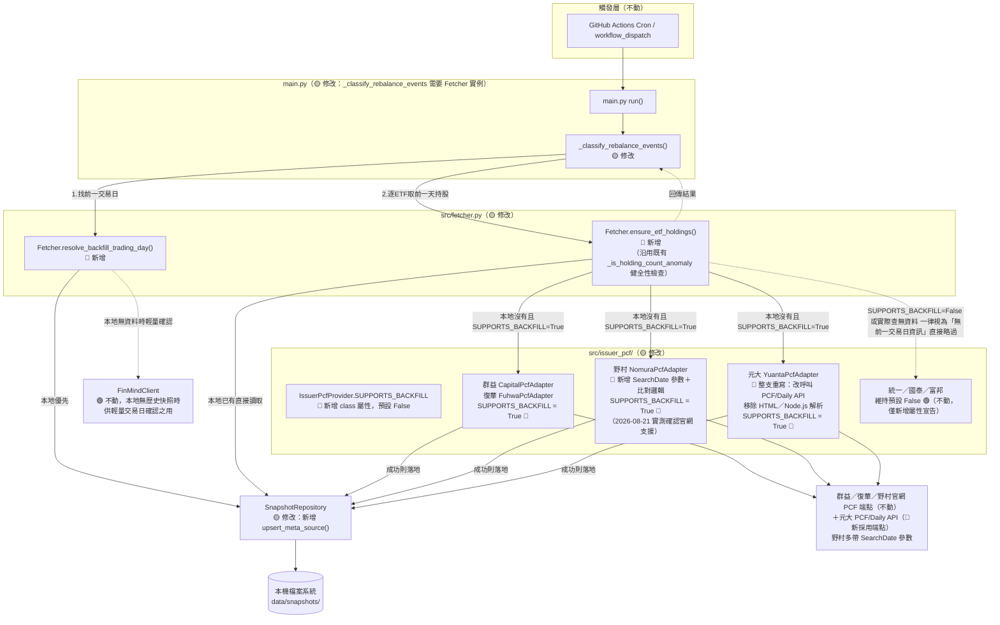
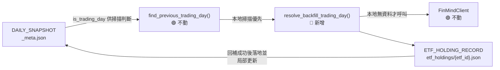
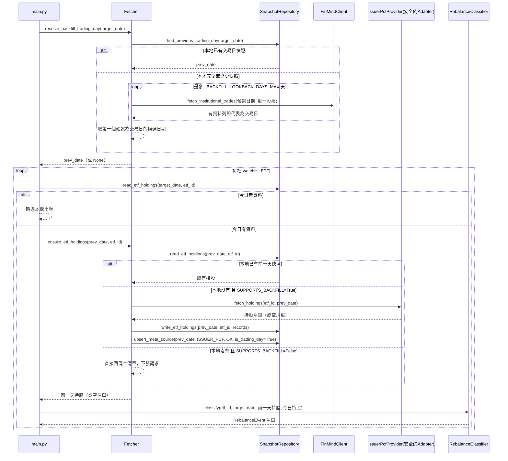

# SD-ETF換倉歷史日期回補機制-系統設計書

| 項目 | 內容 |
| :--- | :--- |
| 文件類型 | 系統設計書（SD，技術性文件，既有系統之異動設計） |
| 設計依據 | 本文件非典型「SA 先行」流程產出，設計依據為 Roy Chiang 於 2026-08-21 實際執行 `scripts/run.sh 0 --date 2026-07-28`（補跑歷史日期）時觀察到「LINE 通知未包含 ETF 換倉段落」之真實缺陷重現（見下方「問題重現與根因拆解」），並延伸沿用 [SA-ETF換倉資料來源方案評估-投信官網爬蟲可行性分析.md](../../analysis/requirements/SA-ETF換倉資料來源方案評估-投信官網爬蟲可行性分析.md) 既有之技術限制分析 |
| 相關文件 | [SD-ETF換倉資料來源方案評估-投信官網爬蟲-系統設計書.md](./SD-ETF換倉資料來源方案評估-投信官網爬蟲-系統設計書.md)（各投信 Adapter 之技術可行性、URL／payload 查證紀錄，本文件之「回補能力矩陣」直接沿用其查證結論，不重複查證）、[SD-籌碼監控推播引擎-系統設計書.md](./SD-籌碼監控推播引擎-系統設計書.md)（`main.py`／`Fetcher`／`SnapshotRepository` 原始設計） |
| 對象讀者 | SD／開發人員／維護人員 |
| 建立日期 | 2026-08-21 |
| 作者 | Claude Code（依 Roy Chiang 確認之設計方向整理） |
| 套件歸屬 | 既有專案 `FinanceTracker`，單一 Python 套件 `src/`；本次不新增子套件，異動集中於 `main.py`／`src/fetcher.py`／`src/storage.py`／`src/issuer_pcf/base.py` 及各 Adapter |

### 異動歷程

| 輪次 | 內容摘要 |
| :--- | :--- |
| 第一輪 | 建立本文件。拆解「補跑 2026-07-28 通知漏了 ETF 換倉段落」之根因為兩個各自獨立、疊加發生的原因；設計「投信官網回補能力矩陣」與「就近一日回補（bounded backfill）」機制，讓「本地剛好缺前一交易日快照」的情境可自動補齊，同時明確劃出「深度歷史回補（如數週前）」不在本次範圍之界線 |
| 第二輪 | 依 Roy Chiang 要求，將「查詢日期回補能力」矩陣（結論層級）往下展開至「實際呼叫哪支 API、日期參數怎麼帶」的實作層級：拆分「①清單／代碼解析 API」與「②持倉明細 API」逐家列出實際端點、日期參數帶法與可驗證欄位，並依「日期能不能帶入 / 帶入後能不能確認」重新歸納為 A（完全無法帶入）／B（帶入但無法確認）／C（可安全帶入且可驗證）三類 |
| 第三輪 | Roy Chiang 於 2026-08-21 用 Postman 直接對野村官網 API 測試，額外帶入 body 欄位 `SearchDate: "2026-08-11"`（非今日）後證實回應 `NavDate` 精準對應，推翻本文件原判定「野村完全無法帶入日期」的結論；改判野村技術上與群益/復華同等級（分類由 A 改為 C），並同步更新矩陣、分類表、範圍界線說明、架構圖與 §四 內部元件設計（新增 `nomura.py` 異動項），§六 新增野村相關待確認事項（多日交叉驗證、非官方欄位穩定性風險） |
| 第四輪 | 依 Roy Chiang 要求：①明確註記國泰 `fetch_holdings()` 對回傳內容**無條件信任**（沒有任何比對邏輯，只要 API 回傳非空陣列就直接當成查詢日期當天的持倉），同步更新矩陣、API 明細表、分類表 B、範圍界線說明；②新增「無法帶入日期是否等於 HTML 爬蟲」釐清小節，逐一拆解分類 A 三家（元大／富邦／統一）的實際技術手段，指出統一的持倉明細其實是 Excel 匯出檔而非 HTML，並重申回補能力的判準是「後端是否存在可帶日期參數的結構化查詢介面」，與技術手段是 HTML 或 API 無直接對應關係 |
| 第五輪 | Roy Chiang 於 2026-08-21 用 Postman 發現元大另有一支現行程式碼未使用的官方 JSON API（`FuncId=PCF/Daily`，帶 `ticker`／`date` 查詢參數，已實測成功），回應結構與現行 Nuxt 狀態解析出的 `pcfData.InKind.FundComposition` 高度相似；因 `PCF.trandate` 是否存在於回應中尚未確認、且採用此 API 可能牽涉整支重構 `yuanta.py`（移除 Node.js 依賴），影響範圍大於野村的「加參數」量級，故新增獨立分類 D（技術上可能可行、待確認且待決策，非本次原始範圍），同步更新矩陣、API 明細表、分類表、HTML 爬蟲釐清小節、範圍界線說明，並於 §六 新增 3 項待確認事項（欄位存在性、重構範圍決策、API 穩定性與另一支 `GetLatestIndex` API 之適用性判斷） |
| 第六輪 | Roy Chiang 提供 Postman 截圖確認 `PCF/Daily` 回應確實含 `PCF.trandate`（如 `"trandate": "20260817"`），解決第五輪待確認事項第 8 項；元大改判為分類 C（可安全回補，與群益/復華/野村同等級），但**是否要整支重構 `yuanta.py`** 之架構決策仍未定案，故分類表不再單獨保留 D 類，改在 C 類內以附註區分「異動量級小（群益/復華/野村）」與「異動量級大、待決策（元大）」；同步更新矩陣、API 明細表、範圍界線說明、HTML 爬蟲釐清小節，並於 §六 新增元大多日交叉驗證待確認事項 |
| 第七輪 | 依 Roy Chiang 指示定案兩項設計：①**元大改採 API 架構**，`yuanta.py` 整支重寫為呼叫 `PCF/Daily` API，完全移除官網 HTML 頁面抓取與 Node.js 子行程解析 `__NUXT__` 狀態的機制（不做新舊兩套並存），連帶移除 `FETCH_ISSUER_PCF_NODE_UNAVAILABLE`／`NUXT_EXTRACT_ERROR` 錯誤碼、`SUPPORTS_BACKFILL` 覆寫為 `True`；②**統一「無前一交易日資訊」情境的對外處理**，將原本 `FETCH_ISSUER_PCF_BACKFILL_UNSUPPORTED`／`_NO_DATA`／`_LOOKUP_EXHAUSTED` 三個各自獨立的錯誤碼合併為單一 `FETCH_ISSUER_PCF_NO_PREVIOUS_DAY`，不論成因是「投信不支援回補」還是「支援但實際查無資料/逾時」，一律視為同一種結果——僅保留當日快照、不執行換倉比對，Log 訊息仍依成因分別記錄供人工排查，但下游不再區分處理分支；同步更新矩陣、分類表、架構圖、§四內部元件設計與業務邏輯、§五錯誤碼彙整與例外處理原則、§六待確認事項（新增測試檔案改寫項目），本輪為設計定案，後續進入 `/dev` 實作階段 |
| 第八輪 | 元大查詢邏輯的正確性細節（`date`／`trandate` 之間的 T+1 關係、驗證證據、程式修正）改記錄於獨立文件 [SD-元大投信PCF公告日期機制-系統設計書.md](./SD-元大投信PCF公告日期機制-系統設計書.md)，本文件僅保留結論並附連結，避免兩份文件內容重複維護 |
| 第九輪 | 依 Roy Chiang 要求，重新徹底檢查「無驗證機制」的富邦、國泰是否有被漏掉的日期欄位（吸取凱基案例的教訓：先前只搜尋特定表格內部，沒有搜尋整頁/整包回應）。**富邦**發現頁面隱藏欄位 `hidSearchsDate` 可驗證當日新鮮度，已修正 `fubon.py` 補上日期比對（新增分類 A'）；額外發現頁面其實有「查詢日期」欄位＋查詢按鈕（ASP.NET WebForms postback 機制），可能具備歷史日期查詢能力，但依 Roy Chiang 指示本輪不深入研究，記錄為待確認事項供未來評估。**國泰**重新檢查清單 API 與明細 API 全部欄位，確認真的沒有可用日期欄位，維持分類 B 不變。另外，凱基投信（`kgi.py`，2026-08-24 新增投信，不在本文件原始查證範圍內）同步套用相同修法：用「持股比重」標題下的日期驗證新鮮度。上述三者的 `SUPPORTS_BACKFILL` 均維持 `False`——本輪僅解決「當日資料新鮮度驗證」，不處理「能否查詢歷史日期」（依指示擱置） |
| 第十輪 | Roy Chiang 手動用瀏覽器測試富邦頁面帶入未來日期（`ddate=20260825`），發現頁面另外印出「資料日期：2026/08/24」，**推翻第九輪「富邦僅能驗證當日新鮮度」的判斷**：第九輪誤用的 `hidSearchsDate` 隱藏欄位其實只會回顯查詢輸入、不驗證真實資料狀態（跟國泰「無條件信任」同一種陷阱）；真正的驗證欄位是頁面上的「資料日期」文字，且證實網址參數 `ddate` 本身就是真實可用的日期查詢參數（非交易日/未來日期會誠實回退到最近交易日）；不需要第九輪推測的 ASP.NET postback 模擬。已重寫 `fubon.py`：改用 `ddate` 查詢參數 + 「資料日期」驗證，實測過去交易日／週末回退皆正確，富邦正式從分類 A' 升級為分類 C，`SUPPORTS_BACKFILL = True`；同步更新矩陣、HTML 爬蟲釐清小節、§四內部元件設計、§六待確認事項第 13 項解除。**教訓記錄於分類表更正說明**：驗證欄位必須用「查一個站方一定沒資料的日期」交叉測試才能確認是否為真正的回填欄位，不能只看欄位命名或用單一日期測試 |

### 與既有文件的關聯與範疇界定

| 文件 | 涵蓋範疇 | 與本文件的關係 |
| :--- | :--- | :--- |
| [SD-ETF換倉資料來源方案評估-投信官網爬蟲-系統設計書.md](./SD-ETF換倉資料來源方案評估-投信官網爬蟲-系統設計書.md) | **每家投信「爬不爬得到」**：URL 規則、payload 結構、Phase 分級、`ADAPTER_REGISTRY` 架構 | 本文件**不重複**查證各投信端點是否可行，直接引用其結論（見下方回補能力矩陣的「依據」欄），只新增「查詢日期能不能非今日」這個該文件未觸及的維度 |
| [SA-ETF換倉資料來源方案評估-投信官網爬蟲可行性分析.md](../../analysis/requirements/SA-ETF換倉資料來源方案評估-投信官網爬蟲可行性分析.md) | 從證交所單一 API 改為逐投信爬取的方案評估 | 背景依據，本文件延伸其「單一資料來源失敗不得中斷整體流程」之既有設計原則 |
| **本文件** | **同一份資料「查詢日期不是今天」時系統該怎麼反應**：判斷各投信能否回補、本地雙日快照如何就近自動補齊、失敗時的可診斷訊息 | 新增範疇，前兩份文件皆未處理 |

---

## 問題重現與根因拆解

### 使用者實際執行紀錄（2026-08-21）

```
scripts/run.sh 0 --date 2026-07-28
...
[WARNING] 元大 PCF 頁面交易日期（20260820）與查詢日期（20260728）不符，視為當日尚未更新
[WARNING] 投信官網 PCF 抓取失敗（00919）：HTTPSConnectionPool(host='www.capitalfund.com.tw', port=443): Read timed out.
[WARNING] 統一投信 Excel 資料日期（20260820）與查詢日期（20260728）不符，視為當日尚未更新
[INFO] 找不到前一交易日快照（可能為首次執行），略過 ETF 換倉比對
```

當日 LINE 通知只有「三大法人買賣超」段落，完全沒有 ETF 換倉段落。

### 根因拆解：兩個各自獨立、足以單獨造成同一結果的原因

| # | 根因 | 對應程式碼 | 說明 |
| :--- | :--- | :--- | :--- |
| 1 | **各投信 Adapter 對「非今日」查詢的支援程度不一，多數形同不支援** | [`src/issuer_pcf/yuanta.py:41-47`](../../../src/issuer_pcf/yuanta.py#L41-L47)、[`uni.py:36-41`](../../../src/issuer_pcf/uni.py#L36-L41)、[`nomura.py:25-31`](../../../src/issuer_pcf/nomura.py#L25-L31)、[`capital.py:29-35`](../../../src/issuer_pcf/capital.py#L29-L35)、[`fuhwa.py:29-34`](../../../src/issuer_pcf/fuhwa.py#L29-L34) | 元大／統一／野村三支 Adapter **完全沒有把 `snapshot_date` 送給對方**，一律拿到官網當下最新一期資料，查詢日期若非最新交易日，日期防呆必定判定不符，回傳空清單；群益／復華有送出查詢日期，理論上可查非今日資料，但本次群益因逾時而非日期問題失敗 |
| 2 | **`main.py._classify_rebalance_events()` 只看本地既有快照，從不主動回補前一天** | [`main.py:98-116`](../../../main.py#L98-L116)、[`src/storage.py:143-154`](../../../src/storage.py#L143-L154)（`find_previous_trading_day`） | `find_previous_trading_day` 純粹掃描 `data/snapshots/` 目錄下**已經存在**的日期資料夾；本地若沒有任何早於查詢日期的快照（如本次首次真正執行），直接回傳 `None`，`_classify_rebalance_events` 隨即回傳空清單、**連 ETF 迴圈都不會進入**——這一步的短路與第 1 點「當天能不能抓到資料」完全無關，即使第 1 點的抓取全部成功，本次仍會因為這一步而拿不到任何換倉事件 |

**兩者疊加的結果：** 只要「本地缺前一天快照」（第 2 點）與「查詢日期非投信官網當下最新一期」（第 1 點）任一成立，就會走到同一句籠統的 log（`找不到前一交易日快照…`或`視為當日尚未更新`），使用者難以從 log 判斷究竟是「網站不支援回查」還是「本地剛好沒暖機」這兩種成因完全不同、對策也不同的情況。

### 各投信「查詢日期回補能力」矩陣（本次新增分析維度）

沿用 [SD-ETF換倉資料來源方案評估-投信官網爬蟲-系統設計書.md](./SD-ETF換倉資料來源方案評估-投信官網爬蟲-系統設計書.md) 已查證之各投信技術細節，新增「是否可信賴地查詢非今日資料」判斷：

| 投信 | Adapter | 是否把 `snapshot_date` 送給官網 | 回傳內容是否有可信賴日期欄位可驗證 | **可否安全回補非今日資料** | 依據 |
| :--- | :--- | :--- | :--- | :--- | :--- |
| 群益 | `CapitalPcfAdapter` | ✅ `POST` body `date` | ✅ `data.pcf.date1` | **✅ 可以** | [capital.py:30](../../../src/issuer_pcf/capital.py#L30)；既有 SD 文件第十二輪已驗證日期語意正確對應查詢日期本身 |
| 復華 | `FuhwaPcfAdapter` | ✅ query `qDate` | ✅ `fund.dDate` | **✅ 可以** | [fuhwa.py:52-66](../../../src/issuer_pcf/fuhwa.py#L52-L66)；既有 SD 文件第十四輪已用 8/19～8/20 兩個交易日交叉驗證 |
| 元大 | `YuantaPcfAdapter`（🔴 整支重寫） | ✅ **改採官方 JSON API** `GET https://etfapi.yuantaetfs.com/ectranslation/api/bridge?...&FuncId=PCF/Daily&ticker={ticker}&date={yyyyMMdd}` | ✅ `PCF.trandate` | **✅ 可以，但查詢邏輯需注意「T+1」語意**——`date` 參數查的是「公告日」，`trandate`（實際收盤持股日）恆為 `date` 的前一個交易日，不是查詢日期本身；正確查法、驗證證據與程式修正見獨立文件 [SD-元大投信PCF公告日期機制-系統設計書.md](./SD-元大投信PCF公告日期機制-系統設計書.md) | 2026-08-21 Postman 手動測試；詳細查詢邏輯見 [SD-元大投信PCF公告日期機制-系統設計書.md](./SD-元大投信PCF公告日期機制-系統設計書.md) |
| 統一 | `UniPcfAdapter` | ❌ 未送出 | 同上（`sheet_date`），同上限制 | ❌ 不行 | [uni.py:31-41](../../../src/issuer_pcf/uni.py#L31-L41) |
| 野村 | `NomuraPcfAdapter` | ⚠️ **現行程式碼未送出**，但 2026-08-21 由 Roy Chiang 用 Postman 直接對官網 API 測試，額外帶 body 欄位 `SearchDate: "2026-08-11"`（非今日）後，回應 `NavDate` 精準對應為 `2026/08/11`，證實官網 API 本身**支援**日期查詢，是 [nomura.py:37-42](../../../src/issuer_pcf/nomura.py#L37-L42) 沒有把這個參數串接進去，不是官網不支援 | ✅ `FundAsset.NavDate`，且已用非今日日期實測比對相符 | **✅ 可以（前提：需先改程式碼加入 `SearchDate` 參數）**——技術上與群益/復華同一等級，目前只差在程式碼尚未串接 | 2026-08-21 Postman 手動測試（見上方截圖／需求描述），現行程式碼見 [nomura.py:36-52](../../../src/issuer_pcf/nomura.py#L36-L52) |
| 國泰 | `CathayPcfAdapter` | ✅ query `SearchDate` | ❌ **無**（程式註解明載「沒有像元大那樣可信賴的交易日期欄位可以比對」，直接信任站方回傳內容） | **⚠️ 不安全，不可回補**——`fetch_holdings()` 對回應內容**無條件信任**：只要 API 有回傳資料列，就直接視為「`SearchDate` 當天的持倉」寫入快照，沒有任何一行程式碼檢查過這批資料實際對應哪一天；若站方實際上忽略 `SearchDate` 仍回傳「當下最新」，程式完全無從察覺，會把最新一期的資料誤標成查詢日期寫入快照，产生錯誤的換倉比對基準 | [cathay.py:22-27](../../../src/issuer_pcf/cathay.py#L22-L27) |
| 富邦 | `FubonPcfAdapter` | ❌ 未送出 | ❌ 無（程式註解明載「沒有像元大那樣可信賴的交易日期欄位可以比對，目前先直接採用站方回傳的最新一筆資料，不做日期防呆」） | **⚠️ 不安全，不可回補**，與國泰同理，且風險更高（連日期都沒送） | [fubon.py:26-32](../../../src/issuer_pcf/fubon.py#L26-L32) |

**結論（2026-08-21 第二輪更新）：** 7 家已開通投信中，**群益、復華兩家程式碼已具備**「送出查詢日期」與「可驗證回傳內容確實對應該日期」兩個條件，可直接安全用於非今日查詢；**野村官網 API 經實測同樣具備這兩個條件**，但現行程式碼尚未把 `SearchDate` 參數串接進去，屬於「技術上可行、待補程式碼」而非「技術限制」，須在 §四 補一項程式異動才能實際啟用；元大／統一在現有官網介面下**確實無日期參數可用**（送了也沒用），於本次設計範圍內一律不嘗試非今日查詢；國泰／富邦則是即使送了日期，也沒有能力驗證站方是否真的照辦，貿然拿來回補的風險是「安靜地把錯誤日期的資料寫進快照」，比查不到資料更危險，因此明確排除。

### API 呼叫明細展開：清單解析 API × 持倉明細 API（本次新增，回應「實際打哪支 API、日期怎麼帶」的提問）

上方矩陣是結論層級的判斷；每家投信實際上都是**兩支 API 接力呼叫**才拿到成分股清單——第一支負責把「市場代碼（如 `00919`）」換成投信內部代碼（`fundNo`／`fundCode`／`fundID`），第二支才是真正查詢成分股/PCF 明細。**這兩支 API 是否需要日期、能不能帶日期，是各自獨立的問題**：清單解析 API 查的是「這檔 ETF 對應哪個內部代碼」，這件事本身不隨日期變動，因此 7 家清單解析 API **全部都不需要、也沒有日期參數**；差異只發生在第二支「持倉明細 API」。以下逐家展開：

| 投信 | ①清單／代碼解析 API | ②持倉／PCF 明細 API | ②日期參數 | ②有無帶入 `snapshot_date` | ②回傳可驗證日期欄位 | 驗證結果 |
| :--- | :--- | :--- | :--- | :--- | :--- | :--- |
| 元大 | 無獨立清單 API，`etf_id` 直接當路徑參數（現行 HTML 路徑）；**新發現的 JSON API 同樣不需要清單解析**，`ticker` 直接當 query 參數 | **現行實作：** `GET https://www.yuantaetfs.com/tradeInfo/pcf/{etf_id}`（HTML 頁面，需再解析 `__NUXT__` 狀態）——頁面本身**無任何日期查詢參數可帶**。**2026-08-21 新發現：** `GET https://etfapi.yuantaetfs.com/ectranslation/api/bridge?APIType=ETFAPI&CompanyName=YUANTAFUNDS&FuncId=PCF/Daily&AppName=ETF&Platform=ETF&ticker={ticker}&date={date}`，官方 JSON API，**有** `date` 查詢參數（已實測回傳成功） | 現行 HTML 路徑無日期參數；新發現 API 為 Query String `date`（`yyyyMMdd`，與現行 `trandate` 比對格式一致） | 現行實作 ❌ 完全無法帶入；新發現 API ✅ **可以帶入**（現行程式碼尚未使用這支 API） | ✅ **確認存在**：回應含 `PCF.trandate`（如 `"trandate": "20260817"`，2026-08-21 Postman 實測截圖已確認）與 `InKind.FundComposition`（`stkcd`/`name`/`qty`），結構與現行 Nuxt 狀態解出的 `pcfData` 完全一致 | 現行 HTML 路徑：只能「事後比對」，頁面固定回傳官網當下最新一期，`trandate` 恰好等於目標日期才視為有效（[yuanta.py:41-47](../../../src/issuer_pcf/yuanta.py#L41-L47)）。**新發現 API**：✅ 日期參數與可驗證欄位均已確認存在，技術上與群益/復華/野村同等級可安全回補；**唯一未定案的是要不要整支取代現行 Node.js 解析機制**（或僅在回補路徑使用），屬於待 Roy Chiang 決策的較大範圍異動，見 §六 |
| 富邦 | 無獨立清單 API，`etf_id` 直接當 querystring | `GET https://websys.fsit.com.tw/FubonETF/Trade/Assets.aspx?stkId={etf_id}&lan=TW`（HTML 表格） | 頁面**無日期查詢參數可帶** | ❌ 完全無法帶入 | **無**，頁面本身不含任何交易日期欄位 | 連「事後比對」都做不到，程式註解明載「沒有像元大那樣可信賴的交易日期欄位可以比對」，一律直接採用站方回傳內容，是 7 家中日期防呆最弱的一家（[fubon.py:26-32](../../../src/issuer_pcf/fubon.py#L26-L32)） |
| 國泰 | `GET https://cwapi.cathaysite.com.tw/api/ETF/GetETFList?Keyword={etf_id}&...` → 取回 `fundCode` | `GET https://cwapi.cathaysite.com.tw/api/ETF/GetETFDetailStockList?FundCode={fundCode}&SearchDate={snapshot_date}&status=1` | Query String `SearchDate`（`yyyy-MM-dd`） | ✅ **有帶入** | **無**，回應內容不含任何日期欄位可交叉核對 | ⚠️ **無條件信任**：帶了日期，但 [cathay.py:53-62](../../../src/issuer_pcf/cathay.py#L53-L62) 的 `_fetch_detail()` 只要 API 回傳非空陣列就直接採用，`fetch_holdings()` 完全沒有比對步驟，等同「只要有回應就當作是查詢日期當天的持倉」，是 7 家中**唯一送了日期卻連驗證邏輯都沒寫**的投信（元大/野村/統一好歹有事後比對，只是沒送日期） |
| 群益 | `POST https://www.capitalfund.com.tw/CFWeb/api/etf/list`（無 body） → 取回 `fundNo` | `POST https://www.capitalfund.com.tw/CFWeb/api/etf/buyback`，JSON body `{"fundId": fund_id, "date": snapshot_date}` | JSON body 欄位 `date`（`yyyy-MM-dd`） | ✅ 有帶入 | 有：`data.pcf.date1`，與帶入的 `date` 同格式 | ✅ 程式直接比對 `pcf.date1 == snapshot_date`，不符即視為空清單，驗證邏輯完整（[capital.py:23-37](../../../src/issuer_pcf/capital.py#L23-L37)） |
| 野村 | 無獨立清單 API，市場代碼直接當 `FundID` | `POST https://www.nomurafunds.com.tw/API/ETFAPI/api/Fund/GetFundAssets`，JSON body 現行程式碼只帶 `{"FundID": etf_id}` | JSON body 欄位 `SearchDate`（`yyyy-MM-dd`）——**官網 API 實際支援，但現行程式碼未帶入** | ⚠️ **可以帶，程式碼目前沒帶**（2026-08-21 Postman 實測：加帶 `"SearchDate": "2026-08-11"` 後，回應精準對應） | 有：`FundAsset.NavDate`（`yyyy/MM/dd`），實測已與帶入的 `SearchDate` 相符 | ✅ 技術上可驗證（比照群益/復華同等級），但**現行程式碼尚未串接** `SearchDate`，需先改 [nomura.py:37-42](../../../src/issuer_pcf/nomura.py#L37-L42) 加入該參數並補上比對邏輯，才能讓 `NomuraPcfAdapter` 真正具備回補能力 |
| 統一 | 先 `GET` 首頁取 Session Cookie，再 `GET https://www.ezmoney.com.tw/ETF/Fund/Index` 解析 HTML 超連結 `fundCode=` 取得內部代碼 | `GET https://www.ezmoney.com.tw/ETF/Fund/AssetExcelNPOI?fundCode={fund_code}`（回傳 Excel 檔） | **無日期查詢參數可帶**，Excel 內容本身是站方當下匯出的固定快照 | ❌ 完全無法帶入 | 有：Excel 表頭民國年日期字串（如 `115/08/14`），程式换算為西元年後比對 | 同元大，只能事後比對，且多一層「先建 Session 再下載」的額外步驟，跟日期回補能力無關但屬於呼叫鏈的一環（[uni.py:66-82](../../../src/issuer_pcf/uni.py#L66-L82)） |
| 復華 | `GET https://www.fhtrust.com.tw/api/fundList`（無需參數） → 取回 `fundID` | `GET https://www.fhtrust.com.tw/api/assets?fundID={fund_id}&qDate={snapshot_date}` | Query String `qDate`，**限定 `yyyy/MM/dd` 斜線格式**（帶連字號格式站方不報錯，只默默回官網首頁 HTML，容易誤判成端點失效） | ✅ 有帶入（程式已處理格式轉換：`snapshot_date.replace("-", "/")`） | 有：`fund.dDate`，換算回連字號格式後與 `snapshot_date` 比對 | ✅ 驗證邏輯完整，與群益同為唯二可安全回補的投信（[fuhwa.py:51-67](../../../src/issuer_pcf/fuhwa.py#L51-L67)） |

**依「日期能不能帶入 / 帶入後能不能確認」重新分組，共三類：**

| 分類 | 投信 | 說明 |
| :--- | :--- | :--- |
| **A. 持倉明細 API 完全沒有日期參數可帶**（官網介面設計本身只回傳當下最新一期，不是程式漏寫） | 統一（1 家） | 回應內容附一個日期欄位可事後比對，本質上是「碰運氣」而非「查詢」 |
| **A'. 持倉明細頁面沒有簡單網址查詢參數，但頁面另有欄位可驗證「是不是當天資料」** | **凱基**（2026-08-24 新增投信） | 「持股比重」標題下的 `(YYYY/MM/DD)` 日期可驗證新鮮度，但頁面本身無日期查詢參數，`SUPPORTS_BACKFILL` 維持 `False`（富邦原本也暫列此類，2026-08-24 進一步查證後已升級為分類 C，見下方說明與更正記錄） |
| **B. 持倉明細 API 有日期參數可帶，但帶入後無法確認站方是否真的照辦**（回應內容缺乏可交叉核對的日期欄位） | 國泰（1 家） | 唯一「送了日期、卻驗不了」的投信；程式碼**無條件信任**回應內容就是 `SearchDate` 當天的持倉，`fetch_holdings()` 沒有任何比對邏輯——只要 API 回傳非空陣列就直接採用，若站方實際上忽略 `SearchDate` 仍回傳最新一期，程式完全無從察覺。2026-08-24 已重新徹底檢查清單 API 與明細 API 兩層回應的所有欄位（含 `dataDate` 等疑似日期欄位），確認**真的沒有可用的日期欄位**，非漏查 |
| **C. 持倉明細 API 有日期參數，且回應內容可交叉驗證確實對應該日期** | 群益、復華（程式碼已串接）／野村（官網 API 已驗證支援，程式碼尚未串接，需加參數＋加比對）／元大（`PCF/Daily` API，已定案採用、取代現行 HTML／Node.js 實作）／**富邦**（2026-08-24 更正，見下方說明）（共 6 家） | 群益、復華、富邦現行程式碼已直接可用；野村需在既有 `nomura.py` 加參數＋加比對；元大異動量級最大但已定案，整支重寫 `yuanta.py`，見 §四 |

**⚠️ 富邦分類更正記錄（2026-08-24）：** 本文件第九輪原將富邦歸類為「A'」（只能驗證當日新鮮度、不能查歷史日期），依據是頁面隱藏欄位 `hidSearchsDate` 顯示「查詢日期」。後續 Roy Chiang 手動用瀏覽器開啟頁面並帶入 `ddate=20260825`（一個尚未發生的未來日期）測試，發現頁面另外印出「資料日期：2026/08/24」——**`hidSearchsDate` 其實只是把查詢輸入原封不動印回來，不管那天有沒有真實資料，跟國泰「無條件信任」是同一種陷阱，第九輪誤把回顯欄位當成驗證欄位**；真正該用的「資料日期」欄位，且 `ddate` 網址參數證實可直接查詢任意日期（非交易日/未來日期會誠實回退到最近交易日並反映在「資料日期」）。已改用 `ddate` 查詢參數＋「資料日期」驗證，實測 2026-08-21（過去交易日）、2026-08-22（週末，正確回空）皆正確，富邦正式從分類 A' 升級為分類 C，`SUPPORTS_BACKFILL` 改為 `True`。**教訓：驗證用的日期欄位必須確認是「站方根據實際資料回填」而非「原樣回顯查詢輸入」，兩者從欄位命名或單一日期測試不一定分辨得出來，需要用「查一個站方一定沒有資料的日期（如未來日期）」交叉測試才能確認。**

**額外補充：清單解析 API 這一側完全不受「查詢日期」影響**——無論哪一類，7 家的清單/代碼解析 API（如國泰 `GetETFList`、群益 `etf/list`、復華 `fundList`）都只查「市場代碼 → 投信內部代碼」的靜態對應關係，沒有、也不需要日期參數；元大／富邦／野村甚至連獨立的清單解析 API 都沒有（市場代碼直接當路徑或 body 參數用；元大新發現的 `PCF/Daily` API 同樣是 `ticker` 直接當查詢參數，不需要清單解析），因此回補能力的瓶頸**全部落在第二支「持倉明細 API」**，這也是為什麼上方矩陣只針對持倉明細 API 分析，而不需要對清單解析 API 另外評估。

### 「無法帶入日期」是否等於「用 HTML 爬蟲」？（釐清技術機制與回補能力的對應關係）

不完全等於，而且「用 HTML 爬蟲」跟「有沒有日期參數」本來就是兩個獨立的維度——**富邦是最好的反例**：技術手段全程是傳統 HTML 爬蟲（BeautifulSoup 解析 `<table>`），但 2026-08-24 證實它其實有一個簡單好用的網址參數 `ddate` 可以查任意日期（見上方分類 C 與更正記錄），完全不是「HTML 爬蟲＝沒有日期參數」；元大現行 HTML 頁面則相反，技術上也是 HTML／前端狀態解析，但這個頁面本身確實沒有日期參數（另一支 `PCF/Daily` JSON API 才有，已改列入分類 C）。目前僅剩統一是「技術手段與日期參數兩者都沒有交集」的乾淨案例：

| 投信 | 持倉明細資料的實際技術手段 | 是不是「HTML 爬蟲」 | 有沒有日期參數 |
| :--- | :--- | :--- | :--- |
| 統一 | 持倉明細**不是** HTML，而是呼叫 `AssetExcelNPOI` 端點直接下載一份 Excel（`.xlsx`）匯出檔，用 `openpyxl` 讀取；但**清單解析步驟**（找 `fundCode`）確實是先 `GET` 一個 HTML 頁面、用 BeautifulSoup 解析超連結 | ⚠️ **一半一半**——清單解析步驟是 HTML 爬蟲，持倉明細本體其實是「檔案匯出」而非網頁 | ❌ 沒有，匯出端點只接受 `fundCode`，回傳的永遠是站方當下匯出時點的最新快照 |

**結論：** 判準是「後端／頁面是否存在一支支援日期查詢的介面」，跟「用什麼技術手段」（HTML 爬蟲、JSON API、Excel 匯出）完全無關，兩者不能互相推論——富邦、元大都用 HTML 爬蟲，一個有日期參數一個沒有；國泰／群益／野村／復華／元大新 API 都是 JSON API，也不是每家都能驗證。目前技術上「真的沒有日期查詢介面」的只剩統一 1 家，國泰則是「有日期參數但無法驗證」（分類 B）。

---

## 一、系統架構與部署環境

### 設計要點

| 項目 | 設計 |
| :--- | :--- |
| 異動範圍 | 僅異動 Fetcher／main.py 內「取得前一交易日 ETF 持股以進行換倉比對」的邏輯，`Analyzer.RebalanceClassifier`／`Notifier`／各投信 Adapter 的抓取與解析邏輯**完全不動** |
| 核心機制 | 新增「就近一日回補（bounded backfill）」：當本地缺少「前一交易日」快照時，**只針對回補能力矩陣判定為安全的投信**，即時多打一次官網請求補回該日資料並落地存檔；不安全的投信一律略過，回傳明確的略過原因 |
| 回補範圍界線（重要） | 本機制解決的是「連續每日執行下，本地剛好缺一天快照」的暖機／中斷情境（例如今天是系統第一次真正執行、或前一天執行失敗未落地）；**不解決、也不嘗試解決**補跑數週前等「深度歷史日期」的換倉比對——這受限於各投信官網本身的資料保留天數（一種外部限制，非本專案程式邏輯可克服），詳見下方「範圍界線」說明與 §六 待確認事項 |
| 请求量控制 | 尋找「前一交易日」候選日期時，本地已有快照優先，只有本地完全無歷史快照可查時才會逐日呼叫 FinMind 做輕量交易日確認（見 §四），且設有 `_BACKFILL_LOOKBACK_DAYS_MAX` 天數上限，避免無界地往前掃描；針對單一已解析出的「前一交易日」，每檔可回補 ETF **最多只多打一次**官網請求，不會為了「找資料」而對同一投信重複嘗試多個日期 |
| 新增外部呼叫 | 無新增外部服務；只有「呼叫既有投信官網 Adapter／FinMind API 的時機」改變，端點與認證方式全部沿用既有設計 |

### 範圍界線：為什麽不解決「補跑 07/28」這種深度回補

三個各自獨立、疊加在一起的限制，任一項不解決都無法達成任意日期回補：

1. **現行呼叫的頁面/端點只揭露當下最新一期（富邦／統一，元大現行實作亦同）**：這幾家 Adapter 目前的請求根本沒有帶入日期參數，就其**目前實際呼叫的頁面/端點**而言，設計上就只呈現「最新一期」，不是程式碼可以繞過的限制。（野村、元大原本也歸在此類，但 2026-08-21 已分別實測發現例外：野村官網 API、元大另一支獨立 `PCF/Daily` API，皆已確認支援日期查詢且可驗證，改列入「查詢日期回補能力」矩陣 C 類；差別只在異動量級——野村只需在既有 Adapter 加參數，元大則因為新 API 與現行 HTML 路徑是完全不同的實作，是否整支重構仍待 Roy Chiang 決策，見 §六。）
2. **官網保留天數未知且未被授權探測（群益／復華，野村／元大比照辦理）**：既有 SD 文件的查證僅驗證過近 1～2 個交易日內可查詢成功，並未（也不建議）反覆嘗試「這家投信 PCF 資料到底能往前查幾天」——這類探測本身即是額外的爬蟲負擔，且官網行為可能隨時調整，不應該寫死一個未經授權驗證的天數上限。
3. **國泰／富邦無法驗證站方是否誠實回應查詢日期**：國泰現行程式碼雖有送出 `SearchDate`，但對回傳內容**無條件信任**，沒有任何比對邏輯；富邦則連日期都沒送。兩者共通點是「拿回來的資料究竟是不是查詢日期當天的資料，沒有辦法確認」，貿然採用的風險高於直接判定為不支援。

若未來確有「補跑數週前歷史換倉比對」的明確需求，建議另立文件評估「改用具備真正歷史存檔的資料來源」（如 SD-ETF換倉資料來源方案評估文件已提及的證交所集中保管所或付費資料商管道），不應以「拉長本機制的回補天數」硬解，那只會讓上述第 2、3 點的風險被放大。

### 架構圖



**設計說明：** `ensure_etf_holdings()` 是本次唯一新增的「會多打外部請求」的路徑，且只對回補能力矩陣判定安全（`SUPPORTS_BACKFILL=True`）的 Adapter 生效；其餘 Adapter 直接被擋在 `ensure_etf_holdings()` 內部、連請求都不會發出，避免對不支援的投信官網做無意義的嘗試性請求。

### 環境規格

沿用既有規格，本次無新增相依套件、無新增憑證／環境變數。

### 安全設計

| 項目 | 設計 |
| :--- | :--- |
| 密鑰管理 | 不需新增，沿用既有 `FINMIND_TOKEN`／`LINE_CHANNEL_ACCESS_TOKEN`／`LINE_CHANNEL_SECRET` |
| 對外請求量 | 回補只在「本地缺前一天快照」時觸發，且每檔可回補 ETF 每次執行最多只多打一次官網請求；連續正常執行的情境下（每天本地都已有前一天快照）本機制幾乎不會被觸發，不會提高既有「每交易日一次」的請求頻率基線 |
| 資料正確性優先於可用性 | 回補能力矩陣刻意採取保守判定（無法驗證即視為不安全），寧可讓部分 ETF 少幾天換倉比對，也不接受「安靜寫入錯誤日期資料」的風險，呼應既有 SD 文件「靜默失效比明確錯誤更難察覺」的既定風險意識 |

---

## 二、資料模型設計

### 現行（As-Is）資料模型摘要

僅列與本次設計相關之既有結構：

| 既有結構 | 路徑 | 本次是否異動 |
| :--- | :--- | :--- |
| `ETF_HOLDING_RECORD` | `data/snapshots/{date}/etf_holdings/{etf_id}.json` | 🟢 結構不動，僅「寫入時機」新增一種來源（回補） |
| `DAILY_SNAPSHOT`（`_meta.json`） | `data/snapshots/{date}/_meta.json` | 🟡 新增局部更新寫入方式，欄位結構本身不動 |
| `IssuerPcfProvider` | `src/issuer_pcf/base.py` | 🟡 新增 class 屬性 `SUPPORTS_BACKFILL` |
| `config/issuer_registry.json` | — | 🟢 不動，回補能力屬於 Adapter 程式碼本身的能力宣告，不透過設定檔調整（見下方設計要點說明） |

### 設計要點

| 項目 | 設計 | 理由 |
| :--- | :--- | :--- |
| 回補能力宣告位置：程式碼屬性，而非設定檔欄位 | `IssuerPcfProvider` 新增 `SUPPORTS_BACKFILL: ClassVar[bool] = False`，只有 `CapitalPcfAdapter`／`FuhwaPcfAdapter` 覆寫為 `True`，**不**放進 `config/issuer_registry.json` 讓維運人員自行調整 | 「這家投信的日期查詢能不能信賴」是查證官網行為後得到的技術事實，跟 `isEnabled`（業務上要不要開放監控）性質不同；放進 JSON 設定檔容易被誤改成 `true` 而繞過查證結論，寫成程式碼常數才能確保「要開放回補，必須先去看程式碼、理解為什麼目前是 False」 |
| `_meta.json` 局部更新 | 新增 `SnapshotRepository.upsert_meta_source(snapshot_date, source_key, status, is_trading_day)`：讀出既有 `_meta.json`（不存在則視為空白 meta），只覆寫傳入的 `source_key` 對應狀態，`is_trading_day` 只允許 `False→True` 的方向覆寫（一旦確認是交易日就不會被之後的呼叫誤改回 False），其餘既有欄位維持原樣後寫回 | 回補只確定了「ETF PCF 這個來源」的狀態，若直接呼叫既有 `write_meta()` 整份覆寫，會把當天尚未抓取、或跟本次回補無關的其他來源（三大法人／成交量等）狀態抹掉，破壞 `find_previous_trading_day()` 往後掃描既有 `_meta.json` 時的正確性 |
| `ETF_HOLDING_RECORD` 結構本身 | 不變 | 回補呼叫的仍是既有 `IssuerPcfProvider.fetch_holdings()` 介面，輸出格式與平常抓取完全一致，`RebalanceClassifier`／`Notifier` 不需感知資料是「當天正常抓的」還是「回補來的」 |
| 不新增回補來源標記欄位 | `ETF_HOLDING_RECORD` **不**額外增加「本筆資料是否由回補產生」的欄位 | 保持既有結構最小異動；若未來稽核真的需要區分，屬於獨立的小異動，不需要在本次預先加欄位造成臆測性設計，留待 §六 待確認事項視實際需要再評估 |

### 檔案關聯（概念層，本次影響範圍）



### 索引與查詢設計彙整

| 設計 | 取代的查詢情境 | 對應情境 |
| :--- | :--- | :--- |
| `resolve_backfill_trading_day()` 本地優先、逐日往前掃描（上限 `_BACKFILL_LOOKBACK_DAYS_MAX` 天） | 取代原本「本地沒有就直接放棄」的行為，改為「本地沒有才逐日確認，找到即停止」 | 首次執行／中斷後重啟等本地快照不連續的情境 |
| `ensure_etf_holdings()` 以 `SUPPORTS_BACKFILL` 做 O(1) 分流 | 避免對不支援回補的投信發出注定失敗或無法驗證正確性的請求 | 每次換倉比對前逐 ETF 呼叫 |

### 資料搬移／初始資料匯入

本文件無搬移章節：不新增資料檔案結構，既有 `data/snapshots/` 歷史快照不需要任何搬移或回填腳本。

---

## 三、前端開發規格

**本章節不適用。** 本系統為無使用者介面的批次腳本，本次異動不涉及任何畫面。

---

## 四、程式元件與介面實作

### 業務邏輯

| 異動項目 | 業務規則 | 程式落地方式 |
| :--- | :--- | :--- |
| 前一交易日解析改為「本地優先、必要時輕量確認」 | 本地已有交易日快照直接採用；本地完全無歷史快照時，逐日（最多 `_BACKFILL_LOOKBACK_DAYS_MAX` 天）呼叫 FinMind 三大法人資料集，任何一天有回傳資料列即視為交易日，藉此在不觸發完整 `fetch_all()` 的情況下確認候選日期是否為交易日 | `Fetcher.resolve_backfill_trading_day()`（🔴 新增），取代 `main.py` 直接呼叫 `storage.find_previous_trading_day()` 後即放棄的行為 |
| 前一交易日 ETF 持股改為「本地優先、有條件即時回補」 | 本地已有該 ETF 該日快照直接讀取；本地沒有時，僅當該 ETF 對應投信 `SUPPORTS_BACKFILL=True`，才呼叫既有 `IssuerPcfProvider.fetch_holdings()` 即時補抓，並沿用既有 `_is_holding_count_anomaly()` 健全性檢查、成功後落地存檔＋局部更新 `_meta.json`；不支援或補抓仍失敗時回傳空清單 | `Fetcher.ensure_etf_holdings()`（🔴 新增） |
| 換倉比對呼叫端改為使用回補結果 | `main.py._classify_rebalance_events()` 改為呼叫上述兩個新方法取得前一交易日與前一天持股，而非直接依賴本地既有快照是否存在 | `main.py._classify_rebalance_events()`（🟡 修改，需接收 `Fetcher` 實例；`main.py.run()` 內建立的 `Fetcher` 物件需保留供此處重複使用，而非用完即棄） |
| 回補能力宣告 | 各 `IssuerPcfProvider` 子類別以類別屬性宣告「是否可安全回補非今日資料」，見「問題重現與根因拆解」之矩陣 | `IssuerPcfProvider.SUPPORTS_BACKFILL: ClassVar[bool] = False`（🔴 新增，基底類別預設值）；`CapitalPcfAdapter.SUPPORTS_BACKFILL = True`／`FuhwaPcfAdapter.SUPPORTS_BACKFILL = True`（🔴 新增覆寫，程式碼本已具備日期參數與驗證邏輯）；`NomuraPcfAdapter.SUPPORTS_BACKFILL = True`（🔴 新增覆寫，**前提是同步完成下方 `nomura.py` 的 `SearchDate` 串接與驗證邏輯，兩者需同一次異動一起做，不可只加屬性不改抓取邏輯**，否則會宣告支援回補卻實際仍抓到最新一期）；`YuantaPcfAdapter.SUPPORTS_BACKFILL = True`（🔴 新增覆寫，**前提是完成下方 `yuanta.py` 整支重寫**，改採 `PCF/Daily` API，見下方內部元件設計），其餘 3 個 Adapter（統一／國泰／富邦）不覆寫、維持預設 `False` |
| **元大改採官方 API，移除 HTML／Node.js 解析機制**（2026-08-21 依 Roy Chiang 指示定案） | 不再抓官網頁面 HTML、不再啟動 Node.js 子行程解析 `__NUXT__` 狀態；改為直接呼叫 `GET https://etfapi.yuantaetfs.com/ectranslation/api/bridge?...&FuncId=PCF/Daily&ticker={etf_id}&date={snapshot_date}`，並比對回應 `PCF.trandate` 是否等於查詢日期，不符則視為當日尚未更新（回傳空清單），語意與現行其餘 JSON API Adapter（群益/復華/野村）一致 | `src/issuer_pcf/yuanta.py`（🔴 整支重寫，見下方內部元件設計） |
| 「無前一交易日資訊」情境統一處理 | 不論成因是「該 ETF 對應投信不支援回補」還是「支援回補但實際查無資料／逾時／解析異常」，一律視為同一種結果：**該 ETF 本次沒有前一交易日持股可供比對**，僅保留當日快照，`RebalanceClassifier` 不執行比對、不產生任何 `RebalanceEvent`；不同成因仍分別記錄不同的 Log 訊息供人工排查，但**不再區分出多種對外可見的錯誤碼／處理分支**，簡化為單一結果狀態 | `Fetcher.ensure_etf_holdings()`（🔴 新增，內部依成因記錄不同 Log 文字，但統一回傳空清單這一種結果） |
| `_meta.json` 局部更新 | 回補成功時只更新 `sources.ISSUER_PCF` 與 `is_trading_day`（僅允許轉為 `True`），不影響同一天其餘來源既有狀態 | `SnapshotRepository.upsert_meta_source()`（🔴 新增） |

### 內部元件設計

| 元件 | 職責 | 異動類型 |
| :--- | :--- | :--- |
| `src/issuer_pcf/base.py`（`IssuerPcfProvider`） | 新增 `SUPPORTS_BACKFILL: ClassVar[bool] = False` 類別屬性，並於 docstring 補充「唯有同時具備『送出查詢日期』與『回傳內容可驗證日期』兩條件才可覆寫為 True」之判準 | 🟡 修改 |
| `src/issuer_pcf/capital.py`（`CapitalPcfAdapter`） | 新增 `SUPPORTS_BACKFILL = True` | 🟡 修改 |
| `src/issuer_pcf/fuhwa.py`（`FuhwaPcfAdapter`） | 新增 `SUPPORTS_BACKFILL = True` | 🟡 修改 |
| `src/issuer_pcf/nomura.py`（`NomuraPcfAdapter`） | **新增範圍（2026-08-21 實測後追加）：** ①請求 body 加入 `"SearchDate": snapshot_date`；②比照群益/復華，比對回傳 `FundAsset.NavDate`（`yyyy/MM/dd`）換算後是否等於 `snapshot_date`，不符則視為當日尚未更新（回傳空清單）；③新增 `SUPPORTS_BACKFILL = True` | 🟡 修改（比群益/復華多了①②兩步，因為現行程式碼完全沒有日期比對邏輯，需要新寫，不是只加一行屬性） |
| `src/issuer_pcf/fubon.py`（`FubonPcfAdapter`） | **已完成（2026-08-24）：** ①`_fetch_html()` 改帶網址查詢參數 `ddate={snapshot_date 轉 yyyyMMdd}`；②新增 `_find_data_date()` 用正規表示式解析頁面「資料日期：YYYY/MM/DD」文字（**不是**先前誤用的隱藏欄位 `hidSearchsDate`，該欄位只會回顯查詢輸入、不驗證真實資料日期，見上方更正記錄），跟 `snapshot_date` 比對，不符則回傳空清單；③新增 `SUPPORTS_BACKFILL = True`；已用真實網站驗證（含過去交易日、週末回退）並跑過測試 | 🟡 修改（已完成並驗證，非本次新增規劃項目） |
| `src/issuer_pcf/yuanta.py`（`YuantaPcfAdapter`） | **整支重寫（2026-08-21 依 Roy Chiang 指示定案，取代原「新增分類 D、待決策」的暫定狀態）：** ①移除 `_fetch_html`／`_extract_nuxt_state`／`_find_pcf_data` 與 `subprocess.run(["node", ...])` 呼叫、暫存檔處理；②改為 `GET https://etfapi.yuantaetfs.com/ectranslation/api/bridge`，Query String 帶 `APIType=ETFAPI&CompanyName=YUANTAFUNDS&FuncId=PCF/Daily&AppName=ETF&Platform=ETF&ticker={etf_id}&date={snapshot_date 轉 yyyyMMdd}`；③比對回應 `PCF.trandate` 是否等於查詢日期，不符則回傳空清單（沿用既有「當日尚未更新」語意）；④解析 `InKind.FundComposition` 為持股清單（欄位 `stkcd`/`name`/`qty`，與現行輸出格式相同，`_to_etf_holding_record()` 等下游轉換不需異動）；⑤新增 `SUPPORTS_BACKFILL = True`；⑥`truststore.inject_into_ssl()` 是否仍需保留待實作時視新網域（`etfapi.yuantaetfs.com`）憑證鏈是否有相同問題而定，若無問題可移除 | 🔴 重寫（連帶影響：`src/issuer_pcf/scripts/extract_nuxt_state.js` 不再被呼叫，可移除；`tests/test_issuer_pcf_yuanta.py`／`tests/test_issuer_pcf_yuanta_integration.py`／`tests/fixtures/yuanta_pcf_0050.html` 需同步改寫為對應新 API 的測試，見 §六） |
| `src/fetcher.py`（`Fetcher.resolve_backfill_trading_day`） | 本地優先掃描＋必要時逐日輕量確認交易日，回傳候選前一交易日字串或 `None` | 🔴 新增 |
| `src/fetcher.py`（`Fetcher.ensure_etf_holdings`） | 本地優先讀取，否則依 `SUPPORTS_BACKFILL` 決定是否即時回補並落地 | 🔴 新增 |
| `src/fetcher.py`（`_BACKFILL_LOOKBACK_DAYS_MAX`） | 模組層常數，`resolve_backfill_trading_day()` 逐日掃描的天數上限，預設建議 10（涵蓋農曆春節等長假），待 §六 Roy Chiang 確認 | 🔴 新增 |
| `src/storage.py`（`SnapshotRepository.upsert_meta_source`） | 局部讀取－合併－寫回 `_meta.json` 的單一來源狀態 | 🔴 新增 |
| `main.py`（`run`） | 保留 `Fetcher` 實例，傳入 `_classify_rebalance_events()`，不再用完即棄 | 🟡 修改 |
| `main.py`（`_classify_rebalance_events`） | 改用 `Fetcher.resolve_backfill_trading_day()` / `ensure_etf_holdings()` 取代直接依賴 `storage.find_previous_trading_day()` | 🟡 修改 |
| `src/analyzer.py`（`RebalanceClassifier`） | 不動，`classify()` 介面與輸入資料結構完全不變 | 🟢 不動 |
| `src/notifier.py`（`MessageFormatter`／`Notifier`） | 不動，`rebalance_events` 產生方式改變但格式不變 | 🟢 不動 |

### 呼叫時機彙整（本次不新增外部端點，僅呼叫時機改變）

| # | 服務 | 呼叫方 | 原呼叫時機 | 本次新增呼叫時機 |
| :--- | :--- | :--- | :--- | :--- |
| 1 | 群益／復華／野村／元大 PCF 端點（野村新增查詢參數；元大改用全新端點取代原 HTML 頁面） | `CapitalPcfAdapter`／`FuhwaPcfAdapter`／`NomuraPcfAdapter`／`YuantaPcfAdapter` | 每日對 `target_date` 呼叫一次（野村原本不帶日期參數；元大原本呼叫的是 HTML 頁面，非本次改用的 `PCF/Daily` API） | 新增：本地缺前一交易日快照時，對 `prev_date` 額外呼叫一次（`ensure_etf_holdings()`）；野村是加參數後首次用於非今日查詢，元大則是改用新端點後首次用於非今日查詢 |
| 2 | FinMind `TaiwanStockInstitutionalInvestorsBuySell`（既有） | `FinMindClient.fetch_institutional_trades` | 每日對 `target_date` 呼叫（`Fetcher._fetch_institutional_trades`） | 新增：本地完全無歷史快照時，`resolve_backfill_trading_day()` 逐日輕量呼叫確認候選日期是否為交易日（僅取一檔監控股票判斷即可，不需全清單） |

### 時序圖：本地缺前一交易日快照時的就近回補流程



---

## 五、維護與例外處理

### 錯誤碼彙整

| 代碼 | 觸發情境 | 對應處理方式 |
| :--- | :--- | :--- |
| **`FETCH_ISSUER_PCF_NO_PREVIOUS_DAY`**（🔴 新增，2026-08-21 依 Roy Chiang 指示由原本三個獨立代碼統一合併） | **統一涵蓋以下三種成因**，只要「該 ETF 這次沒有前一交易日持股可供比對」，一律歸類為同一種對外可見結果：①`ensure_etf_holdings()` 發現本地無前一天快照，且該 ETF 對應 Adapter `SUPPORTS_BACKFILL=False`（不支援非當日查詢）；②`SUPPORTS_BACKFILL=True` 的 Adapter 實際呼叫後仍查無資料／逾時／解析異常（很可能已超出官網保留天數，或該次請求失敗）；③`resolve_backfill_trading_day()` 逐日掃描 `_BACKFILL_LOOKBACK_DAYS_MAX` 天後仍找不到任何交易日 | **統一處理**：僅保留當日快照，不執行換倉比對，不產生 `RebalanceEvent`（非錯誤）。**Log 訊息仍依上述①②③三種成因分別記錄不同文字**方便人工排查根因，但下游（`RebalanceClassifier`／`main.py`）**不再對這三種成因做任何分支處理**，全部視為同一種「無前一交易日資訊」的結果，簡化原先三個獨立代碼各自需要維護對應處理路徑的複雜度 |
| `FETCH_ISSUER_PCF_ERROR`／`NO_DATA`／`ANOMALY_DETECTED`（既有，見 [SD-ETF換倉資料來源方案評估-投信官網爬蟲-系統設計書.md §五](./SD-ETF換倉資料來源方案評估-投信官網爬蟲-系統設計書.md)） | `ensure_etf_holdings()` 內呼叫 `provider.fetch_holdings()` 一樣可能觸發既有錯誤情境 | 沿用既有處理方式，回補路徑與平常抓取路徑共用同一套錯誤處理與健全性檢查；這些既有代碼觸發時同樣併入上方 `FETCH_ISSUER_PCF_NO_PREVIOUS_DAY` 的統一結果（僅保留當日快照、略過比對），不另開一套下游分支邏輯 |
| ~~`FETCH_ISSUER_PCF_NODE_UNAVAILABLE`~~／~~`FETCH_ISSUER_PCF_NUXT_EXTRACT_ERROR`~~（既有，隨元大改採 API 而移除） | 原為元大 HTML／Nuxt 解析失敗、Node.js 不存在時觸發（見 [SD-ETF換倉資料來源方案評估-投信官網爬蟲-系統設計書.md §五](./SD-ETF換倉資料來源方案評估-投信官網爬蟲-系統設計書.md)） | 🔴 **本次隨 `yuanta.py` 整支重寫而移除**，不再有 Node.js 子行程可能失敗的情境；`PCF/Daily` API 若回應結構不符預期，改沿用其餘 JSON Adapter（如國泰/群益/復華）的既有慣例，拋出 `FETCH_ISSUER_PCF_PARSE_ERROR` |

### 排程／SP 清單

沿用既有排程，本次無異動。本專案無資料庫，無 Stored Procedure。

### 例外處理原則

| 情境 | 處理策略 |
| :--- | :--- |
| 回補請求失敗（逾時／非預期例外） | 沿用既有「單一資料源失敗不中斷全局」原則，捕捉例外、記錄 Log、該 ETF 本次略過換倉比對，不影響其他 ETF 或三大法人等其他模組 |
| 回補請求成功但筆數異常驟降 | 沿用既有 `_is_holding_count_anomaly()`，回補路徑與平常抓取路徑共用同一套健全性檢查，異常時不落地、視同查無資料 |
| `_meta.json` 局部更新併發寫入 | 沿用既有「單一批次腳本、單一執行緒」的既有前提，`upsert_meta_source()` 為 read-modify-write，若未來改為並行執行需另外評估鎖機制（非本次範圍，本專案目前無此需求） |
| 深度歷史回補需求 | 明確不支援，統一歸類為 `FETCH_ISSUER_PCF_NO_PREVIOUS_DAY`，但 log 訊息仍需清楚說明實際原因（超出掃描上限／投信不支援回補／已支援但查無資料），避免使用者誤以為是暫時性錯誤而重試 |

---

## 六、待確認事項

| # | 項目 | 待誰確認 | 確認結果 |
| :--- | :--- | :--- | :--- |
| 1 | `_BACKFILL_LOOKBACK_DAYS_MAX` 建議預設值為 10（日曆天，涵蓋農曆春節等長假） | Roy Chiang | 待確認 |
| 2 | 群益／復華／野村／元大官網 PCF 資料實際保留天數上限，目前僅驗證過 1～2 個交易日內可查詢成功（野村、元大目前均僅單一日期驗證過一次），尚未（也不建議主動）探測更長天數 | 開發人員／Roy Chiang | 待確認是否需要正式探測，或維持「不主動探測、以實際查無資料時統一歸類為 `FETCH_ISSUER_PCF_NO_PREVIOUS_DAY` 自然反映上限」 |
| 3 | 是否需要在 `ETF_HOLDING_RECORD` 增加「本筆資料是否由回補產生」的稽核欄位 | Roy Chiang | 待確認（本次設計為不新增，見 §二 設計要點） |
| 4 | 未來若國泰／富邦官網改版後補上可驗證的交易日期欄位，是否要重新評估將其 `SUPPORTS_BACKFILL` 開放為 `True` | 開發人員 | 待確認（本文件已預留判準：需同時符合「送出查詢日期」與「回傳內容可驗證」兩條件） |
| 5 | 深度歷史回補（如數週前）若未來真有明確需求，是否另立文件評估改用具備真正歷史存檔的資料來源 | Roy Chiang | 待確認，非本次阻塞項 |
| 6 | 野村 `SearchDate` 目前只用一組日期（`2026-08-11`）人工測試過一次，建議比照復華當初「8/19～8/20 兩個交易日交叉驗證」的作法，再多測至少一組不同日期，確認不是巧合命中 | Roy Chiang／開發人員 | 待確認；2026-08-21 Roy Chiang 已指示逕行採用實作，此項列為後續補強，非本次實作阻塞項（與第 11 項元大情況相同） |
| 7 | 野村 `SearchDate` 參數為非官方文件記載、透過 Postman 手動測試逆推出來的欄位名稱，官網日後改版有較高機率悄悄失效或改名，是否需要比照 [fuhwa.py](../../../src/issuer_pcf/fuhwa.py) 對「查無資料/格式不符時默默回官網首頁 HTML」的情境額外加一層防呆（而非直接當成查無資料） | 開發人員 | 待確認 |
| 8 | 元大 `PCF/Daily` API（`etfapi.yuantaetfs.com/.../bridge?...FuncId=PCF/Daily`）的完整回應內容是否含 `PCF.trandate` 或同等可驗證日期欄位 | Roy Chiang | ✅ **已確認，2026-08-21**：Postman 實測回應含 `"trandate": "20260817"`，欄位存在且語意與現行 `yuanta.py` 解析 Nuxt 狀態時使用的 `PCF.trandate` 一致 |
| 9 | 元大是否要**整支重構** `yuanta.py`（拿掉現行抓 HTML＋暫存檔＋`subprocess.run(["node", ...])` 解析 Nuxt 狀態的機制，改直接呼叫 `PCF/Daily` API） | Roy Chiang | ✅ **已確認，2026-08-21**：採整支重構，HTML／Node.js 解析機制不再保留（不做「兩套並存」），見 §四內部元件設計；連帶移除 `FETCH_ISSUER_PCF_NODE_UNAVAILABLE`／`NUXT_EXTRACT_ERROR` 錯誤碼 |
| 10 | `PCF/Daily` API 是否為官方文件記載的正式介面（而非逆向工程找到），呼叫是否需要特定 Header／Referer／頻率限制；第一支 `GetLatestIndex` API 經檢視為指數/標的物行情資料、非 ETF 成分股清單，本文件判斷不適用於本次持倉查詢需求，如未來有其他用途需求需另行評估 | 開發人員 | 待確認；非官方文件記載為已知風險，實作時建議沿用其餘 Adapter「單一來源失敗不中斷全局」原則因應，不因此延後導入 |
| 11 | 元大 `date` 參數目前僅用一組日期實測過（截圖顯示回應 `trandate: 20260817`），建議比照復華當初「多交易日交叉驗證」的作法，再測至少一組不同日期，確認站方確實依 `date` 參數回應、而非巧合命中 | Roy Chiang／開發人員 | 待確認；2026-08-21 Roy Chiang 已指示逕行採用實作，此項列為後續補強，非本次實作阻塞項 |
| 12 | `tests/test_issuer_pcf_yuanta.py`／`tests/test_issuer_pcf_yuanta_integration.py`／`tests/fixtures/yuanta_pcf_0050.html`／`src/issuer_pcf/scripts/extract_nuxt_state.js` 皆針對現行 HTML／Nuxt 解析機制而寫，`yuanta.py` 整支重寫後需同步改寫測試（改為對 `PCF/Daily` API 回應的 mock 測試）與移除不再使用的檔案 | 開發人員 | 待確認；實作時一併處理，見 /dev 實作範圍 |
| 13 | ~~富邦頁面 ASP.NET WebForms postback 機制能否用於歷史日期查詢~~ | Roy Chiang | ✅ **已解除（2026-08-24）**：不需要模擬 postback，頁面實際吃簡單網址查詢參數 `ddate`；Roy Chiang 手動測試帶入未來日期（`ddate=20260825`）發現頁面「資料日期」欄位誠實回退到最近交易日，證實 `ddate` 為真實可用的日期查詢參數。已改用 `ddate`＋「資料日期」驗證，富邦正式升級為分類 C，`SUPPORTS_BACKFILL = True`，見上方分類表更正記錄 |
| 14 | 凱基投信（`kgi.py`）「持股比重」日期欄位是否穩定可靠，只用單一時間點驗證過，尚未如群益/復華當初「多交易日交叉驗證」；且該頁面同樣沒有日期查詢參數，`SUPPORTS_BACKFILL` 維持 `False` | 開發人員 | 待確認，非本次阻塞項 |

---

## 七、來源檔案索引

- [SD-ETF換倉資料來源方案評估-投信官網爬蟲-系統設計書.md](./SD-ETF換倉資料來源方案評估-投信官網爬蟲-系統設計書.md)（各投信 Adapter 技術可行性查證來源）
- [SD-籌碼監控推播引擎-系統設計書.md](./SD-籌碼監控推播引擎-系統設計書.md)（`main.py`／`Fetcher`／`SnapshotRepository` 原始設計）
- [SA-ETF換倉資料來源方案評估-投信官網爬蟲可行性分析.md](../../analysis/requirements/SA-ETF換倉資料來源方案評估-投信官網爬蟲可行性分析.md)
- `f:\projects\FinanceTracker\main.py`（現行實作，待依 §四調整）
- `f:\projects\FinanceTracker\src\fetcher.py`（現行實作，待依 §四調整）
- `f:\projects\FinanceTracker\src\storage.py`（現行實作，待依 §二、§四調整）
- `f:\projects\FinanceTracker\src\issuer_pcf\base.py`（現行實作，待依 §四調整）
- `f:\projects\FinanceTracker\src\issuer_pcf\capital.py`／`fuhwa.py`（現行實作，待依 §四調整）
- `f:\projects\FinanceTracker\src\issuer_pcf\nomura.py`（現行實作，待依 §四新增 `SearchDate` 參數與日期驗證邏輯；2026-08-21 Postman 手動測試發現官網 API 支援此參數，為本文件第二輪異動之依據）
- `f:\projects\FinanceTracker\src\issuer_pcf\yuanta.py`（現行實作，待依 §四**整支重寫**為呼叫 `PCF/Daily` API，移除 HTML／Node.js 解析機制；2026-08-21 Postman 手動測試發現並確認此 API 支援 `date`／`trandate` 驗證，為本文件第五～七輪異動之依據）
- `f:\projects\FinanceTracker\src\issuer_pcf\scripts\extract_nuxt_state.js`（現行實作，`yuanta.py` 重寫後不再被呼叫，待隨 §四異動一併移除）
- `f:\projects\FinanceTracker\tests\test_issuer_pcf_yuanta.py`／`test_issuer_pcf_yuanta_integration.py`／`fixtures\yuanta_pcf_0050.html`（現行測試，待依 §六第 12 項改寫為對應 `PCF/Daily` API 回應的測試）
