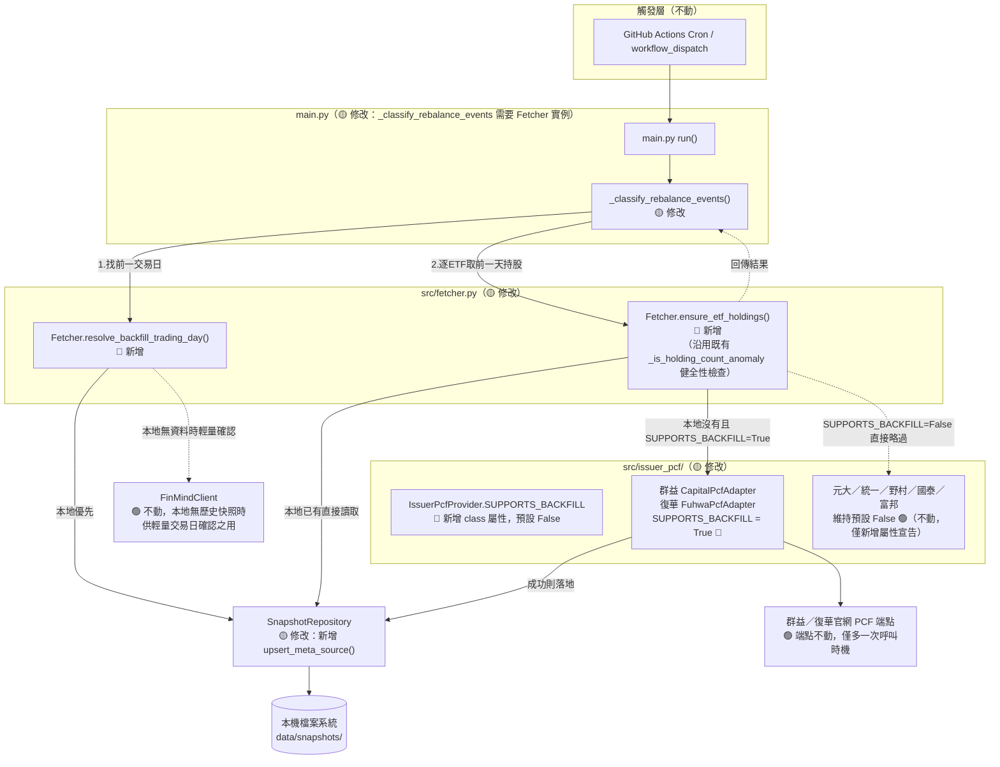
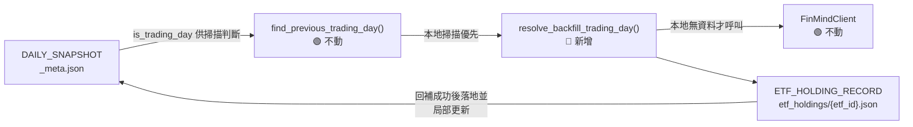
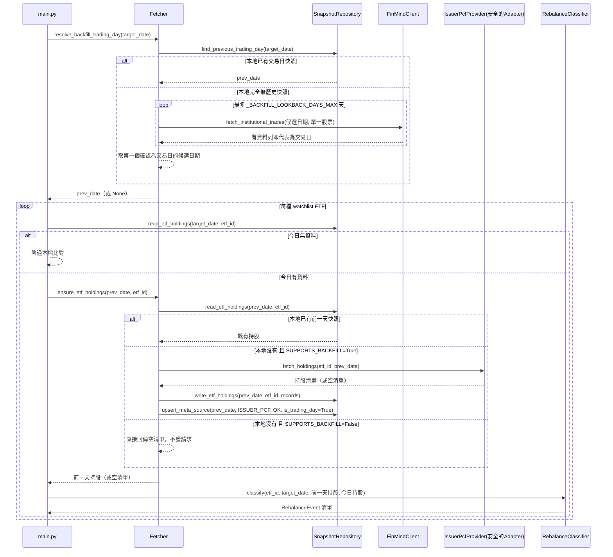

# SD-ETF換倉歷史日期回補機制-系統設計書

| 項目 | 內容 |
| :--- | :--- |
| 文件類型 | 系統設計書（SD，技術性文件，既有系統之異動設計） |
| 設計依據 | 本文件非典型「SA 先行」流程產出，設計依據為 Roy Chiang 於 2026-08-21 實際執行 `scripts/run.sh 0 --date 2026-07-28`（補跑歷史日期）時觀察到「LINE 通知未包含 ETF 換倉段落」之真實缺陷重現（見下方「問題重現與根因拆解」），並延伸沿用 [SA-ETF換倉資料來源方案評估-投信官網爬蟲可行性分析.md](../../analysis/requirements/SA-ETF換倉資料來源方案評估-投信官網爬蟲可行性分析.md) 既有之技術限制分析 |
| 相關文件 | [SD-ETF換倉資料來源方案評估-投信官網爬蟲-系統設計書.md](./SD-ETF換倉資料來源方案評估-投信官網爬蟲-系統設計書.md)（各投信 Adapter 之技術可行性、URL／payload 查證紀錄，本文件之「回補能力矩陣」直接沿用其查證結論，不重複查證）、[SD-籌碼監控推播引擎-系統設計書.md](./SD-籌碼監控推播引擎-系統設計書.md)（`main.py`／`Fetcher`／`SnapshotRepository` 原始設計） |
| 對象讀者 | SD／開發人員／維護人員 |
| 建立日期 | 2026-08-21 |
| 作者 | Claude Code（依 Roy Chiang 確認之設計方向整理） |
| 套件歸屬 | 既有專案 `FinanceTracker`，單一 Python 套件 `src/`；本次不新增子套件，異動集中於 `main.py`／`src/fetcher.py`／`src/storage.py`／`src/issuer_pcf/base.py` 及各 Adapter |

### 異動歷程

| 輪次 | 內容摘要 |
| :--- | :--- |
| 第一輪 | 建立本文件。拆解「補跑 2026-07-28 通知漏了 ETF 換倉段落」之根因為兩個各自獨立、疊加發生的原因；設計「投信官網回補能力矩陣」與「就近一日回補（bounded backfill）」機制，讓「本地剛好缺前一交易日快照」的情境可自動補齊，同時明確劃出「深度歷史回補（如數週前）」不在本次範圍之界線 |

### 與既有文件的關聯與範疇界定

| 文件 | 涵蓋範疇 | 與本文件的關係 |
| :--- | :--- | :--- |
| [SD-ETF換倉資料來源方案評估-投信官網爬蟲-系統設計書.md](./SD-ETF換倉資料來源方案評估-投信官網爬蟲-系統設計書.md) | **每家投信「爬不爬得到」**：URL 規則、payload 結構、Phase 分級、`ADAPTER_REGISTRY` 架構 | 本文件**不重複**查證各投信端點是否可行，直接引用其結論（見下方回補能力矩陣的「依據」欄），只新增「查詢日期能不能非今日」這個該文件未觸及的維度 |
| [SA-ETF換倉資料來源方案評估-投信官網爬蟲可行性分析.md](../../analysis/requirements/SA-ETF換倉資料來源方案評估-投信官網爬蟲可行性分析.md) | 從證交所單一 API 改為逐投信爬取的方案評估 | 背景依據，本文件延伸其「單一資料來源失敗不得中斷整體流程」之既有設計原則 |
| **本文件** | **同一份資料「查詢日期不是今天」時系統該怎麼反應**：判斷各投信能否回補、本地雙日快照如何就近自動補齊、失敗時的可診斷訊息 | 新增範疇，前兩份文件皆未處理 |

---

## 問題重現與根因拆解

### 使用者實際執行紀錄（2026-08-21）

```
scripts/run.sh 0 --date 2026-07-28
...
[WARNING] 元大 PCF 頁面交易日期（20260820）與查詢日期（20260728）不符，視為當日尚未更新
[WARNING] 投信官網 PCF 抓取失敗（00919）：HTTPSConnectionPool(host='www.capitalfund.com.tw', port=443): Read timed out.
[WARNING] 統一投信 Excel 資料日期（20260820）與查詢日期（20260728）不符，視為當日尚未更新
[INFO] 找不到前一交易日快照（可能為首次執行），略過 ETF 換倉比對
```

當日 LINE 通知只有「三大法人買賣超」段落，完全沒有 ETF 換倉段落。

### 根因拆解：兩個各自獨立、足以單獨造成同一結果的原因

| # | 根因 | 對應程式碼 | 說明 |
| :--- | :--- | :--- | :--- |
| 1 | **各投信 Adapter 對「非今日」查詢的支援程度不一，多數形同不支援** | [`src/issuer_pcf/yuanta.py:41-47`](../../../src/issuer_pcf/yuanta.py#L41-L47)、[`uni.py:36-41`](../../../src/issuer_pcf/uni.py#L36-L41)、[`nomura.py:25-31`](../../../src/issuer_pcf/nomura.py#L25-L31)、[`capital.py:29-35`](../../../src/issuer_pcf/capital.py#L29-L35)、[`fuhwa.py:29-34`](../../../src/issuer_pcf/fuhwa.py#L29-L34) | 元大／統一／野村三支 Adapter **完全沒有把 `snapshot_date` 送給對方**，一律拿到官網當下最新一期資料，查詢日期若非最新交易日，日期防呆必定判定不符，回傳空清單；群益／復華有送出查詢日期，理論上可查非今日資料，但本次群益因逾時而非日期問題失敗 |
| 2 | **`main.py._classify_rebalance_events()` 只看本地既有快照，從不主動回補前一天** | [`main.py:98-116`](../../../main.py#L98-L116)、[`src/storage.py:143-154`](../../../src/storage.py#L143-L154)（`find_previous_trading_day`） | `find_previous_trading_day` 純粹掃描 `data/snapshots/` 目錄下**已經存在**的日期資料夾；本地若沒有任何早於查詢日期的快照（如本次首次真正執行），直接回傳 `None`，`_classify_rebalance_events` 隨即回傳空清單、**連 ETF 迴圈都不會進入**——這一步的短路與第 1 點「當天能不能抓到資料」完全無關，即使第 1 點的抓取全部成功，本次仍會因為這一步而拿不到任何換倉事件 |

**兩者疊加的結果：** 只要「本地缺前一天快照」（第 2 點）與「查詢日期非投信官網當下最新一期」（第 1 點）任一成立，就會走到同一句籠統的 log（`找不到前一交易日快照…`或`視為當日尚未更新`），使用者難以從 log 判斷究竟是「網站不支援回查」還是「本地剛好沒暖機」這兩種成因完全不同、對策也不同的情況。

### 各投信「查詢日期回補能力」矩陣（本次新增分析維度）

沿用 [SD-ETF換倉資料來源方案評估-投信官網爬蟲-系統設計書.md](./SD-ETF換倉資料來源方案評估-投信官網爬蟲-系統設計書.md) 已查證之各投信技術細節，新增「是否可信賴地查詢非今日資料」判斷：

| 投信 | Adapter | 是否把 `snapshot_date` 送給官網 | 回傳內容是否有可信賴日期欄位可驗證 | **可否安全回補非今日資料** | 依據 |
| :--- | :--- | :--- | :--- | :--- | :--- |
| 群益 | `CapitalPcfAdapter` | ✅ `POST` body `date` | ✅ `data.pcf.date1` | **✅ 可以** | [capital.py:30](../../../src/issuer_pcf/capital.py#L30)；既有 SD 文件第十二輪已驗證日期語意正確對應查詢日期本身 |
| 復華 | `FuhwaPcfAdapter` | ✅ query `qDate` | ✅ `fund.dDate` | **✅ 可以** | [fuhwa.py:52-66](../../../src/issuer_pcf/fuhwa.py#L52-L66)；既有 SD 文件第十四輪已用 8/19～8/20 兩個交易日交叉驗證 |
| 元大 | `YuantaPcfAdapter` | ❌ 未送出 | 有（`pcfData.PCF.trandate`），但因未送出查詢日期，驗證恆等於「是否剛好等於官網當下最新一期」 | ❌ 不行（非技術缺陷，官網頁面本身只呈現當下最新一期） | [yuanta.py:36-47](../../../src/issuer_pcf/yuanta.py#L36-L47) |
| 統一 | `UniPcfAdapter` | ❌ 未送出 | 同上（`sheet_date`），同上限制 | ❌ 不行 | [uni.py:31-41](../../../src/issuer_pcf/uni.py#L31-L41) |
| 野村 | `NomuraPcfAdapter` | ❌ 未送出 | 同上（`NavDate`），同上限制 | ❌ 不行 | [nomura.py:22-31](../../../src/issuer_pcf/nomura.py#L22-L31) |
| 國泰 | `CathayPcfAdapter` | ✅ query `SearchDate` | ❌ **無**（程式註解明載「沒有像元大那樣可信賴的交易日期欄位可以比對」，直接信任站方回傳內容） | **⚠️ 不安全，不可回補**——送了日期但無法驗證站方是否真的依日期回應，若實際上仍回傳「當下最新」卻誤標為查詢日期寫入快照，會产生錯誤的換倉比對基準且無法察覺 | [cathay.py:22-27](../../../src/issuer_pcf/cathay.py#L22-L27) |
| 富邦 | `FubonPcfAdapter` | ❌ 未送出 | ❌ 無（程式註解明載「沒有像元大那樣可信賴的交易日期欄位可以比對，目前先直接採用站方回傳的最新一筆資料，不做日期防呆」） | **⚠️ 不安全，不可回補**，與國泰同理，且風險更高（連日期都沒送） | [fubon.py:26-32](../../../src/issuer_pcf/fubon.py#L26-L32) |

**結論：** 7 家已開通投信中，只有**群益、復華**兩家同時具備「送出查詢日期」與「可驗證回傳內容確實對應該日期」兩個條件，可以安全地用於非今日的查詢；其餘 5 家在現有官網介面下，於本次設計範圍內**一律不嘗試**非今日查詢——元大／統一／野村是官網本身只呈現當下最新一期（送了日期也沒用）；國泰／富邦則是即使送了日期，也沒有能力驗證站方是否真的照辦，貿然拿來回補的風險是「安靜地把錯誤日期的資料寫進快照」，比查不到資料更危險，因此明確排除。

---

## 一、系統架構與部署環境

### 設計要點

| 項目 | 設計 |
| :--- | :--- |
| 異動範圍 | 僅異動 Fetcher／main.py 內「取得前一交易日 ETF 持股以進行換倉比對」的邏輯，`Analyzer.RebalanceClassifier`／`Notifier`／各投信 Adapter 的抓取與解析邏輯**完全不動** |
| 核心機制 | 新增「就近一日回補（bounded backfill）」：當本地缺少「前一交易日」快照時，**只針對回補能力矩陣判定為安全的投信**，即時多打一次官網請求補回該日資料並落地存檔；不安全的投信一律略過，回傳明確的略過原因 |
| 回補範圍界線（重要） | 本機制解決的是「連續每日執行下，本地剛好缺一天快照」的暖機／中斷情境（例如今天是系統第一次真正執行、或前一天執行失敗未落地）；**不解決、也不嘗試解決**補跑數週前等「深度歷史日期」的換倉比對——這受限於各投信官網本身的資料保留天數（一種外部限制，非本專案程式邏輯可克服），詳見下方「範圍界線」說明與 §六 待確認事項 |
| 请求量控制 | 尋找「前一交易日」候選日期時，本地已有快照優先，只有本地完全無歷史快照可查時才會逐日呼叫 FinMind 做輕量交易日確認（見 §四），且設有 `_BACKFILL_LOOKBACK_DAYS_MAX` 天數上限，避免無界地往前掃描；針對單一已解析出的「前一交易日」，每檔可回補 ETF **最多只多打一次**官網請求，不會為了「找資料」而對同一投信重複嘗試多個日期 |
| 新增外部呼叫 | 無新增外部服務；只有「呼叫既有投信官網 Adapter／FinMind API 的時機」改變，端點與認證方式全部沿用既有設計 |

### 範圍界線：為什麽不解決「補跑 07/28」這種深度回補

三個各自獨立、疊加在一起的限制，任一項不解決都無法達成任意日期回補：

1. **官網本身只揭露當下最新一期（元大／統一／野村）**：這 3 家 Adapter 目前的請求根本沒有帶入日期參數，官網頁面設計上就只呈現「最新一期」，不是程式碼可以繞過的限制。
2. **官網保留天數未知且未被授權探測（群益／復華）**：既有 SD 文件的查證僅驗證過近 1～2 個交易日內可查詢成功，並未（也不建議）反覆嘗試「這家投信 PCF 資料到底能往前查幾天」——這類探測本身即是額外的爬蟲負擔，且官網行為可能隨時調整，不應該寫死一個未經授權驗證的天數上限。
3. **國泰／富邦無法驗證站方是否誠實回應查詢日期**：即使技術上「送出去試試看」，也沒有辦法確認拿回來的資料究竟是不是查詢日期當天的資料，貿然採用的風險高於直接判定為不支援。

若未來確有「補跑數週前歷史換倉比對」的明確需求，建議另立文件評估「改用具備真正歷史存檔的資料來源」（如 SD-ETF換倉資料來源方案評估文件已提及的證交所集中保管所或付費資料商管道），不應以「拉長本機制的回補天數」硬解，那只會讓上述第 2、3 點的風險被放大。

### 架構圖



**設計說明：** `ensure_etf_holdings()` 是本次唯一新增的「會多打外部請求」的路徑，且只對回補能力矩陣判定安全（`SUPPORTS_BACKFILL=True`）的 Adapter 生效；其餘 Adapter 直接被擋在 `ensure_etf_holdings()` 內部、連請求都不會發出，避免對不支援的投信官網做無意義的嘗試性請求。

### 環境規格

沿用既有規格，本次無新增相依套件、無新增憑證／環境變數。

### 安全設計

| 項目 | 設計 |
| :--- | :--- |
| 密鑰管理 | 不需新增，沿用既有 `FINMIND_TOKEN`／`LINE_CHANNEL_ACCESS_TOKEN`／`LINE_CHANNEL_SECRET` |
| 對外請求量 | 回補只在「本地缺前一天快照」時觸發，且每檔可回補 ETF 每次執行最多只多打一次官網請求；連續正常執行的情境下（每天本地都已有前一天快照）本機制幾乎不會被觸發，不會提高既有「每交易日一次」的請求頻率基線 |
| 資料正確性優先於可用性 | 回補能力矩陣刻意採取保守判定（無法驗證即視為不安全），寧可讓部分 ETF 少幾天換倉比對，也不接受「安靜寫入錯誤日期資料」的風險，呼應既有 SD 文件「靜默失效比明確錯誤更難察覺」的既定風險意識 |

---

## 二、資料模型設計

### 現行（As-Is）資料模型摘要

僅列與本次設計相關之既有結構：

| 既有結構 | 路徑 | 本次是否異動 |
| :--- | :--- | :--- |
| `ETF_HOLDING_RECORD` | `data/snapshots/{date}/etf_holdings/{etf_id}.json` | 🟢 結構不動，僅「寫入時機」新增一種來源（回補） |
| `DAILY_SNAPSHOT`（`_meta.json`） | `data/snapshots/{date}/_meta.json` | 🟡 新增局部更新寫入方式，欄位結構本身不動 |
| `IssuerPcfProvider` | `src/issuer_pcf/base.py` | 🟡 新增 class 屬性 `SUPPORTS_BACKFILL` |
| `config/issuer_registry.json` | — | 🟢 不動，回補能力屬於 Adapter 程式碼本身的能力宣告，不透過設定檔調整（見下方設計要點說明） |

### 設計要點

| 項目 | 設計 | 理由 |
| :--- | :--- | :--- |
| 回補能力宣告位置：程式碼屬性，而非設定檔欄位 | `IssuerPcfProvider` 新增 `SUPPORTS_BACKFILL: ClassVar[bool] = False`，只有 `CapitalPcfAdapter`／`FuhwaPcfAdapter` 覆寫為 `True`，**不**放進 `config/issuer_registry.json` 讓維運人員自行調整 | 「這家投信的日期查詢能不能信賴」是查證官網行為後得到的技術事實，跟 `isEnabled`（業務上要不要開放監控）性質不同；放進 JSON 設定檔容易被誤改成 `true` 而繞過查證結論，寫成程式碼常數才能確保「要開放回補，必須先去看程式碼、理解為什麼目前是 False」 |
| `_meta.json` 局部更新 | 新增 `SnapshotRepository.upsert_meta_source(snapshot_date, source_key, status, is_trading_day)`：讀出既有 `_meta.json`（不存在則視為空白 meta），只覆寫傳入的 `source_key` 對應狀態，`is_trading_day` 只允許 `False→True` 的方向覆寫（一旦確認是交易日就不會被之後的呼叫誤改回 False），其餘既有欄位維持原樣後寫回 | 回補只確定了「ETF PCF 這個來源」的狀態，若直接呼叫既有 `write_meta()` 整份覆寫，會把當天尚未抓取、或跟本次回補無關的其他來源（三大法人／成交量等）狀態抹掉，破壞 `find_previous_trading_day()` 往後掃描既有 `_meta.json` 時的正確性 |
| `ETF_HOLDING_RECORD` 結構本身 | 不變 | 回補呼叫的仍是既有 `IssuerPcfProvider.fetch_holdings()` 介面，輸出格式與平常抓取完全一致，`RebalanceClassifier`／`Notifier` 不需感知資料是「當天正常抓的」還是「回補來的」 |
| 不新增回補來源標記欄位 | `ETF_HOLDING_RECORD` **不**額外增加「本筆資料是否由回補產生」的欄位 | 保持既有結構最小異動；若未來稽核真的需要區分，屬於獨立的小異動，不需要在本次預先加欄位造成臆測性設計，留待 §六 待確認事項視實際需要再評估 |

### 檔案關聯（概念層，本次影響範圍）



### 索引與查詢設計彙整

| 設計 | 取代的查詢情境 | 對應情境 |
| :--- | :--- | :--- |
| `resolve_backfill_trading_day()` 本地優先、逐日往前掃描（上限 `_BACKFILL_LOOKBACK_DAYS_MAX` 天） | 取代原本「本地沒有就直接放棄」的行為，改為「本地沒有才逐日確認，找到即停止」 | 首次執行／中斷後重啟等本地快照不連續的情境 |
| `ensure_etf_holdings()` 以 `SUPPORTS_BACKFILL` 做 O(1) 分流 | 避免對不支援回補的投信發出注定失敗或無法驗證正確性的請求 | 每次換倉比對前逐 ETF 呼叫 |

### 資料搬移／初始資料匯入

本文件無搬移章節：不新增資料檔案結構，既有 `data/snapshots/` 歷史快照不需要任何搬移或回填腳本。

---

## 三、前端開發規格

**本章節不適用。** 本系統為無使用者介面的批次腳本，本次異動不涉及任何畫面。

---

## 四、程式元件與介面實作

### 業務邏輯

| 異動項目 | 業務規則 | 程式落地方式 |
| :--- | :--- | :--- |
| 前一交易日解析改為「本地優先、必要時輕量確認」 | 本地已有交易日快照直接採用；本地完全無歷史快照時，逐日（最多 `_BACKFILL_LOOKBACK_DAYS_MAX` 天）呼叫 FinMind 三大法人資料集，任何一天有回傳資料列即視為交易日，藉此在不觸發完整 `fetch_all()` 的情況下確認候選日期是否為交易日 | `Fetcher.resolve_backfill_trading_day()`（🔴 新增），取代 `main.py` 直接呼叫 `storage.find_previous_trading_day()` 後即放棄的行為 |
| 前一交易日 ETF 持股改為「本地優先、有條件即時回補」 | 本地已有該 ETF 該日快照直接讀取；本地沒有時，僅當該 ETF 對應投信 `SUPPORTS_BACKFILL=True`，才呼叫既有 `IssuerPcfProvider.fetch_holdings()` 即時補抓，並沿用既有 `_is_holding_count_anomaly()` 健全性檢查、成功後落地存檔＋局部更新 `_meta.json`；不支援或補抓仍失敗時回傳空清單 | `Fetcher.ensure_etf_holdings()`（🔴 新增） |
| 換倉比對呼叫端改為使用回補結果 | `main.py._classify_rebalance_events()` 改為呼叫上述兩個新方法取得前一交易日與前一天持股，而非直接依賴本地既有快照是否存在 | `main.py._classify_rebalance_events()`（🟡 修改，需接收 `Fetcher` 實例；`main.py.run()` 內建立的 `Fetcher` 物件需保留供此處重複使用，而非用完即棄） |
| 回補能力宣告 | 各 `IssuerPcfProvider` 子類別以類別屬性宣告「是否可安全回補非今日資料」，見「問題重現與根因拆解」之矩陣 | `IssuerPcfProvider.SUPPORTS_BACKFILL: ClassVar[bool] = False`（🔴 新增，基底類別預設值）；`CapitalPcfAdapter.SUPPORTS_BACKFILL = True`／`FuhwaPcfAdapter.SUPPORTS_BACKFILL = True`（🔴 新增覆寫），其餘 5 個 Adapter 不覆寫、維持預設 `False` |
| `_meta.json` 局部更新 | 回補成功時只更新 `sources.ISSUER_PCF` 與 `is_trading_day`（僅允許轉為 `True`），不影響同一天其餘來源既有狀態 | `SnapshotRepository.upsert_meta_source()`（🔴 新增） |

### 內部元件設計

| 元件 | 職責 | 異動類型 |
| :--- | :--- | :--- |
| `src/issuer_pcf/base.py`（`IssuerPcfProvider`） | 新增 `SUPPORTS_BACKFILL: ClassVar[bool] = False` 類別屬性，並於 docstring 補充「唯有同時具備『送出查詢日期』與『回傳內容可驗證日期』兩條件才可覆寫為 True」之判準 | 🟡 修改 |
| `src/issuer_pcf/capital.py`（`CapitalPcfAdapter`） | 新增 `SUPPORTS_BACKFILL = True` | 🟡 修改 |
| `src/issuer_pcf/fuhwa.py`（`FuhwaPcfAdapter`） | 新增 `SUPPORTS_BACKFILL = True` | 🟡 修改 |
| `src/fetcher.py`（`Fetcher.resolve_backfill_trading_day`） | 本地優先掃描＋必要時逐日輕量確認交易日，回傳候選前一交易日字串或 `None` | 🔴 新增 |
| `src/fetcher.py`（`Fetcher.ensure_etf_holdings`） | 本地優先讀取，否則依 `SUPPORTS_BACKFILL` 決定是否即時回補並落地 | 🔴 新增 |
| `src/fetcher.py`（`_BACKFILL_LOOKBACK_DAYS_MAX`） | 模組層常數，`resolve_backfill_trading_day()` 逐日掃描的天數上限，預設建議 10（涵蓋農曆春節等長假），待 §六 Roy Chiang 確認 | 🔴 新增 |
| `src/storage.py`（`SnapshotRepository.upsert_meta_source`） | 局部讀取－合併－寫回 `_meta.json` 的單一來源狀態 | 🔴 新增 |
| `main.py`（`run`） | 保留 `Fetcher` 實例，傳入 `_classify_rebalance_events()`，不再用完即棄 | 🟡 修改 |
| `main.py`（`_classify_rebalance_events`） | 改用 `Fetcher.resolve_backfill_trading_day()` / `ensure_etf_holdings()` 取代直接依賴 `storage.find_previous_trading_day()` | 🟡 修改 |
| `src/analyzer.py`（`RebalanceClassifier`） | 不動，`classify()` 介面與輸入資料結構完全不變 | 🟢 不動 |
| `src/notifier.py`（`MessageFormatter`／`Notifier`） | 不動，`rebalance_events` 產生方式改變但格式不變 | 🟢 不動 |

### 呼叫時機彙整（本次不新增外部端點，僅呼叫時機改變）

| # | 服務 | 呼叫方 | 原呼叫時機 | 本次新增呼叫時機 |
| :--- | :--- | :--- | :--- | :--- |
| 1 | 群益／復華 PCF 端點（既有） | `CapitalPcfAdapter`／`FuhwaPcfAdapter` | 每日對 `target_date` 呼叫一次 | 新增：本地缺前一交易日快照時，對 `prev_date` 額外呼叫一次（`ensure_etf_holdings()`） |
| 2 | FinMind `TaiwanStockInstitutionalInvestorsBuySell`（既有） | `FinMindClient.fetch_institutional_trades` | 每日對 `target_date` 呼叫（`Fetcher._fetch_institutional_trades`） | 新增：本地完全無歷史快照時，`resolve_backfill_trading_day()` 逐日輕量呼叫確認候選日期是否為交易日（僅取一檔監控股票判斷即可，不需全清單） |

### 時序圖：本地缺前一交易日快照時的就近回補流程



---

## 五、維護與例外處理

### 錯誤碼彙整

| 代碼 | 觸發情境 | 對應處理方式 |
| :--- | :--- | :--- |
| **`FETCH_ISSUER_PCF_BACKFILL_UNSUPPORTED`**（🔴 新增） | `ensure_etf_holdings()` 發現本地無前一天快照，且該 ETF 對應 Adapter `SUPPORTS_BACKFILL=False` | 記錄 Log 明確說明「該投信不支援非當日查詢」，不發出請求，回傳空清單，該 ETF 本次略過換倉比對（非錯誤） |
| **`FETCH_ISSUER_PCF_BACKFILL_NO_DATA`**（🔴 新增） | `SUPPORTS_BACKFILL=True` 的 Adapter 實際呼叫後，該日仍查無資料（很可能已超出官網保留天數） | 記錄 Log，回傳空清單，該 ETF 本次略過換倉比對（非錯誤） |
| **`FETCH_ISSUER_PCF_BACKFILL_LOOKUP_EXHAUSTED`**（🔴 新增） | `resolve_backfill_trading_day()` 逐日掃描 `_BACKFILL_LOOKBACK_DAYS_MAX` 天後仍找不到任何交易日 | 記錄 Log（區分於原「找不到前一交易日快照（可能為首次執行）」的模糊訊息，明確指出已嘗試回補但超出掃描上限），整批 ETF 換倉比對本次略過 |
| `FETCH_ISSUER_PCF_ERROR`／`NO_DATA`／`ANOMALY_DETECTED`（既有，見 [SD-ETF換倉資料來源方案評估-投信官網爬蟲-系統設計書.md §五](./SD-ETF換倉資料來源方案評估-投信官網爬蟲-系統設計書.md)） | `ensure_etf_holdings()` 內呼叫 `provider.fetch_holdings()` 一樣可能觸發既有錯誤情境 | 沿用既有處理方式，回補路徑與平常抓取路徑共用同一套錯誤處理與健全性檢查，不另開一套邏輯 |

### 排程／SP 清單

沿用既有排程，本次無異動。本專案無資料庫，無 Stored Procedure。

### 例外處理原則

| 情境 | 處理策略 |
| :--- | :--- |
| 回補請求失敗（逾時／非預期例外） | 沿用既有「單一資料源失敗不中斷全局」原則，捕捉例外、記錄 Log、該 ETF 本次略過換倉比對，不影響其他 ETF 或三大法人等其他模組 |
| 回補請求成功但筆數異常驟降 | 沿用既有 `_is_holding_count_anomaly()`，回補路徑與平常抓取路徑共用同一套健全性檢查，異常時不落地、視同查無資料 |
| `_meta.json` 局部更新併發寫入 | 沿用既有「單一批次腳本、單一執行緒」的既有前提，`upsert_meta_source()` 為 read-modify-write，若未來改為並行執行需另外評估鎖機制（非本次範圍，本專案目前無此需求） |
| 深度歷史回補需求 | 明確不支援，log 訊息需清楚說明原因（超出掃描上限／投信不支援回補），避免使用者誤以為是暫時性錯誤而重試 |

---

## 六、待確認事項

| # | 項目 | 待誰確認 | 確認結果 |
| :--- | :--- | :--- | :--- |
| 1 | `_BACKFILL_LOOKBACK_DAYS_MAX` 建議預設值為 10（日曆天，涵蓋農曆春節等長假） | Roy Chiang | 待確認 |
| 2 | 群益／復華官網 PCF 資料實際保留天數上限，目前僅驗證過 1～2 個交易日內可查詢成功，尚未（也不建議主動）探測更長天數 | 開發人員／Roy Chiang | 待確認是否需要正式探測，或維持「不主動探測、以實際查無資料時的 `FETCH_ISSUER_PCF_BACKFILL_NO_DATA` 自然反映上限」 |
| 3 | 是否需要在 `ETF_HOLDING_RECORD` 增加「本筆資料是否由回補產生」的稽核欄位 | Roy Chiang | 待確認（本次設計為不新增，見 §二 設計要點） |
| 4 | 未來若國泰／富邦官網改版後補上可驗證的交易日期欄位，是否要重新評估將其 `SUPPORTS_BACKFILL` 開放為 `True` | 開發人員 | 待確認（本文件已預留判準：需同時符合「送出查詢日期」與「回傳內容可驗證」兩條件） |
| 5 | 深度歷史回補（如數週前）若未來真有明確需求，是否另立文件評估改用具備真正歷史存檔的資料來源 | Roy Chiang | 待確認，非本次阻塞項 |

---

## 七、來源檔案索引

- [SD-ETF換倉資料來源方案評估-投信官網爬蟲-系統設計書.md](./SD-ETF換倉資料來源方案評估-投信官網爬蟲-系統設計書.md)（各投信 Adapter 技術可行性查證來源）
- [SD-籌碼監控推播引擎-系統設計書.md](./SD-籌碼監控推播引擎-系統設計書.md)（`main.py`／`Fetcher`／`SnapshotRepository` 原始設計）
- [SA-ETF換倉資料來源方案評估-投信官網爬蟲可行性分析.md](../../analysis/requirements/SA-ETF換倉資料來源方案評估-投信官網爬蟲可行性分析.md)
- `f:\projects\FinanceTracker\main.py`（現行實作，待依 §四調整）
- `f:\projects\FinanceTracker\src\fetcher.py`（現行實作，待依 §四調整）
- `f:\projects\FinanceTracker\src\storage.py`（現行實作，待依 §二、§四調整）
- `f:\projects\FinanceTracker\src\issuer_pcf\base.py`（現行實作，待依 §四調整）
- `f:\projects\FinanceTracker\src\issuer_pcf\capital.py`／`fuhwa.py`（現行實作，待依 §四調整）
