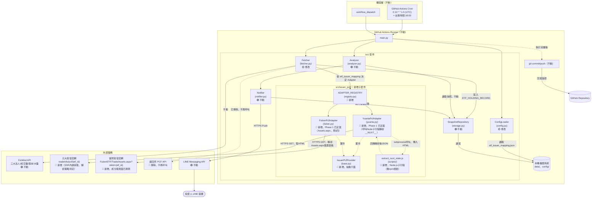
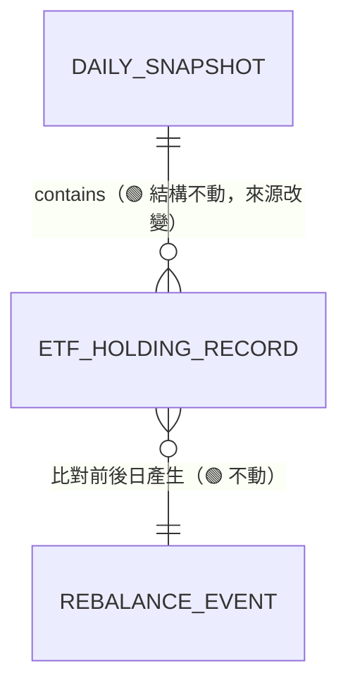
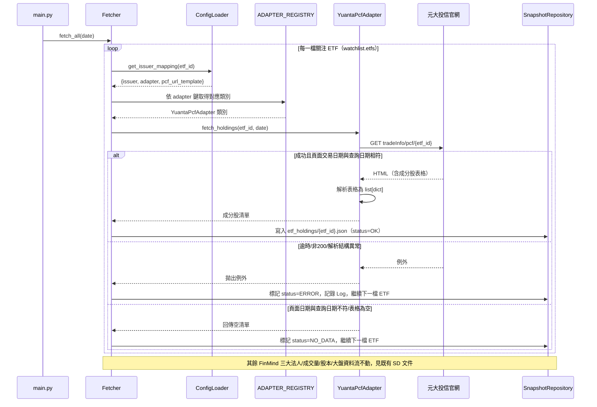

# SD-ETF換倉資料來源方案評估-投信官網爬蟲-系統設計書

| 項目 | 內容 |
| :--- | :--- |
| 文件類型 | 系統設計書（SD，技術性文件，既有系統之異動設計；第二輪補充已併入本文件） |
| 設計依據 | [SA-ETF換倉資料來源方案評估-投信官網爬蟲可行性分析.md](../../analysis/requirements/SA-ETF換倉資料來源方案評估-投信官網爬蟲可行性分析.md) |
| 相關文件 | [SD-籌碼監控推播引擎-系統設計書.md](./SD-籌碼監控推播引擎-系統設計書.md)（原始 SD 文件，本文件**取代**其中 ETF PCF 資料來源相關設計）、[SD-三大法人買賣超關注清單通知-系統設計書.md](./SD-三大法人買賣超關注清單通知-系統設計書.md)（同批次既有異動，本次範疇不涉及三大法人／分點部分，二者互不影響） |
| 對象讀者 | SD／開發人員／維護人員 |
| 建立日期 | 2026-08-10（第二輪補充：2026-08-10；第三輪補充：2026-08-10；第四輪補充：2026-08-10；第五輪補充：2026-08-10；第六輪補充：2026-08-11；第七輪補充：2026-08-11；第八輪補充：2026-08-12；第九輪補充：2026-08-12；第十輪補充：2026-08-14；第十一輪補充：2026-08-14；第十二輪補充：2026-08-14；第十三輪補充：2026-08-17；第十四輪補充：2026-08-21；第十五輪補充：2026-08-24；第十六輪補充：2026-08-24） |
| 作者 | Claude Code（依 Roy Chiang 確認之設計方向整理） |
| 套件歸屬 | 既有專案 `FinanceTracker`，單一 Python 套件 `src/`；本次新增子套件 `src/issuer_pcf/` |

### 異動歷程

| 輪次 | 內容摘要 |
| :--- | :--- |
| 第一輪 | 建立 `IssuerPcfProvider` Adapter 架構取代已失效的證交所 PCF API，完整設計並實作元大投信 Adapter（對應 `0050`） |
| 第二輪 | 實地查證多家投信 PCF 頁面之 URL／payload 結構後，確認**各投信規則差異顯著，無法通用化**；明確鎖定「受支援投信範圍」與分階段（Phase）擴充路線圖，並補齊 ETF↔投信對照與新增投信 Adapter 之驗證 SOP |
| 第三輪 | Roy Chiang 拍板 Phase 劃分：**Phase 1 正式納入元大＋富邦投信**（原第二輪僅元大一家）；**Phase 2 明確定為國泰＋群益投信**（皆需內部代碼對照表）；其餘投信維持「待評估」，不排入時程。本輪並針對富邦 PCF 頁面做第二次實地查證，發現帶入正確 ETF 代碼後頁面呈現的是現金申購買回概況資訊，**未直接看到成分股明細表**，此為新發現之技術風險，已如實記錄於 §一、§六，`FubonPcfAdapter` 本輪僅完成介面骨架與註冊機制，解析邏輯待風險釐清後才能真正完工 |
| 第四輪 | Roy Chiang 提出市面知名主動式 ETF（`00980A`／`00981A`／`00982A`／`00984A`／`00991A`），要求納入**「Phase 3（觀察名單）」**。查明其發行投信分別為野村（`00980A`）、統一（`00981A`）、群益（`00982A`，已在 Phase 2）、安聯（`00984A`，全新投信）、復華（`00991A`）；正式將「待評估」分類更名定調為 **Phase 3＝觀察名單，有明確 ETF 標的但不承諾開發時程**，並查證安聯投信 PCF 頁面同樣採投信內部代碼（非市場代碼），與國泰／群益同一類風險 |
| 第五輪 | 對所有「未確認」投信機構逐一實地查證其 PCF 頁面爬蟲可行性，確認改動可行性。**正面結果**：群益（已確認靜態表格＋下載按鈕）、復華（下拉選單後可見完整持股表格）、永豐（**新發現**可用 ticker 直接組 URL `SinglePcf/{etf_id}`，技術複雜度實為低，優於原評估）。**負面/風險結果**：國泰官網對本次查證請求回傳 **HTTP 403 Forbidden**（疑似有防爬蟲機制）；安聯、野村、中信三家頁面為 **JS 前端動態渲染（SPA）**，靜態請求抓不到實際內容；統一投信頁面查證時發生**重導向次數過多**錯誤；街口投信網域 **DNS 查詢失敗**（網域可能已下線／變更）。**重要更正**：先前（第二、四輪）誤將 `tsit.com.tw` 標註為統一投信，經本輪查證證實 `tsit.com.tw` 實為**台新投信**，統一投信正確網址應為 `ezmoney.com.tw`；已於本輪更正並記錄查證脈絡，避免沿用錯誤資訊 |
| 第六輪 | Roy Chiang 提供野村／統一／復華／中信四家投信的候選 API 端點（推測為其自行以瀏覽器開發者工具查得），逐一以實際請求測試可用性。**重大正面發現**：野村投信端點（`GetFundTradeInfo`）**完全可行**，回傳乾淨 JSON，且可直接用市場代碼（ticker）查詢，技術複雜度為本次查證中最低、優於原先「JS 動態渲染」的判斷；復華投信端點（`api/assets`）**確認可行**，但需内部 `fundID` 對照表；統一投信端點確認為 **Excel 匯出端點**（非原猜測的 JSON API），內容完整可用，但需處理 302 導向 Cookie 機制與內部 `fundCode` 對照表。**重大負面發現**：中信投信端點測得 Token 驗證持續失敗，經檢查回應標頭確認其網站受 **Imperva Incapsula 商用 WAF（Web 應用防火牆）防護**，非單純程式邏輯問題，判定不具技術可行性，建議不再投入嘗試繞過。街口投信依 Roy Chiang 指示（目前標的與台股關連性低）不予排入 |
| 第七輪 | Roy Chiang 追加提供野村（`GetFundList`／`GetFundAssets`）、統一（`Fund/Index` 列表頁、修正後的 `Info?fundCode=49YTW`）、復華（`etf_list` 列表頁）之候選端點，逐一實測。**野村**：`GetFundAssets` 確認為比第六輪 `GetFundTradeInfo` 更乾淨的持股端點（`Table.Columns`/`Table.Rows` 結構化格式），`GetFundList` 確認可作為「野村旗下全部 ETF 清單」的動態驗證來源，取代手動維護清單；兩者皆**不需**內部代碼、可直接用 ticker 查詢，技術可行性再獲確認。**復華**：`etf_list` 頁面確認可直接爬取「市場代碼 ↔ 內部 `fundID`」完整對照表（如 `00991A↔ETF23`、`00929↔ETF21`），取代人工逐筆建表。**統一**：`Fund/Index` 頁面確認可直接爬取「市場代碼 ↔ 內部 `fundCode`」完整對照表；**同時發現並更正第六輪一項錯誤**——第六輪誤將 `fundCode=63YTW` 對應為 `00981A`，經本輪查證證實 `63YTW` 實際對應 `00403A`（主動統一升級50），`00981A` 正確對應的 `fundCode` 應為 `49YTW`；`Info` 頁面確認為一般 HTML（頁面內嵌持股表格文字），未查得獨立的持股 JSON API，故仍以 `AssetExcelNPOI`（已用正確 `fundCode=49YTW` 複驗成功）作為建議資料來源。中信投信依 Roy Chiang 指示（同街口，因防爬蟲阻擋），暫不排入，待後續確認取得方法再調整 |
| 第八輪 | Roy Chiang 要求針對 Phase 1（元大＋富邦）實際查證 robots.txt／服務條款、並逐條驗證元大渲染時期實測到的 8 支候選 API。**富邦（重大正面突破）**：查得姊妹頁面 `Trade/Assets.aspx?stkId={etf_id}&lan=TW`（`ddate` 參數可省略，預設回傳最新交易日資料），才是成分股明細真正位置，靜態 HTML 一次回傳完整 55 檔股票（含股票代碼／名稱／股數／金額／權重%），無分頁無展開；**但同頁另有「期貨」「附買回債券」表格，解析器須鎖定 `<h6>股票</h6>` 後的表格，不可抓第一個 table**，§六 待確認事項第 1 順位（原第三輪高優先項）正式解除。**元大（重大負面修正）**：實測 Roy Chiang 提供的 8 支頁面渲染期 API（`ETFRaisingAD`／`PageWarningMsg`／`ETFWarning/HomeBottom`／`ETFService/GetContact`／`ETFService/GetService`／`ETF/GetLatestIndex`／`ETFMarquee`／`ETFTag/GetProductInformation`），全數回傳 HTTP 200 但**沒有一支是 PCF 持股資料**（分別為廣告版位、頁面警語、法遵聲明、客服資訊、頁尾服務連結、追蹤指數行情、跑馬燈、ETF 產品目錄），證實 PCF 頁面**不存在**獨立的持股資料 API；追查原始 HTML 與 JS bundle 後確認：該頁採 Nuxt.js SSR，「展開」按鈕是純前端顯示筆數開關（非額外 AJAX 請求），完整持股資料是後端渲染當下就序列化進頁尾 `window.__NUXT__=(function(...){...})(...)` 這包參數去重壓縮格式裡，並非乾淨 JSON，也不是單純 `BeautifulSoup` 解析 HTML 表格可以取得（原始 HTML 實測只看得到 5 列）；`YuantaPcfAdapter` 原「低複雜度、已完工」定性需下修，§六 待確認事項第 3 項改列為「已確認，且複雜度高於預期」，解析策略待重新設計（見 §一、§六）。**附帶收穫**：`ETFTag/GetProductInformation` 為元大官方完整 ETF 產品清單 API（含 `STK_CD`／`FUND_NAME`），可作為未來校驗 watchlist 的官方來源；`ETFService/GetService` 內含隱私權政策正式連結 `https://openweb.yuantafunds.com/privacy/`。**robots.txt 查證**：元大 `yuantaetfs.com` 全站 `Allow: /`；富邦 `websys.fsit.com.tw` 雖整體 `Disallow: /`，但明確 `Allow: /FubonETF`，本次用到的 `Pcf.aspx`／`Assets.aspx` 皆在允許路徑內；兩站頁面文字掃描未見「禁止爬蟲」等明文字樣，機器可查部分已排除疑慮，服務條款全文仍待 Roy Chiang 親自過目定案 |
| 第九輪 | Roy Chiang 要求針對第八輪遺留的未確認項目逐一解決，直到 Phase 1 可正式開始實作。實際動手驗證元大 `window.__NUXT__` 解析可行性：以一支僅用 Node.js 內建 `vm`／`fs` 模組（無 npm 套件相依）的極簡腳本，將 `window.__NUXT__=(function(...){...})(...)` 運算式放進沙箱執行，取回物件的 `fetch[].pcfData.InKind.FundComposition` 即為完整成分股清單，**已用 `0050`／`0056` 交叉驗證，皆完整取回 50/50 筆**，欄位 `stkcd`／`name`／`qty` 對應 `component_stock_id`／`component_name`／`holding_shares`，`pcfData.PCF.trandate` 可沿用既有交易日期防呆邏輯。此方案需 Python 以 `subprocess` 呼叫 Node.js 子行程，是本專案首次引入 Python 以外的執行期相依，經與 Roy Chiang 討論後**正式拍板採用**（GitHub Actions `ubuntu-latest` 預設內建 Node.js，免額外安裝；本機開發需自行安裝）。§六 待確認事項第 2、3、20 項本輪正式解除，`YuantaPcfAdapter`／`FubonPcfAdapter` 技術面待確認事項全數清除，**Phase 1（元大＋富邦）正式進入可實作狀態**，僅餘服務條款全文之人工法律判斷（§六 #1／#21）屬「上線前需完成」而非「動工前阻塞項」 |
| 第十輪 | Roy Chiang 提供國泰投信官方 API 端點之 Postman 實測截圖（`cwapi.cathaysite.com.tw`，與第五輪查證回應 `403 Forbidden` 的舊頁面 `www.cathaysite.com.tw/funds/etf/pcf.aspx` 為不同網域／端點），**確認技術路徑完全翻轉**：`GetETFList`（以 `Keyword=` 帶市場代碼查詢，回傳含 `fundCode` 之對照結果，如 `00878→fundCode=CN`）可動態取代人工維護「ticker↔內部代碼」對照表；`GetETFDetailStockList`（`FundCode`＋`SearchDate` 查詢）回傳乾淨 JSON 成分股清單（`stockCode`／`stockName`／`volumn`／`weights`），皆為 `HTTP 200`，原第五輪 403 Forbidden 之風險判斷不再適用於此組端點。§一「受支援投信範圍評估」國泰投信列複雜度由「高（403 Forbidden）」下修為與群益同等級的「低～中」；§六 待確認事項第 7、11 項本輪解除。經 Roy Chiang 確認後**實作並正式開通**：`CathayPcfAdapter` 完成、`issuer_registry.json.cathay.isEnabled` 改為 `true`、`watchlist.json.etfs` 加入 `00878`，並以正式環境即時查證（含平日／週末各日期）確認資料正確、非交易日 API 明確回傳「查無資料」而非誤植前一日舊資料 |
| 第十一輪 | 國泰開通後 Roy Chiang 追問 §六 #21「服務條款」查證的實質內容，發現文件先前附的元大／富邦連結其實是「隱私權聲明」而非「服務條款／使用者條款」（兩者性質不同，後者才是通常會出現「禁止自動化擷取」字樣的地方）。本輪重新查證：(1) 元大／富邦首頁原始碼以關鍵字（條款／聲明／Terms／Agreement）搜尋，**皆只找到隱私權聲明頁面，找不到獨立的服務條款頁面**；(2) 國泰兩個網域（`www.cathaysite.com.tw`／`cwapi.cathaysite.com.tw`）之 `robots.txt` 皆**不存在**（一個回「資源已移除」、一個完全空白），代表國泰先前開通時**未經過第八輪對元大／富邦做過的 robots.txt 查證**，本輪補上。**Roy Chiang 確認定案**：三家投信官網皆查無可審閱之獨立服務條款頁面，已盡合理查證義務，`robots.txt`／頁面關鍵字掃描亦皆未見明文禁止自動化擷取字樣，**不構成阻塞，§六 #21 正式解除**（收尾方式改為「查無條款可看」而非「已看過條款」） |
| 第十二輪 | Roy Chiang 提供群益投信官方 API 端點之 Postman 實測截圖（`www.capitalfund.com.tw/CFWeb/api/etf/...`），逐一實測後**完全解除**§一原先「需額外建立 ticker↔內部數字 ID 對照表」的限制，且發現的資料品質優於原設計（HTML 表格解析）：`POST /CFWeb/api/etf/list` 可動態查出「市場代碼↔`fundNo`」完整對照（已用 `00919→fundNo=195`、`00982A→fundNo=399` 交叉驗證），取代人工建表；`POST /CFWeb/api/etf/buyback`（`{fundId, date}`）回傳結構化 JSON，持股清單位於 `data.stocks[]`（非 `data.pcf`，`pcf` 只是 NAV／受益權單位數等基金層級概況，跟富邦當初誤把 `Pcf.aspx` 當成成分股頁面是同一類陷阱，這次一開始就查證清楚兩者不同），已用 `fundId=195` 實測取回 40 檔完整持股（`stocNo`／`stocName`／`share`／`weight`）。**日期語意已完整驗證**：Request `date` 直接對應回傳 `stocks[].date1`（即所查詢日期本身的持股，非 T-1），非交易日（週末實測）API 回傳 `HTTP 200` 但 `code: 400`／`data: null`，明確區分「查無資料」與「成功」，比國泰的 `result: null` 更明確。§一「受支援投信範圍評估」群益投信列複雜度由「中」下修為「低」（與元大／富邦／國泰同級，且不需 Headless Browser、不需 Cookie 工作階段）；§六 #7 群益部分正式解除。經 Roy Chiang 確認後**實作並正式開通**：`CapitalPcfAdapter` 完成、`issuer_registry.json.capital.isEnabled` 改為 `true`、`watchlist.json.etfs` 加入 `00919`，並以正式環境即時查證確認資料正確 |
| 第十三輪 | Roy Chiang 要求盤點「這個需求還差多少能完成實作」，逐項確認後動手處理三件事：<br>- **SA §六「解析健全性檢查機制」正式實作**：`Fetcher._fetch_etf_holdings()` 新增 `_is_holding_count_anomaly()`，把當天解析筆數跟前一交易日比對，跌幅達門檻（`thresholds.json.default.etf_holding_drop_pct`，預設 50%）視為投信網站改版造成的解析異常，不寫入快照。§四業務邏輯表原「解析結果基本健全性檢查」一列「不需新增邏輯，既有判斷式已涵蓋」的敘述**經本輪確認為不完整**（只擋得住剛好 0 筆的情況，擋不住「40 檔變 3 檔」這種劇烈但非 0 的殘缺資料），已更正為實際落地方案。<br>- **意外挖出並修正一個更嚴重的既有 bug**：手動驗證健全性檢查時發現，`main.py._classify_rebalance_events()` 直接把 `storage.read_etf_holdings(target_date, etf_id)` 的結果（檔案不存在時回傳 `[]`）當成「今天的真實持股」跟前一天比對——這代表只要某檔 ETF 當天**完全沒抓到資料**（例如元大／統一頁面「只顯示最新一天」的已知限制，查詢日期剛好不是頁面當下顯示的日期），就會被誤判成「持股歸零」，把該 ETF 原有的每一檔持股都當成「完全清倉」推播出去。這比「筆數驟降」的情境更嚴重，且在實測 8/17 資料時**真實觸發**（0050 當天因元大頁面日期不符沒抓到資料，觸發前 50 檔全部誤判清倉）。修正：`_classify_rebalance_events()` 改為 `curr_holdings` 為空時直接跳過該 ETF 的比對，不產生任何事件；已補上 `tests/test_main.py` 鎖住這個行為，並用 8/17 真實資料重跑 dry-run 確認不再誤報。<br>- **統一投信（Phase 3）正式實作開通**：確認 `AssetExcelNPOI`／`Fund/Index` 端點仍如文件記載正常運作，但技術複雜度明顯高於國泰/群益——回傳格式是真的 Excel（`.xlsx`）而非 JSON，需新增 `openpyxl` 套件依賴（經 Roy Chiang 確認採用）；需 `requests.Session()` 兩段式 Cookie 工作階段（先訪首頁）；持股表跟期貨/現金部位混在同一張工作表，需定位「股票」區塊；資料日期為民國年格式（如 `115/08/14`），需換算西元年才能跟 `snapshot_date` 比對。`UniPcfAdapter` 完成並正式開通（`isEnabled: true`，`watchlist.json` 加入 `00981A`）。<br>- **復華投信（Phase 3）確認為阻塞狀態，本輪未實作**：第六／七輪記錄的 `GET /api/assets?fundID=...` JSON 端點本輪實測**已失效**，回傳的是官網首頁 HTML 而非資料——復華官網已改版為 Vue.js SPA 架構（`data-template="index"`／`@vue:mounted` 等屬性），且持股明細頁未見任何 SSR 內嵌狀態（不像元大的 `__NUXT__` 可取巧），純前端渲染，靜態請求看不到實際資料。`etf_list` 列表頁本身還在、ticker↔`fundID` 對照連結格式還找得到（`/ETF/etf_detail/ETF23`），但沒有底層 API 可用。這是 SA 文件當初提醒的「投信網站改版讓 adapter 靜默失效」在**開發前**就先發生的例子。經 Roy Chiang 確認**擱置**，待有人以瀏覽器開發者工具重新查得新版底層 API（比照國泰/群益的模式）才能重啟評估，§六新增 #22 追蹤 |
| 第十四輪（本次補充，⚠️ 更正上一輪誤判） | Roy Chiang 提供瀏覽器開發者工具查得的兩支復華候選端點（`GET /api/fundList`、`GET /api/ETFPcf?fundID=...&pcfDate=...`）要求複查是否可用，逐一實測後**發現並更正第十三輪的錯誤結論**：<br>- **`GET /api/fundList`**：✅ 確認可行，`result[]` 含 107 檔基金完整清單，`fundID`↔`etf002`（市場代碼）對照，已交叉驗證 `ETF21↔00929`、`ETF23↔00991A` 與既有記錄一致，可取代舊版 `etf_list` HTML 頁面爬取。<br>- **`GET /api/ETFPcf`**：⚠️ 端點本身正常（`ETF01/006207` 測試回傳 250 檔真實持股），但對本次目標 `ETF21`（00929）／`ETF23`（00991A）**在任何日期皆回空陣列**（測試橫跨 8/1～8/20 超過兩個月皆同），研判此端點是「實物申購買回籃」專用，00929／00991A 屬主動式 ETF、走現金基礎申贖，本來就沒有實物籃可揭露，非端點失效。<br>- **重大更正**：比對過程中意外發現第十三輪判定「復華官網已改版為 Vue.js SPA、原 `GET /api/assets?fundID=...` 端點已失效」**是誤判**——當時測試用 `qDate=2026-08-14`（連字號格式），本輪改用 `qDate=2026/08/20`（斜線格式）重測，**端點正常回傳完整 JSON**，取回 50 檔真實持股（`detail[]` 陣列篩 `ftype=="股票"`）。真正原因是站方對 `qDate` 參數格式要求嚴格，格式不符時**不會報錯，只會默默回傳官網首頁 HTML**，容易誤判成「網站改版、API 失效」——第十三輪正是誤踩這個陷阱，而非復華官網真的改版。§一「受支援投信範圍評估」復華投信技術可行性由「阻塞」更正回「可行」；§六 #22 更正解除。經 Roy Chiang 確認後**實作並正式開通**：`FuhwaPcfAdapter` 完成、`issuer_registry.json.fuhwa.isEnabled` 改為 `true`、`watchlist.json.etfs` 加入 `00991A`，並以正式環境即時查證（含前後兩交易日）確認資料正確 |
| 第十五輪（本次補充，✅ 推翻第五輪 JS SPA 阻塞判斷） | Roy Chiang 以 Postman 查得安聯投信官網（`etf.allianzgi.com.tw`）獨立 `webapi` 後端子路徑三支端點：`GET /webapi/api/AntiForgery/GetAntiForgeryToken`（取得 CSRF token，同時透過 `Set-Cookie` 建立 `.AspNetCore.Antiforgery.*` 工作階段 Cookie）、`POST /webapi/api/Fund/GetFundOverview`（安聯旗下全部基金清單，含 `CFundNo`↔`CSecuritiesCode` 對照，本次實測 `TotalItems=4`，含 `E0001↔00984A`）、`POST /webapi/api/Fund/GetFundAssets`（`{FundID}` 查詢指定基金成分股，本次實測 `FundID=E0001` 正常回傳）；後兩者呼叫皆須於 Header 帶入前一步取得的 `x-xsrf-token`（ASP.NET Core Antiforgery 雙提交模式，token 值＋對應 Cookie 需同時送出，`requests.Session()` 可自動處理 Cookie 部分）。**第五輪「JS 前端動態渲染 SPA、無法取得資料」的悲觀判斷本輪正式推翻**——與野村（第六輪）、國泰（第十輪）、群益（第十二輪）同一類案例：靜態請求拿不到內容的是「前端頁面」，但頁面背後呼叫的獨立 `webapi` 後端本身是乾淨可用的 JSON API；`GetFundOverview` 同時解決「ticker↔內部代碼」對照問題，比照野村/國泰/群益/復華模式，**不需人工維護靜態對照表**，可於 Adapter 啟動時動態查詢。⚠️ 唯一新發現的差異點：`GetFundAssets` 回應為「多區塊表格」格式（`TableTitle`／`Columns`／`Rows`，本次實測看到至少「股票 (95.49%)」一個區塊，`Columns` 為 `{Name, TextAlign}` 物件陣列、疑似對應位置索引式的 `Rows`，而非其餘投信慣用的具名鍵值物件陣列），與富邦「同頁多張表格需鎖定『股票』區塊」屬同一類陷阱，但欄位存取方式（位置索引 vs 具名鍵）為本次查證中首次出現的新樣式，完整 `Rows` 陣列結構本輪僅看到欄位定義、尚未看到列資料本身，列為 §六 新增待確認事項。經本輪查證，**安聯投信技術可行性由「高（🔴 SPA 阻塞，無底層 API）」下修為「低～中」**，與國泰／群益同級；是否比照國泰/群益/復華模式提前實作 `AllianzPcfAdapter` 並開通，**本次僅記錄查證結果，尚未實作**，`issuer_registry.json.allianz.isEnabled` 維持 `false`，留待 Roy Chiang 確認 |
| 第十六輪（本次補充，新增查證：凱基投信，因 `009816` 而起） | 使用者提出新增 `009816`（凱基台灣TOP50，凱基投信發行）之籌碼監控需求，先於 [SA-凱基投信PCF資料來源評估-009816籌碼監控可行性分析.md](../../analysis/requirements/SA-凱基投信PCF資料來源評估-009816籌碼監控可行性分析.md) 確認凱基投信為全新查證機構、PCF 頁面（`kgifund.com.tw/Fund/RedemptionList?fundNo=J023`）用 `WebFetch` 查證時只看到「Loading...」框架，判定為疑似前端動態載入。使用者本輪改用瀏覽器 F12 實測**基金明細頁**（`/Fund/Detail?fundID=J023`，非上一輪查證的 `RedemptionList` 頁）之 Network 分頁，**未攔截到任何回傳持股資料的 XHR/Fetch API**，因而提出評估「透過前端畫面爬蟲」的方案——此方案若走 Headless Browser（Playwright/Selenium）路線，將牴觸本文件 §一「不使用 Headless Browser，維持批次腳本輕量化」之既定架構原則，比照既有 §六 #20（`YuantaPcfAdapter` 當初三選項中 Roy Chiang 明確否決 Headless Browser）之決策先例，屬於需要 Roy Chiang 重新拍板的架構層級決定。**本輪在建議走 Headless Browser 之前，先複查是否為「SSR 完整內嵌資料，只是沒有獨立 API」的情況**（同元大 `window.__NUXT__`、富邦/野村靜態表格的既有模式）：以 `WebFetch` 直接 GET `/Fund/Detail?fundID=J023`（不執行任何 JS 的純 HTTP 請求），逐字元查證回應內容，**確認完整持股表格（股票代號／名稱／股數／權重%，含 `2330` 台積電 41.77%、`2883` 凱基金 1.65% 等至少 14 筆真實數據，且包含發行方自家股票凱基金這種高度特定的數值，可排除小模型摘要幻覺之可能）已存在於原始伺服器回應中，且回應內未見任何 `<script>` 標籤或 `window.__` 系列前端框架狀態變數**——研判這頁很可能是**傳統伺服器端渲染（SSR）**，資料直接烘焙進初始 HTML，並非透過額外 AJAX 呼叫載入；使用者 F12 之所以看不到「後端 API」，合理解釋是資料本來就隨著該頁面本身的 Document 請求一起回傳，並不存在另一支獨立 API 可供攔截，而非真的需要靠瀏覽器執行 JS 才能取得資料。**若此判斷經使用者以瀏覽器「檢視網頁原始碼」（Ctrl+U，而非開發者工具的 Elements/Network 分頁）複驗屬實，`KgiPcfAdapter` 可望比照富邦／野村模式，用最輕量的 `requests` + `BeautifulSoup` 靜態表格解析即可完成，完全不需要引入 Headless Browser**，本次評估結論為「暫不建議走前端爬蟲／Headless Browser 路線，先以「檢視原始碼」複驗 SSR 假說」，尚有 3 項細節待確認（頁面預設分頁與「持股」分頁籤資料是否為同一份、日期查詢參數是否對持股表格生效／是否只能查當日、是否已完整收錄全部成分股或有分頁截斷），詳見本輪新增之 §六 待確認事項與 §一新增段落 |

### 與 SA 文件的關鍵差異對照

SA 文件第六章列出多項待確認事項，本文件為對應決策結果，彙整如下，細節見各章節：

| SA 待決定事項 | 本文件決策 | 對應章節 |
| :--- | :--- | :--- |
| 元大「匯出 excel」按鈕實際下載端點 | 本次**不採用**該路徑（下載端點與所需 headers/cookie 尚未查明，需額外逆向工程）；改採**直接解析 `tradeInfo/pcf/{etf_id}` 頁面的 HTML 表格**，SA 階段已用 WebFetch 驗證過該頁面可讀出交易日期、股票代碼、股數等完整欄位，技術風險較低 | §一、§四 |
| 表格「展開」互動、資料完整性 | 先假設 0050（50 檔成分股）之完整清單已存在原始 HTML（僅 CSS 摺疊）；`YuantaPcfAdapter` 介面不綁死解析方式，若實作階段驗證資料不完整，可置換為呼叫底層 AJAX 端點而不影響上層 `Fetcher` 呼叫介面 | §四、§六 |
| robots.txt／服務條款風險 | SD 階段不做技術阻擋；於呼叫端加入合理 User-Agent 與既有「每交易日僅呼叫一次」頻率，服務條款逐一審視列為**上線前人工檢查項**，非本次開發阻塞項 | §一、§六 |
| 涵蓋範圍（僅元大或多家投信） | 本次僅完整設計並實作**元大投信 Adapter**（對應 `watchlist.json` 目前唯一的 `0050`）；其餘投信留待未來 watchlist 實際新增對應 ETF 時，比照本次介面擴充 | §四、§六 |
| `TwsePcfClient` 去留 | **移除**（不同於分點功能「保留但停用」的處置）；原因：原方案已證實無穩定可用免費端點，且不像分點還有「日後升級付費方案即可復用」的路徑，保留只會增加永遠用不到的死碼維護負擔，日後如需回頭參考可從 git 歷史取回 | §一、§四 |
| ETF PCF 資料來源設定化方式 | 新增 `config/etf_issuer_mapping.json`：ETF 代碼 → 發行投信 → Adapter 類別鍵 → PCF 頁面 URL 樣板 | §二 |
| `DataSourceKey.TWSE_PCF` 是否更名 | 更名為 `ISSUER_PCF`（語意由「證交所」改為「泛指投信官網來源」）；僅影響程式內部常數與 `_meta.json` 輸出的 key 字串，歷史快照檔案的舊 key 值不受影響、不需搬移 | §二、§四 |
| 新增相依套件 | `beautifulsoup4`（HTML 表格解析），不引入 Headless Browser，維持批次腳本輕量化原則 | §一 |

**第二輪補充決策：**

| 使用者提出的問題 | 本文件決策 | 對應章節 |
| :--- | :--- | :--- |
| 每家 PCF 公告頁面是否可能有不同 payload？ | **已實地查證確認：是，且差異相當大**——不只 HTML 結構不同，連「能否用 ETF 市場代碼直接組出 URL」都因投信而異（見下方 §一 新增小節之查證表），沒有單一套解析邏輯可套用所有投信 | §一 |
| 是否需要先鎖定特定常見的幾家？ | **是**。本次明確定義「受支援投信白名單」機制：只有已完成查證＋開發 Adapter 的投信才會被允許出現在 `config/etf_issuer_mapping.json`，`watchlist.json.etfs` 亦只能填入白名單涵蓋的 ETF，其餘一律視為設定錯誤而非嘗試通用爬取 | §一、§二、§四 |
| 那幾家對應到哪些可選擇的 ETF？ | 見 §一「受支援投信範圍評估與 Phase 規劃」之 ETF↔投信對照表；Phase 1（本次）僅元大投信，但元大旗下已涵蓋 `0050`／`0056`／`00940` 等多檔熱門 ETF | §一 |
| 如何依使用者設定的關注 ETF 進行每日通知？ | 流程本身不變（沿用既有 `Fetcher → Analyzer → Notifier` 排程主流程），差異僅在於 `Fetcher` 是否能成功解析出「使用者填入 `watchlist.json.etfs` 的每一檔 ETF」；只要該 ETF 之投信已在白名單內，既有主流程即可正常運作，見 §四時序圖 | §四 |

---

## 一、系統架構與部署環境

### 設計要點

| 項目 | 設計 |
| :--- | :--- |
| 執行型態 | 沿用既有無伺服器批次腳本架構，本次不異動 |
| 外部服務異動 | Fetcher 對 ETF PCF 資料的呼叫來源，由「證交所 PCF API」（已證實無可用免費端點）改為「發行投信官網 PCF 揭露頁面」，依 `config/etf_issuer_mapping.json` 決定呼叫哪個投信 Adapter；FinMind（三大法人／成交量／股本／大盤）與 LINE Messaging API 呼叫皆不動 |
| 涵蓋範圍（第三輪更新） | **Phase 1（本次）= 元大投信＋富邦投信**；Phase 2（已定案但非本次實作）= 國泰投信＋群益投信；其餘投信維持「待評估」不排入時程，見 §一「受支援投信範圍評估」 |
| 新增相依套件 | `beautifulsoup4`（HTML 表格解析），沿用既有 `requests`；不使用 Playwright/Selenium 等 Headless Browser，維持現有輕量依賴 |
| 密鑰管理 | 元大／富邦投信官網頁面皆免登入免金鑰，不需新增環境變數／GitHub Secrets |
| 存取禮節 | Fetcher 呼叫各投信官網時帶入具識別性的 User-Agent 字串（含專案名稱，非偽裝一般瀏覽器行為）；沿用既有「每交易日僅呼叫一次」的排程頻率，不額外提高請求頻率 |

### 受支援投信範圍評估與 Phase 規劃（第二輪新增；Phase 劃分於第三／四輪由 Roy Chiang 拍板定案）

為回答「是否需要先鎖定特定常見的幾家投信」，實地查證了台灣主要 ETF 發行投信之 PCF 頁面 URL／payload 結構，結果證實**差異程度遠超預期**，不僅 HTML 表格欄位不同，連「能否用 ETF 市場代碼（ticker）直接組出唯一 URL」都因投信而異——部分投信（國泰、群益）PCF 頁面用的是投信內部代碼（如國泰的 `fc=CN`、群益的 `195`），而非 `00878`／`00919` 這種市場代碼，若不逐家人工比對就無法組出正確 URL：

| 投信 | PCF 頁面 URL 型態（已查證） | 能否用 ETF 市場代碼直接組 URL | 開發複雜度評估（**第五輪查證後更新**） | **Phase 分級** |
| :--- | :--- | :--- | :--- | :--- |
| 元大投信 | Path 參數：`https://www.yuantaetfs.com/tradeInfo/pcf/{etf_id}` | ✅ 可直接用 ticker | **中～高（🔴 第八輪下修：原始 HTML 實測僅 5 列，完整持股需解析頁尾 `window.__NUXT__` SSR 壓縮狀態，非單純 `BeautifulSoup` 解析靜態表格，且無獨立 AJAX API 可替代，見 §六）** | **Phase 1（設計需依第八輪發現調整，原「已完工」需重新檢視）** |
| 富邦投信 | Query 參數：`https://websys.fsit.com.tw/FubonETF/Trade/Pcf.aspx?stkId={etf_id}&lan=TW`；**成分股明細改用姊妹頁 `https://websys.fsit.com.tw/FubonETF/Trade/Assets.aspx?stkId={etf_id}&lan=TW`（🟢 第八輪查明，`ddate` 參數可省略）** | ✅ 可直接用 ticker（URL 參數已驗證生效） | **低（🟢 第八輪上修：`Assets.aspx` 為靜態 HTML，一次回傳完整 55 檔股票，無分頁無展開；僅需注意頁面同時有期貨／股票／附買回債券三張表，解析器須鎖定「股票」區塊）** | **Phase 1（本次一併納入，成分股位置已查明，可正式定案設計）** |
| 國泰投信 | Query 參數：~~`https://www.cathaysite.com.tw/funds/etf/pcf.aspx?fc={投信內部代碼}`（例：`00878` 對應 `fc=CN`）~~ **（🟢 第十輪更正）改用官方 API**：`GET https://cwapi.cathaysite.com.tw/api/ETF/GetETFList?Keyword={市場代碼}`（查代碼對照）＋`GET https://cwapi.cathaysite.com.tw/api/ETF/GetETFDetailStockList?FundCode={內部代碼}&SearchDate={日期}`（查持股） | ⚠️ 需 `fundCode` 內部代碼，**但 `GetETFList` 可動態查詢取得（🟢 第十輪新發現，同野村/復華/統一模式），不需人工維護對照表** | **低～中（🔴 第五輪：曾查證請求被回應 `HTTP 403 Forbidden`，疑似防爬蟲機制；🟢 第十輪逆轉：改用 Roy Chiang 提供之 `cwapi.cathaysite.com.tw` 官方 API，兩端點皆 `HTTP 200` 回傳乾淨 JSON，403 問題不再適用，見下方第十輪新增段落）** | **Phase 2（已定案；🟢 第十輪：技術可行性風險已解除，是否提前開發排序待 Roy Chiang 確認，見 §六 #11）** |
| 群益投信 | ~~Path 參數帶內部數字 ID：`https://www.capitalfund.com.tw/etf/product/detail/{內部ID}/buyback`（HTML 頁面）~~ **（🟢 第十二輪更正）改用官方 JSON API**：`POST https://www.capitalfund.com.tw/CFWeb/api/etf/list`（查代碼對照）＋`POST https://www.capitalfund.com.tw/CFWeb/api/etf/buyback`（`{fundId, date}` 查持股，資料在 `data.stocks[]`） | ⚠️ 需 `fundNo` 內部代碼，**但 `list` 端點可動態查詢取得（🟢 第十二輪新發現，同野村/復華/統一/國泰模式），不需人工維護對照表** | **低（🟢 第十二輪下修：改用 JSON API 取代 HTML 表格解析，40 檔持股一次回傳，日期語意清楚、非交易日明確回 `code:400`，見下方第十二輪新增段落）** | **Phase 2（已定案；🟢 第十二輪：技術可行性與複雜度已與元大/富邦/國泰同級，是否提前開發排序待 Roy Chiang 確認，見 §六 #7）** |
| 安聯投信 | ~~Path 帶內部代碼：`https://etf.allianzgi.com.tw/etf-info/{內部代碼}`（例：`00984A` 對應 `E0001`）~~ **（🟢 第十五輪更正）改用官方 API**：`GET https://etf.allianzgi.com.tw/webapi/api/AntiForgery/GetAntiForgeryToken`（取 CSRF token＋Cookie）→`POST https://etf.allianzgi.com.tw/webapi/api/Fund/GetFundOverview`（查 `CFundNo`↔`CSecuritiesCode` 對照，帶 `x-xsrf-token`）→`POST https://etf.allianzgi.com.tw/webapi/api/Fund/GetFundAssets`（`{FundID}` 查持股，帶 `x-xsrf-token`） | ⚠️ 需 `CFundNo` 內部代碼，**但 `GetFundOverview` 可動態查詢取得（🟢 第十五輪新發現，同野村/國泰/群益/復華模式），不需人工維護對照表** | **低～中（🟢 第十五輪下修：改用 `webapi` 後端 JSON API 取代原判斷為無法取得內容的 SPA 頁面；⚠️ 需額外處理 Antiforgery token/Cookie 雙提交機制，`GetFundAssets` 回應為多區塊表格格式，欄位存取方式與其餘投信不同，完整 `Rows` 結構待複查，見 §六）** | **Phase 3（觀察名單；技術阻塞已解除，是否提前開發待 Roy Chiang 確認，見 §六 #9／#12）** |
| 野村投信 | `nomurafunds.com.tw/ETFWEB/pcf` | ❓ 未查明 | **高（🔴 第五輪新發現：與安聯同樣為 JS 前端動態渲染 SPA，靜態請求無法取得實際內容）** | **Phase 3（觀察名單，因 `00980A` 而納入）** |
| 統一投信 | **（🔴 第五輪更正）** 正確網址為 `https://www.ezmoney.com.tw/ETF/Transaction/PCF`（原第二／四輪誤標註為 `tsit.com.tw`，該網址實為台新投信，已更正） | ❓ 未查明 | **高（🔴 第五輪新發現：查證時發生「重導向次數過多」錯誤，可能為 session/cookie 機制或反爬蟲重導向，需人工以瀏覽器實測釐清）** | **Phase 3（觀察名單，因 `00981A` 而納入）** |
| 復華投信 | **（🟢 第十四輪更正）官方 API**：`GET https://www.fhtrust.com.tw/api/fundList`（查代碼對照）＋`GET https://www.fhtrust.com.tw/api/assets?fundID={內部代碼}&qDate={yyyy/MM/dd 斜線格式}`（查持股，資料在 `detail[]`，篩 `ftype=="股票"`） | ⚠️ 需 `fundID` 內部代碼，**但 `fundList` 可動態查詢取得（同野村/國泰/群益模式），不需人工維護對照表** | **低（🔴 第十三輪一度誤判為「官網改版、API 失效」；🟢 第十四輪更正：問題出在 `qDate` 參數格式必須用斜線 `yyyy/MM/dd`，用連字號格式會被站方默默導去首頁 HTML 而非報錯，換對格式後端點正常，已用 8/19～8/20 兩個交易日取回 50 檔真實持股）** | ✅ **已實作並開通（第十四輪）** |
| 永豐投信 | **（🔴 第五輪新發現，重大利多）** Path 參數：`https://sitc.sinopac.com/SinopacEtfs/Etfs/SinglePcf/{etf_id}` | ✅ **可直接用 ticker**（已用 `00410A` 實測確認，頁面標題自我驗證對應正確 ETF） | **低（🟢 第五輪由「未查明」上修為與元大／富邦同等級的低複雜度）**，靜態 HTML 完整表格＋日期，30 檔個股清楚列出 | 待評估（**技術可行性已確認為高，若未來有明確監控標的可快速納入開發**，見 §六） |
| 街口投信 | ~~`etf.skit.com.tw/Home/Pcf`~~ | ❓ 未查明 | **高（🔴 第五輪新發現：該網域 DNS 查詢失敗，網站可能已下線或搬遷，需重新查找現況網址）** | 待評估，無明確標的，不排入時程 |
| 中信投信 | `ctbcinvestments.com.tw/Etf/List`（總覽頁）、`ctbcinvestments.taipei/Product/ETFDetail/{數字ID}`（個別 ETF，⚠️ `.taipei` 網域憑證與官方網域不符，應避免使用） | ❓ 未查明 | **高（🔴 第五輪新發現：`.com.tw` 網域頁面亦為 JS 前端動態渲染 SPA，靜態請求無法取得實際內容；`.taipei` 網域另有憑證不符問題，不建議採用）** | 待評估，無明確標的，不排入時程 |
| 凱基投信 | Query 參數（內部代碼）：`https://www.kgifund.com.tw/Fund/Detail?fundID={內部代碼}`（例：`009816` 對應 `fundID=J023`）；PCF 專屬頁 `/Fund/RedemptionList?fundNo={內部代碼}` 經查為前端動態載入空殼，**`/Fund/Detail` 頁已複驗確認為 SSR，可直接取得完整持股表格** | ⚠️ 需 `fundID` 內部代碼，**尚未查得動態對照端點（不同於野村/國泰/群益/安聯/復華模式），本輪僅查得 `009816↔J023` 單筆範例** | **低（🟢 第十六輪查證＋使用者 `view-source:` 複驗：`/Fund/Detail` 頁 `<table name="content">` 列即為完整持股資料，`requests`＋`BeautifulSoup` 即可解析，中文欄位為 HTML 數值字元參照編碼但 `BeautifulSoup` 會自動解碼，不需額外處理，不需要 Headless Browser；⚠️ 日期查詢／完整檔數／分頁籤資料歸屬 3 項細節尚待確認，見 §六 #27～#28）** | 待評估（技術可行性已確認為高，是否排入 Phase 待 Roy Chiang 確認） |

**第三輪新發現（富邦投信技術風險，需誠實記錄）：** 第二輪僅以「無 `stkId` 參數」的頁面查證過富邦格式，該次查得的表格內容實際上可能對應到別檔基金；本輪改用富邦自家 ETF `006208`（富邦台灣釆吉50）帶入正確 `stkId` 重新查證，確認 **URL 參數機制正確生效**（頁面標題顯示「006208 富邦台灣釆吉50」、且有「查詢日期：2026/08/10」欄位），但頁面呈現的是**現金申購買回概況資訊**（基金淨資產價值、已發行受益權單位數、每受益權單位淨資產價值等），**並未直接看到成分股「股票實物申贖」明細表**——與元大頁面「一開就是完整成分股表格」的情況不同。這代表富邦的成分股清單可能位於同頁面的其他分頁籤、另一個頁面，或透過 AJAX 動態載入，實際位置**本輪尚未查明**，已列為 §六 待確認事項第 1 順位，**`FubonPcfAdapter` 本次僅設計外部介面與註冊機制，內部解析邏輯待此風險釐清後才能真正完工**（見 §四）。

**第四輪新增（Phase 3 觀察名單，市面知名主動式 ETF）：** Roy Chiang 提出 `00980A`／`00981A`／`00982A`／`00984A`／`00991A` 五檔知名主動式 ETF，要求納入觀察名單。逐一查明發行投信如下，並確認**安聯投信是全新查證的投信，其 PCF 頁面（`etf.allianzgi.com.tw/etf-info/{內部代碼}`，例：`00984A` 對應 `E0001`）同樣採用投信內部代碼而非市場代碼**，與國泰／群益屬同一類技術風險（需先建立 ticker↔內部代碼對照表才可能開發 Adapter）：

| ETF 代碼 | 名稱 | 發行投信 | 對應投信目前所處 Phase |
| :--- | :--- | :--- | :--- |
| `00980A` | 主動野村台灣優選 | 野村投信 | Phase 3（觀察名單，本輪新增） |
| `00981A` | 主動統一台股增長 | 統一投信 | Phase 3（觀察名單，本輪新增） |
| `00982A` | 主動群益台灣強棒 | 群益投信 | **Phase 2**（已定案，非本輪新增；待 Phase 2 群益 Adapter 開發完成後可望一併涵蓋，不需為此另立規劃） |
| `00984A` | 主動安聯台灣高息成長 | 安聯投信（全新查證） | Phase 3（觀察名單，本輪新增） |
| `00991A` | 主動復華未來50 | 復華投信 | Phase 3（觀察名單，本輪新增） |

**第五輪新增（未確認投信機構逐一實地查證，確認改動可行性）：** 針對前四輪列為「未查明」「待驗證」的所有投信機構，本輪逐一實地發送查證請求，結果分為三類：

| 結果分類 | 投信 | 說明 |
| :--- | :--- | :--- |
| ✅ **可行，維持/上修複雜度評級** | 群益、復華、**永豐** | 頁面皆為伺服器端渲染之靜態 HTML，可見完整持股表格與資料日期；**永豐投信意外發現可直接用市場代碼組出 URL**（`SinglePcf/{etf_id}`），複雜度上修為與元大/富邦同等級的「低」，是本輪最大的正面發現 |
| ⚠️ **內容可行，但存取機制待查明** | 富邦（延續前輪）、復華 | 富邦已知成分股表格位置未查明（見前輪）；復華的「下拉選單選擇 ETF」背後對應的實際 URL／查詢參數尚未查明，需開發階段以瀏覽器開發者工具查證 |
| 🔴 **技術路徑受阻或需重新評估** | 國泰、安聯、野村、統一、中信、街口 | 國泰回應 `403 Forbidden`（疑似防爬蟲機制）；安聯／野村／中信皆為 JS 前端動態渲染（SPA），靜態請求拿不到實際資料；統一投信發生重導向過多錯誤；街口投信網域 DNS 查詢失敗（可能已下線） |

**國泰投信 403 Forbidden 需特別說明：** 這與「URL 規則複雜」是**不同層級的問題**——即使日後建好 ticker↔內部代碼對照表，若網站本身主動偵測並拒絕自動化請求，`CathayPcfAdapter` 仍可能無法運作。可能原因包括請求頻率、User-Agent、或更嚴格的 Bot 防護機制；由於本專案 SA/SD 階段皆已定調「不偽裝成一般瀏覽器」（見 §一安全設計），若此為國泰官網的既定防護策略，代表**國泰投信可能實質上不適合本方案**，建議列為 Phase 2 啟動前的第一項確認事項（見 §六），不應在未釐清前投入 Adapter 開發工時。

**安聯／野村／中信之 JS 動態渲染發現，對開發策略的意涵：** 這三家投信的頁面內容並非直接存在於伺服器回傳的 HTML 中，而是瀏覽器載入後由 JavaScript 動態產生。本專案既有設計原則明確排除 Headless Browser（Playwright/Selenium）以維持批次腳本輕量化（見 §一），因此這三家投信若要支援，必須先找到頁面背後實際呼叫的 JSON/AJAX API（用瀏覽器開發者工具的 Network 分頁查找），而非直接解析渲染後的 HTML；若找不到這類底層 API，則這三家投信在「不引入 Headless Browser」的既定架構原則下**可能不具備技術可行性**，這點應誠實反映在 Phase 3 的路線圖預期中——Phase 3「觀察名單」的名單成員本身就同時包含「已知可行但未排入時程」（復華）與「技術可行性尚待確認、可能受阻」（安聯、野村）兩種不同確定性的項目，不可一概而論。

**第六輪新增（Roy Chiang 提供候選 API 端點，逐一實測結果，取代第五輪對野村／統一／復華／中信之悲觀判斷）：** 第五輪僅以一般頁面請求查證，誤將這幾家歸類為「JS 動態渲染、無法取得資料」；本輪改用 Roy Chiang 提供、更貼近瀏覽器實際行為的候選端點重新測試，結果大幅翻轉：

| 投信 | 候選端點（Roy Chiang 提供） | 實測結果 | 回傳資料內容 | 是否需內部代碼對照 |
| :--- | :--- | :--- | :--- | :--- |
| **野村投信** | `POST /API/ETFAPI/api/Fund/GetFundTradeInfo`（`FundNo` 帶市場代碼） | ✅ **HTTP 200，完全可行** | 乾淨 JSON，含 `CStockCode`／`CStockName`／`CQuantity`／`CWeightsPct`，以及 `CPcfdate`／`CNavDt` 日期欄位，已用 `00980A` 實測成功取得完整成分股清單 | ❌ **不需要**，`FundNo` 直接帶市場代碼即可，是本次查證中複雜度最低的投信之一 |
| **復華投信** | `GET /api/assets?fundID={fundID}&qDate={日期}` | ✅ **HTTP 200，可行** | 乾淨 JSON，含 `stockid`／`stockname`／`qshare`／`mvalue`／`price` 及權重比例，已用 `fundID=ETF23`（對應 `00991A`）實測成功 | ✅ **需要**，`fundID`（如 `ETF23`）為投信內部代碼，非市場代碼 `00991A` 本身，需建立對照表 |
| **統一投信** | `GET /ETF/Fund/AssetExcelNPOI?fundCode={fundCode}` | ✅ **可行，但需處理 Cookie 機制** | 端點實際回傳**結構化 Excel 檔（.xlsx）**而非 JSON；已解析檔案內容確認含「股票代號／股票名稱／股數／持股權重」完整資料，且有「資料日期」欄位。首次請求會先回應 `302` 並透過 `Set-Cookie`（`__nxquid`）建立工作階段，需先訪問首頁取得 Cookie、後續請求帶入該 Cookie 才會成功（`requests.Session()` 可自動處理，非阻礙） | ✅ **需要**，`fundCode` 為投信內部代碼，非市場代碼本身，需建立對照表（⚠️ 本輪例中 `fundCode` 對應值有誤，**已於第七輪查證更正**，見下方） |
| **中信投信** | 三段式：`AuthToken` → `ETFList` → `ETFHoldingWeight` | 🔴 **不可行** | `AuthToken` 端點本身可正常取得一組 token（`HTTP 200`），但後續 `ETFList`／`ETFHoldingWeight` 呼叫**一律回應「Token 無效或過期」**，即使在同一 Cookie 工作階段、帶入 `Referer`／`Origin`／`X-Requested-With` 等標頭後仍然失敗。檢查回應標頭發現 `incap_ses_*` 等 Cookie，**確認網站受 Imperva Incapsula 商用 WAF（Web 應用防火牆）防護**，屬企業級反自動化機制（可能涉及瀏覽器指紋辨識、JS 挑戰等），非單純的程式邏輯問題，**判定不具技術可行性，不建議繼續投入時間嘗試繞過**（繞過商用 WAF 也超出本專案「輕量爬蟲、不偽裝瀏覽器」的既定原則） | — |
| **街口投信** | （Roy Chiang 未提供候選端點，並表示「目前標的與台股暫時關連不大，沒有明確標的」） | 依 Roy Chiang 指示**不予排入**，非技術性排除 | — | — |

**本輪發現對 Phase 規劃的實質影響（提請 Roy Chiang 參考，尚未變更既有 Phase 分級，留待下一輪確認）：**
- **野村投信**技術複雜度應由「高（SPA 阻擋）」下修為與元大同等級的**「低」**，且是**唯一原生提供 JSON API（非 HTML 表格）**的投信，解析穩定性可能優於現有的 HTML 表格解析方式；若 Phase 3 觀察名單要優先升級為正式開發，野村應為第一候選。
- **復華投信**技術複雜度由「未查明」修正為**「中」**（需 `fundID` 對照表，但一旦對照確立，API 本身乾淨可靠）。
- **統一投信**技術複雜度由「高（重導向錯誤）」修正為**「中」**（Cookie 機制對 `requests.Session()` 而言是常規處理、非阻礙；仍需 `fundCode` 對照表）。
- **中信投信**應由「待評估，規則未查明」明確改列為**「不可行」**，兩者性質不同——前者代表「還沒查」，後者代表「查過了、技術路徑不通」，避免未來又重複投入時間查證同一件已有結論的事。

**第十六輪新增（凱基投信，因 `009816` 而起，優先複查 SSR 假說、暫緩 Headless Browser 提案）：** 使用者以 F12 實測凱基投信基金明細頁（`/Fund/Detail?fundID=J023`）Network 分頁，未見任何回傳持股資料的 API 呼叫，因而提出「透過前端畫面爬蟲」的方案評估——若指的是 Playwright/Selenium 等 Headless Browser，將是本文件 §一「不使用 Headless Browser」原則自 §六 #20（元大 `YuantaPcfAdapter` 選型時 Roy Chiang 已明確否決此選項）以來首次被重新提出挑戰。本輪在建議此架構層級變更之前，先用 `WebFetch` 對同一頁面發出**純 HTTP GET（不執行任何 JS）**查證，結果**逐字元確認完整持股表格（`2330` 台積電 41.77%、`2883` 凱基金 1.65% 等至少 14 筆，含發行方自家股票這種高度特定數值，可排除通用知識幻覺）已存在於原始回應內**，且回應中**沒有任何 `<script>` 標籤或 `window.__` 系列前端框架狀態變數**——這與元大／富邦／野村已知的「SSR 頁面」特徵相符，而非安聯／野村最初被誤判的「純前端渲染 SPA」特徵。**推論使用者 F12 找不到 API 的原因，很可能是資料本來就隨頁面本身的 Document 請求一次回傳、根本不存在獨立 API 可供攔截，而非真的需要瀏覽器執行 JS 才能取得資料**（F12 的 Network 分頁若僅篩選 XHR/Fetch 類型，會漏看 Document 類型請求本身已經帶有完整資料的情況）。**本輪結論：暫緩「前端爬蟲／Headless Browser」提案，建議使用者先以瀏覽器「檢視網頁原始碼」（Ctrl+U，而非開發者工具的 Elements 分頁——Elements 顯示的是 JS 執行後的 DOM，會與原始回應混淆）複驗此頁面是否真的在原始回應就含完整表格；若複驗屬實，`KgiPcfAdapter` 可望比照富邦／野村的最輕量作法（`requests` + `BeautifulSoup` 解析靜態表格），完全不需要引入 Headless Browser，也不需要如元大那樣額外引入 Node.js 子行程。**

**同輪複驗結果（使用者以 `view-source:` 複查，SSR 假說確認成立）：** 使用者以瀏覽器「檢視網頁原始碼」直接查看 `https://www.kgifund.com.tw/Fund/Detail?fundID=J023` 之原始 HTTP 回應（非開發者工具 Elements 分頁），確認 `<table class="js-table-a-0 responsive-table responsive-table--sm">` 內 `<tbody>` 逐列（`<tr name="content">`）即為完整持股資料，`<td>` 依序對應股票代碼／名稱／股數／權重%（如 `2330`／`&#x53F0;&#x7A4D;&#x96FB;`／`31,956,000`／`41.77`），**正式確認為傳統伺服器端渲染（SSR），§六 #26 解除**。附帶發現：頁面中文（含表頭「股票代碼」「股票名稱」等與內容）以 HTML 數值字元參照編碼（如「台積電」寫成 `&#x53F0;&#x7A4D;&#x96FB;`），`BeautifulSoup` 解析時會自動解碼還原，不需額外處理；使用者原先以明碼中文「凱基金」搜尋原始碼查無結果，純粹是因為原始碼是編碼後文字、並非資料消失或動態載入，不影響本輪「SSR、不需 Headless Browser」之結論。**`KgiPcfAdapter` 技術路徑已確認可行，可比照 `FubonPcfAdapter`／`NomuraPcfAdapter` 最輕量作法（`requests` + `BeautifulSoup`）設計**，尚餘 §六 #27～#29（完整檔數／分頁籤資料歸屬／日期查詢範圍／服務條款）待確認後可正式定案。

**第七輪新增（Roy Chiang 追加提供野村／統一／復華之「取得 ETF 列表」端點與統一之修正端點，逐一實測結果）：**

| 投信 | 候選端點 | 實測結果 | 說明 |
| :--- | :--- | :--- | :--- |
| **野村投信** | `POST /API/ETFAPI/api/Fund/GetFundList` | ✅ **HTTP 200，確認可行** | 回傳野村旗下全部基金清單（本次查得 11 檔），含 `CStockNo`（市場代碼）／`CShortName`（簡稱）／`CFundType`。**可作為「動態驗證某 ticker 是否屬於野村投信」的權威來源**，取代人工維護清單；`FundType` 欄位可用於區分股票型／債券型 ETF 等（例：`00980A` 為 `CFundType=2`） |
| **野村投信** | `POST /API/ETFAPI/api/Fund/GetFundAssets` | ✅ **HTTP 200，確認可行，且優於第六輪 `GetFundTradeInfo`** | 回傳結構為 `Data.Table.Columns`（欄位定義：股票代號／股票名稱／股數／權重(%)）＋`Data.Table.Rows`（陣列資料），比第六輪測試的 `GetFundTradeInfo` 更貼近「表格」語意、更適合直接映射為 `ETF_HOLDING_RECORD`；**不需**內部代碼，`FundID` 直接帶市場代碼 `00980A` 即可，建議正式採用此端點而非 `GetFundTradeInfo` |
| **統一投信** | `GET /ETF/Fund/Index`（列表頁） | ✅ **HTTP 200，確認可行（需 Cookie）** | 頁面內直接嵌入「市場代碼 ↔ 內部 `fundCode`」完整對照（如 `fundCode=49YTW">00981A 主動統一台股增長`），可直接以 `BeautifulSoup`／正則解析批次取得全部對照，取代人工逐筆建表；與 `AssetExcelNPOI` 一樣需要先訪問首頁取得 `__nxquid` Cookie |
| **統一投信** | `GET /ETF/Fund/Info?fundCode=49YTW`（修正後端點） | ⚠️ **可行但非 API** | 為一般 HTML 頁面（非 JSON），頁面內嵌持股表格文字（可見「股票代號」／「股數」／「持股權重」字樣），但**未查得**獨立的持股 JSON API；頁面中另可見 `ETFNavDetail`／`fundNav`／`GetHistory`／`GetNavHistory` 等端點，經比對皆屬淨值／歷史走勢用途，非持股資料。**結論：統一投信持股資料仍以 `AssetExcelNPOI`（結構化 Excel）為建議資料來源**，`Info` 頁面僅作為輔助交叉驗證 |
| **復華投信** | `GET /ETF/etf_list`（列表頁） | ✅ **HTTP 200，確認可行（無需 Cookie）** | 頁面內直接嵌入「市場代碼 ↔ 內部 `fundID`」完整對照（如 `00991A`↔`ETF23`、`00929`↔`ETF21`、`006207`↔`ETF01` 等全數 20 餘筆），可直接解析批次取得全部對照，取代人工逐筆建表 |

**🔴 重要更正（第六輪錯誤，本輪查證發現並修正）：** 第六輪範例誤將 `fundCode=63YTW` 對應為 `00981A`；本輪透過 `Fund/Index` 列表頁核實，**`63YTW` 實際對應 `00403A`（主動統一升級50），`00981A` 正確對應的 `fundCode` 應為 `49YTW`**。已用正確代碼 `49YTW` 重新呼叫 `AssetExcelNPOI` 複驗成功（回傳有效 .xlsx）。本文件先前（第六輪）§一、§六、§七 出現的 `63YTW` 範例值皆屬示意性錯誤，特此更正記錄，避免沿用。

**第八輪新增（Phase 1 動工前查證：robots.txt／服務條款、富邦成分股位置、元大候選 API 逐條實測）：**

| 查證項目 | 結果 | 對應章節 |
| :--- | :--- | :--- |
| 元大／富邦 `robots.txt` | 元大 `Allow: /`（全站開放）；富邦整體 `Disallow: /` 但明確 `Allow: /FubonETF`，本次用到的 `Trade/Pcf.aspx`、`Trade/Assets.aspx` 皆在允許路徑內 | §一環境規格上方「安全設計」 |
| 服務條款文字掃描 | 兩站頁面內文掃描「服務條款／免責聲明／禁止爬蟲」等關鍵字，未見明文禁止自動化擷取字樣；此為機器可查部分，條款全文本身屬法律判斷，仍待 Roy Chiang 親自過目定案 | §六 #1 |
| 富邦成分股表格位置 | 查得姊妹頁 `Trade/Assets.aspx?stkId={etf_id}&lan=TW`（`ddate` 可省略，預設回傳最新交易日），為靜態 HTML，一次回傳完整 55 檔股票（006208 實測），欄位「股票代碼／股票名稱／股數／金額／權重(%)」對應 `component_stock_id`／`component_name`／`holding_shares`；⚠️ 同頁另有「期貨」「附買回債券」表格，解析器須鎖定 `<h6>股票</h6>` 後方那張表 | §六 #6（本輪解除） |
| 元大 8 支渲染期候選 API 逐條實測 | Roy Chiang 提供頁面載入時實測到的 8 支 API（`ETFRaisingAD`／`PageWarningMsg`／`ETFWarning/HomeBottom`／`ETFService/GetContact`／`ETFService/GetService`／`ETF/GetLatestIndex`／`ETFMarquee`／`ETFTag/GetProductInformation`），全數 `HTTP 200`，但依序為募集廣告（空）、頁面警語（空）、法遵聲明文字、客服聯絡資訊、頁尾服務連結、55 檔追蹤指數行情、跑馬燈輪播、元大全系列 ETF 產品目錄——**沒有一支是 PCF 持股資料**，證實 PCF 頁面不存在獨立可呼叫的持股 API | §六 #3（結論反轉，見下） |
| 元大持股資料實際來源追查 | 原始 HTML 只渲染 5 列（「展開」前）；追查前端 JS 邏輯確認「展開」是純前端顯示筆數開關（`showExpend: size()>4`），非額外 AJAX 請求；完整資料實際上是 Nuxt.js SSR 時就序列化進頁尾 `window.__NUXT__=(function(...){...})(...)` 這包**參數去重壓縮格式**，非乾淨 JSON，且與全站選單/搜尋索引等大量無關資料混雜在同一包，無法簡單用文字比對法擷取 | §六 #3、§一 |
| 附帶收穫 | `ETFTag/GetProductInformation` 為元大官方完整 ETF 產品清單（依國內/國外/槓反/商品/債券/主動 ETF 分類，含 `STK_CD`／`FUND_NAME`），可作未來校驗 watchlist 的官方來源，性質類似野村 `GetFundList`；`ETFService/GetService` 內含隱私權政策正式連結 `https://openweb.yuantafunds.com/privacy/` | §一 |

**本輪對 Phase 1 的實質影響：** 富邦的成分股位置風險（原 §六 #6，⚠️高優先）正式解除，`FubonPcfAdapter` 可依 `Assets.aspx` 端點定案設計；但元大原先「已完工、低複雜度」的定性需要下修——`YuantaPcfAdapter` 不能再簡單假設「`BeautifulSoup` 解析渲染後的 HTML 表格」即可取得完整持股，必須改為解析 SSR 內嵌的 `window.__NUXT__` 壓縮狀態，或退回查證「匯出excel」按鈕是否為真正的後端下載端點（本輪 8 支 API 清單中未見匯出相關端點，該按鈕很可能也是純前端用已內嵌資料組出 Excel Blob，而非另發請求）。兩種方案都比原設計複雜，建議列為 Phase 1 動工前必須先定案的技術決策，而非直接沿用原「已完工」的實作。

**第九輪新增（`window.__NUXT__` 實際解析驗證，Roy Chiang 拍板技術方案）：** 針對第八輪留下的 §六 #20（`YuantaPcfAdapter` 解析策略待拍板），本輪實際動手驗證：以一支僅使用 Node.js 內建 `vm`／`fs` 模組（不需任何 npm 套件）的極簡腳本，將頁尾 `window.__NUXT__=(function(...){...})(...)` 運算式放進沙箱執行（無 DOM、無瀏覽器、不執行頁面其餘任何腳本），取回的物件在 `fetch[].pcfData.InKind.FundComposition` 路徑下即為完整成分股清單。**已用 `0050`、`0056` 兩檔交叉驗證，皆完整取回 50/50 筆**，欄位 `stkcd`／`name`／`qty` 直接對應 `component_stock_id`／`component_name`／`holding_shares`，`pcfData.PCF.trandate`（格式 `yyyyMMdd`）可直接沿用既有交易日期防呆比對邏輯。

此方案需要 Python 以 `subprocess` 呼叫本機 Node.js 執行該腳本，是本專案首次引入 Python 以外的執行期相依，**Roy Chiang 已拍板採用**（見 §四／環境規格），理由：(1) 已用兩檔 ETF 實測驗證可靠，優於手刻 JS 物件語法解析器的脆弱性；(2) GitHub Actions `ubuntu-latest` 官方 runner 預設內建 Node.js，免額外安裝步驟；(3) 僅新增一支不需 `package.json`／`npm install` 的極簡腳本，維護面積小。§六 待確認事項第 2、3、20 項本輪正式解除，`YuantaPcfAdapter` 可依此正式定案設計與實作。

**第十輪新增（Roy Chiang 提供國泰投信官方 API 端點實測，推翻第五輪 403 Forbidden 判斷）：** Roy Chiang 以 Postman 查得國泰投信另一組官方 API 端點（網域 `cwapi.cathaysite.com.tw`，與第五輪查證回應 `403 Forbidden` 的 `www.cathaysite.com.tw/funds/etf/pcf.aspx` 為**不同網域、不同端點**），逐一實測結果：

| 端點 | 用途 | 實測結果 | 回傳資料內容 | 是否需內部代碼 |
| :--- | :--- | :--- | :--- | :--- |
| `GET /api/ETF/GetETFList?FundType=&Keyword={市場代碼}&CurrentPage=1&PerPageCount=20&status=1` | 以市場代碼查詢投信內部 `fundCode` 對照 | ✅ **HTTP 200，確認可行** | 乾淨 JSON，含 `fundCode`／`stockCode`／`stockShortName`／`fundName`／`fundTypeName` 等欄位，已用 `Keyword=00878` 實測成功取得 `fundCode=CN`（與第二輪人工查得之範例一致，交叉驗證正確） | ✅ **可取代人工維護**，比照野村 `GetFundList`／復華 `etf_list`／統一 `Fund/Index` 模式，Adapter 啟動時動態查詢即可，不需靜態對照表 |
| `GET /api/ETF/GetETFDetailStockList?FundCode={內部代碼}&SearchDate={yyyy-MM-dd}&status=1` | 查詢指定日期之成分股持股明細 | ✅ **HTTP 200，確認可行** | 乾淨 JSON，含 `stockCode`／`stockName`／`volumn`（股數）／`weights`（權重%），已用 `FundCode=CN&SearchDate=2026-08-11` 實測成功（`00878` 國泰永續高股息） | ❌ **不需**，`FundCode` 由上一端點動態查得即可 |

**結論：國泰投信技術可行性判斷本輪正式翻轉。** 第五輪的 `403 Forbidden` 是針對舊頁面 `funds/etf/pcf.aspx`（一般瀏覽器頁面），本輪查得的 `cwapi.cathaysite.com.tw` 為獨立 API 子網域，兩端點皆回應正常、內容乾淨結構化，且 `GetETFList` 可動態解決「ticker↔內部代碼」對照問題，**技術複雜度應由「高（403 Forbidden）」下修為與群益同等級的「低～中」**，甚至因不需人工維護對照表，實質上可能優於群益（見 §一表格更新）。§六 待確認事項第 7、11 項本輪解除；是否因此調整 Phase 2 內部開發排序（如優先於群益開發），或維持原定 Phase 2 一併開發，留待 Roy Chiang 確認（本次僅記錄技術查證結果，不逕行調整已由 Roy Chiang 第三輪拍板之 Phase 劃分）。

**第十二輪新增（Roy Chiang 提供群益投信官方 API 端點實測，取代原 HTML 表格解析設計）：** Roy Chiang 以 Postman 查得群益投信官方 JSON API（`www.capitalfund.com.tw/CFWeb/api/etf/...`），逐一實測結果：

| 端點 | 用途 | 實測結果 | 回傳資料內容 | 是否需內部代碼 |
| :--- | :--- | :--- | :--- | :--- |
| `POST /CFWeb/api/etf/list` | 查詢群益旗下全部 ETF 清單 | ✅ **HTTP 200，確認可行** | 乾淨 JSON（`data.funds[]`），含 `fundNo`／`stockNo`／`shortName`／`netValue` 等欄位，已用 `stockNo=00919` 實測取得 `fundNo=195`，並交叉驗證 `stockNo=00982A`（Phase 3 觀察名單之「主動群益台灣強棒」）對應 `fundNo=399`，兩者皆與人工查得之範例一致 | ✅ **可取代人工維護**，比照野村 `GetFundList`／復華 `etf_list`／統一 `Fund/Index`／國泰 `GetETFList` 模式，Adapter 啟動時動態查詢即可 |
| `POST /CFWeb/api/etf/buyback`（Body：`{"fundId": "{內部代碼}", "date": "{yyyy-MM-dd}"}`） | 查詢指定日期之成分股持股明細 | ✅ **HTTP 200，確認可行** | 回應 `data` 底下分成 `pcf`／`stocks`／`bonds`／`futures`／`assets`／`rps`／`characteristics` 多個區塊；**持股清單在 `data.stocks[]`，不是 `data.pcf`**——`pcf` 只是基金層級概況（NAV、受益權單位數等，跟富邦當初誤把 `Pcf.aspx` 當成分股頁面是同一類陷阱）。已用 `fundId=195` 實測取回 **40 檔完整持股**，欄位 `stocNo`／`stocName`／`share`／`weight`／`date1` | ❌ **不需**，`fundId` 由上一端點動態查得即可 |

**日期語意驗證**：以 `fundId=195` 分別帶入 `date=2026-08-11`／`2026-08-13`／`null`（預設）測試，確認 Request 的 `date` 直接對應回傳 `stocks[].date1`（即所查詢日期**本身**的持股，非 T-1；`data.pcf.date1`/`date2` 則是「查詢日／T-1」兩個基金層級的參考日期，不是持股資料的日期，避免日後誤用）。以週末日期（`2026-08-15`／`16`）測試非交易日行為，API 回傳 `HTTP 200` 但 `{"code": 400, "data": null, "message": "沒有查詢到該條件的資料"}`，**比國泰的 `result: null` 更明確地用獨立的 `code` 欄位區分「查無資料」與「成功」**，Adapter 可直接判斷 `code != 200 or data is None` 對應既有的 NO_DATA 語意。

**結論：群益投信原設計（HTML 頁面表格解析）可整組升級為 JSON API 方案，且複雜度不升反降。** §一「受支援投信範圍評估」群益投信列複雜度由「中」下修為與元大／富邦／國泰同級的「低」；§六 待確認事項第 7 項（群益部分）本輪解除。本次僅記錄查證結果，**尚未實作 `CapitalPcfAdapter`**，`issuer_registry.json.capital.isEnabled` 維持 `false`；是否比照國泰模式提前開發，留待 Roy Chiang 確認。

**第十五輪新增（Roy Chiang 提供安聯投信官方 API 端點實測，推翻第五輪 JS 動態渲染 SPA 阻塞判斷）：** Roy Chiang 以 Postman 查得安聯投信官網（`etf.allianzgi.com.tw`）獨立 `webapi` 後端子路徑（與第五輪查證過、判定為 SPA 的前台頁面 `etf-info/{內部代碼}` 為不同路徑），逐一實測結果：

| 端點 | 用途 | 實測結果 | 回傳資料內容 | 是否需內部代碼 |
| :--- | :--- | :--- | :--- | :--- |
| `GET /webapi/api/AntiForgery/GetAntiForgeryToken` | 取得 CSRF token，供後兩支端點的 `x-xsrf-token` Header 使用 | ✅ **HTTP 200，確認可行** | 乾淨 JSON（`token`／`issuedAtUtc`／`maxAgeSeconds`／`expiresAtUtc`），同時透過回應 `Set-Cookie` 建立 `.AspNetCore.Antiforgery.*` 工作階段 Cookie；屬 ASP.NET Core Antiforgery **雙提交（double-submit）機制**——後續請求須同時帶上這支回應的 `token`（放入 `x-xsrf-token` Header）與對應的 Cookie，兩者缺一則後兩支端點會回驗證失敗，**與中信投信 Imperva WAF 的商用反自動化防護性質不同**，屬常規的 CSRF 防護機制，`requests.Session()` 可自動處理 Cookie 部分 |
| `POST /webapi/api/Fund/GetFundOverview`（Body：`{"Keyword":"","FundNo":"","FundType":-1,"PageSize":999,"PageIndex":1}`，Header 需帶 `x-xsrf-token`） | 查詢安聯旗下全部基金清單，取得 `CFundNo`↔`CSecuritiesCode` 對照 | ✅ **HTTP 200，確認可行** | 乾淨 JSON（`Entries[]`），含 `CFundNo`（內部代碼）／`CSecuritiesCode`（市場代碼）／`CFullName`／`CLatestNAV`／`CLatestNAVDate` 等欄位，本次實測 `TotalItems=4`，已交叉驗證 `CFundNo=E0001` 對應 `CSecuritiesCode=00984A`（與第四輪人工查得之範例一致） | ✅ **可取代人工維護**，比照野村 `GetFundList`／國泰 `GetETFList`／群益 `etf/list`／復華 `fundList` 模式，Adapter 啟動時動態查詢即可，不需靜態對照表 |
| `POST /webapi/api/Fund/GetFundAssets`（Body：`{"FundID":"{內部代碼}"}`，Header 需帶 `x-xsrf-token`） | 查詢指定基金之成分股持股明細 | ✅ **HTTP 200，確認可行，但回應結構為本次查證中首見的新樣式** | 回應為**多區塊表格陣列**，每個區塊各自有 `TableTitle`（如「股票 (95.49%)」，帶當前查詢日之持股佔比）／`Columns`（`{Name, TextAlign}` 物件陣列，如「序號」「股票代號」「股票名稱」）／推測後接 `Rows`；本次實測 `FundID=E0001` 正常回傳「股票」區塊，但**完整 `Rows` 陣列內容本輪查證時畫面截斷未完整看到**，欄位存取方式疑似為位置索引對應 `Columns` 順序，而非其餘投信慣用的具名鍵值物件（如 `stockCode`／`stockName`），與富邦「同頁多張表格需鎖定『股票』標題後的表格」屬同一類陷阱（本次亦需鎖定 `TableTitle` 以「股票」開頭的區塊，而非第一個區塊），但欄位解析方式不同，需開發階段以完整回應複查後定案 | ❌ **不需**，`FundID` 由 `GetFundOverview` 動態查得即可；未觀察到查詢日期參數，疑似與富邦 `Assets.aspx`／群益 `buyback` 省略日期時同樣預設回傳最新交易日資料，此點亦待複查確認 |

**結論：安聯投信原判斷（JS 前端動態渲染 SPA、無法取得資料）本輪正式推翻。** 第五輪查證的是安聯官網前台頁面 `etf-info/{內部代碼}`（一般瀏覽器頁面，由前端 JS 動態組裝畫面），本輪查得的 `webapi` 為該頁面背後呼叫的獨立後端 API 子路徑，兩者回應皆乾淨結構化，且 `GetFundOverview` 可動態解決「ticker↔內部代碼」對照問題，**技術複雜度應由「高（🔴 SPA 阻塞）」下修為與國泰／群益同等級的「低～中」**——「中」而非直接定為「低」，是因為 Antiforgery token/Cookie 雙提交機制（其餘已支援投信皆為單純免登入請求，僅統一投信需要 Cookie 工作階段但不需額外 token Header）與 `GetFundAssets` 多區塊位置索引式表格，是本次查證中首次出現的兩個新技術樣式，尚未像其餘投信一樣完整驗證到底層資料筆數與欄位映射正確性。§六 待確認事項第 9、12 項本輪解除（見 §六）；是否因此調整 Phase 3 內部開發優先序（如比照國泰/群益/復華模式提前實作），或維持 Phase 3「觀察名單，不承諾時程」原定位，留待 Roy Chiang 確認（本次僅記錄技術查證結果，不逕行調整已定案之 Phase 劃分）。

**第七輪帶來的設計啟示（提請 Roy Chiang 參考）：** 復華、統一（及理論上野村）皆提供「官方 ETF 列表頁／API」，內含市場代碼與內部代碼的完整對照。這代表 `etf_issuer_mapping.json` 的「市場代碼↔內部代碼」欄位**不一定需要人工逐筆維護**，可設計為 Adapter 啟動時先呼叫/爬取該投信的官方列表、動態建立對照，再查詢個別 ETF 持股——這比原先設想的「純手動維護對照表」更不易過期、也更貼近本專案「新增一檔 ETF＝設定檔新增一筆」的擴充精神；惟本次僅止於**驗證資料源本身可行**，是否採動態對照設計，或維持第二輪已定案的靜態 `issuer_internal_code` 欄位設計，建議留待 Phase 2/3 實際排入開發時再具體設計（見 §六）。

**決策（回答使用者提問／確認 Phase 劃分）：**

1. **需要先鎖定特定常見的幾家，不採「通用爬蟲」設計。** 上表證實各投信 payload 差異巨大，特別是國泰、群益、安聯用內部代碼而非市場代碼，若不逐家人工驗證就無法可靠組出正確 URL，通用化解析器不可行、也不安全。
2. **`config/etf_issuer_mapping.json` 即是「目前受支援投信／ETF」的唯一真實來源（single source of truth）**：只有已完成查證並開發對應 Adapter 的投信，才會出現在這份設定檔中；`watchlist.json.etfs` 內只能填入已被此設定檔涵蓋的 ETF 代碼，其餘一律視為 `CONFIG_INVALID`（見 §四）。
3. **Phase 1（本次）＝元大投信＋富邦投信**（Roy Chiang 第三輪拍板）：**第九輪起兩者皆已正式定案，可開始實作**——富邦（第八輪）查明 `Assets.aspx` 為成分股明細正確來源；元大（第九輪）驗證並經 Roy Chiang 拍板採用「Python 呼叫 Node.js 子行程解析 `window.__NUXT__`」方案，已用 `0050`／`0056` 交叉驗證取回完整 50/50 筆持股。Phase 1 技術面待確認事項全數清除，僅餘 §六 #1／#21 服務條款全文之人工法律判斷屬「上線前需完成」而非「動工前阻塞項」。
4. **Phase 2＝國泰投信＋群益投信**（Roy Chiang 第三輪拍板）：兩者皆需先建立「市場代碼 ↔ 投信內部代碼」完整對照表才能開發 Adapter，本次不實作，待 Phase 1 穩定後排入。**第十輪補充：國泰投信原第五輪 `403 Forbidden` 疑慮已透過 `cwapi.cathaysite.com.tw` 官方 API 解除，且該 API 可動態查詢對照表、不需人工維護，技術可行性判斷已與群益同級甚至更優，惟 Phase 排序本身仍以 Roy Chiang 拍板為準，本次不逕行調整。**（**後續：國泰已於第十輪實作並開通**，見 §六 #4／附註）**第十二輪補充：群益投信原設計（HTML 表格解析）已升級為官方 JSON API 方案，`list` 端點同樣可動態查對照表，複雜度與國泰同級，技術面已無阻礙；是否比照國泰模式提前實作，本次僅記錄查證結果，留待 Roy Chiang 確認。**
5. **Phase 3＝觀察名單（第四輪新增，正式定調）**：野村、統一、安聯、復華四家投信因 Roy Chiang 提出的具體知名主動式 ETF 標的而正式列入觀察名單——**有明確 ETF 標的、但不承諾任何開發時程**，用途是讓路線圖溝通與未來評估有明確依據，區別於「連標的都還沒有」的其餘投信。**第五輪查證後需補充：Phase 3 內部技術確定性不一**——復華已確認內容可行（僅選單機制待查明）；安聯、野村經查證為 JS 動態渲染（見上方發現），在「不引入 Headless Browser」的既定架構原則下，可行性遠低於復華，若日後要將 Phase 3 升級為正式開發，復華應優先於安聯／野村。**第十五輪補充：安聯投信原判斷之技術阻塞（JS SPA、無底層 API）已透過 `etf.allianzgi.com.tw/webapi` 官方 API 解除，技術可行性已與國泰／群益同級（見 §一第十五輪新增段落）。實作階段已完整驗證 Antiforgery token/Cookie 機制與 `GetFundAssets` 多區塊表格格式（見 §六 #24／#25），`AllianzPcfAdapter` 已正式實作並開通（`watchlist.json` 含 `00984A`），Phase 3 觀察名單四家投信現已全數落地。**
6. **永豐／街口／中信維持「待評估，無明確標的」，不排入任何時程且暫不列入 Phase 3**：與 Phase 3 的差異在於目前沒有使用者提出的具體監控需求，優先序低於 Phase 3 已有明確標的之投信。**第五輪查證後需補充：永豐投信技術可行性經確認為「低複雜度」（可直接用 ticker 組 URL、靜態表格），若未來使用者提出具體監控標的，可比照元大/富邦快速納入開發，優先序應高於街口（網域已 DNS 失敗）與中信（JS 動態渲染）。**

**ETF ↔ 發行投信對照（供使用者設定 watchlist 前參考是否受支援）：**

| ETF 代碼 | 名稱（範例） | 發行投信 | Phase | 本次是否可加入 watchlist |
| :--- | :--- | :--- | :--- | :--- |
| `0050` | 元大台灣50 | 元大投信 | 1 | ✅ 支援（已設計實作） |
| `0056` | 元大高股息 | 元大投信 | 1 | ✅ 支援（沿用同一 `YuantaPcfAdapter`，僅需於 `etf_issuer_mapping.json` 新增一筆設定） |
| `00940` | 元大台灣價值高息 | 元大投信 | 1 | ✅ 支援（同上） |
| `006208` | 富邦台灣釆吉50 | 富邦投信 | 1 | ✅ 支援（第八輪查明 `Trade/Assets.aspx` 為成分股明細來源，可正式設計實作） |
| `00878` | 國泰永續高股息 | 國泰投信 | 2 | ❌ 本次不支援；技術可行性已於第十輪確認（見 §一），待 Phase 2 排入開發 |
| `00919` | 群益台灣精選高息 | 群益投信 | 2 | ✅ 支援（第十二輪已實作並開通，`CapitalPcfAdapter`） |
| `00980A` | 主動野村台灣優選 | 野村投信 | 3（觀察名單） | ❌ 不支援，僅列觀察，無開發時程 |
| `00981A` | 主動統一台股增長 | 統一投信 | 3（觀察名單） | ✅ 支援（第十三輪已實作並開通，`UniPcfAdapter`；原「僅列觀察，無開發時程」定位提前解除） |
| `00982A` | 主動群益台灣強棒 | 群益投信 | 2 | ⚠️ 技術上可行（隨 `CapitalPcfAdapter` 一併涵蓋），本次未實際加入 watchlist 測試，僅 `00919` |
| `00984A` | 主動安聯台灣高息成長 | 安聯投信 | 3（觀察名單） | ✅ 支援（第十五輪已實作並開通，`AllianzPcfAdapter`；原「僅列觀察，無開發時程」定位提前解除） |
| `00991A` | 主動復華未來50 | 復華投信 | 3（觀察名單） | ✅ 支援（第十四輪已實作並開通，`FuhwaPcfAdapter`；原「僅列觀察，無開發時程」定位提前解除） |
| `00929` | 復華台灣科技優息 | 復華投信 | 3（觀察名單） | ⚠️ 技術上可行（隨 `FuhwaPcfAdapter` 一併涵蓋），本次未實際加入 watchlist 測試，僅 `00991A` |

> 此表為文件層級的參考／路線圖，**不是**執行期讀取的設定檔內容；實際執行期唯一依據是 `config/etf_issuer_mapping.json` 目前實際登記的項目（見 §二）。Phase 3（觀察名單）ETF **不會**出現在 `etf_issuer_mapping.json` 或 `watchlist.json.etfs` 中，使用者若填入會被 `CONFIG_INVALID` 擋下（見 §四）。

### 架構圖（更新）



**設計說明：** `IssuerPcfProvider.fetch_holdings(etf_id, snapshot_date) -> list[dict]` 抽象介面的回傳格式，刻意與既有 `TwsePcfClient.fetch_holdings()` 完全一致（`component_stock_id`／`component_name`／`holding_shares`），因此 `Fetcher._to_etf_holding_record()` 與其後的 `Analyzer`／`Notifier` 完全不需修改。`Fetcher` 依 `config/etf_issuer_mapping.json` 查出每檔 ETF 對應的 `adapter` 鍵，向 `ADAPTER_REGISTRY` 查表取得對應 Adapter 類別實例；查無對照時視為設定錯誤（`CONFIG_INVALID`），這個設計讓「新增一檔 ETF 監控」與「新增一個投信 Adapter」的對應關係完全外部化在設定檔中，符合原 SA 文件「擴充性策略」原則，也呼應本次評估文件「新增一檔 ETF＝新增一個投信 Adapter」的漸進式擴充預期。

### 環境規格

沿用既有規格，新增一項相依套件與**一項新的執行期相依（Node.js）**：

| 環境 | 用途 | 執行方式 | 連線設定來源 |
| :--- | :--- | :--- | :--- |
| 本機開發（Dev） | 開發、單元測試、手動補跑特定日期 | `python main.py --date 2026-08-10` | 專案根目錄 `.env` |
| 正式排程（Prod） | 每交易日自動執行 | GitHub Actions `ubuntu-latest`，Python 3.11**＋ Node.js（見下方第九輪說明）** | GitHub Repository Secrets |

`requirements.txt` 新增：
```
beautifulsoup4>=4.12,<5
```

**（第九輪新增）Node.js 執行期相依：** `YuantaPcfAdapter` 需以 `subprocess` 呼叫本機 Node.js 執行一支極簡腳本（`src/issuer_pcf/scripts/extract_nuxt_state.js`，見 §四），解析元大 PCF 頁面 SSR 內嵌的 `window.__NUXT__` 狀態。這是本次唯一需要 Node.js 的環節（僅此一支腳本，不需要 `package.json`／`npm install`，該腳本只用 Node 內建 `vm`／`fs` 模組，無任何 npm 套件相依）：
- **本機開發**：需另行安裝 Node.js（不限版本，`vm`／`fs` 為長年穩定的內建模組），開發人員環境需自行確認 `node` 在 PATH 上。
- **GitHub Actions `ubuntu-latest`**：官方 runner image 預設已內建 Node.js（供其他 Marketplace Actions 使用），**免額外安裝步驟**，`node --version` 可直接執行。
- **啟動期健檢**：`ConfigLoader` 或 `Fetcher` 初始化時建議呼叫一次 `shutil.which("node")` 或 `node --version` 做前置檢查，找不到時立即以清楚錯誤訊息中止（避免執行到一半才發現 Node 不存在），詳見 §五 錯誤碼。

### 安全設計

沿用既有設計原則，本次補充一項存取禮節規範：

| 項目 | 設計 |
| :--- | :--- |
| 密鑰管理 | 不需新增憑證，沿用既有 `FINMIND_TOKEN`／`LINE_CHANNEL_ACCESS_TOKEN`／`LINE_CHANNEL_SECRET` |
| 資料敏感性 | PCF 為依規定應每日公開揭露之市場資訊，非個資，落地存放於版控無安全疑慮，比照既有原則 |
| 對外請求禮節（新增） | `YuantaPcfAdapter`／`FubonPcfAdapter` 呼叫各投信官網時帶入具識別性的 `User-Agent`（例：`FinanceTracker-ChipMonitor/1.0`），不偽裝成一般瀏覽器；沿用既有排程頻率（每交易日一次），不額外對該網站增加請求量 |

---

## 二、資料模型設計

### 現行（As-Is）資料模型摘要

僅列與本次設計相關之既有檔案結構，完整規格見 [SD-籌碼監控推播引擎-系統設計書.md §二](./SD-籌碼監控推播引擎-系統設計書.md#二資料模型設計)：

| 既有檔案 | 路徑 | 本次是否異動 |
| :--- | :--- | :--- |
| `ETF_HOLDING_RECORD` | `data/snapshots/{date}/etf_holdings/{etf_id}.json` | 🟢 結構不動，僅「產生方式（呼叫來源）」改變 |
| `DAILY_SNAPSHOT` | `data/snapshots/{date}/_meta.json` | 🟡 `sources` 內 `TWSE_PCF` key 更名為 `ISSUER_PCF` |
| `config/watchlist.json` | — | 🟢 不動，`etfs[]` 直接沿用 |
| `config/thresholds.json` | — | 🟢 不動 |
| `INSTITUTIONAL_TRADE_RECORD`／`STOCK_DAILY_TRADING`／`STOCK_CAPITAL_SNAPSHOT`／`MARKET_INSTITUTIONAL_RECORD`／`INSTITUTIONAL_ALERT`／`REBALANCE_EVENT`／`NOTIFICATION_LOG` | — | 🟢 本次完全不動，不重複列出，詳見 [SD-三大法人買賣超關注清單通知-系統設計書.md](./SD-三大法人買賣超關注清單通知-系統設計書.md) |

### 設計要點

| 項目 | 設計 | 理由 |
| :--- | :--- | :--- |
| 新增設定檔 | `config/etf_issuer_mapping.json`：ETF 代碼 → 發行投信代碼（`issuer`）→ Adapter 類別鍵（`adapter`）→ PCF 頁面 URL 樣板（`pcf_url_template`） | 讓「監控哪些 ETF」與「用哪個 Adapter／哪個 URL 抓」的對應關係外部化為設定，新增監控 ETF 或投信改版調整 URL 樣式時不需改程式碼 |
| `ETF_HOLDING_RECORD` 結構 | 不變 | Adapter 層輸出格式對齊既有 `TwsePcfClient` 輸出鍵名，`Analyzer`／`Notifier` 零異動 |
| `DAILY_SNAPSHOT.sources` key 彙總粒度 | 沿用現行 `_fetch_etf_holdings()` 既有「同一個 key 彙總所有 ETF 之抓取結果（任一檔成功即 OK）」的設計，本次僅將 key 名稱由 `TWSE_PCF` 改為 `ISSUER_PCF`，**不拆分為每投信一個獨立 key** | 目前僅一家投信（元大），拆分為 per-issuer key 屬過度設計；待未來監控 ETF 橫跨多家投信、且需要區分「哪家投信失敗」時再評估拆分，不阻塞本次 |
| 移除 `TwsePcfClient` | 直接移除，不比照分點功能「保留但停用」 | 原方案已證實無穩定可用免費端點，未來也無「升級付費方案即可復用」的路徑，保留只增加死碼維護負擔 |
| **（第二輪）`issuer_internal_code` 欄位預留** | `etf_issuer_mapping.json` 的每筆對照**提早**預留一個選填欄位 `issuer_internal_code`，Phase 1（元大）不需填寫（`pcf_url_template` 直接用市場代碼即可組出 URL）；欄位本身現在就設計好，是為了 Phase 2+ 導入國泰／群益等「需要投信內部代碼而非市場代碼」的投信時，不需要重構 schema | 見 §一「受支援投信範圍評估」查證結果：國泰／群益的 PCF 頁面 URL 必須帶入其內部代碼（非 ticker），若等到真的要導入才加欄位，會需要改一次既有資料結構；現在預留一個選填欄位，成本極低但避免日後重工 |
| **（第二輪）受支援範圍治理** | `config/etf_issuer_mapping.json` 定位為「目前受支援 ETF／投信」的唯一真實來源；`ConfigLoader._validate()` 既有的「`watchlist.etfs` 需存在於對照表」檢查（見 §四），本次起明確賦予其「白名單閘門」的角色定位，而非僅是防呆typo | 呼應 §一 決策：避免系統嘗試對未經人工驗證 URL 規則的投信進行「猜測性」爬取，錯誤地把別的 ETF/頁面內容當成使用者要的標的存入快照 |

### ERD（概念層，本次影響範圍）



> 其餘既有實體（`INSTITUTIONAL_TRADE_RECORD`、`STOCK_DAILY_TRADING`、`MARKET_INSTITUTIONAL_RECORD`、`INSTITUTIONAL_ALERT` 等）本次完全不受影響，關聯詳見 [SD-三大法人買賣超關注清單通知-系統設計書.md §二](./SD-三大法人買賣超關注清單通知-系統設計書.md#二資料模型設計)，不在本文件重複列出。

### 檔案總覽

| # | 檔案類型 | 路徑樣式 | 本次動作 |
| :--- | :--- | :--- | :--- |
| 1 | `ETF_HOLDING_RECORD`（ETF 持股） | `data/snapshots/{date}/etf_holdings/{etf_id}.json` | 🟢 結構不動 |
| 2 | `DAILY_SNAPSHOT`（每日狀態中繼資料） | `data/snapshots/{date}/_meta.json` | 🟡 修改（`sources.TWSE_PCF` → `sources.ISSUER_PCF`） |
| 3 | 設定檔：ETF 發行投信對照表 | `config/etf_issuer_mapping.json` | 🔴 新增 |
| 4 | 設定檔：監控標的清單 | `config/watchlist.json` | 🟢 不動，`etfs[]` 沿用 |
| 5 | 其餘既有檔案（三大法人／成交量／股本／大盤／換倉分析／推播紀錄／門檻／收訊名單／分點對照表） | — | 🟢 本次完全不動 |

---

### `config/etf_issuer_mapping.json`（新增）

**說明：** 定義每檔監控 ETF 的資料來源，`ConfigLoader` 啟動階段即驗證 `watchlist.json.etfs` 內每個代碼是否皆有對應設定，缺漏視為 `CONFIG_INVALID`。

| # | Field Name | Description | Data Type | Length | Default | 非空值 | PK | FK | Reference | 備註 |
| :--- | :--- | :--- | :--- | :--- | :--- | :--- | :--- | :--- | :--- | :--- |
| 1 | mappings.{etf_id}.issuer | 發行投信代碼 | string | 20 | — | Y | Y | — | — | 本次僅 `yuanta`；本檔即為「受支援投信」白名單，未經查證的投信不可出現於此 |
| 2 | mappings.{etf_id}.adapter | Adapter 類別識別鍵 | string | 50 | — | Y | — | Y | `ADAPTER_REGISTRY`（`src/issuer_pcf/registry.py`） | 目前僅 `YuantaPcfAdapter` |
| 3 | mappings.{etf_id}.pcf_url_template | PCF 頁面 URL 樣板 | string | 200 | — | Y | — | — | — | 含 `{etf_id}` placeholder，供 Adapter 組出實際請求 URL |
| 4 | mappings.{etf_id}.issuer_internal_code | 投信內部代碼（如國泰 `fc`、群益內部數字 ID） | string | 50 | null | N | — | — | — | **（第二輪新增，預留）** Phase 1（元大）不需填寫；Phase 2+ 若導入需要內部代碼而非市場代碼的投信（如國泰、群益）時才會使用，見 §一 |

**範例（Phase 1，元大＋富邦投信，`issuer_internal_code` 兩者皆不使用，因兩家皆可直接用市場代碼組出 URL）：**
```json
{
  "mappings": {
    "0050": {
      "issuer": "yuanta",
      "adapter": "YuantaPcfAdapter",
      "pcf_url_template": "https://www.yuantaetfs.com/tradeInfo/pcf/{etf_id}"
    },
    "006208": {
      "issuer": "fubon",
      "adapter": "FubonPcfAdapter",
      "pcf_url_template": "https://websys.fsit.com.tw/FubonETF/Trade/Pcf.aspx?stkId={etf_id}&lan=TW"
    }
  }
}
```

> `006208` 這筆設定於 §六 待確認事項第 1 項（富邦成分股頁面位置）釐清並完成 `FubonPcfAdapter` 解析邏輯前，即使登記於此檔，實際抓取仍會因解析不到成分股表格而回傳 `NO_DATA`／`ERROR`，不會誤植錯誤資料。

**範例（供理解 §一 決策，示意 Phase 2 未來導入國泰投信時的 schema 用法，本次不實作、不落地）：**
```json
{
  "mappings": {
    "00878": {
      "issuer": "cathay",
      "adapter": "CathayPcfAdapter",
      "pcf_url_template": "https://www.cathaysite.com.tw/funds/etf/pcf.aspx?fc={issuer_internal_code}",
      "issuer_internal_code": "CN"
    }
  }
}
```

### Enum 定義（異動部分）

```python
# src/models.py（概念定義，實際實作型別由開發階段決定）

class DataSourceKey(str, Enum):
    FINMIND_INSTITUTIONAL = "FINMIND_INSTITUTIONAL"  # 🟢 不動
    FINMIND_PRICE = "FINMIND_PRICE"                  # 🟢 不動
    FINMIND_BALANCE_SHEET = "FINMIND_BALANCE_SHEET"  # 🟢 不動
    FINMIND_MARKET = "FINMIND_MARKET"                # 🟢 不動
    FINMIND_BROKER = "FINMIND_BROKER"                # 🟢 不動
    ISSUER_PCF = "ISSUER_PCF"                         # 🟡 由 TWSE_PCF 更名
```

### 索引與查詢設計彙整

| 檔案/目錄設計 | 取代的查詢情境 | 對應 UC |
| :--- | :--- | :--- |
| `config/etf_issuer_mapping.json` 以 ETF 代碼為 key | `Fetcher` 抓取每檔 ETF 前，O(1) 查出應使用哪個 Adapter，不需在程式碼內寫死 if/else 判斷投信 | ETF PCF 抓取流程 |
| 其餘既有索引設計 | 不動 | — |

### 資料搬移／初始資料匯入

本文件無搬移章節：`ETF_HOLDING_RECORD` 歷史快照結構不變，不需搬移。初始資料異動僅為新增 `config/etf_issuer_mapping.json`（含 `0050` 一筆對照），由開發人員於本次異動實作時一併建立並 commit，非既有資料之搬移範疇。既有 `_meta.json` 歷史檔案內殘留的 `TWSE_PCF` key 維持原樣不動、不回頭改寫，僅本次起新產生的快照使用新 key `ISSUER_PCF`。

---

## 三、前端開發規格

**本章節不適用。** 沿用原 SD 文件 §三之說明：本系統為無使用者介面的無伺服器批次腳本，本次異動不涉及任何畫面。

---

## 四、程式元件與介面實作

### 業務邏輯（對應 SA 文件方案內容）

| 異動項目 | 業務規則 | 程式落地方式 |
| :--- | :--- | :--- |
| ETF PCF 資料來源改為投信官網 | 依 `watchlist.json.etfs` 逐一查 `etf_issuer_mapping.json` 決定使用哪個 `IssuerPcfProvider` Adapter 取得該 ETF 當日成分股清單 | `Fetcher._fetch_etf_holdings()`（🟡 修改）改為透過 `_resolve_issuer_provider(etf_id)` 取得 Adapter 實例，取代原本直接呼叫 `self._twse_client.fetch_holdings()` |
元大投信 PCF 頁面解析（**第九輪定案**） | 對 `pcf_url_template` 組出之 URL 發送 GET 取得原始 HTML；以 `subprocess` 呼叫 `node src/issuer_pcf/scripts/extract_nuxt_state.js <html內容或暫存檔路徑>`，取回 `window.__NUXT__` 沙箱解析後的 JSON，讀取 `fetch[].pcfData.InKind.FundComposition`（找出陣列中含 `pcfData` 鍵的元素，不寫死索引）取得成分股代碼／名稱／股數；並以 `pcfData.PCF.trandate`（`yyyyMMdd`）比對傳入 `snapshot_date` | `YuantaPcfAdapter.fetch_holdings()`（🔴 新增，**第九輪已定案並經雙 ETF 驗證，可正式實作**，不再是 `BeautifulSoup` 解析 HTML 表格，改為「HTTP 取頁面＋Node 子行程解析 SSR 狀態」兩段式） |
| 交易日期防呆 | 頁面標示之交易日期若與查詢日期不同（例如網站尚未更新至最新交易日），視為 `NO_DATA` 而非直接採用「舊」資料當成「新」快照 | `YuantaPcfAdapter._parse_trade_date()`（🔴 新增），比對失敗回傳空清單（沿用既有「空清單＝NO_DATA」判斷式，見 `Fetcher._fetch_etf_holdings`） |
| 未設定對照的 ETF | `watchlist.json.etfs` 內若出現未在 `etf_issuer_mapping.mappings` 設定對照的代碼，視為設定錯誤，啟動階段即中止 | `ConfigLoader._validate()`（🟡 修改）新增檢查 |
| 解析結果基本健全性檢查（**第十三輪更正**） | 解析結果為 0 筆時沿用既有「空清單＝略過、標記 NO_DATA」語意，不誤判為成功；~~原敘述「不需新增邏輯，既有判斷式已涵蓋」經第十三輪確認為不完整~~——0 筆防呆擋不住「40 檔變 3 檔」這種劇烈但非 0 的殘缺資料，需另外比對前一交易日筆數 | `Fetcher._is_holding_count_anomaly()`（🔴 第十三輪新增），比對前一交易日持股筆數，跌幅達 `thresholds.json.default.etf_holding_drop_pct`（預設 50%）視為解析異常，不寫入快照 |
| 換倉比對防呆（**第十三輪新增，修正既有 bug**） | ETF 當天完全沒抓到資料時（`curr_holdings` 為空），不能當成「持股歸零」去跟前一天比對，否則既有持股會整批被誤判成清倉事件 | `main.py._classify_rebalance_events()`（🟡 修改，屬 `SD-籌碼監控推播引擎-系統設計書.md` 範疇但因本次查證發現一併修正），`curr_holdings` 為空時跳過該 ETF 比對 |
| **（第二輪）白名單錯誤訊息可讀性** | `watchlist.etfs` 內出現未受支援的 ETF 代碼時，錯誤訊息需明確告知「該 ETF 目前不受支援」而非泛用的欄位缺漏訊息，讓維運人員能立即判斷是「打錯代碼」還是「投信尚未開發 Adapter」 | `ConfigLoader._validate()` 訊息範例：`"watchlist.etfs 內 '00878' 尚未受支援（無對應 etf_issuer_mapping 設定），請確認代碼是否正確，或該投信是否已完成 Adapter 開發（見 SD 文件 §一受支援投信範圍）"` |
| 富邦投信 PCF 頁面解析（**第八輪定案**） | 改對 `https://websys.fsit.com.tw/FubonETF/Trade/Assets.aspx?stkId={etf_id}&lan=TW`（`ddate` 參數可省略，預設回傳最新交易日資料）發送 GET，解析 HTML 表格取得成分股代碼／名稱／股數；頁面同時含期貨、股票、附買回債券三張表，解析器需先定位 `<h6>股票</h6>` 標題後方的表格再解析列 | `FubonPcfAdapter.fetch_holdings()`（🔴 新增，**第八輪查明 `Assets.aspx` 為成分股明細真正來源後正式定案**，以 `BeautifulSoup` 依「股票」區塊標頭定位表格後解析，不再是骨架／`NotImplementedError`） |

### 新增投信 Adapter 之驗證 SOP（第二輪新增）

呼應 §一「受支援投信範圍評估」的決策，未來要將某投信從「暫不支援」移至「受支援」清單前，須依序完成以下驗證，全部確認可行才建立新 Adapter 並登記進 `etf_issuer_mapping.json`：

1. **URL 規則確認**：該投信 PCF 頁面能否用 ETF 市場代碼（ticker）直接組出唯一 URL？或需要額外的「投信內部代碼」對照（如國泰／群益）？若需要，需先人工逐檔查出對照表。
2. **渲染方式確認**：頁面資料是否為伺服器端渲染（HTML 內即含完整表格，可用 `requests` + `BeautifulSoup` 直接解析）？或需 JS/AJAX 動態載入（需另尋底層資料端點，避免引入 Headless Browser）？
3. **交易日期欄位確認**：頁面是否有明確標示「交易日期」欄位可供比對，比照 `YuantaPcfAdapter` 既有的日期防呆機制（見 §四時序圖）？
4. **服務條款確認**：該投信官網 `robots.txt`／服務條款是否明確禁止自動化擷取？
5. 上述 4 項皆確認可行後，才建立新的 `{Issuer}PcfAdapter` 類別、於 `ADAPTER_REGISTRY` 註冊，並於 `config/etf_issuer_mapping.json` 新增對照項目。

### 內部元件設計

| 元件 | 職責 | 異動類型 |
| :--- | :--- | :--- |
| `src/issuer_pcf/base.py`（`IssuerPcfProvider`） | 定義 `fetch_holdings(etf_id, snapshot_date) -> list[dict]` 抽象介面，回傳鍵名與既有 `TwsePcfClient` 輸出一致 | 🔴 新增 |
| `src/issuer_pcf/yuanta.py`（`YuantaPcfAdapter`） | 實作元大投信 PCF 頁面之 HTTP 請求、呼叫 `extract_nuxt_state.js` 子行程、解析回傳 JSON、交易日期比對 | 🔴 新增，**第九輪定案，可正式實作** |
| `src/issuer_pcf/scripts/extract_nuxt_state.js`（Node.js 腳本） | 讀入 HTML 內容，擷取 `window.__NUXT__=(function(...){...})(...)` 運算式，於 Node `vm` 沙箱執行（無 DOM），將結果以 JSON 字串印至 stdout；找不到 marker 或執行例外時，以非 0 exit code＋錯誤訊息印至 stderr 中止 | 🔴 新增，**第九輪新增，僅用 Node 內建模組，不需 npm 套件** |
| `src/issuer_pcf/fubon.py`（`FubonPcfAdapter`） | 實作富邦投信 `Assets.aspx` 之 HTTP 請求、依「股票」區塊定位表格解析、交易日期比對 | 🔴 新增，**第八輪定案，可正式實作** |
| `src/issuer_pcf/registry.py`（`ADAPTER_REGISTRY`） | `adapter` 字串鍵 → Adapter 類別的對照字典（本輪登記 `YuantaPcfAdapter`／`FubonPcfAdapter` 兩筆），供 `Fetcher` 依設定檔動態選擇 | 🔴 新增 |
| `src/fetcher.py`（`Fetcher`） | `_fetch_etf_holdings()` 改為透過 `_resolve_issuer_provider()` 取得 Adapter；建構子移除 `twse_client` 參數，改為（可選）`issuer_providers` 注入點，維持既有「可注入假物件測試」設計慣例 | 🟡 修改 |
| `src/fetcher.py`（`TwsePcfClient`） | 移除 | 🔴 移除 |
| `src/fetcher.py`（`_TRADING_DAY_SOURCES` 集合） | 集合內 `DataSourceKey.TWSE_PCF` 改為 `DataSourceKey.ISSUER_PCF` | 🟡 修改 |
| `src/config.py`（`ConfigLoader`） | 新增讀取 `etf_issuer_mapping.json`；新增 `get_issuer_mapping(etf_id) -> dict`；`_validate()` 新增「`watchlist.etfs` 內代碼皆須存在於對照表」之檢查 | 🟡 修改 |
| `src/models.py`（`DataSourceKey`） | `TWSE_PCF` → `ISSUER_PCF` | 🟡 修改 |
| `requirements.txt` | 新增 `beautifulsoup4` | 🟡 修改 |

### 現行（As-Is）API 規格摘要

沿用原 SD 文件 §四之外部服務清單，本次狀態調整一項：

| # | 服務 | 端點 | 用途 | 呼叫方 | 本次狀態 |
| :--- | :--- | :--- | :--- | :--- | :--- |
| 1 | 證交所 PCF API | `GET www.twse.com.tw/rwd/zh/ETF/pcf` | 抓取 ETF 成分股 | `TwsePcfClient` | 🔴 移除，已證實無穩定可用免費端點 |

### API 契約（第九輪定案：元大投信 PCF 頁面，改為兩段式：HTTP 取頁 ＋ Node 子行程解析）

| # | 服務 | Method / Endpoint | 用途 | 呼叫方 | 認證方式 |
| :--- | :--- | :--- | :--- | :--- | :--- |
| 2 | 元大投信官網 | `GET https://www.yuantaetfs.com/tradeInfo/pcf/{etf_id}` | 取得指定 ETF 當日 PCF 頁面（HTML，內含 SSR 序列化狀態） | `YuantaPcfAdapter` | 免金鑰，公開頁面 |
| 2a | 本機 Node.js（非外部服務） | `node src/issuer_pcf/scripts/extract_nuxt_state.js`（HTML 內容經 stdin 或暫存檔傳入，JSON 經 stdout 傳回） | 於沙箱解析 #2 回應中的 `window.__NUXT__` 狀態，取回結構化物件 | `YuantaPcfAdapter` | 本機子行程，無網路呼叫 |

**Request 範例：**
```
GET https://www.yuantaetfs.com/tradeInfo/pcf/0050
```

> **第九輪定案（取代第八輪暫緩狀態）：本端點回傳的 HTML 僅渲染前 5 檔成分股（「展開」為純前端顯示筆數開關，非額外 AJAX 請求，第八輪已確認頁面渲染期無獨立持股 API），但完整清單確實序列化於頁尾 `window.__NUXT__=(function(...){...})(...)` 這包 Nuxt.js 狀態內。** 已驗證：將此運算式放進 Node.js `vm` 沙箱執行（不含 DOM、不執行頁面其餘腳本），取回物件的 `fetch[].pcfData.InKind.FundComposition`（陣列中找出含 `pcfData` 鍵的元素，不寫死索引）即為完整成分股清單，已用 `0050`／`0056` 交叉驗證皆完整取回 50/50 筆。Roy Chiang 已拍板採用此「Python 呼叫 Node.js 子行程」方案（見 §一環境規格）。

**Node 子行程解析後的原始結構（`fetch[i].pcfData`，節錄）：**
```json
{
  "PCF": {"markcd": "0050", "trandate": "20260812", "fundid": "1066"},
  "InKind": {
    "FundComposition": [
      {"stkcd": "2330", "name": "台積電", "ename": "Taiwan Semiconductor Manufacturing Co. Ltd.", "qty": 12734, "cashinlieu": "N", "minimum": "Y"},
      {"stkcd": "2454", "name": "聯發科", "ename": "MediaTek Inc.", "qty": 800, "cashinlieu": "N", "minimum": "Y"}
    ]
  }
}
```

**Adapter 內部解析後回傳格式（與既有 `TwsePcfClient.fetch_holdings()` 鍵名一致，`stkcd→component_stock_id`／`name→component_name`／`qty→holding_shares`，供 `Fetcher._to_etf_holding_record()` 直接複用）：**
```json
[
  {"component_stock_id": "2330", "component_name": "台積電", "holding_shares": 12734},
  {"component_stock_id": "2454", "component_name": "聯發科", "holding_shares": 800}
]
```

**失敗／需視為 NO_DATA 或 ERROR 的情境：**
- HTTP 逾時／非 200 回應 → 拋出例外，`Fetcher` 捕捉後標記該 ETF `status=ERROR`。
- 找不到 `window.__NUXT__=` marker、或 Node 子行程執行例外（`vm` 執行錯誤、JSON 序列化失敗）→ 標記 `status=ERROR`（見 §五 新增 `FETCH_ISSUER_PCF_NUXT_EXTRACT_ERROR`），可能為網站改版導致序列化格式改變。
- 本機 `node` 指令不存在／呼叫逾時 → 視為環境設定錯誤，`status=ERROR`，訊息需明確指出「Node.js 未安裝或不在 PATH」以利維運人員排查（不可與網站本身的解析錯誤混淆）。
- 解析出的 `pcfData.PCF.trandate`（`yyyyMMdd`）與傳入 `snapshot_date` 不一致（網站尚未更新至最新交易日）→ 回傳空清單，`Fetcher` 既有邏輯視為 `NO_DATA`（非錯誤）。

### API 契約（第八輪定案：富邦投信 PCF 成分股頁面）

| # | 服務 | Method / Endpoint | 用途 | 呼叫方 | 認證方式 |
| :--- | :--- | :--- | :--- | :--- | :--- |
| 3 | 富邦投信官網 | `GET https://websys.fsit.com.tw/FubonETF/Trade/Assets.aspx?stkId={etf_id}&lan=TW`（`ddate={yyyy/MM/dd}` 選填，省略時回傳最新交易日資料） | 取得指定 ETF 當日成分股明細（HTML 頁面，含期貨／股票／附買回債券三張表） | `FubonPcfAdapter` | 免金鑰，公開頁面 |

> **第三輪查證過的 `Trade/Pcf.aspx`（不帶 `Assets` 路徑）僅回傳現金申購買回概況，不含成分股明細，本次確認正確資料來源是姊妹頁面 `Trade/Assets.aspx`，兩者為不同頁面，`Pcf.aspx` 本次起不再作為 `FubonPcfAdapter` 的資料來源。**

**Request 範例（已實測，006208 富邦台灣釆吉50）：**
```
GET https://websys.fsit.com.tw/FubonETF/Trade/Assets.aspx?stkId=006208&lan=TW
```

**回應內容（靜態 HTML，`<h6>股票</h6>` 標題後方表格節錄，共 55 檔完整股票，此處僅列前 2 檔）：**
```html
<h6 class="mb20">股票</h6>
<table class="table1 fix3 darkblue lastdark w1360 xoverscroll blue_t">
  <tbody>
    <tr class="title">
      <td>股票代碼</td><td>股票名稱</td><td>股數</td><td>金額</td><td>權重(%)</td>
    </tr>
    <tr>
      <td>2330</td><td>台積電</td><td>108,244,064</td><td>259,244,533,280</td><td>58.0878</td>
    </tr>
    <tr>
      <td>2454</td><td>聯發科</td><td>6,521,042</td><td>26,214,588,840</td><td>5.8737</td>
    </tr>
    ...
    <tr>
      <td><span>股票合計</span></td><td></td><td></td><td>444,574,775,675</td><td>99.6114</td>
    </tr>
  </tbody>
</table>
```

**Adapter 內部解析後回傳格式（與 `YuantaPcfAdapter` 一致）：**
```json
[
  {"component_stock_id": "2330", "component_name": "台積電", "holding_shares": 108244064},
  {"component_stock_id": "2454", "component_name": "聯發科", "holding_shares": 6521042}
]
```

**解析注意事項（第八輪查明）：**
- 頁面同時有「期貨」「股票」「附買回債券」三張結構相同的表格依序排列，解析器**必須先定位 `<h6>股票</h6>` 這個標題節點，再取其後方緊接的 `<table>`**，不可直接抓頁面第一個 table（會抓到期貨資料）。
- 表格最後一列為「股票合計」小計列（無股票代碼），解析時需排除，不可誤植為一筆持股資料。
- `ddate` 參數可省略；省略時網站自動回傳最新一筆已公告的資料（本次實測省略後仍正確回傳 2026/08/11 資料），`YuantaPcfAdapter` 既有的「交易日期防呆比對」邏輯可直接沿用於此。

**失敗／需視為 NO_DATA 的情境：** 比照元大 Adapter（HTTP 逾時/非 200 → `ERROR`；找不到「股票」標題或表格結構改變 → `FETCH_ISSUER_PCF_PARSE_ERROR`）。

### API 契約（第十六輪定案：凱基投信 PCF 資料）

| # | 服務 | Method / Endpoint | 用途 | 呼叫方 | 認證方式 |
| :--- | :--- | :--- | :--- | :--- | :--- |
| 4 | 凱基投信官網 | `GET https://www.kgifund.com.tw/Fund/Detail?fundID={內部代碼}`（`fundID` 為投信內部代碼，非市場代碼；`009816` 對應 `J023`） | 取得指定 ETF 當日成分股明細（HTML 頁面，SSR，內含多個資產分頁籤區塊） | `KgiPcfAdapter` | 免金鑰，公開頁面 |

**Request 範例（已實測，`009816` 凱基台灣TOP50）：**
```
GET https://www.kgifund.com.tw/Fund/Detail?fundID=J023
```

**回應內容（SSR 靜態 HTML，`<h4>股票</h4>` 標題後方表格節錄，已複驗共 50 檔完整股票，此處僅列前 2 檔；中文為 HTML 數值字元參照編碼）：**
```html
<div class="fund-asset__asset fund-asset__asset--desktop-none">
  <h4 class="fund-asset__sub-title">&#x80A1;&#x7968;</h4>  <!-- 股票 -->
  <div class="responsive-table-wrap" style="margin-bottom:20px;">
    <table class="js-table-a-0 responsive-table responsive-table--sm">
      <thead>
        <tr>
          <th>&#x80A1;&#x7968;&#x4EE3;&#x78BC;</th>  <!-- 股票代碼 -->
          <th>&#x80A1;&#x7968;&#x540D;&#x7A31;</th>  <!-- 股票名稱 -->
          <th>&#x80A1;&#x6578;</th>                   <!-- 股數 -->
          <th>&#x6B0A;&#x91CD;(%)</th>                <!-- 權重(%) -->
        </tr>
      </thead>
      <tbody>
        <tr name="content">
          <td>2330</td><td>&#x53F0;&#x7A4D;&#x96FB;</td><td>31,956,000</td><td>41.77</td>
        </tr>
        <tr name="content">
          <td>2454</td><td>&#x806F;&#x767C;&#x79D1;</td><td>2,600,000</td><td>5.39</td>
        </tr>
        ...
      </tbody>
    </table>
  </div>
</div>
```

**Adapter 內部解析後回傳格式（與其餘 Adapter 一致）：**
```json
[
  {"component_stock_id": "2330", "component_name": "台積電", "holding_shares": 31956000},
  {"component_stock_id": "2454", "component_name": "聯發科", "holding_shares": 2600000}
]
```

**解析注意事項（第十六輪查明）：**
- `BeautifulSoup` 解析 `.text`／`.get_text()` 時會自動將 `&#x53F0;` 等 HTML 數值字元參照解碼為正常中文字串，**不需要額外的 HTML entity 解碼邏輯**。
- 解析器須先定位 `<h4 class="fund-asset__sub-title">股票</h4>` 標題節點，再取其後方緊接的 `<table>`（比照 `FubonPcfAdapter` 用 `<h6>股票</h6>` 定位表格的既有模式），不可假設頁面只有一張表格——`class="fund-asset__asset fund-asset__asset--desktop-none"` 之命名暗示頁面可能存在對應的行動版/桌面版雙重區塊（響應式設計常見手法），**若解析後筆數超過 50 筆或出現重複股票代碼，需先排查是否誤抓了重複的響應式區塊**，可用「依 `component_stock_id` 去重」作為防禦性處理。
- 完整 50 檔成分股資料已確認**一次性存在於原始 HTTP 回應內**（使用者以 `view-source:` 複驗），不需另尋展開後的 AJAX 端點，也不需 Headless Browser 或 Node.js 子行程。
- **不支援日期查詢**（使用者已實測頁面日期範圍選擇器對此表格無效）：`KgiPcfAdapter.SUPPORTS_BACKFILL` 維持基底類別預設值 `False`，僅能取得當日資料；若某交易日抓取當下網站尚未更新，暫無官方日期欄位可比對，解析器需改以「回應中是否能定位到 `<h4>股票</h4>` 表格且列數 > 0」作為成功判斷依據，取不到則回傳空清單交由 `Fetcher` 標記 `NO_DATA`（不可誤判為 `ERROR`）。

**失敗／需視為 NO_DATA 或 ERROR 的情境：**
- HTTP 逾時／非 200 回應 → 拋出例外，標記 `status=ERROR`。
- 找不到 `<h4>股票</h4>` 標題節點或其後無 `<table>` → 標記 `status=ERROR`（`FETCH_ISSUER_PCF_PARSE_ERROR`），可能為網站改版。
- 表格存在但列數為 0 → 回傳空清單，`Fetcher` 既有邏輯視為 `NO_DATA`。

### 時序圖：ETF PCF 抓取流程（更新，僅本次異動範圍）



**LINE Push 請求/回應：** 不動，見原 SD 文件 §四。

---

## 五、維護與例外處理

### 錯誤碼彙整

| 代碼 | 觸發情境 | 對應處理方式 |
| :--- | :--- | :--- |
| **`FETCH_ISSUER_PCF_ERROR`**（🔴 新增） | 投信官網 HTTP 請求逾時／連線失敗／非 200 回應 | 記錄 Log，該 ETF 標記 `status=ERROR`，其餘 ETF／模組照常執行 |
| **`FETCH_ISSUER_PCF_NO_DATA`**（🔴 新增） | 頁面標示交易日期與查詢日期不符（網站尚未更新），或表格本身為空 | 記錄 Log，標記 `status=NO_DATA`（非錯誤），不計入告警 |
| **`FETCH_ISSUER_PCF_PARSE_ERROR`**（🔴 新增） | HTML 結構與預期不符（可能為網站改版），解析器找不到預期的表格/欄位（富邦 `Assets.aspx` 適用） | 記錄 Log 並標記 `status=ERROR`；此類錯誤屬「靜默失效」風險較高的情境，建議日後（非本次）疊加「連續 N 天失敗才另發告警」機制，見 §六 |
| **`FETCH_ISSUER_PCF_NUXT_EXTRACT_ERROR`**（🔴 新增，第九輪） | 元大頁面找不到 `window.__NUXT__=` marker、Node 子行程於 `vm` 沙箱執行例外、或回傳 JSON 找不到 `pcfData`／`FundComposition` 路徑（可能為網站前端重新打包導致序列化格式改變） | 記錄 Log 並標記 `status=ERROR`；與 `FETCH_ISSUER_PCF_PARSE_ERROR` 同屬「網站改版」高風險情境，一併納入未來「連續 N 天失敗」告警機制的監控範圍 |
| **`FETCH_ISSUER_PCF_NODE_UNAVAILABLE`**（🔴 新增，第九輪） | 本機／CI 執行環境找不到 `node` 指令（`subprocess` 呼叫失敗，`FileNotFoundError`），或呼叫逾時 | 視為環境設定錯誤而非資料來源錯誤，記錄 Log 並標記 `status=ERROR`，訊息明確區分「Node.js 未安裝」與一般解析錯誤，避免維運人員誤判為網站改版 |
| `CONFIG_INVALID` | 新增檢查場景：`watchlist.etfs` 內代碼未出現在 `etf_issuer_mapping.mappings` | 沿用既有處理方式：啟動階段即檢查並中止執行 |
| ~~`FETCH_TWSE_ERROR`~~ / ~~`FETCH_TWSE_NO_DATA`~~（原 SD 文件） | 對應端點已移除，不會再觸發 | 🔴 廢除 |

### 排程／SP 清單

沿用既有排程，本次無異動：`.github/workflows/daily-chip-monitor.yml`（`schedule` + `workflow_dispatch`），詳見原 SD 文件 §五。本專案無資料庫，故無 Stored Procedure。

### 例外處理原則

| 情境 | 處理策略 |
| :--- | :--- |
| 投信官網改版導致解析失敗 | 沿用「單一資料源失敗不中斷全局」，僅該 ETF 換倉分析當日缺席，其餘功能不受影響 |
| 頁面交易日期與查詢日期不符 | 視為 `NO_DATA` 而非 `ERROR`，避免尚未更新的網站內容被誤判為程式錯誤或被誤存為當日快照 |
| 逐 ETF 獨立處理 | 比照既有 `_fetch_etf_holdings` 迴圈設計，單一 ETF 失敗不影響其他 ETF |
| 靜默失效風險 | 本次僅記錄 Log；「連續 N 天解析失敗才加強告警」留待 §六 待確認事項，非本次實作範圍 |

---

## 六、待確認事項

| # | 項目 | 待誰確認 | 確認結果 |
| :--- | :--- | :--- | :--- |
| 1 | 元大／富邦投信官網服務條款／`robots.txt` 是否明確禁止自動化擷取 | Roy Chiang | **已解除（第十一輪，見 #21）：robots.txt 機器可查部分第八輪已排除疑慮——元大 `Allow: /`，富邦雖整體 `Disallow: /` 但明確 `Allow: /FubonETF`（本次用到的 `Pcf.aspx`／`Assets.aspx` 皆涵蓋在內）；兩站頁面文字掃描亦未見「禁止爬蟲」明文字樣。第十一輪進一步查證「服務條款」本身：元大／富邦首頁皆只找得到隱私權聲明頁面，查無獨立的服務條款頁面可供審閱，Roy Chiang 確認以「已盡合理查證義務、查無條款可看」定案，不構成阻塞** |
| 2 | 「匯出 excel」按鈕之實際下載端點是否值得後續改用（可能較 HTML 表格解析更穩定） | 開發人員 | **已解決（第九輪）：不再需要，已改採更可靠的 `window.__NUXT__` 解析方案（見 #3），匯出excel 端點不再列為候選路徑** |
| 3 | 0050 完整 50 檔成分股是否確實已在原始 HTML 內（非 JS「展開」動態載入） | 開發人員 | **已解決（第九輪）：確認完整資料序列化於頁尾 `window.__NUXT__` 狀態內（非渲染後 HTML），以 Node.js `vm` 沙箱執行後可完整取回；已用 `0050`／`0056` 交叉驗證皆完整取回 50/50 筆持股（`fetch[].pcfData.InKind.FundComposition`），`YuantaPcfAdapter` 已可依此正式實作，見 §四 API 契約** |
| 4 | Adapter 開發優先順序／Phase 劃分 | Roy Chiang | **已確認（第三／四輪定案）：Phase 1＝元大投信＋富邦投信（本次一併開發）；Phase 2＝國泰投信＋群益投信（皆需內部代碼對照表，本次不實作）；Phase 3（觀察名單）＝野村／統一／安聯／復華投信（因 `00980A`／`00981A`／`00984A`／`00991A`／`00929` 而列入，有明確標的但不承諾時程）；永豐／街口／中信因無明確標的維持「待評估」，優先序低於 Phase 3**（見 §一） |
| 5 | 是否需要「連續 N 天解析失敗」的加強告警機制（例如另發 LINE 訊息提醒維運人員，而非僅記錄 Log） | Roy Chiang | 待確認（非本次阻塞項） |
| 6（第三輪提出，✅ 第八輪解除） | ~~富邦投信 PCF 頁面尚未查得成分股「股票實物申贖」明細表的實際位置~~ | 開發人員 | **已解除（第八輪）：查得姊妹頁面 `Trade/Assets.aspx?stkId={etf_id}&lan=TW`（`ddate` 可省略）即為成分股明細正確來源，靜態 HTML 一次回傳完整 55 檔股票，`FubonPcfAdapter` 可正式定案設計與實作，見 §四 API 契約** |
| 7（第二輪新增，第十輪／第十二輪全數解除） | ~~國泰投信「ticker ↔ `fc` 內部代碼」、群益投信「ticker ↔ 內部數字 ID」之完整對照表，目前僅各查得一筆範例（`00878→CN`、`00919→195`），尚未建立完整對照~~ | 開發人員（Phase 2 啟動時） | **已全數解決**：國泰（第十輪）`GetETFList?Keyword=` 端點可動態查詢取得；群益（第十二輪）`POST /CFWeb/api/etf/list` 同樣可動態查詢取得（已交叉驗證 `00919→195`、`00982A→399`）。兩者皆不需人工維護靜態對照表，Phase 2 啟動時 Adapter 直接呼叫清單端點即可 |
| 8（第五輪更新） | 永豐投信是否存在可直接以 ticker 定位單一 ETF 的 PCF 端點 | 開發人員 | **已確認（第五輪）：存在，`https://sitc.sinopac.com/SinopacEtfs/Etfs/SinglePcf/{etf_id}`，已用 `00410A` 實測成功，靜態 HTML 完整表格＋日期，技術可行性高**（見 §一） |
| 9（第五輪更新，✅ 第十五輪解除） | ~~安聯投信「ticker ↔ `etf-info` 內部代碼」完整對照表，且該頁面是否含成分股明細~~ | 開發人員 | **已解除（第十五輪）：安聯官網獨立 `webapi` 後端已查得，`GetFundOverview` 可動態查詢「`CFundNo`↔`CSecuritiesCode`」完整對照（不需人工維護），`GetFundAssets` 確認含成分股明細（`FundID=E0001` 已實測回傳「股票」區塊）；原「JS 前端動態渲染 SPA、靜態請求無法取得內容」之判斷僅適用於前台頁面，不適用於本輪查得的後端 API**（見 §一第十五輪新增段落） |
| 10（第六輪更新） | 野村／統一／復華三家投信之 PCF 資料取得方式 | 開發人員 | **已確認（第六輪）：三家皆有可行的官方端點，取代第五輪「SPA／重導向錯誤」的悲觀判斷——野村 `POST /API/ETFAPI/api/Fund/GetFundTradeInfo`（`FundNo` 直接帶市場代碼，JSON 回應，🟢複雜度低）；復華 `GET /api/assets?fundID={fundID}`（`fundID` 為內部代碼，需對照表，JSON 回應，🟡複雜度中）；統一 `GET /ETF/Fund/AssetExcelNPOI?fundCode={fundCode}`（`fundCode` 為內部代碼，需對照表＋Cookie 工作階段，回傳結構化 Excel，🟡複雜度中）**（見 §一第六輪新增段落） |
| 11（第五輪新增，第六輪維持，✅ 第十輪解除） | ~~國泰投信官網對查證請求回應 `HTTP 403 Forbidden`~~，需確認是否為固定的防爬蟲機制或僅為暫時性問題；若證實為長期性防護策略，在本專案「不偽裝成一般瀏覽器」的既定安全設計原則下，**國泰投信可能不具技術可行性**，需 Roy Chiang 決定是否仍投入 Phase 2 開發工時，或改列為不支援 | Roy Chiang／開發人員 | **已解除（第十輪）：403 Forbidden 為舊頁面 `funds/etf/pcf.aspx` 之現象，改用官方 API `cwapi.cathaysite.com.tw`（`GetETFList`／`GetETFDetailStockList`）皆 `HTTP 200` 正常回應，技術可行性確認無虞，國泰投信正式解除「可能不具技術可行性」疑慮，可安心排入 Phase 2 開發** |
| 12（第六輪更新，✅ 第十五輪全數釐清） | ~~安聯、野村、中信三家投信是否存在可直接呼叫的底層 API~~ | 開發人員 | **已全數釐清（第十五輪）：野村已確認有可行 API（見 #10）；中信已確認為 Imperva Incapsula WAF 防護，判定不具技術可行性（見下方 #15）；安聯本輪查得 `etf.allianzgi.com.tw/webapi` 後端 API（`GetAntiForgeryToken`／`GetFundOverview`／`GetFundAssets`），確認可行，技術可行性由「未查得」轉為「已確認，需 Antiforgery token/Cookie 機制」，見 §一第十五輪新增段落** |
| 13（第五輪新增） | 街口投信網域 `etf.skit.com.tw` 查證時 DNS 查詢失敗 | — | **已確認（第六輪）：Roy Chiang 說明該投信目前標的與台股關連性低，非技術問題，決定不予排入，不再列為待查項目** |
| 14（第六輪更新） | ~~中信投信 `.taipei` 網域憑證問題與 `.com.tw` 動態渲染~~ | 開發人員 | **已由更明確的發現取代，見下方 #15** |
| 15（第六輪新增，⚠️ 結論性） | 中信投信 `AuthToken`／`ETFList`／`ETFHoldingWeight` 三段式 API：`AuthToken` 可正常取得 token，但後續呼叫一律回應「Token 無效或過期」，即使補上 Cookie 工作階段、`Referer`／`Origin`／`X-Requested-With` 標頭仍失敗；回應標頭確認網站受 **Imperva Incapsula 商用 WAF 防護** | Roy Chiang | **已確認（第六輪）：判定不具技術可行性，建議不再投入時間嘗試繞過（繞過商用 WAF 已超出本專案「輕量爬蟲、不偽裝瀏覽器」原則），中信投信正式排除於所有 Phase 之外** |
| 16（第七輪更新，✅ 全數解除） | ~~復華 `fundID`、統一 `fundCode` 之完整「市場代碼↔內部代碼」對照表尚未建立~~ | 開發人員 | **已確認（第七輪）：兩者皆已找到官方「ETF 列表頁」可直接爬取完整對照，取代人工逐筆建表**——復華 `GET /ETF/etf_list`（已取得約 20 餘筆完整對照，如 `00991A↔ETF23`、`00929↔ETF21`）；統一 `GET /ETF/Fund/Index`（已取得完整對照，如 `00981A↔49YTW`，且**更正第六輪錯誤**：`63YTW` 實為 `00403A` 非 `00981A`，見 §一）。**第十三輪補充**：統一已定案採「Adapter 啟動時動態爬取 `Fund/Index` 建立對照」（`UniPcfAdapter._resolve_fund_code()` 已實作）。**第十四輪補充**：復華改採官方 JSON API `GET /api/fundList`（取代舊版 HTML 頁面爬取），同樣動態查詢不維護靜態對照表，`FuhwaPcfAdapter._resolve_fund_id()` 已實作 |
| 17（第六輪新增，第七輪部分解決） | ~~野村 `GetFundTradeInfo` 之 `Type`／`Keyword` 參數語意未驗證~~ | 開發人員 | **部分解決（第七輪）：已改用更單純的 `GetFundAssets` 端點（僅需 `FundID`＋`SearchDate` 兩個參數，無 `Type`/`Keyword` 語意疑慮），建議正式採用 `GetFundAssets` 而非 `GetFundTradeInfo` 作為野村持股資料來源，此項待確認事項可視為以「改用更簡單端點」解決，原 `GetFundTradeInfo` 之參數語意不再需要深究** |
| 18（第七輪新增） | 野村 `GetFundList` 回傳結果含 `CFundType` 欄位（本次觀察到 `2`／`15`／`21`／`1043` 等數值），語意尚未完全確認（推測可能區分主動式 ETF／被動式 ETF／跨境 ETF／債券 ETF 等類型），若要用此欄位做自動化篩選需先確認完整對照表 | 開發人員 | 待確認 |
| 19（第七輪新增，✅ 第十三輪解除） | ~~統一投信除 `AssetExcelNPOI`（Excel）外未查得獨立持股 JSON API；`Info` 頁面雖含持股表格但為 HTML，若日後改採直接解析 `Info` 頁面 HTML 而非下載解析 Excel，兩者取捨（Excel 較不受版面異動影響 vs HTML 較不需額外的 Excel 解析套件）留待實作階段決定~~ | 開發人員 | **已確認（第十三輪）：正式採用 `AssetExcelNPOI`（Excel），新增 `openpyxl` 套件依賴解析（經 Roy Chiang 確認），理由是 Excel 版面比 HTML 穩定、不受頁面改版影響；`UniPcfAdapter` 已依此實作並開通** |
| 20（第八輪提出，✅ 第九輪解除） | ~~`YuantaPcfAdapter` 最終解析策略：(a) 解析 `window.__NUXT__`、(b) 反查匯出excel端點、(c) 引入 Headless Browser~~ | Roy Chiang | **已確認（第九輪）：Roy Chiang 拍板採用方案 (a)——Python 以 `subprocess` 呼叫 Node.js 子行程（僅內建 `vm`／`fs` 模組，無 npm 套件相依）解析 `window.__NUXT__`，已用 `0050`／`0056` 驗證可靠；專案首次引入 Node.js 執行期相依，GitHub Actions `ubuntu-latest` 預設已內建，本機開發需自行安裝，見 §一環境規格** |
| 21（第八輪新增，✅ 第十一輪解除） | ~~富邦／元大服務條款全文之法律判斷（robots.txt 與頁面關鍵字掃描已完成機器可查部分，見 #1），需 Roy Chiang 親自開啟以下連結過目：富邦 `https://www.fubon.com/asset-management/footer?type=privacy`；元大 `https://openweb.yuantafunds.com/privacy/`（第八輪從 `ETFService/GetService` API 查得）~~ | Roy Chiang | **已解除（第十一輪）：第八輪附的兩個連結經覆核，性質其實是「隱私權聲明」而非「服務條款」（兩者不同——後者才是通常會出現「禁止自動化擷取」字樣的地方）。本輪以關鍵字（條款／聲明／Terms／Agreement）重新掃描元大／富邦首頁原始碼，**皆查無獨立的服務條款頁面**；同時補查國泰兩網域 `robots.txt`（`www.cathaysite.com.tw`／`cwapi.cathaysite.com.tw`），**皆不存在**（此為國泰開通時遺漏的查證，本輪補齊）。三家投信官網之 `robots.txt`／頁面關鍵字掃描皆未見明文禁止自動化擷取字樣，且查無可審閱之服務條款頁面，Roy Chiang 確認**以「已盡合理查證義務」定案，不構成阻塞**，Phase 1（元大／富邦）與已開通之國泰皆維持正常運作，無需回頭暫停** |
| 22（第十三輪新增，✅ 第十四輪更正解除） | ~~復華投信官網已改版為 Vue.js SPA 架構，第六／七輪記錄的 `GET /api/assets?fundID=...` JSON 端點實測已失效（回傳首頁 HTML 而非資料），持股明細頁未見任何 SSR 內嵌狀態可取巧解析，純前端渲染~~ | Roy Chiang／開發人員 | **已更正解除（第十四輪）：第十三輪為誤判，官網並未改版。真正原因是 `GET /api/assets` 的 `qDate` 參數必須用 `yyyy/MM/dd` 斜線格式，第十三輪誤用連字號格式（`yyyy-MM-dd`）導致站方默默回傳首頁 HTML 而非資料，被誤判成「端點失效」。改用正確格式後端點正常運作，已取回 50 檔真實持股，`FuhwaPcfAdapter` 已實作並開通** |
| 23（第十三輪新增，✅ 已解除） | ~~SA 文件「解析健全性檢查機制」（成分股數量驟降/劇烈變化時標記警示）未實作；`main.py._classify_rebalance_events()` 在 ETF 當天無資料時會誤把 `[]` 當成「持股歸零」，把既有持股全部誤判成清倉事件~~ | 開發人員 | **已解除（第十三輪）：`Fetcher._is_holding_count_anomaly()` 已實作（跌幅 ≥50% 視為解析異常不寫入）；`main.py._classify_rebalance_events()` 已修正為 `curr_holdings` 為空時跳過比對，不產生事件。已用 8/17 真實資料重現原始問題（0050 誤判 50 檔清倉）並驗證修正後不再誤報，另補 `tests/test_main.py`／`tests/test_fetcher.py` 鎖住行為** |
| 24（第十五輪新增，✅ 實作階段解除） | ~~安聯投信 `GetFundAssets` 回應之完整 `Rows` 陣列結構、`Columns` 與 `Rows` 之位置索引對應關係（哪一欄是股票代號／股票名稱／股數／權重）、是否有「合計」列需排除、是否有查詢日期參數或僅回傳最新交易日資料，本輪僅查得 `Columns` 欄位定義（`TableTitle: "股票 (95.49%)"`），未看到完整列資料~~ | 開發人員 | **已解除（實作階段）：直接呼叫正式環境取得完整真實回應，確認頂層信封為 `{Entries:{FundID, Data:{FundAsset, Table}}}`（與 `GetFundOverview` 同一種信封格式），`Table` 為 3 張表格（無標題資產總覽表、「股票 (95.49%)」、「期貨」），股票表格欄位為「序號／股票代號／股票名稱／股數／權重(%)」，`Rows` 為位置索引陣列，結構與野村 `GetFundAssets` 之 `Table.Columns`/`Table.Rows` 幾乎一致；無查詢日期參數，僅回傳最新一期資料；無「合計」列需排除。**⚠️ 額外發現**：無標題資產總覽表的列資料裡本身有一格字面值就是「股票」二字（資產類別小計，非成分股），若靠掃描儲存格內容找表格會誤判，必須靠 `TableTitle` 判斷，與富邦/群益/野村已知陷阱同一類，已寫入 `AllianzPcfAdapter` 並補測試鎖住。`AllianzPcfAdapter` 已依此正式實作並開通，見附註 |
| 25（第十五輪新增，✅ 實作階段解除） | ~~安聯 Antiforgery token 之 `maxAgeSeconds`（本次實測為 86400 秒＝24 小時）是否足夠支撐單次批次執行（每交易日一次，理論上足夠），以及 token／Cookie 是否需要每次執行重新取得，或可在同一次批次執行的多次請求間重複使用~~ | 開發人員 | **已解除（實作階段）：`Data.FundAsset.PCFDate`（`yyyy/MM/dd`）即為該批持股資料實際對應的交易日，可直接跟 `snapshot_date` 比對，等同其餘投信的日期防呆機制，不需要額外處理 token 快取；token／Cookie 採「每次呼叫 `fetch_holdings()` 重新取得一次」的簡單作法，每交易日僅呼叫一次，效能影響可忽略，暫不做跨次重用** |
| 26（第十六輪新增，✅ 同輪解除） | ~~凱基投信 `/Fund/Detail?fundID=J023` 頁面是否真為 SSR~~ | 使用者／Roy Chiang | **已解除：使用者以瀏覽器 `view-source:` 檢視網頁原始碼複驗，確認 `<table class="js-table-a-0 responsive-table responsive-table--sm">` 內 `<tbody><tr name="content">` 逐列即為完整持股資料（`<td>2330</td>`／`<td>&#x53F0;&#x7A4D;&#x96FB;</td>`／`<td>31,956,000</td>`／`<td>41.77</td>` 依序對應股票代碼／名稱／股數／權重%），確認為傳統 SSR，非 Headless Browser 才能取得，`KgiPcfAdapter` 可比照富邦／野村模式用 `requests` + `BeautifulSoup` 靜態解析。⚠️ **附帶發現**：頁面中文字（含表格標題與內容）以 HTML 數值字元參照編碼（如「台積電」寫成 `&#x53F0;&#x7A4D;&#x96FB;`），這是標準 HTML 編碼慣例，`BeautifulSoup` 解析 `.text` 屬性時會自動解碼還原為正常中文字串，**不需要額外處理**；此發現同時解釋了 §一 `WebFetch` 查證時「未見 `<script>` 標籤」的判斷方式若換成人工用瀏覽器 Ctrl+F 搜尋明碼中文（如「凱基金」）會查無結果的原因——並非資料消失或動態載入，純粹是明碼搜尋比對不到已編碼文字，之後撰寫解析器或人工複驗時應改用股票代碼（如 `2330`）或搜尋 `name="content"` 等結構特徵，避免重蹈此誤判** |
| 27（第十六輪新增，✅ 同輪解除） | ~~該頁面完整成分股清單是否已一次性全部存在於原始 HTML~~ | 使用者 | **已確認：使用者以瀏覽器複驗，`view-source:` 原始碼內確實完整列出 50 檔成分股（`009816` 追蹤 TOP 50 指數），非「前 N 大摘要」，也無分頁/截斷，`KgiPcfAdapter` 解析原始 HTML 即可取得完整清單，不需額外的展開/AJAX 呼叫，同元大「完整資料早已在原始回應、僅前端顯示筆數受 CSS 控制」的模式（§六 #3），但凱基比元大更單純——不需 Node.js 子行程解析 SSR 狀態，純表格 `BeautifulSoup` 解析即可** |
| 28（第十六輪新增，✅ 同輪解除） | ~~日期範圍選擇器是否連動持股表格~~ | 使用者 | **已確認：使用者實測日期查詢對持股表格無效，僅能取得當日資料。`KgiPcfAdapter.SUPPORTS_BACKFILL` 定為 `False`（沿用基底類別預設值，比照國泰/群益/野村/統一/復華/安聯多數投信之既有慣例），Fetcher 僅在排程當天呼叫，不支援回補歷史日期** |
| 29（第十六輪新增） | 凱基投信官網 `kgifund.com.tw` 之 `robots.txt`（已於 [SA-凱基投信PCF資料來源評估-009816籌碼監控可行性分析.md](../../analysis/requirements/SA-凱基投信PCF資料來源評估-009816籌碼監控可行性分析.md) 查得全站無 `Disallow`，初步無疑慮）與服務條款全文，比照既有 §六 #1／#21 之處理方式，列為上線前人工確認項，非動工前阻塞項 | Roy Chiang | 待確認（非阻塞） |

---

## 七、來源檔案索引

- [SA-ETF換倉資料來源方案評估-投信官網爬蟲可行性分析.md](../../analysis/requirements/SA-ETF換倉資料來源方案評估-投信官網爬蟲可行性分析.md)（本文件設計依據）
- [SD-籌碼監控推播引擎-系統設計書.md](./SD-籌碼監控推播引擎-系統設計書.md)（原始 SD 文件，本文件取代其中 ETF PCF 相關設計）
- [SD-三大法人買賣超關注清單通知-系統設計書.md](./SD-三大法人買賣超關注清單通知-系統設計書.md)（同批次既有異動，範疇互不重疊）
- `f:\projects\FinanceTracker\src\fetcher.py`（現行實作，待依 §四調整）
- `f:\projects\FinanceTracker\src\config.py`（現行實作，待依 §二、§四調整）
- `f:\projects\FinanceTracker\src\models.py`（現行實作，待依 §二調整）
- `f:\projects\FinanceTracker\src\storage.py`（現行實作，本次不需調整，`ETF_HOLDING_RECORD` 結構不變）
- `f:\projects\FinanceTracker\config\watchlist.json`（現行設定檔，`etfs[]` 沿用）
- `f:\projects\FinanceTracker\requirements.txt`（現行相依套件清單，待新增 `beautifulsoup4`）
- 查證來源（元大，第一輪）：https://www.yuantaetfs.com/tradeInfo/pcf/0050
- 查證來源（第二輪，受支援投信範圍評估）：
  - 富邦投信（初查）：https://websys.fsit.com.tw/FubonETF/Trade/Pcf.aspx?stkId=00895&lan=TW
  - 國泰投信：https://www.cathaysite.com.tw/funds/etf/pcf.aspx?fc=CN
  - 群益投信：https://www.capitalfund.com.tw/etf/product/detail/195/buyback
  - 復華投信：https://www.fhtrust.com.tw/ETF/trade_list
  - 永豐投信：https://sitc.sinopac.com/SinopacEtfs/Etfs/Pcf
  - 野村投信：https://www.nomurafunds.com.tw/ETFWEB/pcf
  - 統一投信：~~https://www.tsit.com.tw/ETF/Home/Pcf~~（⚠️ 第五輪查證證實此網址實為**台新投信**，非統一投信，見下方第五輪來源之更正）
  - 街口投信：http://etf.skit.com.tw/Home/Pcf（⚠️ 第五輪查證此網域已 DNS 查詢失敗）
  - 中信投信：https://www.ctbcinvestments.com.tw/Home/Step（僅查得申購流程頁，未查得 PCF 頁面確切規則）
- 查證來源（第三輪，富邦投信 `006208` 複查，確認 `stkId` 生效但未查得成分股表格）：https://websys.fsit.com.tw/FubonETF/Trade/Pcf.aspx?stkId=006208&lan=TW
- 查證來源（第四輪，Phase 3 觀察名單發行投信確認）：
  - `00980A`／`00981A`／`00982A`／`00984A`／`00991A` 發行投信確認：今周刊／Smart自學網等財經媒體報導綜合查證（野村＝`00980A`、統一＝`00981A`、群益＝`00982A`、安聯＝`00984A`、復華＝`00991A`）
  - 安聯投信 ETF 專區：https://etf.allianzgi.com.tw/etf-info/E0001（`00984A`，內部代碼 `E0001`）
- 查證來源（第五輪，未確認投信機構爬蟲可行性複查）：
  - 國泰投信（複查，回應 `403 Forbidden`）：https://www.cathaysite.com.tw/funds/etf/pcf.aspx?fc=CN
  - 群益投信（複查，確認可行）：https://www.capitalfund.com.tw/etf/product/detail/195/buyback
  - 安聯投信（複查 `tab=4`，確認為 SPA 無法取得內容）：https://etf.allianzgi.com.tw/etf-info/E0001?tab=4
  - 野村投信（複查，確認為 SPA）：https://www.nomurafunds.com.tw/ETFWEB/pcf
  - **統一投信正確網址（更正）**：https://www.ezmoney.com.tw/ETF/Transaction/PCF（查證時發生重導向次數過多錯誤）
  - **`tsit.com.tw` 更正查證**：https://www.tsit.com.tw/ETF/Home/Pcf 內容確認為**台新投信**（頁面含「台新BBB投等債20+」、連結至 `taishinholdings.com.tw`），非統一投信
  - 復華投信（複查，確認下拉選單後可見完整表格）：https://www.fhtrust.com.tw/ETF/trade_list
  - **永豐投信（新發現 ticker 可用 URL）**：https://sitc.sinopac.com/SinopacEtfs/Etfs/SinglePcf/00410A
  - 中信投信（複查總覽頁，確認為 SPA）：https://www.ctbcinvestments.com.tw/Etf/List
  - 中信投信（`.taipei` 網域，憑證不符）：https://www.ctbcinvestments.taipei/Product/ETFDetail/19
- 查證來源（第六輪，Roy Chiang 提供候選 API 端點實測）：
  - 野村投信 API（✅ 實測成功，`FundNo=00980A`）：`POST https://www.nomurafunds.com.tw/API/ETFAPI/api/Fund/GetFundTradeInfo`
  - 復華投信 API（✅ 實測成功，`fundID=ETF23` 對應 `00991A`）：`GET https://www.fhtrust.com.tw/api/assets?fundID=ETF23&qDate=2026/08/10`
  - 統一投信 Excel 匯出端點（✅ 實測成功，需先訪問首頁取得 Cookie；⚠️ 本次示意 `fundCode` 對照有誤，已於第七輪更正，見下方）：`GET https://www.ezmoney.com.tw/ETF/Fund/AssetExcelNPOI?fundCode={fundCode}`（另測 `Info`／`ValueJson` 端點：`Info` 回傳一般網頁 HTML 非資料 API，`ValueJson` 僅回傳歷史淨值序列非持股明細，皆非本次所需的持股資料端點）
  - 中信投信 API（🔴 實測 `AuthToken` 可取得 token，但 `ETFList`／`ETFHoldingWeight` 皆回應 token 無效，確認為 Imperva Incapsula WAF 防護）：`POST https://www.ctbcinvestments.com.tw/API/home/AuthToken`、`POST https://www.ctbcinvestments.com.tw/API/etf/ETFList`
- 查證來源（第七輪，Roy Chiang 追加提供 ETF 列表端點與統一投信修正端點實測）：
  - 野村投信 ETF 列表 API（✅ 實測成功，11 檔）：`POST https://www.nomurafunds.com.tw/API/ETFAPI/api/Fund/GetFundList`
  - 野村投信持股 API（✅ 實測成功，優於第六輪端點，`FundID=00980A`）：`POST https://www.nomurafunds.com.tw/API/ETFAPI/api/Fund/GetFundAssets`
  - 統一投信 ETF 列表頁（✅ 實測成功，含完整 `fundCode`↔ticker 對照）：`GET https://www.ezmoney.com.tw/ETF/Fund/Index`
  - 統一投信個別 ETF 頁（⚠️ 為 HTML 非 API，已用正確代碼複驗 `AssetExcelNPOI`）：`GET https://www.ezmoney.com.tw/ETF/Fund/Info?fundCode=49YTW`、`GET https://www.ezmoney.com.tw/ETF/Fund/AssetExcelNPOI?fundCode=49YTW`（`00981A` 正確對照代碼，更正第六輪誤植的 `63YTW`）
  - 復華投信 ETF 列表頁（✅ 實測成功，含完整 `fundID`↔ticker 對照）：`GET https://www.fhtrust.com.tw/ETF/etf_list`
- 查證來源（第八輪，robots.txt／富邦成分股位置／元大渲染期候選 API 逐條實測）：
  - 元大投信 robots.txt（✅ `Allow: /`）：`GET https://www.yuantaetfs.com/robots.txt`
  - 富邦投信 robots.txt（✅ `Disallow: /` 但 `Allow: /FubonETF`）：`GET https://websys.fsit.com.tw/robots.txt`
  - **富邦成分股明細頁（✅ 新發現，55 檔完整股票，取代原 `Pcf.aspx`）**：`GET https://websys.fsit.com.tw/FubonETF/Trade/Assets.aspx?stkId=006208&lan=TW`
  - 元大 0050 PCF 頁原始 HTML 複查（確認僅渲染 5 列，展開為前端 toggle）：`GET https://www.yuantaetfs.com/tradeInfo/pcf/0050`
  - 元大渲染期候選 API（Roy Chiang 提供，8 支皆 `HTTP 200` 但均非持股資料）：`GET https://etfapi.yuantaetfs.com/ectranslation/api/trans?...FuncId=ETFRaisingAD`、`...FuncId=PageWarningMsg`、`...FuncId=ETFWarning/HomeBottom`、`...FuncId=ETFService/GetContact`、`...FuncId=ETFService/GetService`、`...FuncId=ETFMarquee`、`...FuncId=ETFTag/GetProductInformation`；`GET https://etfapi.yuantaetfs.com/ectranslation/api/bridge?...FuncId=ETF/GetLatestIndex`
  - 元大隱私權政策（第八輪由 `ETFService/GetService` 查得）：`https://openweb.yuantafunds.com/privacy/`
- 查證來源（第九輪，`window.__NUXT__` Node.js 沙箱解析驗證）：
  - 元大 0050 PCF 頁（✅ 完整取回 50/50 筆持股）：`GET https://www.yuantaetfs.com/tradeInfo/pcf/0050`
  - 元大 0056 PCF 頁（✅ 交叉驗證，完整取回 50/50 筆持股，確認解法不限單一 ETF）：`GET https://www.yuantaetfs.com/tradeInfo/pcf/0056`
  - 驗證方式：Node.js `vm` 模組沙箱執行頁尾 `window.__NUXT__=(function(...){...})(...)` 運算式，讀取 `fetch[].pcfData.InKind.FundComposition`
- 查證來源（第十輪，Roy Chiang 提供國泰投信官方 API 端點實測）：
  - 國泰投信 ETF 代碼對照 API（✅ 實測成功，`Keyword=00878` 對應 `fundCode=CN`）：`GET https://cwapi.cathaysite.com.tw/api/ETF/GetETFList?FundType=&Keyword=00878&CurrentPage=1&PerPageCount=20&status=1`
  - 國泰投信成分股明細 API（✅ 實測成功，`FundCode=CN&SearchDate=2026-08-11`）：`GET https://cwapi.cathaysite.com.tw/api/ETF/GetETFDetailStockList?FundCode=CN&SearchDate=2026-08-11&status=1`
- 查證來源（第十二輪，Roy Chiang 提供群益投信官方 API 端點實測）：
  - 群益投信 ETF 清單 API（✅ 實測成功，含 `00919→fundNo=195`、`00982A→fundNo=399` 完整對照）：`POST https://www.capitalfund.com.tw/CFWeb/api/etf/list`
  - 群益投信成分股明細 API（✅ 實測成功，`fundId=195`，回傳 40 檔持股於 `data.stocks[]`）：`POST https://www.capitalfund.com.tw/CFWeb/api/etf/buyback`（Body：`{"fundId": "195", "date": "2026-08-11"}`）
  - 非交易日行為驗證（✅ 週末日期回 `code:400`／`data:null`，非誤植前一日資料）：同上端點，`date=2026-08-15`／`2026-08-16`
- 查證來源（第十三輪，統一投信端點複查／復華投信改版發現／健全性檢查與換倉比對 bug 實測）：
  - 統一投信 Excel 匯出端點（✅ 複查仍可行，`fundCode=49YTW`，回傳 50 檔持股）：`GET https://www.ezmoney.com.tw/ETF/Fund/AssetExcelNPOI?fundCode=49YTW`
  - 統一投信 ETF 列表頁（✅ 複查仍可行，含 `00981A↔49YTW` 對照）：`GET https://www.ezmoney.com.tw/ETF/Fund/Index`
  - 復華投信持股 API（🔴 已失效，回傳首頁 HTML 非 JSON）：`GET https://www.fhtrust.com.tw/api/assets?fundID=ETF23&qDate=2026-08-14`
  - 復華投信 ETF 列表頁（✅ 頁面仍在，但持股明細頁未見 SSR 內嵌狀態）：`GET https://www.fhtrust.com.tw/ETF/etf_list`、`GET https://www.fhtrust.com.tw/ETF/etf_detail/ETF23`
  - 換倉誤報 bug 重現與驗證（0050 因元大頁面日期不符無資料，修正前誤產生 50 筆清倉事件；修正後正確跳過比對）：`main.py --date 2026-08-17 --dry-run`
- 查證來源（第十四輪，Roy Chiang 提供復華投信官方 API 端點複查／更正第十三輪誤判）：
  - 復華投信基金清單 API（✅ 實測成功，含 `00929↔ETF21`、`00991A↔ETF23` 完整對照，共 107 檔）：`GET https://www.fhtrust.com.tw/api/fundList`
  - 復華投信實物申購買回籃 API（⚠️ 端點正常，但 `ETF21`／`ETF23` 皆回空——主動式 ETF 現金基礎申贖無實物籃；`ETF01` 測試回傳 250 檔證實端點本身無誤）：`GET https://www.fhtrust.com.tw/api/ETFPcf?fundID=ETF01&pcfDate=2026/08/20`
  - **復華投信持股明細 API（✅ 更正後確認可行，`qDate` 須用斜線格式）**：`GET https://www.fhtrust.com.tw/api/assets?fundID=ETF23&qDate=2026/08/20`（回傳完整 50 檔持股於 `detail[]`）；對照組 `GET https://www.fhtrust.com.tw/api/assets?fundID=ETF23&qDate=2026-08-20`（連字號格式，回傳首頁 HTML 非資料，即第十三輪誤判之成因）
- 查證來源（第十五輪，Roy Chiang 提供安聯投信官方 API 端點實測，Postman 截圖）：
  - 安聯投信 CSRF Token API（✅ 實測成功，`HTTP 200`，並透過 `Set-Cookie` 建立 Antiforgery Cookie）：`GET https://etf.allianzgi.com.tw/webapi/api/AntiForgery/GetAntiForgeryToken`
  - 安聯投信基金清單 API（✅ 實測成功，`TotalItems=4`，含 `CFundNo=E0001↔CSecuritiesCode=00984A` 對照，需帶 `x-xsrf-token`）：`POST https://etf.allianzgi.com.tw/webapi/api/Fund/GetFundOverview`（Body：`{"Keyword":"","FundNo":"","FundType":-1,"PageSize":999,"PageIndex":1}`）
  - 安聯投信成分股明細 API（✅ 實測成功，`FundID=E0001`，回應為多區塊表格格式，需帶 `x-xsrf-token`；完整 `Rows` 資料本輪未完整查看，見 §六 #24）：`POST https://etf.allianzgi.com.tw/webapi/api/Fund/GetFundAssets`（Body：`{"FundID":"E0001"}`）
- 查證來源（第十六輪，凱基投信 `009816`，`/Fund/Detail` 頁 SSR 假說查證）：
  - [SA-凱基投信PCF資料來源評估-009816籌碼監控可行性分析.md](../../analysis/requirements/SA-凱基投信PCF資料來源評估-009816籌碼監控可行性分析.md)（本輪前置查證，含 `009816↔J023` 對照、`RedemptionList` 頁為空殼、`robots.txt` 無限制之查證結果）
  - 凱基投信 ETF 總覽頁：`GET https://www.kgifund.com.tw/Home/ETF`
  - 凱基投信基金明細頁（✅ 純 HTTP GET 即查得完整持股表格，判斷為 SSR，`fundID=J023` 對應 `009816`）：`GET https://www.kgifund.com.tw/Fund/Detail?fundID=J023`
  - 使用者本輪以瀏覽器 F12 對同一頁面複查（Network 分頁未見持股資料 API），與本輪 `WebFetch` 查證結果之解讀差異，見 §一第十六輪新增段落

---

## 附註：實作就緒狀態（第十五輪更新）

截至第十四輪，Phase 1（元大＋富邦）、Phase 2（國泰＋群益）皆已實作並開通，Phase 3 觀察名單中**統一、復華投信皆提前實作並開通**：

| Adapter | 資料來源 | 技術方案 | 狀態 |
| :--- | :--- | :--- | :--- |
| `YuantaPcfAdapter` | `tradeInfo/pcf/{etf_id}` | HTTP 取頁 ＋ Node.js 子行程解析 `window.__NUXT__`（見 §四） | ✅ 已實作並開通 |
| `FubonPcfAdapter` | `Trade/Assets.aspx?stkId={etf_id}&lan=TW` | HTTP 取頁 ＋ `BeautifulSoup` 解析「股票」區塊表格（見 §四） | ✅ 已實作並開通 |
| `CathayPcfAdapter` | `cwapi.cathaysite.com.tw/api/ETF/GetETFList`＋`GetETFDetailStockList` | HTTP JSON API，`fundCode` 動態查詢（見 §一第十輪） | ✅ 已實作並開通（`watchlist.json` 含 `00878`） |
| `CapitalPcfAdapter` | `capitalfund.com.tw/CFWeb/api/etf/list`＋`buyback` | HTTP JSON API，`fundNo` 動態查詢，持股在 `data.stocks[]`（見 §一第十二輪） | ✅ 已實作並開通（`watchlist.json` 含 `00919`） |
| `NomuraPcfAdapter` | `nomurafunds.com.tw/API/ETFAPI/api/Fund/GetFundList`＋`GetFundAssets` | HTTP JSON API，`FundID` 直接帶市場代碼，不需內部代碼對照（見 §一第七輪） | ✅ 已實作並開通（`watchlist.json` 含 `00980A`） |
| `UniPcfAdapter` | `ezmoney.com.tw/ETF/Fund/Index`＋`AssetExcelNPOI` | HTTP＋Cookie Session，`fundCode` 動態查詢，回應為 Excel（`openpyxl` 解析，見 §一第十三輪） | ✅ 已實作並開通（`watchlist.json` 含 `00981A`） |
| `FuhwaPcfAdapter` | `fhtrust.com.tw/api/fundList`＋`api/assets` | HTTP JSON API，`fundID` 動態查詢，持股在 `detail[]`（篩 `ftype=="股票"`）；`qDate` 須用 `yyyy/MM/dd` 斜線格式（見 §一第十四輪） | ✅ 已實作並開通（`watchlist.json` 含 `00991A`） |
| `AllianzPcfAdapter` | `etf.allianzgi.com.tw/webapi/api/Fund/GetFundOverview`＋`GetFundAssets`（需先呼叫 `GetAntiForgeryToken`） | HTTP JSON API，`CFundNo` 動態查詢，需 Antiforgery token/Cookie 雙提交，持股在 `Entries.Data.Table` 中 `TableTitle` 以「股票」開頭的區塊（位置索引式 `Rows`，見 §一第十五輪、§六 #24） | ✅ 已實作並開通（`watchlist.json` 含 `00984A`） |
| `KgiPcfAdapter` | `kgifund.com.tw/Fund/Detail?fundID={內部代碼}` | HTTP GET＋`BeautifulSoup` 解析 SSR 靜態表格（`<h4>股票</h4>` 定位表格），`fundID` 靜態對照（尚無動態清單端點），依 `component_stock_id` 去重響應式重複區塊；不支援日期查詢，`SUPPORTS_BACKFILL=False`（見 §一第十六輪） | ✅ 已實作並開通（`watchlist.json` 含 `009816`） |

§六 #1／#21「服務條款全文之法律判斷」第十一輪已由 Roy Chiang 確認定案，不再是待辦項；§六 #23「解析健全性檢查機制」與其連帶發現的換倉比對誤報 bug 已於第十三輪解除；§六 #22「復華官網改版」第十四輪確認為誤判並更正解除；§六 #9／#12／#24／#25「安聯投信底層 API 與回應結構」第十五輪查得並於實作階段完整驗證，見上方異動歷程。**Phase 3 觀察名單四家投信（野村／統一／安聯／復華）現已全數實作並開通**，Phase 3「觀察名單、不承諾時程」之定位已於實務上完成，僅永豐／街口／中信因無明確標的或技術受阻維持未排入。
