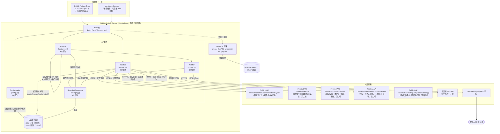
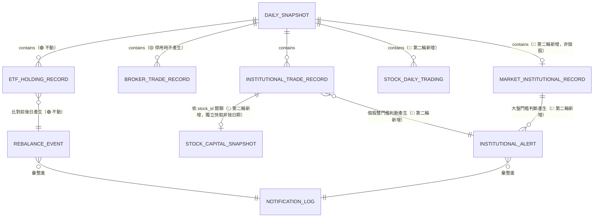
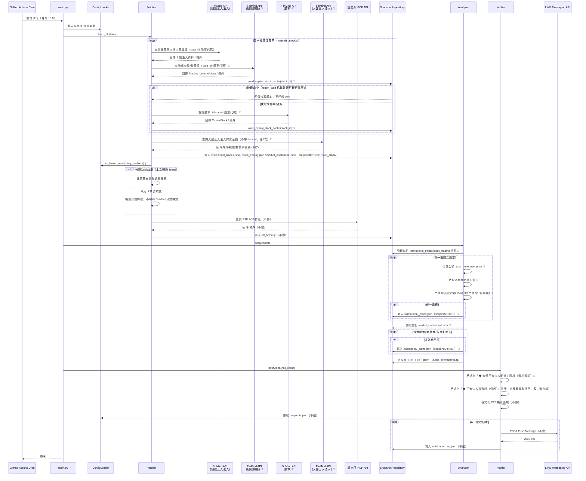

# SD-三大法人買賣超關注清單通知-系統設計書

| 項目 | 內容 |
| :--- | :--- |
| 文件類型 | 系統設計書（SD，技術性文件，既有系統之異動設計；第二輪補充已併入本文件） |
| 設計依據 | [SA-三大法人買賣超關注清單通知-功能模組分析.md](../../analysis/requirements/SA-三大法人買賣超關注清單通知-功能模組分析.md)、[SA-三大法人分級門檻告警機制-功能模組分析.md](../../analysis/requirements/SA-三大法人分級門檻告警機制-功能模組分析.md)（第二輪，補充個股分級門檻與大盤監控） |
| 相關文件 | [SD-籌碼監控推播引擎-系統設計書.md](./SD-籌碼監控推播引擎-系統設計書.md)（原始 SD 文件，本文件為其異動設計） |
| 對象讀者 | SD / 開發人員 / 維護人員 |
| 建立日期 | 2026-08-05（第二輪補充：2026-08-05） |
| 作者 | Claude Code（依 Roy Chiang 確認之設計方向整理） |
| 套件歸屬 | 既有專案 `FinanceTracker`，單一 Python 套件 `src/`，本次異動不新增套件 |

### 異動歷程

| 輪次 | 內容摘要 |
| :--- | :--- |
| 第一輪 | 分點監控改版為三大法人合計買賣超單一絕對值門檻（500 張） |
| 第二輪（本次補充） | 門檻機制擴充為「個股雙門檻（成交量佔比／市值分級金額）OR 判斷」＋「大盤三大法人金額門檻（外資/投信/自營商各自獨立）」雙軌並行，**取代**第一輪之單一絕對值門檻 |

### 與 SA 文件的關鍵差異對照

SA 文件第六章列出多項「SD 階段待細化事項」，本文件為對應決策結果，彙整如下，細節見各章節：

| SA 待決定事項 | 本文件決策 | 對應章節 |
| :--- | :--- | :--- |
| 三大法人合計口徑（外資自營商歸屬） | 計算時**全部五個欄位加總**（`Foreign_Investor` + `Foreign_Dealer_Self` + `Investment_Trust` + `Dealer_self` + `Dealer_Hedging`），避免漏計；**訊息呈現時外資自營商併入「外資」同一行顯示**（該欄位實務上多為 0，獨立成行對簡報可讀性無益） | §二、§四 |
| 股→張單位換算 | 資料落地儲存**維持原始單位「股」**（不做轉換，避免精度損失、亦利於未來換算基準調整）；**僅在 `MessageFormatter` 組版時除以 1,000 轉換為「張」呈現**，與既有分點功能之呈現習慣一致 | §二、§四 |
| ~~三大法人合計門檻預設值~~ | ~~`institutional_net_volume = 500`（張）~~ **已於第二輪廢除**，改用下方「個股雙門檻」機制，`institutional_net_volume` 鍵不再使用（設定檔保留但不讀取，避免破壞既有檔案格式） | §二 |
| `broker_branches.json` 停用旗標設計 | 於 `config/broker_branches.json` 頂層新增 `enabled`（boolean，預設 `false`）欄位；`ConfigLoader` 新增 `is_broker_monitoring_enabled()` 方法供 Fetcher／Analyzer 判斷是否執行分點相關邏輯 | §二、§四 |
| FinMind Token 環境變數處置 | 沿用既有 `FINMIND_TOKEN`，不需新增憑證；三大法人資料集實測確認免 token 亦可呼叫成功，但生產環境仍建議帶入既有 token 以取得較高呼叫額度（600 次/小時） | §一、§四 |
| 快照資料結構調整 | 新增獨立檔案 `data/snapshots/{date}/institutional_trades.json`，比照既有 `broker_trades.json` 命名慣例；`broker_trades.json` 停用期間不再產生新檔案，但歷史檔案保留不刪除 | §二 |
| **（第二輪）股本快取策略** | 以「財報季度」為快取有效性判斷基準：`data/reference/capital_stock/{stock_id}.json` 落地保存最近一次成功取得的股本與其財報 `date`；每次執行時比對是否已有「本季或最近可取得季度」的快取，命中則不重打 API，未命中才呼叫 `TaiwanStockBalanceSheet` | §二、§四 |
| **（第二輪）面額換算假設** | 固定假設面額 10 元（`發行股數 = 股本 ÷ 10`）；現行監控股票（`2330`／`2454`）皆為面額 10 元普通股，本次不處理特殊面額個案，日後清單擴增遇特殊面額股票時另案處理 | §二、§四 |
| **（第二輪）金額估算基準** | 採用**收盤價**（非成交均價）估算個股法人買賣超金額，與市值估算共用同一筆 `TaiwanStockPrice` 資料，實作最簡單 | §四 |
| **（第二輪）差異化告警文案** | 個股標籤改採 `[市值分級, 觸發原因...]` 標籤清單格式（半形中括號、逗號分隔），觸發門檻 1 標示 `量能`、門檻 2 標示 `大額`、兩者皆觸發則兩個標籤並列 `量能, 大額`；大盤區塊僅列出當日**有觸發**的法人類別；簡報不再附加免責文字頁尾（見§六第 7 項） | §四 |
| **（第二輪）大盤區塊呈現順序** | 置於個股區塊**之前**（先看大盤總體氛圍，再看個股細節，由粗到細符合閱讀習慣） | §四 |
| **（第二輪）`thresholds.json` schema 擴充方式** | 新增巢狀區塊 `institutional_tiered`（個股雙門檻）與 `market_institutional`（大盤門檻），與既有 `default`／`overrides` 平級，不修改既有鍵值語意 | §二 |

---

## 一、系統架構與部署環境

### 設計要點

| 項目 | 設計 |
| :--- | :--- |
| 執行型態 | 沿用既有無伺服器批次腳本架構，本次不異動 |
| 外部服務異動 | Fetcher 對 FinMind 的呼叫，由「分點買賣超資料集」改為「三大法人買賣超資料集」；證交所 PCF、LINE Messaging API 呼叫皆不動 |
| 儲存策略 | 沿用既有「版控內 JSON 檔案」持久化策略，僅新增一種檔案類型（見 §二），不部署資料庫 |
| 密鑰管理 | 沿用既有 `FINMIND_TOKEN` 環境變數，不新增憑證 |

### 架構圖（更新）



**設計說明：** `FinMindClient` 內同時保留 `fetch_broker_trades`（既有，分點）與新增 `fetch_institutional_trades`（三大法人）兩個方法，`Fetcher` 依 `ConfigLoader.is_broker_monitoring_enabled()` 決定是否呼叫前者；此設計讓「分點資料源日後若可用」時，只需將設定檔旗標改為 `true` 即可復用，不需要重寫程式碼，符合 SA 文件「分點功能降級但不刪除」之關鍵設計原則。

**（第二輪）設計說明：** `TaiwanStockPrice`／`TaiwanStockInstitutionalInvestorsBuySell` 隨監控股票數量逐股呼叫；`TaiwanStockBalanceSheet` 先查 `data/reference/capital_stock/{stock_id}.json` 本地快取（比對財報季度），命中才不重打 API；`TaiwanStockTotalInstitutionalInvestors` 屬市場層級資料，不隨監控股票數增加，每次執行僅呼叫 1 次。四者皆為 FinMind 免費層，已於 SA 階段實測確認可用。

### 環境規格

沿用既有規格，本次不異動：

| 環境 | 用途 | 執行方式 | 連線設定來源 |
| :--- | :--- | :--- | :--- |
| 本機開發（Dev） | 開發、單元測試、手動補跑特定日期 | `python main.py --date 2026-08-05` | 專案根目錄 `.env` |
| 正式排程（Prod） | 每交易日自動執行 | GitHub Actions `ubuntu-latest`，Python 3.11 | GitHub Repository Secrets |

### 安全設計

沿用既有設計，本次不異動：`FINMIND_TOKEN`、`LINE_CHANNEL_ACCESS_TOKEN`、`LINE_CHANNEL_SECRET` 一律透過環境變數注入；三大法人買賣超為市場公開資訊，非個資，落地存放於版控無安全疑慮，比照既有分點/ETF 資料處理原則。

---

## 二、資料模型設計

### 現行（As-Is）資料模型摘要

僅列與本次設計相關之既有檔案結構，完整規格見 [SD-籌碼監控推播引擎-系統設計書.md §二](./SD-籌碼監控推播引擎-系統設計書.md#二資料模型設計)：

| 既有檔案 | 路徑 | 本次是否異動 |
| :--- | :--- | :--- |
| `BROKER_TRADE_RECORD` | `data/snapshots/{date}/broker_trades.json` | 🟢 結構不動，僅由「預設產生」改為「依停用旗標決定是否產生」 |
| `config/watchlist.json` | — | 🟢 不動；`stocks[]` 直接沿用作為三大法人監控範圍，`brokers[]` 保留但不再被本次功能使用 |
| `config/thresholds.json` | — | 🟡 新增一個欄位（見下方） |
| `config/broker_branches.json` | — | 🟡 新增一個欄位（見下方） |

### 設計要點

| 項目 | 設計 | 理由 |
| :--- | :--- | :--- |
| 新增檔案類型 | 新增 `INSTITUTIONAL_TRADE_RECORD`，對應檔案 `data/snapshots/{date}/institutional_trades.json` | 比照既有 `broker_trades.json` 命名慣例與檔案粒度（同一快照日期一個檔案），維持一致性 |
| 儲存單位 | 落地儲存**維持股為單位**（與 FinMind 原始回傳一致），不在寫入階段做張數轉換 | 避免整數轉換造成的無條件捨去/進位誤差影響後續門檻比對精確度；換算為「張」的責任收斂在 `Notifier.MessageFormatter` 呈現層，符合單一職責 |
| 合計欄位是否落地 | `INSTITUTIONAL_TRADE_RECORD` 額外儲存 `total_net`（三大法人合計淨買賣超，寫入時即算好） | 避免 Analyzer/Notifier 每次讀取都重算，且利於利用 `data/` 版控歷史直接稽核「當天為何達到/未達到門檻」 |
| 分點資料是否繼續寫入 | `broker_trades.json` 於 `is_broker_monitoring_enabled() = false`（本次預設值）時**不再產生新檔案**；`_meta.json` 亦不再包含 `sources.FINMIND_BROKER` 這把鍵 | 停用功能不應留下「每天都失敗」的錯誤紀錄污染 Log 與快照 meta，讓停用狀態乾淨、不誤導維運人員 |
| ~~門檻鍵值命名~~（第二輪已廢除） | ~~`default.institutional_net_volume`~~ 改用下方（第二輪）巢狀門檻設定，鍵保留於檔案內但不再被讀取 | 見下方「（第二輪）門檻 schema 設計」 |
| 停用旗標位置 | 選擇放在 `config/broker_branches.json` 而非另建 `config/features.json` | 分點監控的「監控對象」與「是否啟用」高度相關，放同一檔案降低維運人員需要打開的設定檔數量；且沿用 SA 文件「不新增獨立設定檔」之精神 |
| **（第二輪）分析結果與原始資料分離** | 個股雙門檻／大盤門檻的「判斷結果」不寫回 `INSTITUTIONAL_TRADE_RECORD`（原始資料），另立 `INSTITUTIONAL_ALERT`（`data/reports/{date}/institutional_alerts.json`），比照既有 `REBALANCE_EVENT` 之「原始快照 vs 分析結果分檔」慣例 | 維持原始資料不被分析邏輯污染，門檻公式調整時只需重跑 Analyzer、不需重新抓取資料；也讓「當天為何觸發」有獨立的稽核紀錄 |
| **（第二輪）股本快取獨立於日期快照之外** | 股本快取存於 `data/reference/capital_stock/{stock_id}.json`（不分日期，單檔覆寫更新），不放進 `data/snapshots/{date}/` | 股本季更新，若放進每日快照會造成 250 個交易日重複儲存幾乎相同的資料，浪費版控空間；獨立快取檔案，每次更新才覆寫，年增量趨近於 0 |
| **（第二輪）門檻 schema 設計** | `thresholds.json` 新增 `institutional_tiered`（個股雙門檻）與 `market_institutional`（大盤門檻）兩個頂層區塊，與既有 `default`／`overrides` 平級並存 | 語意上個股分級門檻與大盤門檻是全新概念，不適合塞進原本扁平的 `default.*` 結構；獨立區塊也讓日後個別調整互不干擾 |

### ERD（概念層，更新）



### 檔案總覽

| # | 檔案類型 | 路徑樣式 | 本次動作 |
| :--- | :--- | :--- | :--- |
| 1 | DAILY_SNAPSHOT（每日狀態中繼資料） | `data/snapshots/{date}/_meta.json` | 🟡 修改（`sources` key 由 `FINMIND` 改為 `FINMIND_INSTITUTIONAL`；`FINMIND_BROKER` 停用時不出現此 key；第二輪新增 `FINMIND_PRICE`／`FINMIND_MARKET` key） |
| 2 | INSTITUTIONAL_TRADE_RECORD（個股三大法人買賣超） | `data/snapshots/{date}/institutional_trades.json` | 🟢 第一輪結構不動 |
| 3 | BROKER_TRADE_RECORD（分點買賣超） | `data/snapshots/{date}/broker_trades.json` | 🟡 保留結構，停用期間不產生新檔案 |
| 4 | ETF_HOLDING_RECORD（ETF 持股） | `data/snapshots/{date}/etf_holdings/{etf_id}.json` | 🟢 不動 |
| 5 | REBALANCE_EVENT（換倉分析結果） | `data/reports/{date}/rebalance_events.json` | 🟢 不動 |
| 6 | NOTIFICATION_LOG（推播紀錄） | `data/reports/{date}/notification_log.json` | 🟢 不動 |
| 7 | **STOCK_DAILY_TRADING（個股成交量/收盤價）** | `data/snapshots/{date}/stock_trading.json` | 🔴 第二輪新增 |
| 8 | **STOCK_CAPITAL_SNAPSHOT（個股股本快取）** | `data/reference/capital_stock/{stock_id}.json` | 🔴 第二輪新增，獨立快取（非按日期） |
| 9 | **MARKET_INSTITUTIONAL_RECORD（大盤三大法人買賣金額）** | `data/snapshots/{date}/market_institutional.json` | 🔴 第二輪新增 |
| 10 | **INSTITUTIONAL_ALERT（門檻判斷結果）** | `data/reports/{date}/institutional_alerts.json` | 🔴 第二輪新增 |
| 11 | 設定檔：門檻 | `config/thresholds.json` | 🟡 新增 `institutional_tiered`／`market_institutional` 區塊（第二輪，取代第一輪 `institutional_net_volume`） |
| 12 | 設定檔：LINE 收訊名單 | `config/recipients.json` | 🟢 不動 |
| 13 | 設定檔：分點名稱對照表 | `config/broker_branches.json` | 🟡 新增 `enabled` 欄位 |
| 14 | 設定檔：監控標的清單 | `config/watchlist.json` | 🟢 不動（`stocks[]` 直接沿用） |

---

### 1. INSTITUTIONAL_TRADE_RECORD（新增） — `data/snapshots/{date}/institutional_trades.json`

**說明：** 當日 `config/watchlist.json.stocks` 內指定股票的三大法人買賣超原始資料，陣列結構，每檔股票一筆。

| # | Field Name | Description | Data Type | Length | Default | 非空值 | PK | FK | Reference | 備註 |
| :--- | :--- | :--- | :--- | :--- | :--- | :--- | :--- | :--- | :--- | :--- |
| 1 | trade_date | 交易日期 | string (date) | 10 | — | Y | Y | — | — | 與所在目錄日期一致 |
| 2 | stock_id | 股票代碼 | string | 10 | — | Y | Y | — | — | 例：`2330` |
| 3 | stock_name | 股票名稱 | string | 50 | — | Y | — | — | — | — |
| 4 | foreign_investor_buy | 外資買進股數 | int | — | — | Y | — | — | — | FinMind `Foreign_Investor.buy`，單位：股 |
| 5 | foreign_investor_sell | 外資賣出股數 | int | — | — | Y | — | — | — | FinMind `Foreign_Investor.sell`，單位：股 |
| 6 | foreign_dealer_self_net | 外資自營商淨買賣超股數 | int | — | 0 | Y | — | — | — | FinMind `Foreign_Dealer_Self.buy - sell`，實務上多為 0 |
| 7 | investment_trust_buy | 投信買進股數 | int | — | — | Y | — | — | — | FinMind `Investment_Trust.buy` |
| 8 | investment_trust_sell | 投信賣出股數 | int | — | — | Y | — | — | — | FinMind `Investment_Trust.sell` |
| 9 | dealer_self_net | 自營商自行買賣淨買賣超股數 | int | — | — | Y | — | — | — | FinMind `Dealer_self.buy - sell` |
| 10 | dealer_hedging_net | 自營商避險淨買賣超股數 | int | — | — | Y | — | — | — | FinMind `Dealer_Hedging.buy - sell` |
| 11 | total_net | 三大法人合計淨買賣超股數 | int | — | — | Y | — | — | — | 上列 5 個淨額欄位之總和，寫入時即算好（見 §一設計要點） |

---

### 2. BROKER_TRADE_RECORD（保留，結構不動） — `data/snapshots/{date}/broker_trades.json`

沿用既有結構（見原 SD 文件 §二第 2 節），欄位定義本次不異動；差異僅在於「是否產生此檔案」改由 `ConfigLoader.is_broker_monitoring_enabled()` 控制，見 §四業務邏輯。

---

### 3. DAILY_SNAPSHOT（修改） — `data/snapshots/{date}/_meta.json`

| # | Field Name | Description | Data Type | 非空值 | 備註 |
| :--- | :--- | :--- | :--- | :--- | :--- |
| 1 | snapshot_date | 快照日期 | string (date) | Y | 不動 |
| 2 | sources | 各資料源狀態物件 | object | Y | key 異動：`FINMIND` → **`FINMIND_INSTITUTIONAL`**；分點停用時不含 `FINMIND_BROKER` 這把 key；`TWSE_PCF` 不動 |
| 3 | is_trading_day | 綜合判定當日是否為有效交易日 | boolean | Y | 判定邏輯不動（任一來源 `status = OK` 即為 `true`） |

---

### 4. STOCK_DAILY_TRADING（第二輪新增） — `data/snapshots/{date}/stock_trading.json`

**說明：** 當日 `watchlist.json.stocks` 內指定股票的成交量與收盤價，供門檻 1（成交量佔比）與金額估算共用。

| # | Field Name | Description | Data Type | Length | Default | 非空值 | PK | FK | Reference | 備註 |
| :--- | :--- | :--- | :--- | :--- | :--- | :--- | :--- | :--- | :--- | :--- |
| 1 | trade_date | 交易日期 | string (date) | 10 | — | Y | Y | — | — | — |
| 2 | stock_id | 股票代碼 | string | 10 | — | Y | Y | — | — | — |
| 3 | trading_volume | 當日成交股數 | int | — | — | Y | — | — | — | FinMind `TaiwanStockPrice.Trading_Volume` |
| 4 | close_price | 當日收盤價 | float | — | — | Y | — | — | — | FinMind `TaiwanStockPrice.close`，用於金額/市值估算 |

---

### 5. STOCK_CAPITAL_SNAPSHOT（第二輪新增，獨立快取） — `data/reference/capital_stock/{stock_id}.json`

**說明：** 單一股票的股本快取，**不分日期、單檔覆寫**；每次執行前先讀取本檔比對 `report_date` 是否已是最新可取得財報季，未過期則不重打 API。

| # | Field Name | Description | Data Type | Length | Default | 非空值 | PK | FK | Reference | 備註 |
| :--- | :--- | :--- | :--- | :--- | :--- | :--- | :--- | :--- | :--- | :--- |
| 1 | stock_id | 股票代碼 | string | 10 | — | Y | Y | — | — | 亦為檔名 |
| 2 | report_date | 財報季底日期 | string (date) | 10 | — | Y | — | — | — | FinMind `TaiwanStockBalanceSheet.date`，用於快取有效性判斷 |
| 3 | capital_stock | 股本（元） | int | — | — | Y | — | — | — | FinMind `type=CapitalStock` 之 `value` |
| 4 | estimated_shares | 估算發行股數 | int | — | — | Y | — | — | — | `capital_stock ÷ 10`（固定假設面額 10 元，見 §一設計要點） |
| 5 | fetched_at | 本快取寫入時間 | string (datetime, ISO 8601) | — | — | Y | — | — | — | 供人工排查快取新鮮度 |

---

### 6. MARKET_INSTITUTIONAL_RECORD（第二輪新增） — `data/snapshots/{date}/market_institutional.json`

**說明：** 當日大盤（市場整體）三大法人買賣金額，**非個股資料、不隨監控股票數增加**，每次執行僅一筆。

| # | Field Name | Description | Data Type | Length | Default | 非空值 | PK | FK | Reference | 備註 |
| :--- | :--- | :--- | :--- | :--- | :--- | :--- | :--- | :--- | :--- | :--- |
| 1 | trade_date | 交易日期 | string (date) | 10 | — | Y | Y | — | — | — |
| 2 | foreign_net_amount | 外資買賣超金額（元） | int | — | — | Y | — | — | — | `Foreign_Investor.buy - sell`＋`Foreign_Dealer_Self.buy - sell` |
| 3 | trust_net_amount | 投信買賣超金額（元） | int | — | — | Y | — | — | — | `Investment_Trust.buy - sell` |
| 4 | dealer_net_amount | 自營商買賣超金額（元） | int | — | — | Y | — | — | — | `Dealer_self.buy - sell`＋`Dealer_Hedging.buy - sell` |

---

### 7. INSTITUTIONAL_ALERT（第二輪新增，分析結果） — `data/reports/{date}/institutional_alerts.json`

**說明：** Analyzer 依個股雙門檻與大盤門檻判斷後，**僅保留達標項目**的結果（未達標者不落地，避免檔案膨脹，比照既有 `REBALANCE_EVENT` 慣例）。陣列結構，個股與大盤項目以 `scope` 區分。

| # | Field Name | Description | Data Type | Length | Default | 非空值 | PK | FK | Reference | 備註 |
| :--- | :--- | :--- | :--- | :--- | :--- | :--- | :--- | :--- | :--- | :--- |
| 1 | scope | 適用範圍 | string (enum: `STOCK` / `MARKET`) | — | — | Y | Y | — | — | 見下方 `AlertScope` enum |
| 2 | stock_id | 股票代碼 | string | 10 | null | N | Y | — | — | 僅 `scope=STOCK` 時填寫 |
| 3 | trigger_type | 觸發類型 | string (enum) | — | — | Y | — | — | 見下方 `AlertTriggerType` enum |
| 4 | estimated_amount | 觸發當下之估算金額（元） | int | — | null | N | — | — | — | `scope=STOCK` 為個股估算金額；`scope=MARKET` 為對應法人類別之實際金額（非估算） |
| 5 | market_cap_tier | 市值分級 | string (enum) | — | null | N | — | — | 見下方 `MarketCapTier` enum | 僅 `scope=STOCK` 時填寫 |
| 6 | volume_ratio_pct | 佔成交量比例（%） | float | — | null | N | — | — | — | 僅門檻 1 相關時填寫，供訊息呈現引用 |

---

### 設定檔規格異動

#### `config/thresholds.json`（第二輪：新增巢狀區塊，取代第一輪單一鍵值）

| # | Field Name | Description | Data Type | 非空值 | 備註 |
| :--- | :--- | :--- | :--- | :--- | :--- |
| 1 | default.broker_net_volume | 分點買賣超預設門檻（張） | int | Y | 🟢 不動，分點功能停用期間不生效但保留設定值 |
| 2 | ~~default.institutional_net_volume~~ | ~~三大法人合計買賣超預設門檻~~ | int | — | 🟡 **第二輪起不再被讀取**，鍵保留於檔案內容不變動（向下相容），改由下方 `institutional_tiered`／`market_institutional` 取代 |
| 3 | default.etf_rebalance_pct | ETF 調倉幅度預設門檻（%） | float | Y | 🟢 不動 |
| 4 | overrides.{etf_id}.etf_rebalance_pct | 個別 ETF 覆寫門檻 | float | N | 🟢 不動 |
| 5 | **institutional_tiered.volume_ratio_pct** | 個股門檻 1：佔成交量比例門檻（%） | float | Y | 🔴 第二輪新增，預設 `15.0` |
| 6 | **institutional_tiered.market_cap_tiers.large_min** | 大型股市值下限（元） | int | Y | 🔴 第二輪新增，預設 `100000000000`（1,000 億） |
| 7 | **institutional_tiered.market_cap_tiers.mid_min** | 中型股市值下限（元） | int | Y | 🔴 第二輪新增，預設 `10000000000`（100 億） |
| 8 | **institutional_tiered.amount_thresholds.large** | 大型股門檻 2 金額（元） | int | Y | 🔴 第二輪新增，預設 `3000000000`（30 億） |
| 9 | **institutional_tiered.amount_thresholds.mid** | 中型股門檻 2 金額（元） | int | Y | 🔴 第二輪新增，預設 `500000000`（5 億） |
| 10 | **institutional_tiered.amount_thresholds.small** | 中小型股門檻 2 金額（元） | int | Y | 🔴 第二輪新增，預設 `100000000`（1 億） |
| 11 | **market_institutional.foreign_amount** | 大盤外資門檻（元，絕對值） | int | Y | 🔴 第二輪新增，預設 `20000000000`（200 億） |
| 12 | **market_institutional.trust_amount** | 大盤投信門檻（元，絕對值） | int | Y | 🔴 第二輪新增，預設 `3000000000`（30 億） |
| 13 | **market_institutional.dealer_amount** | 大盤自營商門檻（元，絕對值） | int | Y | 🔴 第二輪新增，預設 `5000000000`（50 億） |

**範例（第二輪更新後）：**
```json
{
  "default": {
    "broker_net_volume": 500,
    "institutional_net_volume": 500,
    "etf_rebalance_pct": 10.0
  },
  "institutional_tiered": {
    "volume_ratio_pct": 15.0,
    "market_cap_tiers": { "large_min": 100000000000, "mid_min": 10000000000 },
    "amount_thresholds": { "large": 3000000000, "mid": 500000000, "small": 100000000 }
  },
  "market_institutional": {
    "foreign_amount": 20000000000,
    "trust_amount": 3000000000,
    "dealer_amount": 5000000000
  },
  "overrides": { "0050": { "etf_rebalance_pct": 10.0 } }
}
```

#### `config/broker_branches.json`（新增欄位）

| # | Field Name | Description | Data Type | 非空值 | 備註 |
| :--- | :--- | :--- | :--- | :--- | :--- |
| 1 | **enabled** | 分點監控功能是否啟用 | boolean | Y | 🔴 新增，**預設 `false`**；`ConfigLoader._validate()` 需允許此欄位缺省時視為 `false`（向下相容既有未帶此欄位的設定檔） |
| 2 | branches[].code | FinMind 分點代碼 | string | Y | 🟢 不動 |
| 3 | branches[].name | 中文分點名稱 | string | Y | 🟢 不動 |

**範例（更新後）：**
```json
{
  "enabled": false,
  "branches": [
    { "code": "1020", "name": "凱基-台北" },
    { "code": "9200", "name": "摩根大通" }
  ]
}
```

#### `config/watchlist.json`（結構不動）

🟢 不動。`stocks[]` 直接沿用作為三大法人監控股票範圍；`brokers[]` 保留但於分點功能停用期間不被讀取使用。

### Enum 定義（新增/異動部分）

```python
# src/models.py（概念定義，實際實作型別由開發階段決定）

class SnapshotStatus(str, Enum):
    OK = "OK"
    NO_DATA = "NO_DATA"
    ERROR = "ERROR"
    # 🟢 不動，本次沿用

# 🔴 新增：資料源識別鍵，取代原本寫死於程式碼中的 "FINMIND" 字串
class DataSourceKey(str, Enum):
    FINMIND_INSTITUTIONAL = "FINMIND_INSTITUTIONAL"  # 個股三大法人買賣超
    FINMIND_PRICE = "FINMIND_PRICE"                  # 🔴 第二輪新增：個股成交量/收盤價
    FINMIND_BALANCE_SHEET = "FINMIND_BALANCE_SHEET"  # 🔴 第二輪新增：個股股本（快取）
    FINMIND_MARKET = "FINMIND_MARKET"                # 🔴 第二輪新增：大盤三大法人買賣金額
    FINMIND_BROKER = "FINMIND_BROKER"                # 分點買賣超（保留，停用時不寫入）
    TWSE_PCF = "TWSE_PCF"                             # ETF 持股，不動

# 🔴 第二輪新增：INSTITUTIONAL_ALERT 的適用範圍
class AlertScope(str, Enum):
    STOCK = "STOCK"    # 個股層級
    MARKET = "MARKET"  # 大盤層級

# 🔴 第二輪新增：告警觸發類型，供 Notifier 顯示差異化文案
class AlertTriggerType(str, Enum):
    VOLUME_RATIO = "VOLUME_RATIO"        # 個股門檻1：佔成交量比例達標（標籤顯示 `量能`）
    TIERED_AMOUNT = "TIERED_AMOUNT"      # 個股門檻2：市值分級金額達標（標籤顯示 `大額`）
    VOLUME_AND_AMOUNT = "VOLUME_AND_AMOUNT"  # 個股門檻1+2 同時達標（標籤顯示 `量能, 大額`）
    MARKET_FOREIGN = "MARKET_FOREIGN"    # 大盤外資達標
    MARKET_TRUST = "MARKET_TRUST"        # 大盤投信達標
    MARKET_DEALER = "MARKET_DEALER"      # 大盤自營商達標

# 🔴 第二輪新增：個股市值分級
class MarketCapTier(str, Enum):
    LARGE = "LARGE"    # 大型股，估算市值 ≥ 1,000 億
    MID = "MID"        # 中型股，100 億 ≤ 估算市值 < 1,000 億
    SMALL = "SMALL"    # 中小型股，估算市值 < 100 億
```

### 索引與查詢設計彙整

| 檔案/目錄設計 | 取代的查詢情境 | 對應 UC |
| :--- | :--- | :--- |
| `data/snapshots/{date}/institutional_trades.json` 獨立成檔 | 快照讀寫時不需與分點資料混雜於同一檔案，日後分點復用時互不干擾 | UC1、UC4 |
| `data/reference/capital_stock/{stock_id}.json` 獨立於日期快照之外（第二輪） | 股本查詢不需逐日掃描快照目錄，直接依 `stock_id` 定位單一快取檔案 | UC10 |
| `data/reports/{date}/institutional_alerts.json` 僅存達標項目（第二輪） | 「今天有哪些告警」查詢不需載入全部個股/大盤原始資料再重新運算一次 | UC12、UC13 |
| 其餘既有索引設計 | 不動 | — |

### 資料搬移／初始資料匯入

本文件無搬移章節：既有快照歷史資料（`broker_trades.json`）不需搬移，維持原檔案不動，僅日後不再新增。初始資料異動涉及 `config/broker_branches.json` 新增 `enabled: false` 欄位、`config/thresholds.json` 新增（第一輪）`institutional_net_volume` 欄位與（第二輪）`institutional_tiered`／`market_institutional` 區塊，由開發人員於本次異動實作時一併調整既有設定檔，非既有資料之搬移範疇。首次執行時 `data/reference/capital_stock/` 目錄為空，屬正常情況（快取未命中，正常呼叫 API 建立）。

---

## 三、前端開發規格

**本章節不適用。** 沿用原 SD 文件 §三之說明：本系統為無使用者介面的無伺服器批次腳本。本次異動僅調整 LINE 推播訊息內容區塊（純文字），其格式規格已於 SA 文件 §3.3 定義、本文件 §四列出，不另設前端章節。

---

## 四、程式元件與介面實作

### 業務邏輯（對應 SA FR）

| FR | 業務規則 | 程式落地方式 |
| :--- | :--- | :--- |
| FR-1.1（三大法人買賣超抓取） | 逐股呼叫 FinMind `TaiwanStockInstitutionalInvestorsBuySell`，取得五個法人類別買進/賣出股數 | `FinMindClient.fetch_institutional_trades(trade_date, stock_ids)`（🔴 新增方法），對 `config.get_watchlist_stocks()` 逐一呼叫並彙整 |
| FR-1.2（ETF PCF 抓取） | 不動 | 不動 |
| FR-1.3（異常與休市處理） | 三大法人資料源比照既有例外容錯模式 | `Fetcher._fetch_institutional_trades` 以 try/except 包裹，失敗寫入 `_meta.json.sources.FINMIND_INSTITUTIONAL.status = ERROR`，不中斷後續流程 |
| （分點功能，停用態） | 僅當 `config.is_broker_monitoring_enabled() = true` 時才呼叫分點 API | `Fetcher.fetch_all` 於呼叫 `_fetch_broker_trades` 前先檢查旗標，`false` 時直接略過，不寫入 `_meta.json` 中對應 key |
| ~~FR-2.1~~（三大法人合計門檻篩選） | ~~加總 5 個法人類別淨額為 `total_net`，與 `institutional_net_volume` 門檻比較~~ | 🟡 **第二輪已由 FR-2.5／FR-2.6 取代**，見下方 |
| FR-2.2（ETF 雙日持股比對） | 不動 | 不動 |
| ~~FR-3.1~~（訊息格式化） | ~~股數換算為張（÷1,000）；外資與外資自營商合併顯示為同一行~~ | 🟡 **第二輪由 FR-3.3 擴充**，見下方（外資合併顯示決策沿用不變） |
| FR-3.2（LINE Push） | 不動 | 不動 |
| **FR-1.4（第二輪，個股成交量/收盤價抓取）** | 逐股呼叫 `TaiwanStockPrice`，取得 `Trading_Volume`、`close` | `FinMindClient.fetch_stock_trading(trade_date, stock_ids)`（🔴 新增方法） |
| **FR-1.5（第二輪，個股股本抓取＋快取）** | 逐股讀取 `data/reference/capital_stock/{stock_id}.json`；若無快取或 `report_date` 非最新可取得財報季，才呼叫 `TaiwanStockBalanceSheet` 並覆寫快取 | `FinMindClient.fetch_capital_stock()`（🔴 新增）＋`SnapshotRepository.read_capital_stock_cache()` / `write_capital_stock_cache()`（🔴 新增） |
| **FR-1.6（第二輪，大盤三大法人金額抓取）** | 呼叫 `TaiwanStockTotalInstitutionalInvestors`（不帶 `data_id`，每次執行僅 1 次），取得 `total` 以外各法人類別金額 | `FinMindClient.fetch_market_institutional(trade_date)`（🔴 新增方法） |
| **FR-2.3（第二輪，個股金額估算）** | `估算金額 = total_net股數 × close_price`；`估算市值 = estimated_shares × close_price` | `InstitutionalTieredFilter._estimate_amount()`（🔴 新增） |
| **FR-2.4（第二輪，市值分級判斷）** | 依 `institutional_tiered.market_cap_tiers` 設定歸類 `MarketCapTier` | `InstitutionalTieredFilter._classify_tier()`（🔴 新增） |
| **FR-2.5（第二輪，個股雙門檻 OR 判斷，取代 FR-2.1）** | 門檻1：`abs(total_net) / trading_volume >= volume_ratio_pct`；門檻2：`abs(估算金額) >= 分級門檻`；OR 判斷，記錄 `AlertTriggerType` | `InstitutionalTieredFilter.filter_significant_trades()`（🔴 新增，取代 `InstitutionalFilter`） |
| **FR-2.6（第二輪，大盤三法人各自判斷）** | 外資／投信／自營商各自與 `market_institutional.*` 門檻比較，各自獨立產生 `INSTITUTIONAL_ALERT`（`scope=MARKET`） | `MarketInstitutionalFilter.filter_significant_trades()`（🔴 新增） |
| **FR-3.3（第二輪，差異化告警訊息，取代 FR-3.1 呈現邏輯）** | 個股每檔一行 `{代碼} {名稱} [{市值分級}, {觸發原因...}]:{買/賣}超 {金額}億元 (外 ... / 投 ... / 自 ...)`，`AlertTriggerType` 對應標籤 `量能`／`大額`／`量能, 大額`；新增「◆ 大盤三大法人動態」區塊置於個股區塊之前，僅列出當日有觸發的法人類別；訊息不附加免責文字頁尾 | `MessageFormatter._format_stock_alert_line()`、`_format_market_alerts()`（🔴 新增） |

### 內部元件設計

| 元件 | 職責 | 異動類型 |
| :--- | :--- | :--- |
| `src/config.py` (`ConfigLoader`) | 新增 `is_broker_monitoring_enabled()`；第二輪新增 `get_volume_ratio_threshold()`、`get_tiered_amount_threshold(tier)`、`get_market_cap_tier_bounds()`、`get_market_institutional_threshold(investor_type)`；`get_institutional_net_volume_threshold()` 不再被呼叫但保留方法本身（向下相容） | 🟡 修改 |
| `src/fetcher.py` (`FinMindClient`) | 既有 `fetch_institutional_trades()` 不動；第二輪新增 `fetch_stock_trading()`、`fetch_capital_stock()`、`fetch_market_institutional()` | 🟡 修改 |
| `src/fetcher.py` (`Fetcher`) | `fetch_all()` 第二輪新增呼叫 `_fetch_stock_trading()`、`_fetch_capital_stock()`（含快取判斷）、`_fetch_market_institutional()` | 🟡 修改 |
| `src/analyzer.py` (`InstitutionalTieredFilter`) | 個股雙門檻 OR 判斷、市值分級、金額估算，**取代**第一輪 `InstitutionalFilter` | 🔴 新增（第二輪），第一輪 `InstitutionalFilter` 類別移除 |
| `src/analyzer.py` (`MarketInstitutionalFilter`) | 大盤三法人各自門檻判斷 | 🔴 新增（第二輪） |
| `src/analyzer.py` (`BrokerFilter`) | 不動（呼叫方跳過） | 🟢 不動 |
| `src/notifier.py` (`MessageFormatter`) | 第二輪新增大盤區塊與差異化告警文案組版方法 | 🟡 修改 |
| `src/storage.py` (`SnapshotRepository`) | 既有 `write_institutional_trades()` 不動；第二輪新增 `write_stock_trading()`、`read/write_capital_stock_cache()`、`write_market_institutional()`、`write_institutional_alerts()` | 🟡 修改 |
| `src/models.py` | 第二輪新增 `StockDailyTrading`、`StockCapitalSnapshot`、`MarketInstitutionalRecord`、`InstitutionalAlert` dataclass；`AlertScope`／`AlertTriggerType`／`MarketCapTier` enum | 🟡 修改 |

### 現行（As-Is）API 規格摘要

沿用原 SD 文件 §四之外部服務清單，本次新增一項、既有項目狀態調整：

| # | 服務 | 端點 | 用途 | 呼叫方 | 本次狀態 |
| :--- | :--- | :--- | :--- | :--- | :--- |
| 1 | FinMind API（分點） | `GET /api/v4/data?dataset=TaiwanStockTradingDailyReportSecIdAgg` | 抓取分點買賣超 | `FinMindClient.fetch_broker_trades` | 🟡 保留程式碼，預設停用不呼叫（原 dataset 名稱有誤，已於 SA 文件確認並待日後修正或棄用） |
| 2 | 證交所 PCF API | — | 抓取 ETF 成分股 | `TwsePcfClient` | 🟢 不動（含既有已知失效問題，本次不處理） |
| 3 | LINE Messaging API | `POST /v2/bot/message/push` | 推播簡報 | `LineClient` | 🟢 不動 |

### API 契約（新增：三大法人買賣超）

| # | 服務 | Method / Endpoint | 用途 | 呼叫方 | 認證方式 |
| :--- | :--- | :--- | :--- | :--- | :--- |
| 4 | FinMind API（三大法人） | `GET https://api.finmindtrade.com/api/v4/data`<br>`?dataset=TaiwanStockInstitutionalInvestorsBuySell`<br>`&data_id={股票代碼}`<br>`&start_date={日期}&end_date={日期}`<br>`&token={FINMIND_TOKEN}` | 抓取單一股票當日三大法人買賣超 | `FinMindClient.fetch_institutional_trades` | Query 帶 `token`（可選，帶入可取得較高呼叫額度） |

**Request 範例：**
```
GET https://api.finmindtrade.com/api/v4/data?dataset=TaiwanStockInstitutionalInvestorsBuySell&data_id=2330&start_date=2026-08-05&end_date=2026-08-05&token=xxx
```

**Response 範例（成功，實測格式）：**
```json
{
  "msg": "success",
  "status": 200,
  "data": [
    {"date": "2026-08-05", "stock_id": "2330", "name": "Foreign_Investor", "buy": 15247428, "sell": 27676945},
    {"date": "2026-08-05", "stock_id": "2330", "name": "Foreign_Dealer_Self", "buy": 0, "sell": 0},
    {"date": "2026-08-05", "stock_id": "2330", "name": "Investment_Trust", "buy": 1490421, "sell": 1056701},
    {"date": "2026-08-05", "stock_id": "2330", "name": "Dealer_self", "buy": 311050, "sell": 1392806},
    {"date": "2026-08-05", "stock_id": "2330", "name": "Dealer_Hedging", "buy": 67592, "sell": 1312755}
  ]
}
```

**Response 範例（免費層越權，如省略 `data_id` 嘗試全市場查詢）：**
```json
{"msg": "Your level is free. Please update your user level. ...", "status": 400, "token_tail": ""}
```
→ `FinMindClient` 一律帶 `data_id` 逐股呼叫，不會觸發此情境；仍需捕捉以防未來 FinMind 政策調整。

### API 契約（第二輪新增：成交量、股本、大盤三大法人金額）

| # | 服務 | Method / Endpoint | 用途 | 呼叫方 | 認證方式 |
| :--- | :--- | :--- | :--- | :--- | :--- |
| 5 | FinMind API（個股價量） | `GET .../v4/data?dataset=TaiwanStockPrice&data_id={股票代碼}&start_date={日期}&end_date={日期}` | 抓取個股成交量與收盤價 | `FinMindClient.fetch_stock_trading` | Query 帶 `token`（可選） |
| 6 | FinMind API（資產負債表） | `GET .../v4/data?dataset=TaiwanStockBalanceSheet&data_id={股票代碼}&start_date={日期}&end_date={日期}` | 抓取股本（`type=CapitalStock`），僅快取未命中時呼叫 | `FinMindClient.fetch_capital_stock` | Query 帶 `token`（可選） |
| 7 | FinMind API（大盤三大法人） | `GET .../v4/data?dataset=TaiwanStockTotalInstitutionalInvestors&start_date={日期}&end_date={日期}` | 抓取大盤三大法人買賣金額，**不帶 `data_id`**，每次執行僅呼叫一次 | `FinMindClient.fetch_market_institutional` | Query 帶 `token`（可選） |

**Request 範例（個股價量）：**
```
GET https://api.finmindtrade.com/api/v4/data?dataset=TaiwanStockPrice&data_id=2330&start_date=2026-08-05&end_date=2026-08-05
```

**Response 範例（成功，實測格式）：**
```json
{"msg":"success","status":200,"data":[{"date":"2026-08-05","stock_id":"2330","Trading_Volume":41021199,"Trading_money":95455231293,"open":2335.0,"max":2360.0,"min":2310.0,"close":2320.0,"spread":-50.0,"Trading_turnover":277787}]}
```

**Request 範例（股本）：**
```
GET https://api.finmindtrade.com/api/v4/data?dataset=TaiwanStockBalanceSheet&data_id=2330&start_date=2026-01-01&end_date=2026-08-05
```

**Response 範例（成功，實測格式，僅節錄 `CapitalStock` 相關列，實際回傳含上百筆會計科目，`FinMindClient` 需篩選 `type == "CapitalStock"`）：**
```json
{"msg":"success","status":200,"data":[
  {"date":"2026-03-31","stock_id":"2330","type":"CapitalStock","value":259323701000.0,"origin_name":"股本合計"}
]}
```

**Request 範例（大盤三大法人，不帶 `data_id`）：**
```
GET https://api.finmindtrade.com/api/v4/data?dataset=TaiwanStockTotalInstitutionalInvestors&start_date=2026-08-05&end_date=2026-08-05
```

**Response 範例（成功，實測格式）：**
```json
{"msg":"success","status":200,"data":[
  {"date":"2026-08-05","name":"Dealer_self","buy":9919729990,"sell":18594023919},
  {"date":"2026-08-05","name":"Foreign_Dealer_Self","buy":0,"sell":0},
  {"date":"2026-08-05","name":"Dealer_Hedging","buy":31528976847,"sell":42283419627},
  {"date":"2026-08-05","name":"Investment_Trust","buy":47011577882,"sell":19846417822},
  {"date":"2026-08-05","name":"Foreign_Investor","buy":447661494099,"sell":453393026925},
  {"date":"2026-08-05","name":"total","buy":536121778818,"sell":534116888293}
]}
```
→ `total` 列為官方加總，本系統仍以個別法人類別欄位加總比對（`Dealer_self`＋`Dealer_Hedging`＝自營商），不直接使用 `total` 列（`total` 混合三大法人全部，無法拆分各自門檻）。

**LINE Push 請求/回應：** 不動，見原 SD 文件 §四。

### 時序圖：每日排程主流程（更新）



---

## 五、維護與例外處理

### 錯誤碼彙整

| 代碼 | 觸發情境 | 對應處理方式 |
| :--- | :--- | :--- |
| **`FETCH_INSTITUTIONAL_ERROR`**（🔴 新增） | FinMind 三大法人 API 呼叫逾時/回傳非預期格式 | 記錄 Log，`_meta.json.sources.FINMIND_INSTITUTIONAL.status = ERROR`，該股票當日略過三大法人分析，其餘股票/模組照常執行 |
| **`FETCH_INSTITUTIONAL_NO_DATA`**（🔴 新增） | 當日為假日/颱風假，回傳空結果 | 記錄 Log，`status = NO_DATA`（非錯誤），不計入告警 |
| **`FETCH_PRICE_ERROR`**（🔴 第二輪新增） | `TaiwanStockPrice` 呼叫失敗 | 記錄 Log，`_meta.json.sources.FINMIND_PRICE.status = ERROR`；該股票當日**門檻1與金額估算皆無法計算**（缺成交量/收盤價），僅該股票略過雙門檻判斷，其餘股票照常 |
| **`FETCH_BALANCE_SHEET_ERROR`**（🔴 第二輪新增） | `TaiwanStockBalanceSheet` 呼叫失敗且無可用舊快取 | 記錄 Log；若存在**任何一筆**歷史快取（即使已過期）則沿用舊快取市值分級並記錄 WARNING，避免單次 API 異常就整個略過該股票；完全無快取時該股票當日略過門檻2判斷 |
| **`FETCH_MARKET_INSTITUTIONAL_ERROR`**（🔴 第二輪新增） | `TaiwanStockTotalInstitutionalInvestors` 呼叫失敗 | 記錄 Log，`_meta.json.sources.FINMIND_MARKET.status = ERROR`；當日簡報略過「◆ 大盤三大法人動態」區塊，不影響個股區塊 |
| `FETCH_TWSE_ERROR` / `FETCH_TWSE_NO_DATA` | 不動 | 不動，見原 SD 文件 §五 |
| `LINE_PUSH_FAILED` | 不動 | 不動 |
| `CONFIG_INVALID` | 涵蓋範圍新增：`thresholds.json` 缺 `institutional_tiered`／`market_institutional` 區塊、`broker_branches.json.enabled` 型別非 boolean 等新欄位驗證失敗情境 | 沿用既有處理方式：啟動階段即檢查並中止執行 |
| ~~`FETCH_FINMIND_ERROR`~~ / ~~`FETCH_FINMIND_NO_DATA`~~ | 原代碼語意調整為專指「分點」資料源 | 🟡 分點功能停用期間不會觸發；分點功能日後復用時沿用原代碼定義 |

### 排程／SP 清單

沿用既有排程，本次無異動：`.github/workflows/daily-chip-monitor.yml`（`schedule` + `workflow_dispatch`），詳見原 SD 文件 §五。本專案無資料庫，故無 Stored Procedure。

### 例外處理原則

沿用既有原則（單一資料源失敗不中斷全局、LINE 推播有限重試、設定檔錯誤啟動階段即中止），三大法人資料源比照既有分點資料源之例外處理層級套用。第二輪新增之例外情境：

| 情境 | 處理策略 |
| :--- | :--- |
| 個股缺成交量/收盤價（`FETCH_PRICE_ERROR`） | 該股票當日整體略過雙門檻判斷（門檻1、門檻2皆需要收盤價/成交量），不納入 `institutional_alerts.json`，不影響其他股票 |
| 個股股本快取與 API 皆不可用 | 略過該股票市值分級（僅門檻2受影響），門檻1（成交量佔比）仍可獨立判斷 |
| 大盤資料源失敗 | 僅簡報略過大盤區塊，不影響個股區塊之產出與推播 |

---

## 六、待確認事項

| # | 項目 | 待誰確認 | 確認結果 |
| :--- | :--- | :--- | :--- |
| 1 | ~~三大法人合計門檻預設值 `500` 張是否合理~~ | ~~Roy Chiang~~ | **已確認，第二輪改採分級門檻機制（見異動歷程），此項目已由新機制取代，不再適用** |
| 2 | 簡報是否需要區分「外資」與「外資自營商」兩行呈現，或維持本文件決策之合併顯示 | Roy Chiang | **已確認，採合併顯示**（見 §一） |
| 3 | `broker_branches.json.enabled` 未來若要復用分點功能，是否需要先確認 FinMind 帳號已升級付費方案，或屆時再另尋資料源 | Roy Chiang | 待確認（非本次阻塞項） |
| 4 | 分點功能停用後，`config/watchlist.json.brokers[]` 是否保留在設定檔內或先行清空 | Roy Chiang | **已確認，保留不清空**（見 §一） |
| 5（第二輪新增） | 個股市值分級臨界點（1,000億/100億）與各項門檻金額（大盤200億/30億/50億、個股30億/5億/1億、成交量佔比15%）是否需要隨市場環境（如大盤指數位階、成交量長期趨勢）定期檢討調整，或視為長期固定值 | Roy Chiang（產品/維運面決策） | 待確認（非本次阻塞項，先以定案數值上線） |
| 6（第二輪新增） | 股本快取失效後、`TaiwanStockBalanceSheet` 又暫時無法呼叫時，沿用「已過期舊快取」的期間長度是否需要上限（例如超過 2 季未更新則视为不可信，改為略過門檻2而非沿用） | 開發人員 | 待確認（本次先不設上限，僅記錄 WARNING） |
| 7（第二輪新增） | ~~個股門檻2「大額進出」訊息內是否需要同時揭露「本次估算方式為股數×收盤價，非官方精確金額」的免責文字，或僅在文件層級註明即可~~ | ~~Roy Chiang~~ | **已確認，不在訊息內附加免責文字**（原頁尾「本訊息由籌碼監控引擎自動產生，個股金額為估算值」已移除），估算方式僅在本文件與 SA 文件層級註明 |

---

## 七、來源檔案索引

- [SA-三大法人買賣超關注清單通知-功能模組分析.md](../../analysis/requirements/SA-三大法人買賣超關注清單通知-功能模組分析.md)（第一輪設計依據）
- [SA-三大法人分級門檻告警機制-功能模組分析.md](../../analysis/requirements/SA-三大法人分級門檻告警機制-功能模組分析.md)（第二輪設計依據，本次補充內容之基礎）
- [SD-籌碼監控推播引擎-系統設計書.md](./SD-籌碼監控推播引擎-系統設計書.md)（原始 SD 文件，本文件為其異動設計）
- `f:\projects\FinanceTracker\src\fetcher.py`（現行實作，待依 §四調整）
- `f:\projects\FinanceTracker\src\analyzer.py`（現行實作，待依 §四調整；第二輪新增 `InstitutionalTieredFilter`、`MarketInstitutionalFilter`）
- `f:\projects\FinanceTracker\src\notifier.py`（現行實作，待依 §四調整）
- `f:\projects\FinanceTracker\src\models.py`（現行實作，待依 §二調整）
- `f:\projects\FinanceTracker\src\config.py`（現行實作，待依 §二、§四調整）
- `f:\projects\FinanceTracker\src\storage.py`（現行實作，待依 §二調整）
- `f:\projects\FinanceTracker\config\watchlist.json`、`config\thresholds.json`、`config\broker_branches.json`（現行設定檔，待依 §二調整）
- 本次對話中對 FinMind API 之即時驗證呼叫紀錄（`TaiwanStockInstitutionalInvestorsBuySell`／`TaiwanStockPrice`／`TaiwanStockBalanceSheet`／`TaiwanStockTotalInstitutionalInvestors` 皆為 `200 success` 回應）
