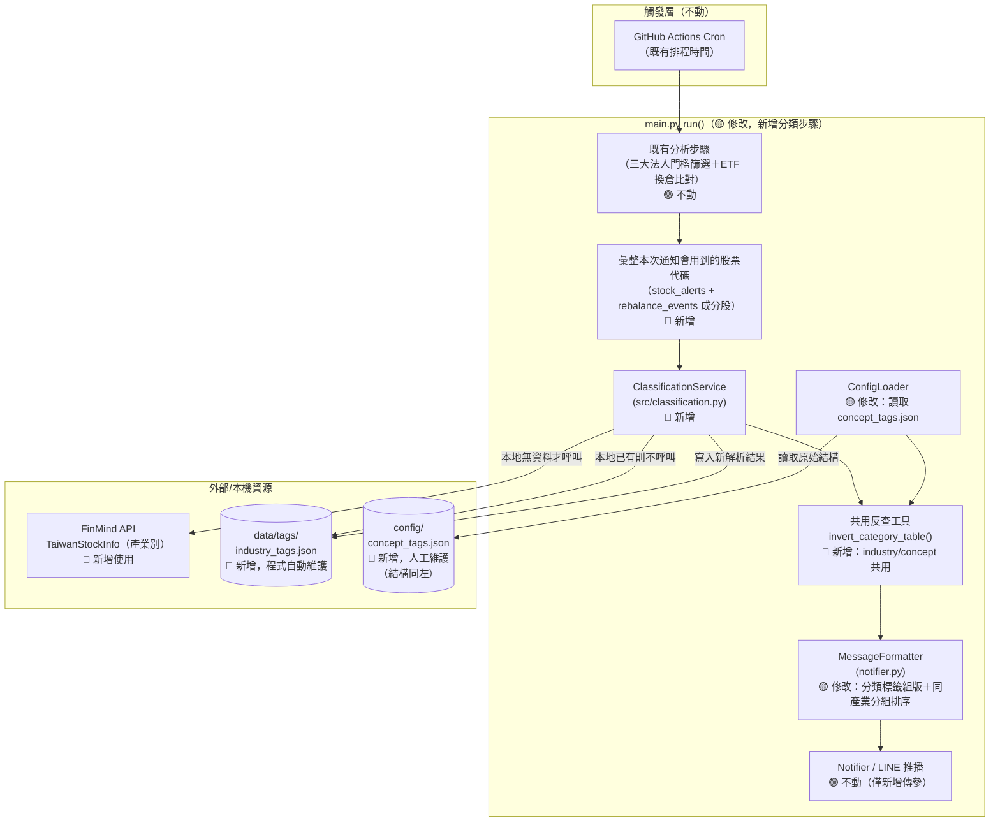
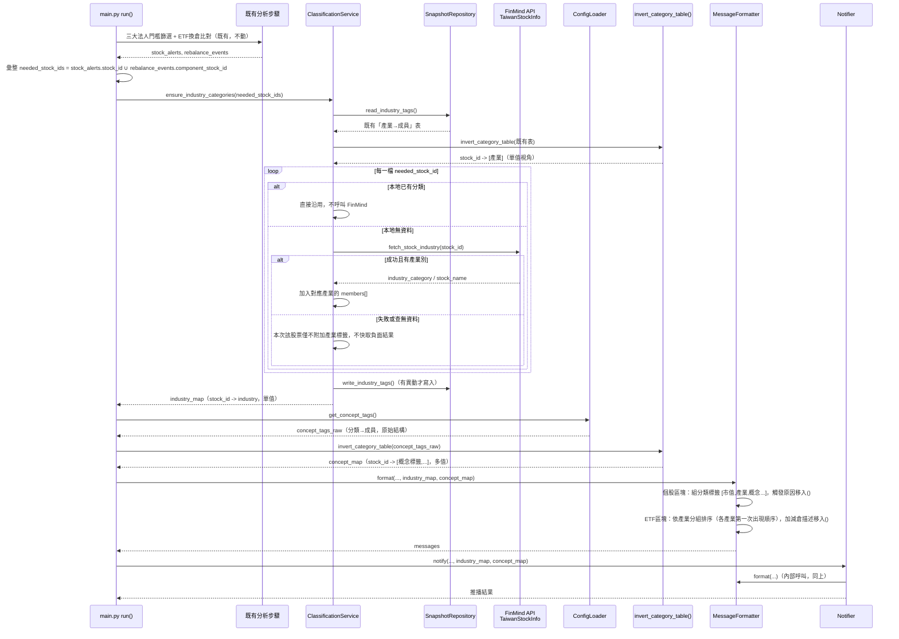

# SD-個股產業與概念分類標籤顯示-系統設計書

| 項目 | 內容 |
| :--- | :--- |
| 文件類型 | 系統設計書（SD，技術性文件，新增功能並整合進既有每日排程） |
| 設計依據 | 本次對話中使用者直接確認之最終需求（四點＋§六待確認事項確認結果），非既有 SA 文件之逐字展開 |
| 相關文件 | [SD-三大法人買賣超關注清單通知-系統設計書.md](./SD-三大法人買賣超關注清單通知-系統設計書.md)（`InstitutionalAlert` 現行結構、`MessageFormatter` 現行格式基準）、[SD-籌碼監控推播引擎-系統設計書.md](./SD-籌碼監控推播引擎-系統設計書.md)（`main.py run()` 現行流程、`RebalanceEvent` 現行結構）、[SD-股票產業主題分類清單管理-系統設計書.md](./SD-股票產業主題分類清單管理-系統設計書.md)（**本文件取代其整體架構方向**，見下方差異對照） |
| 對象讀者 | SD / 開發人員 / 維護人員 |
| 建立日期 | 2026-08-26 |
| 作者 | Claude Code（依 Roy Chiang 於對話中確認之最終需求整理） |
| 套件歸屬 | 既有專案 `FinanceTracker`，單一 Python 套件 `src/`，本次新增檔案 `src/classification.py` |

### 與前次方案的差異對照（重要，先讀這段避免誤用舊文件）

前次 [SD-股票產業主題分類清單管理-系統設計書.md](./SD-股票產業主題分類清單管理-系統設計書.md) 規劃的「主動呼叫、獨立 CLI（`--classify-sync`／`--classify-stock`）＋玩股網概念股爬蟲 `ConceptAdapter`」架構，經後續調查證實玩股網、Goodinfo、TPEx 官方「產業價值鏈資訊平台」的服務條款皆明確禁止程式化擷取，該方案**不予採用**。使用者於本次對話直接確認新方向，本文件依此重新設計，與前次方案差異如下：

| 項目 | 前次方案（不採用） | 本次方案（本文件） |
| :--- | :--- | :--- |
| 觸發時機 | 維運人員主動呼叫，獨立 CLI，不掛排程 | **整合進既有每日排程**，於 `main.py run()` 分析完成、發送通知前自動執行 |
| 產業別來源 | FinMind 主要＋TWSE OpenAPI 備援 | **僅 FinMind**，失敗則本次略過該股票的產業標籤（已確認不做雙來源備援，見§六確認結果 2） |
| 主題/概念股來源 | 玩股網爬蟲（`ConceptAdapter`／`WantgooConceptAdapter`） | **改為純人工維護**的本地設定檔，不含任何自動擷取程式 |
| 資料表方向 | 股票→分類（`STOCK_CLASSIFICATION`），另建主題→成分股快取反查 | **產業→成分股**與**概念→成分股****兩張表採同一種「分類→成員」結構**（見§二，已確認架構一致），僅儲存位置與維護方式不同（自動 vs 人工） |
| 用途 | 獨立查詢工具，未串接進通知內容 | **直接驅動每日通知內容的分類標籤與分組排序**（見§四） |

---

## 一、系統架構與部署環境

### 設計要點

| 項目 | 設計 |
| :--- | :--- |
| 執行型態 | 沿用既有無伺服器批次腳本架構；本次**不新增獨立 CLI**，而是在 `main.py run()` 既有流程中插入一個新步驟 |
| 插入時機 | 分析階段（三大法人門檻篩選＋ETF 換倉比對）完成、`MessageFormatter`／`Notifier` 呼叫之前——對應使用者需求「每日排程的最後，發送通知信前」 |
| 呼叫範圍（cache-aside） | 只針對**本次通知會用到的股票**（即 `stock_alerts` 內個股＋`rebalance_events` 內 `component_stock_id`）檢查本地是否已有分類；本地已有的**不重打 API**，只有本地沒有的才呼叫 FinMind — 對應需求 3 |
| 產業別來源精簡為單一來源 | 本次**僅使用 FinMind `TaiwanStockInfo`**，不引入 TWSE OpenAPI 備援（**已確認**，見§六確認結果 2）；FinMind 該股票查詢失敗或查無資料時，**僅該股票本次不附加產業標籤**，不影響其餘標籤（市值分級／概念標籤）正常顯示，也不快取負面結果（**已確認**，見§六確認結果 5 與§二設計要點） |
| 產業別顯示格式 | **已確認**：直接採用 FinMind 原始 `industry_category` 值，去除字尾「業」字後顯示（如「半導體業」→「半導體」），不做其他改寫；使用者先前範例（將台積電/世芯/力旺標示為「電子」）僅為示意，非實際規則（見§六確認結果 1） |
| 概念股標籤改為純人工維護，且**架構比照產業表** | 新增 `config/concept_tags.json`，**資料結構與 `data/tags/industry_tags.json` 一致**（皆為「分類名稱 → 成員清單」），差異僅在儲存位置（`config/` vs `data/tags/`）與維護方式（人工版控 vs 程式自動維護）——**已確認**，見§六確認結果 4；程式對此檔案**只讀取、不寫入、不呼叫任何外部來源** |
| 儲存策略 | 沿用既有「版控內 JSON 檔案」持久化策略：新增 `data/tags/industry_tags.json`（程式維護，整表用單一檔案，不分日期覆寫）；獨立於 `data/reference/capital_stock/` 之外——後者是既有「單一數值快取」用途，分類標籤未來可能有更多種類，故另立 `data/tags/` 資料夾存放，實作階段依使用者指示定案（原設計曾放在 `data/reference/`，後改為獨立資料夾）；新增 `config/concept_tags.json`（人工維護，結構與前者一致） |
| 密鑰管理 | 沿用既有 `FINMIND_TOKEN`，不新增憑證 |

### 架構圖



### 環境規格

沿用既有規格，本次不異動：本機開發用 `python main.py --date {日期} --dry-run` 即可預覽分類標籤效果；正式排程沿用既有 GitHub Actions。

### 安全設計

沿用既有設計：`FINMIND_TOKEN` 沿用既有環境變數；`config/concept_tags.json` 為人工維護、版控內純文字設定檔，內容為市場公開資訊（股票代碼與概念標籤文字），非個資，無安全疑慮。

---

## 二、資料模型設計

### 現行（As-Is）資料模型摘要

僅列與本次設計相關之既有結構，完整規格見 [SD-三大法人買賣超關注清單通知-系統設計書.md §二](./SD-三大法人買賣超關注清單通知-系統設計書.md#二資料模型設計)、[SD-籌碼監控推播引擎-系統設計書.md](./SD-籌碼監控推播引擎-系統設計書.md)：

| 既有結構 | 來源 | 本次是否異動 |
| :--- | :--- | :--- |
| `InstitutionalAlert`（含 `stock_id`、`market_cap_tier`） | `src/models.py` | 🟢 不動，本次僅讀取其 `stock_id` 供分類查詢用 |
| `RebalanceEvent`（含 `component_stock_id`、`event_type`、`curr_shares`、`prev_shares`、`change_pct`） | `src/models.py` | 🟢 不動，本次僅讀取其 `component_stock_id` 供分類查詢用 |
| `MessageFormatter._format_stock_alert_line` | `src/notifier.py` | 🟡 修改，見§四 |
| `MessageFormatter._format_events` | `src/notifier.py` | 🟡 修改，見§四 |
| `StockCapitalSnapshot`（`data/reference/capital_stock/{stock_id}.json`） | `src/storage.py` | 🟢 不動，僅作為「目前最新值、單檔覆寫」存放模式參考 |

### 設計要點

| 項目 | 設計 | 理由 |
| :--- | :--- | :--- |
| **兩張表共用同一種「分類→成員」結構**（已確認） | `industry_tags.json`（自動）與 `concept_tags.json`（人工）皆採**相同 schema**：以分類名稱為 key，值為 `{members: [{stock_id, stock_name}], updated_at?}`；唯一差異是前者由 `ClassificationService` 自動寫入，後者由維運人員手動編輯 | 使用者明確要求「架構上跟 industry_tags.json 一致」；統一結構後，兩者可共用同一套「分類→成員」反查/組版邏輯（`invert_category_table()`），不需要為人工維護表另寫一套解析程式 |
| 表格方向：分類→成員，非成員→分類 | 直接對應需求原文「維護本地的產業類別表，列表中資訊除了產業名稱之外，還有已知該產業的標的有哪些」；概念表亦比照辦理 | 忠實對應使用者需求的資料結構描述 |
| 「空陣列，等後續更新」的實際行為（產業表） | `industry_tags.json` 是**逐股累積建立**的反查表：某產業第一次被發現時，成員清單自然只有剛解析出的那一檔，其餘同產業的股票要等各自被查到（透過 FR-3 的 cache-aside 流程）才會陸續加入 | FinMind 沒有「查某產業有哪些成分股」的端點，只能逐股查詢後反推，這是唯一可行的建表方式，同時完全符合需求描述的字面行為 |
| Cache-aside 判斷共用反查工具，不另建索引檔 | `ClassificationService` 載入 `industry_tags.json` 後，呼叫共用的 `invert_category_table()` 在記憶體內建立一次性的 `stock_id → industry`（單值，因官方產業別互斥）反查字典；不另外落地一份「股票→產業」的索引檔 | 避免兩份檔案互相同步的風險；`industry_tags.json` 才是唯一真實來源（single source of truth）；同一份工具函式供 `concept_tags.json` 建立 `stock_id → 概念標籤陣列`（多值，因一檔股票可有多個概念）反查表 |
| 無 TTL，成功結果永久沿用 | 一旦某股票被解析出產業別並寫入，之後永遠視為有效，不重打 API；只有「從未解析成功過」的股票才會在每次需要時重新嘗試 | 官方產業別極少變動，比照前次方案已定案的「無 TTL」原則，維持設計一致性 |
| FinMind 失敗/查無資料**不快取負面結果**（已確認） | 若某股票這次呼叫 FinMind 失敗或查無 `industry_category`，本次該股票**僅不附加產業標籤**，其餘分類標籤（市值分級、概念標籤）不受影響照常顯示；`industry_tags.json` **不**留下任何「已知查無資料」的標記 | 避免暫時性失敗被誤判成永久性「這檔股票沒有產業別」；下次該股票再次出現在通知中時仍會重新嘗試 |
| `concept_tags.json` 為選填檔案 | `ConfigLoader` 載入時若此檔案不存在，視為 `{}`（無任何概念分類），**不**拋出 `ConfigError` 中止程式 | 這是全新檔案，若視為必要設定檔會讓既有未建立此檔案的環境直接無法啟動；純標籤裝飾功能不應該有能力擋下整個每日通知流程 |
| `[]` 省略規則（已確認） | 當某股票的市值分級／產業別／概念標籤**全部皆無**時，`[]` 整段省略不顯示；只要三者之中**任一項有值**（例如查無產業別但有人工標註的概念標籤），`[]` 仍會顯示、僅列出實際有的項目 | 對應使用者確認：「如果沒有產業分類，但可能會有概念分類，當沒有任何標籤的時候，才會直接省略 `[]` 不顯示」 |
| 一檔股票可同時屬於多個概念分類（已確認） | `concept_tags.json` 不限制同一檔股票只能出現在一個分類的 `members[]` 內；`invert_category_table()` 對概念表本就是「多值反查」（見§四虛擬碼），會把該股票出現過的**所有**分類名稱依序收進同一個陣列，`_classification_tags()` 再用 `extend()` 全部併入同一個 `[]` 標籤陣列，不需要額外處理。多個概念標籤彼此的先後順序＝該股票在 `concept_tags.json` 內**依序**出現於哪些分類 key 底下（依檔案內分類 key 的先後順序），維運人員可直接調整檔案內分類 key 的排列順序來控制顯示順序 | 對應使用者確認：「同一檔股票可能有多個不同的概念…若有此情境則一併列在標籤陣列 `[]` 中即可」；產業表則因官方產業別互斥，同一股票理論上只會出現在一個產業的 `members[]` 內，維持單值 |

### ERD（概念層）

```mermaid
erDiagram
    CATEGORY_TAG_TABLE ||--o{ CATEGORY_MEMBER : contains

    CATEGORY_TAG_TABLE {
        string category_name PK "分類名稱，亦為 JSON 物件的 key；產業表為官方產業別，概念表為人工命名的概念名稱"
        string updated_at "本分類成員清單最後異動時間（人工維護表此欄位選填）"
    }
    CATEGORY_MEMBER {
        string stock_id PK_FK
        string stock_name
    }
```

> 本次共有兩份實體檔案套用同一套結構：`industry_tags.json`（`data/tags/`，程式自動維護，每檔股票僅會出現在**一個**產業分類下）與 `concept_tags.json`（`config/`，人工維護，每檔股票可出現在**多個**概念分類下）。兩者除儲存位置與維護方式外，資料結構完全相同，故 ERD 合併呈現一次。

### 檔案總覽

| # | 檔案類型 | 路徑樣式 | 維護方式 | 本次動作 |
| :--- | :--- | :--- | :--- | :--- |
| 1 | **INDUSTRY_TAG（產業→成分股）** | `data/tags/industry_tags.json` | 程式自動維護（`ClassificationService`） | 🔴 新增 |
| 2 | **CONCEPT_TAG（概念→成分股）** | `config/concept_tags.json` | 人工維護，選填檔案 | 🔴 新增 |

---

### 共用結構規格（`industry_tags.json` 與 `concept_tags.json` 皆適用）

**說明：** 以分類名稱為 key 的物件，`不分日期、整份檔案覆寫`。

| # | Field Name | Description | Data Type | Length | Default | 非空值 | PK | FK | Reference | 備註 |
| :--- | :--- | :--- | :--- | :--- | :--- | :--- | :--- | :--- | :--- | :--- |
| 1 | （物件 key）category_name | 分類名稱 | string | 30 | — | Y | Y | — | — | 產業表：直接採用 FinMind `industry_category` 原始值（去尾字「業」僅在**顯示層**處理，落地儲存仍保留原始值，見§四）；概念表：維運人員自訂名稱（如「IC 設計」） |
| 2 | members | 該分類已知成員清單 | array\<object\> | — | `[]` | Y | — | — | — | 每筆 `{stock_id, stock_name}`；產業表新建立的分類自然為空陣列，見§二設計要點 |
| 3 | updated_at | 本分類成員清單最後異動時間 | string (datetime, ISO 8601) | — | — | N（產業表必填／概念表選填） | — | — | — | 產業表由程式自動填入；概念表為人工維護，此欄位是否填寫由維運人員自行決定 |

**`industry_tags.json` 範例：**
```json
{
  "半導體業": {
    "members": [
      { "stock_id": "2330", "stock_name": "台積電" },
      { "stock_id": "3661", "stock_name": "世芯-KY" },
      { "stock_id": "3529", "stock_name": "力旺" }
    ],
    "updated_at": "2026-08-26T20:05:00+08:00"
  },
  "航運業": {
    "members": [
      { "stock_id": "2603", "stock_name": "長榮" }
    ],
    "updated_at": "2026-08-26T20:05:03+08:00"
  }
}
```

**`config/concept_tags.json` 範例（結構相同，人工維護；`2330` 同時出現在兩個分類下，示範一檔股票可屬於多個概念）：**
```json
{
  "IC 製造": {
    "members": [
      { "stock_id": "2330", "stock_name": "台積電" }
    ]
  },
  "先進封裝": {
    "members": [
      { "stock_id": "2330", "stock_name": "台積電" }
    ]
  },
  "IC 設計": {
    "members": [
      { "stock_id": "3529", "stock_name": "力旺" }
    ]
  }
}
```
> 上例中 `invert_category_table()` 對 `2330` 反查結果為 `["IC 製造", "先進封裝"]`（依分類 key 在檔案內的出現順序），最終顯示為 `[半導體, 大型, IC 製造, 先進封裝]`（標籤順序見§四，產業別排最前）。

**初始建立：** `industry_tags.json` 首次執行時由程式自動建立；`concept_tags.json` 檔案不存在時視同 `{}`（見§二設計要點），維運人員可隨時新增此檔案並依上述結構填入想標註的股票，不需任何遷移步驟。

### 索引與查詢設計彙整

| 檔案/目錄設計 | 取代的查詢情境 | 對應本次需求 |
| :--- | :--- | :--- |
| `invert_category_table()` 對 `industry_tags.json` 反查（單值） | 「本地是否已有這檔股票的產業分類」判斷（cache-aside） | 需求 3 |
| `invert_category_table()` 對 `concept_tags.json` 反查（多值） | 組版時查詢該股票有哪些人工標註的概念標籤 | 需求 4 |

### 資料搬移／初始資料匯入

本文件無搬移章節：兩份檔案皆為全新檔案，首次執行前不存在為正常狀態（`industry_tags.json` 首次執行時會自動建立；`concept_tags.json` 由維運人員視需要手動建立，不建立則概念標籤功能形同未使用，不影響其餘功能）。

---

## 三、前端開發規格

**本章節不適用。** 本系統為無使用者介面的無伺服器批次腳本，本次異動僅為 LINE 推播訊息內容格式（純文字），規格已於§四列出。

---

## 四、程式元件與介面實作

### 業務邏輯（對應使用者需求 1～4，含§六確認結果）

| 需求 | 業務規則 | 程式落地方式 |
| :--- | :--- | :--- |
| 1（產業類別表維護） | 每日排程分析完成、發送通知前，針對本次通知會用到的股票，逐檔查 FinMind `TaiwanStockInfo` 取得產業別，寫入/更新 `industry_tags.json`（分類→成員結構） | `ClassificationService.ensure_industry_categories(stock_ids)`（🔴 新增）內部呼叫 `FinMindClient.fetch_stock_industry(stock_id)`（🔴 新增方法） |
| 2（分類標籤排序顯示） | 個股買賣超訊息：`[市值分級, 產業別, 概念標籤...]`；ETF 換倉訊息：`[產業別, 概念標籤...]`（不含市值分級）；同一 ETF 底下的換倉項目依產業別分組相鄰顯示，**組間順序＝清單中各產業第一次出現的順序**（已確認）；原本的加減倉文字說明移入 `()` 內 | `MessageFormatter._classification_tags()`（🔴 新增共用方法）、`_format_stock_alert_line()`（🟡 修改）、`_group_and_format_events()`（🔴 新增，取代原 `_format_events()`） |
| 3（Cache-aside，本地無資料才查；查無資料僅略過該標籤，已確認） | `ensure_industry_categories()` 內，逐股檢查反查字典是否已有該股票，已有則跳過、不呼叫 FinMind；查詢失敗或查無資料**不視為錯誤中止**，該股票本次僅不附加產業標籤 | 同上，`ensure_industry_categories()` 內部邏輯 |
| 4（概念標籤，人工維護，架構同產業表，已確認） | `concept_tags.json` 採與 `industry_tags.json` 相同的「分類→成員」結構，組版時用同一套 `invert_category_table()` 反查出該股票所屬的概念分類清單，附加在產業別標籤之後 | `ConfigLoader.get_concept_tags()`（🔴 新增，回傳原始「分類→成員」結構）、`main.py` 呼叫 `invert_category_table()` 轉為 `stock_id → 概念標籤陣列` 後傳入 `MessageFormatter` |

### 訊息格式（最終定案）

**個股買賣超（`_format_stock_alert_line`，🟡 修改）：**

```
2330 台積電 [半導體, 大型]:賣超 35.3 億元 (量能, 大額，外 +5,795 張 / 投 +184 張 / 自 +457 張)
```

- `[]` 內為**分類標籤**，順序固定為：產業別（新增，FinMind 原始值去尾字「業」，已確認）＋市值分級（既有）＋概念標籤（新增，如有）。**產業別排最前面**（追加確認）：即使個股區塊本身不像 ETF 區塊那樣實際依產業分組排列，只要標籤第一項固定放產業別，讀者掃視標籤就能一眼認出哪些股票屬於同一產業，不需要真的把清單重新排序。
- `()` 內為**觸發原因＋明細**：原本的 `量能`／`大額` 觸發標籤，改移入此處，與外資/投信/自營商明細以「，」相接。
- `[]` 內三者（市值分級／產業別／概念標籤）**全部皆無**時整段省略；任一項有值即顯示（已確認，見§二設計要點）。

**ETF 換倉動態（`_group_and_format_events`，🔴 新增，取代 `_format_events`）：**

```
◆ ETF 換倉動態
- 00985A:
  3661 世芯-KY [半導體] (新建倉 +40,000 股)
  3529 力旺 [半導體, IC 設計] (完全清倉)
  2603 長榮 [航運] (調倉減碼 -1,011,000 股，-58.2%)
```

- `[]` 內為產業別＋概念標籤（**不含市值分級**，因換倉成分股未必有市值分級資料），同§二規則，全無時省略。
- `()` 內為原本的加減倉描述：`新建倉 +{股數} 股` / `完全清倉` / `調倉{加碼|減碼} {正負股數}，{正負百分比}%`。
- **同一 ETF 內，依產業別分組相鄰顯示**，組間順序＝該 ETF 本次換倉清單中各產業**第一次出現**的順序（已確認）；同一產業內部維持原始事件順序；查無產業別的股票統一排在該 ETF 清單最後。

### 內部元件設計

| 元件 | 職責 | 異動類型 |
| :--- | :--- | :--- |
| `src/classification.py`（`ClassificationService`） | 協調「本地是否已有分類」判斷、呼叫 FinMind、寫回 `industry_tags.json` | 🔴 新增 |
| `src/classification.py`（`invert_category_table()`） | 共用工具函式：將「分類→成員」結構反轉為「股票→分類清單」，供 `ClassificationService`（industry，取單值）與 `main.py`（concept，取多值）共用 | 🔴 新增 |
| `src/fetcher.py`（`FinMindClient.fetch_stock_industry`） | 呼叫 FinMind `TaiwanStockInfo`，取得單一股票的產業別/名稱 | 🟡 修改（新增方法） |
| `src/storage.py`（`SnapshotRepository`） | 新增 `read_industry_tags()` / `write_industry_tags()` | 🟡 修改 |
| `src/config.py`（`ConfigLoader`） | 新增 `get_concept_tags()`，載入 `concept_tags.json`（選填檔案，缺省視為 `{}`），回傳原始「分類→成員」結構（不在此處反轉） | 🟡 修改 |
| `src/notifier.py`（`MessageFormatter`） | `format()` 新增 `industry_map: dict[str,str]`／`concept_map: dict[str,list[str]]` 參數（皆為已反轉之股票為主鍵結構）；新增 `_classification_tags()`；`_format_stock_alert_line()` 改版；`_format_events()` 改為 `_group_and_format_events()` | 🟡 修改 |
| `src/notifier.py`（`Notifier.notify`） | 新增 `industry_map`／`concept_map` 參數，轉呼叫 `MessageFormatter.format()` | 🟡 修改 |
| `main.py`（`run()`） | 分析完成後、格式化/推播前，新增彙整所需股票代碼、呼叫 `ClassificationService`、讀取並反轉 `concept_tags` 的步驟 | 🟡 修改 |

### 現行（As-Is）API 規格摘要

FinMind `TaiwanStockInfo` 之 Request/Response 格式已於 [SD-股票產業主題分類清單管理-系統設計書.md §四](./SD-股票產業主題分類清單管理-系統設計書.md#四程式元件與介面實作) 定義過，本次沿用同一支 API，僅呼叫時機與呼叫方改變（見下方新版時序圖），欄位定義不重複列出。

### 業務邏輯：分類標籤組版與共用反查工具（虛擬碼，供理解規則，非最終程式碼）

```python
def invert_category_table(data: dict) -> dict[str, list[str]]:
    """{分類名稱: {members: [{stock_id, stock_name}, ...]}} -> {stock_id: [分類名稱, ...]}
    industry 用途：呼叫端自行取 result.get(stock_id, [None])[0]（單值，因官方產業別互斥）
    concept 用途：呼叫端直接使用 result.get(stock_id, [])（多值，一檔股票可有多個概念）
    """
    reverse: dict[str, list[str]] = {}
    for category_name, entry in data.items():
        for member in entry.get("members", []):
            reverse.setdefault(member["stock_id"], []).append(category_name)
    return reverse
```

```python
def _classification_tags(tier_label, stock_id, industry_map, concept_map):
    # 順序固定：產業別排最前面，市值分級次之，概念標籤殿後（追加確認，見§六）
    tags = []
    industry = industry_map.get(stock_id)  # dict[str, str]，已取單值
    if industry:
        tags.append(_strip_trailing_industry_suffix(industry))  # 「半導體業」->「半導體」，僅顯示層處理
    if tier_label:
        tags.append(tier_label)
    tags.extend(concept_map.get(stock_id, []))  # dict[str, list[str]]
    return tags
```

```python
def _group_and_format_events(events, industry_map, concept_map):
    order, buckets = [], {}
    for e in events:
        key = industry_map.get(e.component_stock_id) or ""  # "" = 查無產業別，統一放最後
        if key not in buckets:
            buckets[key] = []
            order.append(key)
        buckets[key].append(e)
    if "" in order:
        order.remove("")
        order.append("")
    return [
        _format_single_event(e, industry_map, concept_map)
        for key in order
        for e in buckets[key]
    ]
```

### 時序圖：`main.py run()` 新增分類步驟



---

## 五、維護與例外處理

### 錯誤碼彙整

| 代碼 | 觸發情境 | 對應處理方式 |
| :--- | :--- | :--- |
| **`CLASSIFY_INDUSTRY_FINMIND_ERROR`**（🔴 新增） | `FinMindClient.fetch_stock_industry` 呼叫逾時/例外 | 記錄 Log，該股票本次僅不附加產業標籤（已確認），不快取負面結果，下次仍會重試 |
| **`CLASSIFY_INDUSTRY_NO_DATA`**（🔴 新增） | FinMind 回應成功但查無該股票資料或 `industry_category` 為空 | 記錄 Log，同上處理，不快取負面結果 |
| **`CLASSIFY_CONCEPT_CONFIG_INVALID`**（🔴 新增） | `config/concept_tags.json` 存在但 JSON 格式錯誤 | 記錄 WARNING，本次視為 `{}`（無概念標籤），**不中止**整體每日排程（此為選填裝飾功能，格式錯誤不應讓通知推播失敗） |

### 排程／SP 清單

本次無新增排程：僅在既有 `main.py run()` 內新增一個步驟，執行時機與頻率完全跟隨既有每日排程（`.github/workflows/daily-chip-monitor.yml`，不異動）。本專案無資料庫，故無 Stored Procedure。

### 例外處理原則

| 情境 | 處理策略 |
| :--- | :--- |
| FinMind 產業別查詢全部失敗（如當日 FinMind 服務中斷） | 本次所有股票皆略過產業標籤，仍顯示市值分級（個股區塊）與概念標籤（如有）；ETF 區塊此時同產業分組退化為全部歸在「查無產業別」的單一群組；**不影響通知照常發送** |
| `industry_tags.json` 檔案損毀（JSON 格式錯誤） | 視為空表（`{}`）重新開始累積，記錄 WARNING；不因既有快取損毀而中止排程 |
| `concept_tags.json` 缺少某已標註股票 | 該股票的概念標籤部分不顯示，不影響產業別標籤正常顯示 |

---

## 六、待確認事項

| # | 項目 | 待誰確認 | 確認結果 |
| :--- | :--- | :--- | :--- |
| 1 | 產業別顯示是否統一去除字尾「業」 | Roy Chiang | **已確認，去除字尾「業」，直接採用 FinMind 原始值去尾字**；先前範例（電子）僅為示意，非實際規則 |
| 2 | 是否需要 TWSE OpenAPI 備援 | Roy Chiang | **已確認，不加備援**；FinMind 查無資料時該股票僅不附加產業標籤 |
| 3 | 同一 ETF 內「同產業分組」的組間排序規則 | Roy Chiang | **已確認，採「清單中各產業第一次出現的順序」** |
| 4 | `concept_tags.json` 的維護方式與資料結構 | Roy Chiang | **已確認：先直接編輯 JSON 檔並 commit；資料結構須與 `industry_tags.json` 一致**（分類→成員），本文件已依此調整（見§二） |
| 5 | 完全查無任何分類的股票，`[]` 是否省略 | Roy Chiang | **已確認：只有市值分級／產業別／概念標籤三者皆無時才省略 `[]`；若有產業分類但無概念分類（或反之），`[]` 仍需顯示已知項目** |
| 6（實作完成後追加） | `[]` 內分類標籤的排列順序 | Roy Chiang | **已確認，改為「產業別 → 市值分級 → 概念標籤」**（原設計為「市值分級 → 產業別 → 概念標籤」）；理由：產業別排最前面，即使個股區塊未實際依產業分組排列，掃視標籤第一項也能一眼看出哪些股票屬於同一產業，跟 ETF 區塊「依產業分組相鄰顯示」的視覺邏輯一致 |

---

## 七、來源檔案索引

- [SD-三大法人買賣超關注清單通知-系統設計書.md](./SD-三大法人買賣超關注清單通知-系統設計書.md)（`InstitutionalAlert`、市值分級 `MarketCapTier` 現行結構依據）
- [SD-籌碼監控推播引擎-系統設計書.md](./SD-籌碼監控推播引擎-系統設計書.md)（`main.py run()`、`RebalanceEvent` 現行結構依據）
- [SD-股票產業主題分類清單管理-系統設計書.md](./SD-股票產業主題分類清單管理-系統設計書.md)（FinMind `TaiwanStockInfo` API 規格沿用來源；整體架構方向已由本文件取代，見文件開頭差異對照）
- `f:\projects\FinanceTracker\src\fetcher.py`（`FinMindClient` 現行實作，待新增 `fetch_stock_industry`）
- `f:\projects\FinanceTracker\src\notifier.py`（`MessageFormatter` 現行 `_format_stock_alert_line`／`_format_events` 實作，待依§四改版）
- `f:\projects\FinanceTracker\src\storage.py`（`SnapshotRepository` 現行股本快取存放模式參考，待新增分類表讀寫方法）
- `f:\projects\FinanceTracker\src\config.py`（`ConfigLoader` 現行設定檔載入模式，待新增 `concept_tags.json` 選填載入邏輯）
- `f:\projects\FinanceTracker\main.py`（現行 `run()` 流程，待依§四插入分類步驟）
- `f:\projects\FinanceTracker\config\watchlist.json`、`thresholds.json`（現行設定檔範例，`concept_tags.json` 檔案慣例參考）
