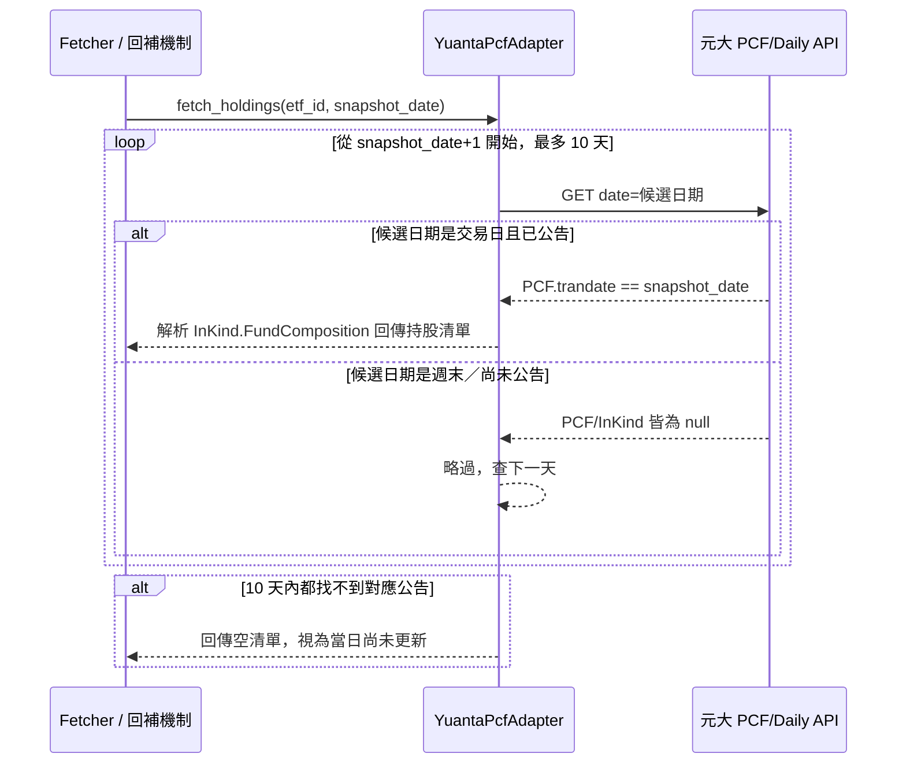

# SD-元大投信PCF公告日期機制-系統設計書

| 項目 | 內容 |
| :--- | :--- |
| 文件類型 | 系統設計書（SD，技術性文件，既有系統之異動設計） |
| 設計依據 | 本文件非典型「SA 先行」流程產出，設計依據為 Roy Chiang 於 2026-08-21 對元大投信 `PCF/Daily` API 提出質疑「`trandate` 應該是指前一個交易日的日期？」，經實測 6 組真實查詢資料後確認為真，並延伸修正 `YuantaPcfAdapter` 的查詢邏輯 |
| 相關文件 | [SD-ETF換倉歷史日期回補機制-系統設計書.md](./SD-ETF換倉歷史日期回補機制-系統設計書.md)（元大於該文件第五～六輪被暫定為分類 C「可安全回補」，本文件為該判斷的技術修正與細節補完，兩份文件需合併理解元大的完整結論）、[SD-ETF換倉資料來源方案評估-投信官網爬蟲-系統設計書.md](./SD-ETF換倉資料來源方案評估-投信官網爬蟲-系統設計書.md)（元大原始 HTML／Nuxt 解析設計，本文件之異動已完全取代其查詢邏輯） |
| 對象讀者 | SD／開發人員／維護人員 |
| 建立日期 | 2026-08-21 |
| 作者 | Claude Code（依 Roy Chiang 確認之設計方向整理） |
| 套件歸屬 | 既有專案 `FinanceTracker`，單一 Python 套件 `src/`；本次異動僅集中於 `src/issuer_pcf/yuanta.py` 與對應測試檔案 `tests/test_issuer_pcf_yuanta.py` |

### 異動歷程

| 輪次 | 內容摘要 |
| :--- | :--- |
| 第一輪 | 建立本文件。針對 Roy Chiang 提出的「元大 `trandate` 是否為前一交易日」疑問，實際呼叫 `PCF/Daily` API 6 組不同日期（含平日與跨週末）驗證，確認查詢參數 `date` 語意是「公告日」而非「收盤持股日」，`trandate` 恆為 `date` 的前一個交易日；據此將 `YuantaPcfAdapter.fetch_holdings()` 的查詢邏輯改為「往 `snapshot_date` 後面找下一個交易日的公告」，取代原本「直接查 `snapshot_date` 本身」的錯誤假設，並同步改寫對應測試（7 個測試案例，全數通過），全專案測試套件維持 124 個全數通過 |

---

## 問題重現與根因拆解

### 問題起因

[SD-ETF換倉歷史日期回補機制-系統設計書.md](./SD-ETF換倉歷史日期回補機制-系統設計書.md) 第五、六輪將元大改採 `PCF/Daily` API（取代原 HTML／Nuxt 解析），並將其歸類為「可安全回補」，比對邏輯沿用最初的假設：**查詢日期 `date` 應該等於回應內容的 `trandate`**。2026-08-21 實際上線測試（`--date 2026-08-11`，真實查詢時間為 2026-08-21）時，元大回應 `trandate=20260810`，與查詢日期 `20260811` 對不上，被判定「當日尚未更新」。Roy Chiang 對此提出關鍵疑問：這是否代表 `trandate` 本質上就是「前一個交易日」，而不是巧合或資料保留天數不足？

### 實測驗證（2026-08-21，共 6 組真實查詢）

直接呼叫 `GET https://etfapi.yuantaetfs.com/ectranslation/api/bridge?...FuncId=PCF/Daily&ticker=0050&date={date}`：

| 查詢 `date` | 星期 | 回應 `trandate` | 星期 | 回應 `anndate` | 說明 |
| :--- | :--- | :--- | :--- | :--- | :--- |
| 2026-08-19 | 三 | 2026-08-18 | 二 | 2026-08-19 | 前一交易日 |
| 2026-08-20 | 四 | 2026-08-19 | 三 | 2026-08-20 | 前一交易日 |
| 2026-08-21（真實今天） | 四 | 2026-08-20 | 三 | 2026-08-21 | 連查「今天」也是前一交易日 |
| 2026-08-22（明天，尚未發生） | 五 | `null` | — | `null` | 尚未公告，正確回空值，非誤給舊資料 |
| 2026-08-14 | 五 | 2026-08-13 | 四 | 2026-08-14 | 前一交易日 |
| 2026-08-15／16 | 六／日 | `null` | — | `null` | 週末無公告，正確回空值 |
| 2026-08-17 | 一 | **2026-08-14**（五） | — | 2026-08-17 | **正確跳過週末**，抓到上一個「交易日」而非單純減一天 |

**結論：完全證實 Roy Chiang 的假設。** `date` 查詢參數的語意是「這份 PCF 公告要給哪一天使用」，`trandate`（實際收盤持股日）恆為 `date` 的**前一個交易日**——這是 PCF（申購／買回清單）產業慣例：每個交易日收盤後結算，隔一個交易日開盤前才公告使用，`date` 當天盤都還沒開，只能用前一天收盤的部位去算。額外發現：公告資料約在**前一天下午 16:30～17:00** 左右結算完成（回應 `upddate` 欄位落在 16:35～16:59 區間），且官網對週末／未來日期會正確回傳全 `null` 的合法 JSON（非錯誤、非隨便給舊資料），證明 `date` 參數是被官網真實用來過濾資料的，不是裝飾用或巧合命中。

### 根因

[yuanta.py](../../../src/issuer_pcf/yuanta.py) 原本的比對邏輯 `trandate != snapshot_date.replace("-", "")` 假設「查詢日 = 收盤持股日」，但依上述驗證，這兩者恆差一個交易日。此假設錯誤導致：**元大的每一次查詢（不論是日常抓取還是回補）都會系統性地判定為「當日尚未更新」而回傳空清單**，即使官網當下確實有可用資料——因為程式一直在拿「查詢日期本身」去對，而不是「查詢日期的下一個交易日」。這不是資料保留天數不足或網站不穩定的問題，是查詢方向從一開始就反了。

---

## 一、系統架構與部署環境

### 設計要點

| 項目 | 設計 |
| :--- | :--- |
| 異動範圍 | 僅 `YuantaPcfAdapter.fetch_holdings()` 的查詢邏輯，不影響其他投信 Adapter、`Fetcher`、`main.py` 的呼叫介面（`fetch_holdings(etf_id, snapshot_date)` 簽章完全不變） |
| 核心機制 | 新增「往後找公告日」：不再直接用 `snapshot_date` 查詢，改為從 `snapshot_date` 隔天開始逐日查詢（上限 10 天，涵蓋連假），直到找到 `trandate` 剛好等於 `snapshot_date` 的那份公告為止；查到週末／未公告日期時官網回傳全 `null`，視為「這天跳過，查下一天」，非錯誤 |
| 請求量影響 | 正常情況下只需 1～2 次請求（`snapshot_date` 隔天多半就是下一個交易日）；遇到連續假期（如農曆春節）才會逼近上限的 10 次請求，仍是一次性、有界的，不會無限重試 |
| 與既有回補機制的關係 | `YuantaPcfAdapter.SUPPORTS_BACKFILL = True` 維持不變（見 [SD-ETF換倉歷史日期回補機制-系統設計書.md](./SD-ETF換倉歷史日期回補機制-系統設計書.md) 第五輪），本次修正的是「查詢邏輯本身要往後找一天」這個更基礎的正確性問題，回補機制呼叫 `fetch_holdings()` 的方式不需要跟著改 |

### 時序圖：查詢 snapshot_date 當天收盤持股的實際流程

### 環境規格

沿用既有規格，本次無新增相依套件、無新增憑證／環境變數，`truststore.inject_into_ssl()` 沿用不動。

### 安全設計

沿用既有規格，無異動；本次修正純粹是查詢邏輯正確性問題，不涉及認證或資料外洩風險。

---

## 二、資料模型設計

**本文件無異動。** `EtfHoldingRecord` 結構、`_meta.json` 結構、`SUPPORTS_BACKFILL` 屬性宣告皆已在 [SD-ETF換倉歷史日期回補機制-系統設計書.md](./SD-ETF換倉歷史日期回補機制-系統設計書.md) 第五、七輪處理完畢，本次不重複異動；`fetch_holdings()` 的輸出格式（`component_stock_id`／`component_name`／`holding_shares`）完全不變，下游 `Fetcher`／`RebalanceClassifier` 不需感知這次修正。

---

## 三、前端開發規格

**本章節不適用。** 本系統為無使用者介面的批次腳本，本次異動不涉及任何畫面。

---

## 四、程式元件與介面實作

### 業務邏輯

| 異動項目 | 業務規則 | 程式落地方式 |
| :--- | :--- | :--- |
| 元大查詢邏輯改為「往後找公告日」 | 要拿到 `snapshot_date` 當天的收盤持股，改查 `snapshot_date` 之後最近一個「公告內容剛好對上 `snapshot_date`」的日期，而不是直接查 `snapshot_date` 本身；查到週末／尚未公告的日期時，官網回應會是全 `null` 的合法 JSON，視為略過繼續找下一天，不是錯誤 | `YuantaPcfAdapter._find_announcement_for()`（🔴 新增），取代原本 `fetch_holdings()` 內直接呼叫 `_fetch_pcf_daily(etf_id, snapshot_date)` 後比對 `trandate` 的方式 |

### 內部元件設計

| 元件 | 職責 | 異動類型 |
| :--- | :--- | :--- |
| `src/issuer_pcf/yuanta.py`（`YuantaPcfAdapter.fetch_holdings`） | 呼叫 `_find_announcement_for()` 取得對應公告，解析 `InKind.FundComposition` 為持股清單；找不到對應公告時回傳空清單 | 🟡 修改 |
| `src/issuer_pcf/yuanta.py`（`YuantaPcfAdapter._find_announcement_for`） | 從 `snapshot_date` 隔天開始逐日查詢（上限 `_ANNOUNCEMENT_LOOKAHEAD_DAYS_MAX = 10` 天），找到 `PCF.trandate == snapshot_date` 的公告即回傳，全部落空則回傳 `None` | 🔴 新增 |
| `src/issuer_pcf/yuanta.py`（`YuantaPcfAdapter._fetch_pcf_daily`） | 呼叫 `PCF/Daily` API 並回傳原始 JSON；只在回應**不是合法字典**時才視為異常拋出 `FETCH_ISSUER_PCF_PARSE_ERROR`（週末／未公告日期回傳全 `null` 欄位的合法字典不算異常） | 🟡 修改（原本會誤判「找不到 `PCF` 這個 key」為異常，但週末回應其實有 `PCF` key、值是 `null`，已修正判斷條件） |
| `src/issuer_pcf/yuanta.py`（`_ANNOUNCEMENT_LOOKAHEAD_DAYS_MAX`） | 模組層常數，逐日往後查詢公告日的天數上限，預設 10（涵蓋農曆春節等長假），與 `src/fetcher.py` 的 `_BACKFILL_LOOKBACK_DAYS_MAX` 概念類似但各自獨立、不共用常數 | 🔴 新增 |

### 呼叫時機彙整

不新增外部端點，僅單次 `fetch_holdings()` 呼叫內部可能產生的請求次數從固定 1 次改為「1～10 次不等」（視 `snapshot_date` 隔天是否直接就是下一個交易日而定），呼叫時機（何時被 `Fetcher`／回補機制呼叫）完全不變。

---

## 五、維護與例外處理

### 錯誤碼彙整

| 代碼 | 觸發情境 | 對應處理方式 |
| :--- | :--- | :--- |
| `FETCH_ISSUER_PCF_PARSE_ERROR`（既有，語意微調） | ①`_fetch_pcf_daily()` 回應本身不是合法 JSON 物件（非上述週末/未公告的正常空值情況）；②往後找了 `_ANNOUNCEMENT_LOOKAHEAD_DAYS_MAX` 天後仍找到公告但 `InKind.FundComposition` 缺失 | 拋出例外，交由 `Fetcher` 記錄為該 ETF 本次抓取失敗，沿用既有「單一投信失敗不中斷全局」原則 |
| （無新增代碼）往後找 10 天仍找不到對應公告 | `_find_announcement_for()` 逐日查詢後仍找不到 `trandate == snapshot_date` 的公告 | 記錄 Log 說明「找不到反映該日收盤持股的公告檔案」，回傳空清單，視為當日尚未更新（非錯誤），與其餘投信「查無資料」的既有語意一致，不特別新增代碼 |

### 排程／SP 清單

本文件無排程/SP 異動。本專案無資料庫，無 Stored Procedure。

### 例外處理原則

| 情境 | 處理策略 |
| :--- | :--- |
| 逐日查詢過程中單次請求失敗（逾時／例外） | 目前 `_fetch_pcf_daily()` 內的例外會直接往外拋，中斷整個 `_find_announcement_for()` 迴圈；沿用既有「單一投信失敗不中斷全局」原則，由 `Fetcher._fetch_etf_holdings()` 外層的 try/except 捕捉，該 ETF 本次略過，不影響其他 ETF。**待確認**：是否要讓迴圈內單次請求失敗改為略過繼續查下一天（見待確認事項） |
| 深度歷史查詢 | 本次修正不改變「回補範圍界線」的既有結論（見 [SD-ETF換倉歷史日期回補機制-系統設計書.md](./SD-ETF換倉歷史日期回補機制-系統設計書.md)），`_ANNOUNCEMENT_LOOKAHEAD_DAYS_MAX` 只解決「查詢日的下一個交易日在哪」這個有界問題，不是深度歷史回補的手段 |

---

## 六、待確認事項

| # | 項目 | 待誰確認 | 確認結果 |
| :--- | :--- | :--- | :--- |
| 1 | 正式排程（GitHub Actions，週一至週五 18:00 執行、`target_date` 預設為當天）是否真的能在 18:00 前取得「當天」的公告——依實測公告約在前一天 16:30～17:00 結算，要拿到「今天」的收盤持股，`_find_announcement_for()` 會查「明天」的公告，而「明天」的公告是**今天傍晚**才會發布；18:00 執行理論上該公告已就緒，但實際 GitHub Actions 執行時間與官網實際發布時間都有微小浮動，尚未在正式排程環境驗證過 | Roy Chiang／開發人員 | 待確認，建議觀察未來幾次正式排程執行結果 |
| 2 | Roy Chiang 提出的「排程改成隔天早上 8:45、`target_date` 改為前一交易日」方案，能提供更寬鬆的資料就緒時間margin，且讓使用者在開盤前收到通知，時效性更好；但範圍涉及 `.github/workflows/daily-chip-monitor.yml` 排程時間、`main.py` 的 `target_date` 預設邏輯、FinMind 等其他資料源在該時間點的就緒狀況、LINE 訊息文案調整，範圍已超出本文件（僅聚焦元大查詢邏輯正確性），**建議另立文件評估** | Roy Chiang | 待確認，非本次阻塞項 |
| 3 | `_find_announcement_for()` 迴圈內單次請求失敗時，目前設計是直接中斷整個查找、該 ETF 本次抓取失敗；是否要改成「這天請求失敗，當作沒查到，繼續查下一天」以提高容錯，但這樣可能讓單一請求失敗被誤判成「查無公告」而非「網路問題」，兩種語意在 log 上要分清楚 | 開發人員 | 待確認 |
| 4 | `_ANNOUNCEMENT_LOOKAHEAD_DAYS_MAX = 10` 是否要與 `src/fetcher.py` 的 `_BACKFILL_LOOKBACK_DAYS_MAX = 10` 保持同步調整（兩者目前數值相同但各自獨立宣告，互不影響） | Roy Chiang | 待確認，本次沿用相同數值僅為巧合方便記憶，非強制耦合設計 |

---

## 七、來源檔案索引

- [SD-ETF換倉歷史日期回補機制-系統設計書.md](./SD-ETF換倉歷史日期回補機制-系統設計書.md)（元大回補能力矩陣判斷之上游文件，兩份文件合併理解）
- [SD-ETF換倉資料來源方案評估-投信官網爬蟲-系統設計書.md](./SD-ETF換倉資料來源方案評估-投信官網爬蟲-系統設計書.md)（元大原始 HTML／Nuxt 解析設計，已被本次異動取代）
- `f:\projects\FinanceTracker\src\issuer_pcf\yuanta.py`（現行實作，本次異動標的）
- `f:\projects\FinanceTracker\tests\test_issuer_pcf_yuanta.py`（現行測試，本次已同步改寫，7 個測試案例全數通過）
