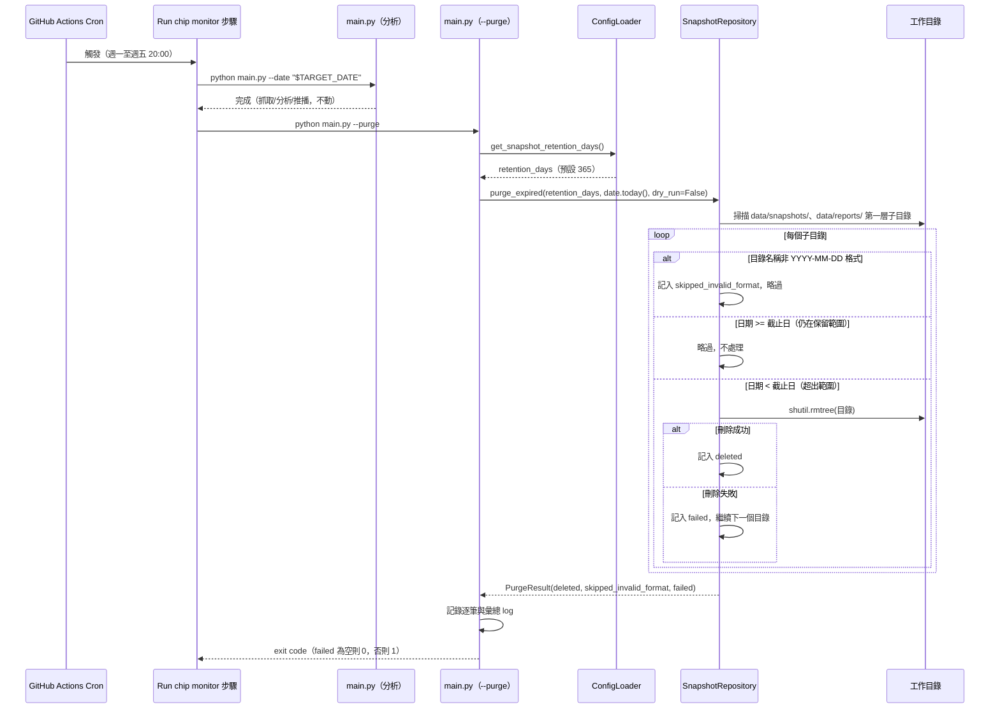

# SD-快照資料保留清除機制-系統設計書

| 項目 | 內容 |
| :--- | :--- |
| 文件類型 | 系統設計書（SD，技術性文件，既有系統之新增能力） |
| 設計依據 | [SA-快照資料保留清除機制-功能模組分析.md](../../analysis/requirements/SA-快照資料保留清除機制-功能模組分析.md) |
| 相關文件 | [SD-籌碼監控推播引擎-系統設計書.md](./SD-籌碼監控推播引擎-系統設計書.md)（`main.py`／`src/storage.py` 現行設計）、[SD-每日通知改為隔日晨間執行-系統設計書.md](./SD-每日通知改為隔日晨間執行-系統設計書.md)（現行排程時間 20:00 之依據） |
| 對象讀者 | SD／開發人員／維運人員 |
| 建立日期 | 2026-08-24 |
| 作者 | Claude Code（依 Roy Chiang 確認之設計方向整理） |
| 套件歸屬 | 既有專案 `FinanceTracker`，單一 Python 套件 `src/`；本次不新增子套件，異動集中於 `src/storage.py`／`src/config.py`／`main.py`／`.github/workflows/daily-chip-monitor.yml`／`scripts/run.sh` |

### 與 SA 文件的關鍵差異對照

Roy Chiang 於 SD 階段對 SA 文件 §六 待確認事項給出兩項明確決策，**與 SA 文件原始設計有一處實質差異**，特此對照如下：

| SA 待確認事項 | SA 原始傾向 | 本文件決策 | 對應章節 |
| :--- | :--- | :--- | :--- |
| 保留天數是否設定化 | 建議設定化，未定案 | **確認採用**：放入 `config/thresholds.json` | §二 |
| 是否需要獨立的手動清除指令 | 留待 SD 階段依需求決定是否納入 | **確認需要，且與 SA 原設計不同**：SA 原設計是「排程流程尾端、`run()` 內自動觸發」（見 SA §3.2 FR-2.1）；**本文件改為清除與分析完全脫鉤，各自是獨立指令**（`main.py --purge`），排程只是「透過腳本依序呼叫兩個指令」，不是分析流程內部的一個步驟。改動原因：分析（抓取/比對/推播）與清除（工作目錄生命週期管理）是兩種完全不同性質的操作，耦合在同一個 `run()` 函式內，會讓「只想手動清一次」或「只想跑一次分析、不想動到檔案」的情境都做不到，分開後兩者可獨立測試、獨立失敗、獨立在指令列呼叫 | §四 |

---

## 一、系統架構與部署環境

### 設計要點

| 項目 | 設計 |
| :--- | :--- |
| 執行型態 | 沿用既有無伺服器批次腳本架構；新增一個**獨立於分析流程之外**的 CLI 進入點旗標 `main.py --purge`，本次不新增獨立的 `.py` 檔案（維持單一 `main.py` 進入點＋旗標區分行為的既有慣例，與 `--dry-run` 同一種設計語言） |
| 觸發方式 | 沿用既有 GitHub Actions 排程（週一至週五台灣 20:00），於同一個 workflow 步驟的 shell script 內，**依序呼叫兩個獨立指令**：`python main.py --date "$TARGET_DATE"`（分析）→ `python main.py --purge`（清除）；本機開發亦可透過 `scripts/run.sh` 新增的 `purge` 模式單獨觸發，不需要跑完整分析流程 |
| 新增相依套件 | 無，`shutil.rmtree`／正規表示式皆為 Python 標準函式庫 |
| 密鑰管理 | 不涉及外部服務呼叫，不需新增環境變數／GitHub Secrets |
| 安全設計 | 刪除範圍嚴格限制在 `data/snapshots/`／`data/reports/` 底下，且目錄名稱須完全符合 `YYYY-MM-DD` 格式才會被視為候選（見 §四業務邏輯）；`--dry-run` 可與 `--purge` 併用，僅預覽不實際刪除，供上線前／每次調整保留天數後之驗證用途 |

### 架構圖

```mermaid
flowchart TD
    subgraph Trigger["觸發層"]
        CRON["GitHub Actions Cron\n週一至週五 台灣 20:00"]
        MANUAL["scripts/run.sh purge\n（本機手動觸發，🔴 新增模式）"]
    end

    subgraph Workflow["daily-chip-monitor.yml「Run chip monitor」步驟"]
        RUN1["python main.py --date \"$TARGET_DATE\"\n🟢 不動"]
        RUN2["python main.py --purge\n🔴 新增，獨立第二道指令"]
    end

    subgraph MainPy["main.py"]
        ARGPARSE["parse_args()\n🟡 修改，新增 --purge 旗標"]
        RUNFN["run()（抓取/分析/推播）\n🟢 不動"]
        PURGEFN["run_purge()\n🔴 新增"]
    end

    subgraph Core["核心元件"]
        CFG["ConfigLoader\n🟡 修改，新增 get_snapshot_retention_days()"]
        STORAGE["SnapshotRepository\n🟡 修改，新增 purge_expired()"]
    end

    subgraph FS["工作目錄"]
        SNAP["data/snapshots/{date}/\n🟡 受清除影響"]
        REPORT["data/reports/{date}/\n🟡 受清除影響"]
        REF["data/reference/\n🟢 不受影響"]
    end

    CRON --> RUN1 --> RUN2
    MANUAL --> PURGEFN
    RUN1 --> RUNFN
    RUN2 --> ARGPARSE --> PURGEFN
    PURGEFN --> CFG
    PURGEFN --> STORAGE
    STORAGE -->|掃描並刪除超出保留期限之目錄| SNAP
    STORAGE -->|掃描並刪除超出保留期限之目錄| REPORT
    STORAGE -.不觸碰.-> REF
```

### 環境規格

沿用既有規格，不需額外環境設定；`--purge` 在本機開發（Dev）與正式排程（Prod）皆以相同方式呼叫，差異僅在資料量（Dev 通常較少歷史資料，實際刪除數量可能為 0）。

---

## 二、資料模型設計

### 現行（As-Is）資料模型摘要

僅列與本次設計相關之既有結構，完整規格見 [SD-籌碼監控推播引擎-系統設計書.md §二](./SD-籌碼監控推播引擎-系統設計書.md)：

| 既有結構 | 路徑 | 本次是否異動 |
| :--- | :--- | :--- |
| `DAILY_SNAPSHOT` 與各 `*_RECORD` 快照 | `data/snapshots/{date}/` | 🟢 結構不動，僅其**生命週期**（超出保留期限後整個日期目錄被刪除）受影響 |
| `REBALANCE_EVENT`／`INSTITUTIONAL_ALERT`／`NOTIFICATION_LOG` | `data/reports/{date}/` | 🟢 結構不動，生命週期同上 |
| `STOCK_CAPITAL_SNAPSHOT`（股本快取） | `data/reference/capital_stock/{stock_id}.json` | 🟢 完全不動，明確排除於清除範圍之外（見 SA §一） |
| `config/thresholds.json` | — | 🟡 `default` 區塊新增一個鍵 |

### 設計要點

| 項目 | 設計 | 理由 |
| :--- | :--- | :--- |
| 新增設定項 | `thresholds.json.default.snapshot_retention_days`（整數，預設 365） | 呼應 SD 階段決策「應該放入 thresholds」；比照既有 `etf_holding_drop_pct` 選填欄位的模式，**未設定時仍有預設值可運作**，不強制要求既有設定檔立即補上此欄位、不會讓既有部署因升級程式碼就啟動失敗 |
| 新增回傳結構 `PurgeResult` | 放在 `src/models.py`，與其餘共用資料結構同一檔案；欄位為 `cutoff_date: str`／`deleted: list[str]`／`skipped_invalid_format: list[str]`／`failed: list[tuple[str, str]]`（路徑＋錯誤訊息） | `PurgeResult` 由 `SnapshotRepository` 產生、由 `main.py` 消費（記錄 log／組出摘要），是跨模組共用的回傳型別，符合 `models.py` 既有定位；**不落地成快照檔案**，純粹是單次執行的記憶體內回傳值（呼應 SA NFR「清除紀錄不需要另外落地存檔，避免遞迴複雜度」） |
| 目錄名稱驗證規則 | 正規表示式 `^\d{4}-\d{2}-\d{2}$`，且能被 `date.fromisoformat()` 正確解析（排除如 `9999-99-99` 這種格式對但值不合法的情況） | 對應 SA §一「非日期格式目錄一律略過」原則；同時擋掉「格式像日期但值不合法」與「格式根本不像日期」兩種情況 |
| 截止日計算 | `cutoff = (date.today() - timedelta(days=retention_days)).isoformat()`，字串比較 `目錄名稱 < cutoff` 即視為超出範圍 | 沿用 `find_previous_trading_day()` 既有「`YYYY-MM-DD` 字典序等於時間序」慣例，不需額外的日期物件比較 |

### ERD（概念層，本次影響範圍）

本次**不新增任何持久化資料表／檔案結構**，僅新增一個純記憶體內的回傳型別（`PurgeResult`）與一項設定值，因此不繪製 ERD；既有 `DAILY_SNAPSHOT` 與各快照/報告實體間的關聯完全不受影響。

---

## 三、前端開發規格

**本章節不適用。** 沿用原 SD 文件說明：本系統為無使用者介面的無伺服器批次腳本，本次異動不涉及任何畫面。

---

## 四、程式元件與介面實作

### 業務邏輯（對應 SA 文件方案內容）

| 異動項目 | 業務規則 | 程式落地方式 |
| :--- | :--- | :--- |
| 清除指令與分析指令脫鉤 | `--purge` 旗標存在時，**只執行清除、完全不執行抓取/分析/推播**，且忽略 `--date`（清除的截止日永遠以執行當下 `date.today()` 為基準，與 `--date` 語意無關，見 SA §一） | `main.py::main()` 在 `parse_args()` 之後優先檢查 `args.purge`，成立則呼叫新的 `run_purge()` 並直接回傳，不進入既有 `_parse_target_date()`／`run()` 流程 |
| 保留範圍判斷 | 掃描 `data/snapshots/` 與 `data/reports/` 第一層子目錄，僅完全符合 `YYYY-MM-DD` 格式者納入比對；日期 < 截止日（`today - retention_days`）即判定超出範圍 | `SnapshotRepository.purge_expired(retention_days, as_of_date, dry_run)`（🔴 新增） |
| `--dry-run` 不觸發實際刪除 | `--purge --dry-run` 併用時，`purge_expired()` 仍完整跑過掃描與判斷邏輯，但改為只記錄「本次會清除」清單，不呼叫 `shutil.rmtree` | 同上方法內以 `dry_run` 參數分流，兩種模式共用同一套掃描/判斷邏輯，避免 dry-run 與正式執行的判斷結果不一致 |
| 單一目錄刪除失敗容錯 | 單一目錄 `shutil.rmtree` 失敗只記錄該筆失敗、繼續處理其餘目錄，不中斷整個 `--purge` 執行 | `purge_expired()` 內以 `try/except OSError` 包住單次刪除，失敗累加進 `PurgeResult.failed`，迴圈繼續 |
| 執行結果彙總記錄 | `--purge` 執行完畢記錄一筆彙總 log（清除數／略過數／失敗數），逐筆刪除/略過/失敗也各自記一行明細 log | `main.py::run_purge()`（🔴 新增），依 `PurgeResult` 內容逐一 `logger.info`/`logger.warning`，`SnapshotRepository` 本身不含 `logger`（沿用既有分工：`storage.py` 純 I/O、由呼叫端決定如何記錄） |
| 保留天數讀取 | 讀 `thresholds.json.default.snapshot_retention_days`，未設定時預設 365 | `ConfigLoader.get_snapshot_retention_days() -> int`（🔴 新增） |
| 排程同時觸發兩個指令 | 既有 GitHub Actions「Run chip monitor」步驟的 shell script 內，於 `python main.py --date "$TARGET_DATE"` 之後追加一行 `python main.py --purge` | `.github/workflows/daily-chip-monitor.yml`（🟡 修改） |
| 本機手動觸發清除 | `scripts/run.sh` 新增 `purge` 模式，呼叫 `python main.py --purge`（沿用既有 `check_env_vars` 前置檢查，但清除本身不需要 FinMind／LINE 金鑰，是否要沿用該檢查見 §六待確認） | `scripts/run.sh`（🟡 修改） |

### 內部元件設計

| 元件 | 職責 | 異動類型 |
| :--- | :--- | :--- |
| `src/models.py`（`PurgeResult`） | 定義清除執行結果的回傳結構 | 🔴 新增 |
| `src/storage.py`（`SnapshotRepository.purge_expired()`） | 掃描 `snapshots/`／`reports/` 兩個目錄、依保留天數與格式驗證判斷、執行（或模擬）刪除、回傳 `PurgeResult` | 🔴 新增 |
| `src/config.py`（`ConfigLoader.get_snapshot_retention_days()`） | 讀取設定檔保留天數，未設定時回傳預設值 365 | 🔴 新增 |
| `main.py`（`parse_args()`） | 新增 `--purge` 旗標 | 🟡 修改 |
| `main.py`（`run_purge()`） | 讀設定、呼叫 `purge_expired()`、記錄 log、回傳成功/失敗布林值 | 🔴 新增 |
| `main.py`（`main()`） | 依 `args.purge` 分流至 `run_purge()` 或既有 `run()` 流程 | 🟡 修改 |
| `.github/workflows/daily-chip-monitor.yml` | 「Run chip monitor」步驟追加 `python main.py --purge` | 🟡 修改 |
| `scripts/run.sh` | 新增 `purge` 模式 | 🟡 修改 |
| `config/thresholds.json` | `default` 區塊新增 `snapshot_retention_days: 365` | 🟡 修改 |

### 時序圖：排程執行清除流程



**`--dry-run` 併用時的差異：** 上圖 `alt 日期 < 截止日` 分支中，`Store` 不會真正呼叫 `shutil.rmtree`，而是直接把路徑記入 `deleted`（語意為「本次會被清除」），其餘掃描/判斷邏輯完全相同，確保 dry-run 預覽結果與正式執行結果一致。

---

## 五、維護與例外處理

### 錯誤碼彙整

| 代碼 | 觸發情境 | 對應處理方式 |
| :--- | :--- | :--- |
| **`SNAPSHOT_PURGE_DELETE_FAILED`**（🔴 新增，記錄用途，非拋出例外） | 單一目錄 `shutil.rmtree` 失敗（權限、檔案被鎖定等） | 記錄警告 log（含路徑與原始錯誤訊息），計入 `PurgeResult.failed`，不中斷其餘目錄的清除；`run_purge()` 最終依 `failed` 是否為空決定回傳值（有失敗回傳 `False`，`main()` 對應以 exit code 1 結束） |
| **`SNAPSHOT_PURGE_INVALID_FORMAT`**（🔴 新增，記錄用途） | 目錄名稱不符合 `YYYY-MM-DD` 格式（如已知的 `data/snapshots/2026/`） | 記錄警告 log，計入 `PurgeResult.skipped_invalid_format`，不視為錯誤、不影響 exit code，僅供維運人員事後人工檢視是否需要另行處理 |
| `ConfigError`（既有） | `--purge` 執行時 `ConfigLoader()` 初始化失敗（設定檔缺失／格式錯誤） | 沿用既有處理方式：記錄錯誤 log，`run_purge()` 回傳 `False`，`main()` 以 exit code 1 結束，不嘗試清除 |

### 排程／SP 清單

| 名稱 | 觸發頻率 | 用途 | 異動說明 |
| :--- | :--- | :--- | :--- |
| `daily-chip-monitor.yml`（GitHub Actions） | 週一至週五 台灣 20:00（不動） | 每日籌碼監控主排程 | 🟡 「Run chip monitor」步驟新增第二道指令 `python main.py --purge`，緊接在既有 `python main.py --date "$TARGET_DATE"` 之後執行 |

本專案無資料庫，故無 Stored Procedure。

### 例外處理原則

| 情境 | 處理策略 |
| :--- | :--- |
| `main.py --date ...`（分析）失敗導致該行 shell 指令非 0 結束 | GitHub Actions `run:` 步驟預設 `set -e`／`pipefail`，分析失敗時該步驟會在執行到 `python main.py --purge` **之前**就中止，本次排程不會執行清除；因清除屬於「工作目錄長期維護」性質、非時效性任務，略過一次不影響正確性，下次排程正常執行分析成功後即會補上，本次不額外處理（例如不加 `\|\| true` 讓清除無條件執行），避免掩蓋分析失敗本身應該被看見的錯誤 |
| 單一目錄刪除失敗 | 記錄警告、略過、繼續處理其餘目錄，見上方錯誤碼彙整；`--purge` 本身執行完畢後若有任一目錄刪除失敗，整體以非 0 exit code 結束，讓 CI 記錄可見，但不影響「已成功刪除的目錄」結果 |
| 目錄名稱格式不符 | 一律略過不處理，記錄警告供人工檢視，不嘗試猜測或連坐清除 |
| `--purge` 與 `--date` 併用 | `--date` 被忽略（清除截止日固定以 `date.today()` 為準），不視為錯誤、不中止執行，僅在說明文字（`--help`）中明確告知此行為，避免使用者誤以為 `--date` 對 `--purge` 有作用 |
| 本機開發／手動觸發 | `scripts/run.sh purge` 提供本機獨立觸發管道，供調整保留天數後立即驗證，不需要等下次排程 |

---

## 六、待確認事項

| # | 項目 | 待誰確認 | 確認結果 |
| :--- | :--- | :--- | :--- |
| 1 | `scripts/run.sh purge` 模式是否要沿用既有 `check_env_vars`（檢查 `FINMIND_TOKEN`／`LINE_CHANNEL_ACCESS_TOKEN`／`LINE_CHANNEL_SECRET`）前置檢查——清除功能本身不需要這些金鑰，強制檢查會讓「只想清一次舊資料」的情境也被要求先設定好 LINE/FinMind 金鑰，但沿用現行慣例可讓所有模式都有一致的前置檢查行為 | Roy Chiang | 待確認（本文件建議：`purge` 模式不需要 `check_env_vars`，直接執行） |
| 2 | 已知的既有殘留垃圾目錄 `data/snapshots/2026/`（見 SA 文件現況缺口）是否於本次實作時一併手動刪除 | Roy Chiang | 待確認（本次清除邏輯設計上會略過不處理，需人工另行決定） |
| 3 | `--purge` 若刪除失敗（`PurgeResult.failed` 非空）導致 exit code 非 0，是否要讓 GitHub Actions 排程失敗時寄送通知信；目前排程 workflow 沒有針對單一步驟失敗的額外通知設定，會沿用 GitHub Actions 預設的「workflow 失敗即寄信給 repo 相關人員」機制 | Roy Chiang | 待確認（本文件不額外新增通知機制，沿用 GitHub Actions 預設行為） |

---

## 七、來源檔案索引

- [SA-快照資料保留清除機制-功能模組分析.md](../../analysis/requirements/SA-快照資料保留清除機制-功能模組分析.md)（本文件設計依據）
- [SD-籌碼監控推播引擎-系統設計書.md](./SD-籌碼監控推播引擎-系統設計書.md)（`main.py`／`src/storage.py` 現行設計）
- `f:\projects\FinanceTracker\src\storage.py`（現行實作，待依 §四調整）
- `f:\projects\FinanceTracker\src\config.py`（現行實作，待依 §四調整）
- `f:\projects\FinanceTracker\src\models.py`（現行實作，待依 §二新增 `PurgeResult`）
- `f:\projects\FinanceTracker\main.py`（現行實作，待依 §四調整）
- `f:\projects\FinanceTracker\config\thresholds.json`（現行設定檔，待新增 `snapshot_retention_days`）
- `f:\projects\FinanceTracker\.github\workflows\daily-chip-monitor.yml`（現行排程，待依 §四調整）
- `f:\projects\FinanceTracker\scripts\run.sh`（現行本機執行腳本，待依 §四調整）
