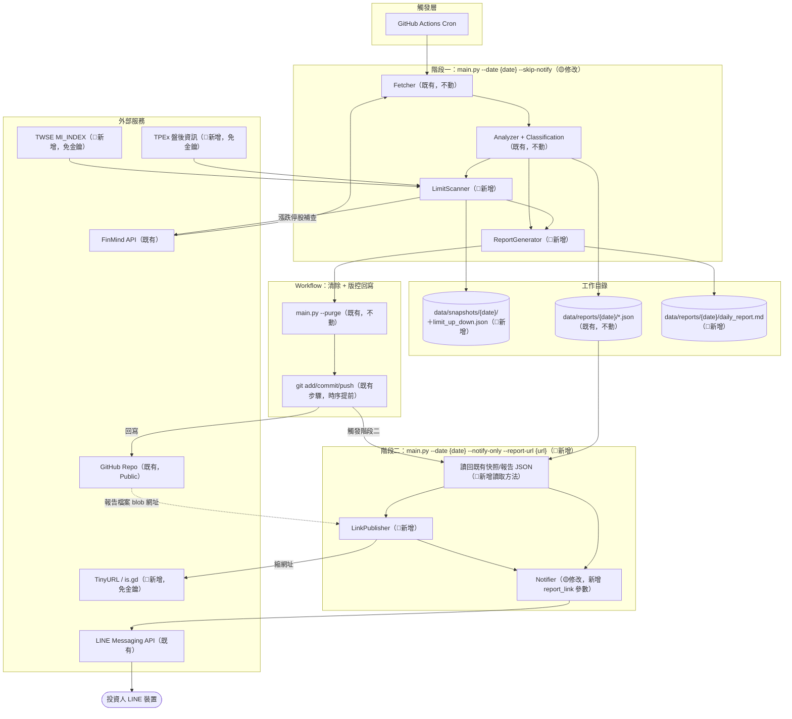
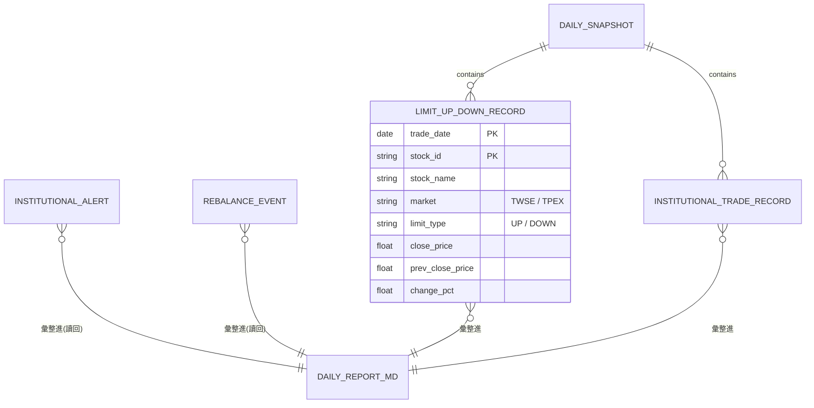
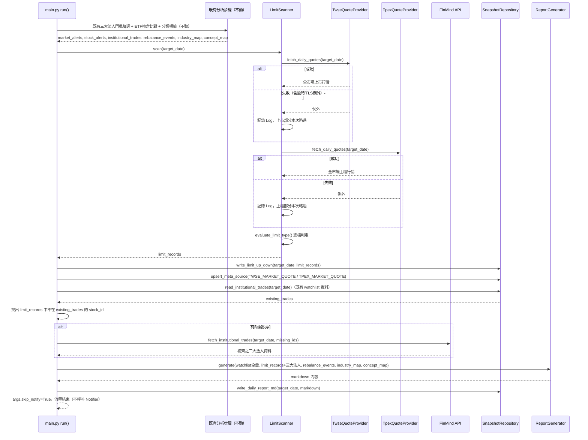

# SD-每日完整籌碼報告與漲跌停監控-系統設計書

| 項目 | 內容 |
| :--- | :--- |
| 文件類型 | 系統設計書（SD，技術性文件，既有系統之新增能力） |
| 設計依據 | [SA-每日完整籌碼報告與漲跌停監控-功能模組分析.md](../../analysis/requirements/SA-每日完整籌碼報告與漲跌停監控-功能模組分析.md) |
| 相關文件 | [SD-籌碼監控推播引擎-系統設計書.md](./SD-籌碼監控推播引擎-系統設計書.md)（`main.py run()`／`Fetcher`／`SnapshotRepository` 現行設計）、[SD-快照資料保留清除機制-系統設計書.md](./SD-快照資料保留清除機制-系統設計書.md)（`main.py` 旗標分流設計語言參考）、[SD-個股產業與概念分類標籤顯示-系統設計書.md](./SD-個股產業與概念分類標籤顯示-系統設計書.md)（`MessageFormatter`／分類標籤現行設計） |
| 對象讀者 | SD／開發人員／維運人員 |
| 建立日期 | 2026-09-02 |
| 作者 | Claude Code（依 Roy Chiang 確認之設計方向整理，並實際驗證漲跌停判定規則） |
| 套件歸屬 | 既有專案 `FinanceTracker`，單一 Python 套件 `src/`；本次新增 `src/market_quote/`（比照既有 `src/issuer_pcf/` 之 Provider 介面慣例）、`src/limit_scanner.py`、`src/report_generator.py`、`src/link_publisher.py` |

### 與 SA 文件的關鍵差異對照（本文件對 SA §六待確認事項的決策結果）

| SA 待確認事項 | 本文件決策 | 對應章節 |
| :--- | :--- | :--- |
| 漲跌停精確判定規則 | **確認**：以當日收盤價與「當日自身資料反推之前日收盤價」（`前日收盤 = 當日收盤 - 漲跌價差`）計算理論漲跌停價，依台股現行升降單位表捨入比對；**不需要額外查詢前一交易日快照**，也**不需要排除注意股/處置股**（台股現股漲跌幅限制統一 ±10%，處置股僅撮合機制不同，非漲跌幅不同） | §二、§四 |
| TPEx TLS 憑證問題 | **已排除，實測不會在正式環境重現**：以 Python 3.11.9／OpenSSL 3.0.13（與 workflow 固定版本一致）實際呼叫 TPEx 端點，回應 `200 OK` 且資料正常（`totalCount: 1014`），未出現本機 Python 3.14.4／OpenSSL 3.0.19 環境下的 `SSLCertVerificationError`，證實為本機環境特有問題，與 TPEx 端點本身或程式邏輯無關（詳見§六驗證記錄）。**仍保留**既有 per-source try/except 容錯模式作為一般性防呆（呼叫失敗一律記錄為該來源當日 `ERROR`，僅上櫃部分本次略過），但不再視為「預期會發生」的風險 | §五、§六 |
| 短網址服務與降級策略 | **確認**：TinyURL 優先、失敗改 is.gd、兩者皆失敗**直接回退為完整 GitHub 網址**（非 SA 原設計「省略連結」）——因完整網址本身即為確定性字串、必定有效，不需要「無連結」這個分支 | §四 |
| `main.py` CLI 介面拆分 | **確認**：新增 `--skip-notify`／`--notify-only`／`--report-url` 三個旗標，比照 `--purge` 之「獨立旗標、各自可單獨呼叫」設計語言；**不移除**既有無旗標時之完整單次流程（供本機手動測試沿用） | §四 |
| `daily_report.md` 版面 | **確認（實作前更新）**：三段式（Watchlist 完整清單／漲跌停清單／ETF 換倉動態）；分組方式**改為「依概念分組＋顯示 `[分類]` 標題」**，與 LINE 訊息新排版一致（原設計「依產業分組」已由使用者於實作前推翻，見下方「與既有系統一併調整」） | §四 |
| 漲跌停清單與 watchlist 重複標的呈現 | **確認**：兩份清單各自獨立列出，**不去重、不特別標註**——語意不同（watchlist 是長期關注、漲跌停是當日異常），避免為合併規則增加不必要的複雜度 | §四 |
| `DAILY_FULL_REPORT`／短網址對應關係落地方式 | **確認**：**不新增持久化實體**；報告檔案路徑本身即為確定性字串（`data/reports/{date}/daily_report.md`），短網址純粹是通知當下的呈現用途，不需要另建對應表 | §二 |
| TPEx 端點正式資料集選型 | **確認**：採用本次已實測驗證之「上櫃股票每日收盤行情」端點（`otc_quotes_no1430`） | §四 |

---

### 與既有系統一併調整（實作前追加，非 SA 原始範疇，但同一次實作一併處理）

實作前使用者提出兩項對**既有已上線功能**（三大法人買賣超通知，見 [SD-三大法人買賣超關注清單通知-系統設計書.md](./SD-三大法人買賣超關注清單通知-系統設計書.md)、[SD-個股產業與概念分類標籤顯示-系統設計書.md](./SD-個股產業與概念分類標籤顯示-系統設計書.md)）的異動要求，目的是降低訊息量與雜訊：

| 項目 | 決策 |
| :--- | :--- |
| 三大法人買賣超門檻倍率化 | 門檻**不直接寫死絕對值**，改在 `config/thresholds.json` 新增 `institutional_tiered.threshold_multiplier`（浮點數，選填，預設 `1.0`），套用於 `volume_ratio_pct` 與 `amount_thresholds.{large,mid,small}` 兩組門檻（`get_volume_ratio_threshold()`／`get_tiered_amount_threshold()` 內部乘上此值），使用者日後可隨時調整此單一數值而不需要重算每個門檻。本次先設為 `1.5`（適度提高）。**不套用**於大盤三大法人門檻（`market_institutional`）與 ETF 換倉門檻（`etf_rebalance_pct`）——使用者原始需求明確是「關注股票」（個股）層級的門檻，與大盤／換倉屬不同性質的告警 |
| 個股／ETF 換倉排版改為「依概念分組＋顯示 `[分類]` 標題」 | `MessageFormatter` 個股買賣超區塊（原本為未分組的平鋪清單）與 ETF 換倉動態區塊（原本依產業**靜默**分組、不印出標題）**統一改為**：依「該股票在 `concept_tags.json` 中第一個出現的概念分類」分組，組間順序＝清單中各分類第一次出現的順序，查無概念分類者統一歸入「未分類」並排在最後；每組前方印出可視的 `[分類名稱]` 標題行。**分組依據與每行內聯的 `[]` 標籤內容互不影響**：即使某股票的概念已被用作分組依據，該行內聯 `[]` 仍完整列出其全部標籤（產業別／市值分級／全部概念標籤，與現行 `_classification_tags()` 邏輯完全一致，不做任何省略）——這是因為一檔股票可能同時符合多個概念（如「電源」與「被動」），分組只能擇一（取第一個），但呈現時仍要讓讀者看到完整分類資訊。兩個區塊共用同一套分組＋分頁安全 block 產生邏輯，避免重工 |

這兩項調整範圍限定在**既有** `src/config.py`／`src/notifier.py`（及新增的共用分組工具），與本文件其餘章節描述的「漲跌停監控／完整報告」新功能各自獨立、互不依賴，但因**新增的 `ReportGenerator` 直接沿用這套新排版邏輯**（見上方「Markdown 報告版面」），故納入同一次實作，實作細節記錄於 `docs/develop/plan/PLAN-每日完整籌碼報告與漲跌停監控-v1.md`，不另立獨立 SD 文件。

---

## 一、系統架構與部署環境

### 設計要點

| 項目 | 設計 |
| :--- | :--- |
| 執行型態 | 沿用既有無伺服器批次腳本架構；**不新增獨立 `.py` 進入點**，延續 `main.py` 單一進入點＋旗標分流既有慣例（與 `--purge` 同一種設計語言） |
| 執行階段拆分（本次核心變動） | 既有 `main.py --date {date}` 原本「抓取→分析→**推播**」一次完成；本次新增兩個旗標將「推播」拆為獨立、延後執行的階段：`--skip-notify`（只做抓取/分析/產出報告，不推播）、`--notify-only --report-url {url}`（不重新抓取，讀回既有快照資料，格式化並推播，可選附加報告連結）。**無旗標時維持原有單次完整流程**（供本機手動測試 `scripts/run.sh full` 沿用，不含連結） |
| 觸發方式調整（Orchestration） | GitHub Actions workflow 由「抓取分析推播 → 清除 → commit/push」調整為「抓取分析產出報告(不推播) → 清除 → commit/push → 推播(含連結，見§四 Orchestration 小節)」；`git commit/push` 移到推播**之前**，確保連結指向的檔案已存在於 GitHub |
| 新增外部服務 | TWSE `MI_INDEX`、TPEx 盤後資訊、TinyURL／is.gd 短網址服務，皆為**免金鑰**公開服務，不新增 GitHub Secrets |
| 新增相依套件 | 無，全部沿用既有 `requests` |
| 密鑰管理 | 不涉及新增密鑰；既有 `FINMIND_TOKEN`／`LINE_CHANNEL_ACCESS_TOKEN`／`LINE_CHANNEL_SECRET` 管理方式不變 |
| 安全設計 | TWSE／TPEx／短網址服務皆為唯讀 GET 請求，不傳送任何敏感資料（僅公開股票代碼與 GitHub 公開網址）；短網址服務失敗**不得**降級為停用 TLS 憑證驗證 |

### 架構圖



### 環境規格

沿用既有規格（`ubuntu-latest`、Python 3.11、`.env`／GitHub Repository Secrets）。TWSE／TPEx／短網址服務皆為免金鑰公開端點，本機開發與正式排程呼叫方式一致，不需額外環境設定。

### 安全設計

沿用既有設計。新增的三個外部服務（TWSE、TPEx、短網址）皆為公開、免驗證之 GET 端點，僅傳送公開資訊（股票代碼、GitHub 公開網址），不涉及個資或密鑰，無需額外安全措施。

---

## 二、資料模型設計

### 現行（As-Is）資料模型摘要

僅列與本次設計相關之既有結構，完整規格見 [SD-籌碼監控推播引擎-系統設計書.md §二](./SD-籌碼監控推播引擎-系統設計書.md)：

| 既有結構 | 路徑 | 本次是否異動 |
| :--- | :--- | :--- |
| `INSTITUTIONAL_TRADE_RECORD` | `data/snapshots/{date}/institutional_trades.json` | 🟢 結構不動，本次直接讀取作為「Watchlist 完整清單」資料來源 |
| `INSTITUTIONAL_ALERT` | `data/reports/{date}/institutional_alerts.json` | 🟢 結構不動；新增**讀取方法**（現行僅有寫入方法，見§四） |
| `REBALANCE_EVENT` | `data/reports/{date}/rebalance_events.json` | 🟢 結構不動；新增**讀取方法**（現行僅有寫入方法，見§四） |
| `DAILY_SNAPSHOT`（`_meta.json`） | `data/snapshots/{date}/_meta.json` | 🟡 `sources` 物件新增兩個 key（`TWSE_MARKET_QUOTE`／`TPEX_MARKET_QUOTE`），沿用既有 `upsert_meta_source()` 局部更新機制 |
| `DataSourceKey`（Enum） | `src/models.py` | 🟡 新增兩個成員 |

### 設計要點

| 項目 | 設計 | 理由 |
| :--- | :--- | :--- |
| 新增實體 `LIMIT_UP_DOWN_RECORD` | 獨立快照檔 `data/snapshots/{date}/limit_up_down.json`，結構比照既有 `*_RECORD` 快照（陣列，每筆一檔股票） | 與既有 `institutional_trades.json`／`etf_holdings/{etf_id}.json` 同一種「日期快照」慣例，供 `ReportGenerator` 讀取，也供日後如需回溯查詢 |
| **不新增** `DAILY_FULL_REPORT` 中繼資料實體（推翻 SA 原假設） | `daily_report.md` 路徑本身即確定性字串 `data/reports/{date}/daily_report.md`，不需要另外記錄「報告↔短網址」對應關係；短網址是**通知當下**才產生的呈現用途，並非需要被回溯查詢的持久化狀態 | 減少一個持久化實體與其讀寫程式碼；GitHub blob 網址可隨時由 `date` 重新推導，短網址失效時直接用完整網址即可，沒有「查不到當初短網址是什麼」的問題 |
| 漲跌停判定**不依賴前一交易日快照** | `LimitUpDownRecord.prev_close_price` 由當日資料自身反推：`prev_close = close_price - change`（TWSE／TPEx 回應皆同時提供收盤價與漲跌價差） | 避免漲跌停掃描依賴 `SnapshotRepository.find_previous_trading_day()`（該方法回傳的是「哪一天」，仍需另外查該天的收盤價，等於多一次資料源查詢）；當日資料自帶完整計算所需欄位，是更簡單、更不易出錯的設計 |
| `institutional_trades.json` 不因本次擴充而改變寫入內容 | 漲跌停股的三大法人資料**不**回寫進 `institutional_trades.json`（該檔案語意固定為「watchlist 全量」），而是在 `ReportGenerator` 產出階段以記憶體內的暫時字典（`stock_id -> 三大法人 dict`）合併呈現，不落地 | 維持既有檔案「一份資料只有一種語意」的單純性，避免 watchlist 與漲跌停兩種不同性質的清單混在同一份快照裡，造成日後讀取者誤判涵蓋範圍 |

### ERD（概念層，本次新增/異動範圍）



> `DAILY_REPORT_MD` 為產出檔案（非結構化實體），不落地任何額外中繼資料，見上方設計要點。

### 新增檔案：`LIMIT_UP_DOWN_RECORD` — `data/snapshots/{date}/limit_up_down.json`

**說明：** 當日經 `LimitScanner` 判定為漲停或跌停之股票清單（上市＋上櫃合併），陣列結構，比照既有快照檔慣例。

| # | Field Name | Description | Data Type | Length | Default | 非空值 | PK | FK | Reference | 備註 |
| :--- | :--- | :--- | :--- | :--- | :--- | :--- | :--- | :--- | :--- | :--- |
| 1 | trade_date | 交易日期 | string (date) | 10 | — | Y | Y | — | — | 與所在目錄日期一致 |
| 2 | stock_id | 股票代碼 | string | 10 | — | Y | Y | — | — | — |
| 3 | stock_name | 股票名稱 | string | 50 | — | Y | — | — | — | 取自 TWSE／TPEx 原始回應，不需另外查 FinMind |
| 4 | market | 市場別 | string (enum) | — | — | Y | — | — | 見下方 `MarketType` | `TWSE`（上市）／`TPEX`（上櫃） |
| 5 | limit_type | 漲跌停別 | string (enum) | — | — | Y | — | — | 見下方 `LimitType` | `UP`（漲停）／`DOWN`（跌停） |
| 6 | close_price | 當日收盤價 | float | — | — | Y | — | — | — | — |
| 7 | prev_close_price | 前一交易日收盤價（反推值） | float | — | — | Y | — | — | — | `= close_price - change`，非另外查詢所得 |
| 8 | change_pct | 漲跌幅百分比 | float | — | — | Y | — | — | — | 恆為 +10.0 附近（UP）或 -10.0 附近（DOWN），保留供人工核對用 |

### Enum 定義（新增）

```python
# src/models.py 新增

class MarketType(str, Enum):
    TWSE = "TWSE"   # 上市
    TPEX = "TPEX"   # 上櫃


class LimitType(str, Enum):
    UP = "UP"       # 漲停
    DOWN = "DOWN"   # 跌停


class DataSourceKey(str, Enum):
    # ...既有成員不動...
    TWSE_MARKET_QUOTE = "TWSE_MARKET_QUOTE"   # 🔴新增
    TPEX_MARKET_QUOTE = "TPEX_MARKET_QUOTE"   # 🔴新增
```

### 索引與查詢設計彙整

| 檔案/目錄設計 | 取代的查詢情境 | 對應 UC |
| :--- | :--- | :--- |
| `data/snapshots/{date}/limit_up_down.json` 以日期分目錄 | `ReportGenerator` 依日期讀取當日漲跌停清單 | UC1、UC3 |
| `institutional_trades.json` 依 `stock_id` 建字典 | 判斷漲跌停股是否已存在 watchlist 資料，避免重複呼叫 FinMind（見§四 FR-1.3） | UC2 |

### 資料搬移／初始資料匯入

本文件無搬移章節：`limit_up_down.json`／`daily_report.md` 皆為全新檔案類型，首次執行時自動建立，不涉及既有資料搬移。

---

## 三、前端開發規格

**本章節不適用。** 沿用原 SD 文件說明：本系統為無使用者介面的無伺服器批次腳本，本次異動不涉及任何畫面；`daily_report.md` 雖為「給人看」的文件，但屬於「產出檔案」而非「互動畫面」，其版面規格於§四說明。

---

## 四、程式元件與介面實作

### 業務邏輯（對應 SA FR）

| FR | 業務規則 | 程式落地方式 |
| :--- | :--- | :--- |
| FR-1.1 | 上市漲跌停掃描：呼叫 TWSE `MI_INDEX` 取得全市場當日收盤行情 | `TwseQuoteProvider.fetch_daily_quotes(trade_date)`（🔴新增） |
| FR-1.2 | 上櫃漲跌停掃描：呼叫 TPEx 盤後資訊取得全市場當日收盤行情 | `TpexQuoteProvider.fetch_daily_quotes(trade_date)`（🔴新增） |
| FR-1.3 | 漲跌停股三大法人查詢：優先沿用 watchlist 已抓取之資料，本地沒有才補查 FinMind | `main.py::_fetch_limit_institutional_trades()`（🔴新增，cache-aside，比照 `ClassificationService` 既有設計語言） |
| FR-1.4 | 異常與無資料處理 | `LimitScanner.scan()` 內 per-market try/except，單一市場失敗記錄 Log 並繼續處理另一市場，不中斷整體流程 |
| FR-2.1 | Watchlist 全量三大法人呈現（不篩門檻） | `ReportGenerator` 直接讀取 `institutional_trades.json` 全量內容 |
| FR-2.2 | 漲跌停清單呈現 | `ReportGenerator` 讀取 `limit_up_down.json` ＋合併§FR-1.3 之三大法人資料 |
| FR-2.3 | ETF 換倉事件呈現 | `ReportGenerator` 讀取 `rebalance_events.json`，沿用既有依產業分組排序邏輯 |
| FR-2.4 | Markdown 格式輸出 | `ReportGenerator.generate() -> str`，`SnapshotRepository.write_daily_report_md()`（🔴新增） |
| FR-3.1 | 執行順序調整 | `.github/workflows/daily-chip-monitor.yml` 步驟重排（見下方 Orchestration 小節） |
| FR-3.2 | 短網址產生 | `LinkPublisher.shorten(long_url) -> str`（🔴新增，TinyURL 優先、is.gd 次之） |
| FR-3.3 | LINE 訊息附加連結 | `MessageFormatter.format(..., report_link)`（🟡修改），附加於訊息最末一頁 |
| FR-3.4 | 短網址服務降級策略 | `LinkPublisher.shorten()` 兩個服務皆失敗時**直接回傳原始長網址**（見文件開頭差異對照，簡化 SA 原「省略連結」設計） |

### 漲跌停判定規則（虛擬碼，供理解規則，非最終程式碼）

```python
# src/limit_scanner.py

_TICK_TABLE = [  # (價格上限（不含）, 對應升降單位)；依現行台股升降單位規則
    (10, 0.01), (50, 0.05), (100, 0.1), (500, 0.5), (1000, 1), (float("inf"), 5),
]
_LIMIT_PCT = 0.10       # 台股現股漲跌幅限制統一 ±10%（含注意股／處置股，見文件開頭差異對照）
_COMPARE_TOLERANCE = 0.005  # 浮點數比對容許誤差


def _tick_size(price: float) -> float:
    for upper_bound, tick in _TICK_TABLE:
        if price < upper_bound:
            return tick
    return _TICK_TABLE[-1][1]


def calculate_limit_prices(prev_close: float) -> tuple[float, float]:
    """回傳 (漲停價, 跌停價)。漲停價依台股規則無條件捨去至對應升降單位（確保不超過 +10%），
    跌停價無條件進位（確保跌幅不超過 -10%）。"""
    theoretical_up = prev_close * (1 + _LIMIT_PCT)
    theoretical_down = prev_close * (1 - _LIMIT_PCT)
    tick_up = _tick_size(theoretical_up)
    tick_down = _tick_size(theoretical_down)
    limit_up = math.floor(theoretical_up / tick_up) * tick_up
    limit_down = math.ceil(theoretical_down / tick_down) * tick_down
    return round(limit_up, 2), round(limit_down, 2)


def evaluate_limit_type(close: float, change: float) -> LimitType | None:
    prev_close = close - change
    if prev_close <= 0:
        return None  # 新股掛牌首日等無有效前收盤價之情況，不判定
    limit_up, limit_down = calculate_limit_prices(prev_close)
    if abs(close - limit_up) <= _COMPARE_TOLERANCE:
        return LimitType.UP
    if abs(close - limit_down) <= _COMPARE_TOLERANCE:
        return LimitType.DOWN
    return None
```

> **已知限制**：新股上市前 5 個交易日依規定無漲跌幅限制，本演算法對這類股票的理論漲跌停價比對通常不會剛好命中，實務影響極小（不會誤判，只是這類股票即使當日暴漲暴跌也不會被本功能捕捉），列為已知限制而非阻塞問題。

### Markdown 報告版面（`daily_report.md`，最終定案）

> **異動說明（覆蓋原§六待確認事項 #4）**：Watchlist 完整清單原設計依產業分組，經使用者於實作前重新確認，**改為與 LINE 訊息一致的「依概念分組＋顯示 `[分類]` 標題」**（見下方「與既有系統一併調整」章節）。沿用 `MessageFormatter`／`ReportGenerator` 共用的分組工具，不另建獨立排序邏輯。

```markdown
# 籌碼監控完整日報 2026-09-02

## Watchlist 三大法人買賣超（全量，不篩門檻）

### [半導體]
| 股票代碼 | 名稱 | 產業/市值/概念標籤 | 外資買賣超(張) | 投信買賣超(張) | 自營商買賣超(張) | 合計(張) | 是否達門檻 |
|---|---|---|---|---|---|---|---|
| 2330 | 台積電 | 電子工, 大型, 半導體 | +5,795 | +184 | +457 | +5,965 | ✅ |
| 3661 | 世芯-KY | ... | ... | ... | ... | ... | — |

### [未分類]
| 股票代碼 | 名稱 | 產業/市值/概念標籤 | 外資買賣超(張) | 投信買賣超(張) | 自營商買賣超(張) | 合計(張) | 是否達門檻 |
|---|---|---|---|---|---|---|---|
| 2049 | 上銀 | 電機機械, 大型 | ... | ... | ... | ... | — |

（依「該股票在 `concept_tags.json` 中第一個出現的概念分類」分組，查無概念分類者歸入「未分類」並排在最後；組間順序＝清單中各分類第一次出現的順序。「產業/市值/概念標籤」欄完整列出該股票的所有標籤，不因為某個概念已被用作分組依據就從此欄省略。「是否達門檻」欄標示該股票是否也出現在當日 LINE 簡報中，供使用者對照）

## 今日漲跌停股票

| 股票代碼 | 名稱 | 市場 | 漲/跌停 | 收盤價 | 外資 | 投信 | 自營商 |
|---|---|---|---|---|---|---|---|
| xxxx | xxxx | 上市 | 漲停 | 123.0 | +120 張 | — | +30 張 |

（無資料時顯示「今日無個股觸及漲跌停"）

## ETF 換倉動態

（`_group_and_format_events()` 本次一併改為「依概念分組＋顯示 `[分類]` 標題」，見下方「與既有系統一併調整」章節；規則與上方 Watchlist 清單相同，改以表格呈現）

---
*本報告由籌碼監控推播引擎自動產生*
```

### Orchestration：`main.py` CLI 介面設計

| 旗標 | 行為 | 使用情境 |
| :--- | :--- | :--- |
| （無旗標） | 抓取→分析→產出報告→**推播（不含連結）** | 本機手動測試（`scripts/run.sh full`），沿用既有行為 |
| `--skip-notify` | 抓取→分析→產出報告，**不推播** | Workflow 階段一 |
| `--notify-only`（需搭配 `--date`，`--report-url` 選填） | 讀回既有快照/報告 JSON，格式化並推播；若帶 `--report-url` 則呼叫 `LinkPublisher` 縮網址後附加 | Workflow 階段二（commit/push 之後） |
| `--dry-run` | 不變：僅預覽訊息內容，不呼叫 LINE；與 `--notify-only` 併用時預覽含連結的最終訊息；與 `--skip-notify` 併用時無額外作用（兩者皆不呼叫 LINE） | 不變 |
| `--purge` | 不變 | 不變 |

`--skip-notify` 與 `--notify-only` 互斥（`argparse` mutually exclusive group）。

### Workflow 執行順序（`.github/workflows/daily-chip-monitor.yml`，異動）

| 步驟 | 內容 | 異動 |
| :--- | :--- | :--- |
| 1 | `python main.py --date "$TARGET_DATE" --skip-notify` | 🟡（原本含推播，本次移除推播） |
| 2 | `python main.py --purge` | 🟢 不動 |
| 3 | `git add data/ && git commit && git push`，**標記 `continue-on-error: true`** | 🟡（新增 `continue-on-error`，見下方風險說明） |
| 4 | 判斷步驟 3 是否成功，成功則組出 `REPORT_URL`（字串組合，非 HTTP 呼叫）；`python main.py --date "$TARGET_DATE" --notify-only [--report-url "$REPORT_URL"]` | 🔴新增 |
| 5 | 若步驟 3 失敗，本步驟以非 0 結束，讓整個 Job 標記失敗（觸發 GitHub Actions 預設失敗通知信） | 🔴新增 |

**設計理由（風險緩解，重要）：** 若單純將 `git push` 移到推播之前、且未做上述 `continue-on-error` 設計，一旦 push 失敗（如版本衝突），推播步驟將完全不會執行，使用者當天會**完全收不到通知**——這是比現行「push 失敗但至少已收到通知」更差的行為退化。因此本文件明確設計為：**推播永遠會被嘗試**（步驟 4 不受步驟 3 成功與否影響是否執行），僅在 push 成功時才附加連結；push 失敗時 Job 仍以失敗狀態結束（保留既有「失敗即寄信」的可觀測性），但不犧牲當日通知本身。

```yaml
- name: Prepare (fetch/analyze/report)
  id: prepare
  env: { ... }
  run: |
    if [ -n "${{ github.event.inputs.date }}" ]; then
      TARGET_DATE="${{ github.event.inputs.date }}"
    else
      TARGET_DATE="$(date +'%Y-%m-%d')"
    fi
    echo "target_date=$TARGET_DATE" >> "$GITHUB_OUTPUT"
    python main.py --date "$TARGET_DATE" --skip-notify
    python main.py --purge

- name: Commit snapshot data
  id: commit
  continue-on-error: true
  run: |
    git config user.name "github-actions[bot]"
    git config user.email "github-actions[bot]@users.noreply.github.com"
    git add data/
    git diff --cached --quiet || git commit -m "chore: 更新籌碼快照資料 ${{ steps.prepare.outputs.target_date }}"
    git push

- name: Notify
  env: { LINE_CHANNEL_ACCESS_TOKEN: ..., LINE_CHANNEL_SECRET: ... }
  run: |
    TARGET_DATE="${{ steps.prepare.outputs.target_date }}"
    if [ "${{ steps.commit.outcome }}" = "success" ]; then
      REPORT_URL="https://github.com/${{ github.repository }}/blob/${{ github.ref_name }}/data/reports/$TARGET_DATE/daily_report.md"
      python main.py --date "$TARGET_DATE" --notify-only --report-url "$REPORT_URL"
    else
      python main.py --date "$TARGET_DATE" --notify-only
    fi

- name: Fail job if commit step failed
  if: steps.commit.outcome != 'success'
  run: exit 1
```

### 內部元件設計

| 元件 | 職責 | 異動類型 |
| :--- | :--- | :--- |
| `src/market_quote/base.py`（`MarketQuoteProvider`） | 抽象介面，定義 `fetch_daily_quotes(trade_date) -> list[dict]`，比照既有 `IssuerPcfProvider` 設計語言 | 🔴新增 |
| `src/market_quote/twse.py`（`TwseQuoteProvider`） | 呼叫 TWSE `MI_INDEX`，回傳全市場上市個股當日收盤行情 | 🔴新增 |
| `src/market_quote/tpex.py`（`TpexQuoteProvider`） | 呼叫 TPEx 盤後資訊，回傳全市場上櫃個股當日收盤行情 | 🔴新增 |
| `src/limit_scanner.py`（`LimitScanner`） | 協調呼叫兩個 Provider、依§四漲跌停判定規則篩選、組出 `LimitUpDownRecord` 清單 | 🔴新增 |
| `src/limit_scanner.py`（`calculate_limit_prices`／`evaluate_limit_type`） | 純函式，漲跌停價計算與判定（可獨立單元測試） | 🔴新增 |
| `src/report_generator.py`（`ReportGenerator`） | 彙整 watchlist 全量／漲跌停清單／換倉事件，產出 Markdown 字串 | 🔴新增 |
| `src/link_publisher.py`（`LinkPublisher`） | 呼叫 TinyURL／is.gd 縮網址，失敗降級為原始網址 | 🔴新增 |
| `src/models.py` | 新增 `MarketType`／`LimitType`／`LimitUpDownRecord`，`DataSourceKey` 新增兩成員 | 🟡修改 |
| `src/storage.py` | 新增 `write_limit_up_down()`／`read_limit_up_down()`／`write_daily_report_md()`／`read_institutional_alerts()`（🔴新讀取方法，現行僅有寫入）／`read_rebalance_events()`（🔴新讀取方法，現行僅有寫入） | 🟡修改 |
| `src/notifier.py`（`MessageFormatter.format`／`Notifier.notify`） | 新增選填參數 `report_link: str \| None`，有值時於訊息末尾附加一行連結 | 🟡修改 |
| `main.py`（`parse_args`） | 新增 `--skip-notify`／`--notify-only`／`--report-url`（互斥群組見上） | 🟡修改 |
| `main.py`（`run()`） | 移除流程尾端直接呼叫 `Notifier`；改為呼叫 `LimitScanner`／`ReportGenerator` 後，依 `args.skip_notify` 決定是否推播 | 🟡修改 |
| `main.py`（`run_notify_only()`） | 讀回既有快照/報告資料、（選填）縮網址、呼叫 `Notifier` | 🔴新增 |
| `main.py`（`_scan_limit_up_down()`） | 呼叫 `LimitScanner`，寫入快照，更新 `_meta.json` 兩個新來源狀態 | 🔴新增 |
| `main.py`（`_fetch_limit_institutional_trades()`） | cache-aside：優先沿用 `institutional_trades.json` 既有資料，本地無資料才補查 FinMind | 🔴新增 |
| `.github/workflows/daily-chip-monitor.yml` | 步驟重排（見上） | 🟡修改 |
| `scripts/run.sh` | 新增本機測試 `notify-only` 模式（選填，供開發階段驗證兩階段流程） | 🟡修改 |

### 現行（As-Is）API 規格摘要

FinMind `TaiwanStockInstitutionalInvestorsBuySell` 之呼叫方式已於 [SD-籌碼監控推播引擎-系統設計書.md §四](./SD-籌碼監控推播引擎-系統設計書.md#四程式元件與介面實作) 定義，本次沿用同一支既有方法 `FinMindClient.fetch_institutional_trades()`，僅呼叫來源與時機不同（漲跌停股 cache-aside 補查），欄位定義不重複列出。

### API 契約（外部服務整合介面，新增部分）

| # | 服務 | Method / Endpoint | 用途 | 呼叫方 | 認證方式 |
| :--- | :--- | :--- | :--- | :--- | :--- |
| 1 | TWSE `MI_INDEX` | `GET https://www.twse.com.tw/rwd/zh/afterTrading/MI_INDEX?date={YYYYMMDD}&type=ALLBUT0999&response=json` | 全市場上市個股當日收盤行情 | `TwseQuoteProvider` | 無（公開） |
| 2 | TPEx 盤後資訊 | `GET https://www.tpex.org.tw/web/stock/aftertrading/otc_quotes_no1430/stk_wn1430_result.php?l=zh-tw&d={民國年/MM/DD}&se=EW&o=json` | 全市場上櫃個股當日收盤行情 | `TpexQuoteProvider` | 無（公開） |
| 3 | TinyURL | `GET https://tinyurl.com/api-create.php?url={long_url}` | 縮網址（優先） | `LinkPublisher` | 無（公開） |
| 4 | is.gd | `GET https://is.gd/create.php?format=simple&url={long_url}` | 縮網址（TinyURL 失敗時備援） | `LinkPublisher` | 無（公開） |

**注意事項：** TPEx 端點日期參數為**民國年格式**（`115/08/31`），需將 ISO 日期字串轉換；`TwseQuoteProvider`／`TpexQuoteProvider` 內部各自負責格式轉換，呼叫端（`LimitScanner`）一律使用系統既有之 `YYYY-MM-DD` 格式。

### 時序圖：階段一（`--skip-notify`）新增之漲跌停與報告步驟



### 時序圖：階段二（`--notify-only`）

```mermaid
sequenceDiagram
    participant Workflow as GitHub Actions（Notify 步驟）
    participant Main as main.py run_notify_only()
    participant Store as SnapshotRepository
    participant Link as LinkPublisher
    participant TinyURL as TinyURL
    participant Isgd as is.gd
    participant Notify as Notifier
    participant Line as LINE Messaging API

    Workflow->>Main: --date {date} --notify-only [--report-url {url}]
    Main->>Store: read_institutional_alerts(date) / read_institutional_trades(date) / read_rebalance_events(date)
    Store-->>Main: market_alerts, stock_alerts, institutional_trades, rebalance_events
    Main->>Main: _resolve_classification_tags()（沿用既有，cache-aside 命中本地快取，通常不再呼叫 FinMind）
    opt --report-url 有帶值
        Main->>Link: shorten(report_url)
        Link->>TinyURL: GET api-create.php
        alt 成功
            TinyURL-->>Link: 短網址
        else 失敗
            Link->>Isgd: GET create.php
            alt 成功
                Isgd-->>Link: 短網址
            else 皆失敗
                Link-->>Link: 回退為原始 report_url
            end
        end
        Link-->>Main: short_url
    end
    Main->>Notify: notify(..., report_link=short_url)
    Notify->>Line: Push Message（含連結，見§四報告版面）
    Line-->>Notify: 200 / 4xx
    Notify-->>Main: 成功/失敗
```

---

## 五、維護與例外處理

### 錯誤碼彙整

| 代碼 | 觸發情境 | 對應處理方式 |
| :--- | :--- | :--- |
| **`MARKET_QUOTE_TWSE_ERROR`**（🔴新增） | TWSE `MI_INDEX` 呼叫逾時/例外/回應格式異常 | 記錄 Log，`upsert_meta_source(TWSE_MARKET_QUOTE, ERROR)`，本次僅上市部分無漲跌停資料，上櫃部分與其餘流程不受影響 |
| **`MARKET_QUOTE_TPEX_ERROR`**（🔴新增） | TPEx 端點呼叫逾時/例外/**TLS 憑證例外**/回應格式異常 | 同上，記錄為 `TPEX_MARKET_QUOTE=ERROR`，僅上櫃部分本次無資料；**明確不得**以停用憑證驗證繞過 |
| **`MARKET_QUOTE_NO_DATA`**（🔴新增） | 當日為假日/非交易日，兩端點皆查無資料 | 記錄 Log，`status=NO_DATA`（非錯誤），`limit_up_down.json` 寫入空陣列 |
| **`LINK_SHORTEN_FAILED`**（🔴新增，記錄用途，非拋出例外） | TinyURL／is.gd 皆呼叫失敗 | 記錄警告 Log，`LinkPublisher.shorten()` 回傳原始長網址，不影響推播照常進行 |
| **`REPORT_GENERATION_FAILED`**（🔴新增） | `ReportGenerator.generate()` 拋出未預期例外 | 記錄例外 Log，本次略過寫入 `daily_report.md`（該日無報告檔案可連結），**不中斷**後續推播流程（推播內容本身不受影響，僅無法附加連結） |

### 排程／SP 清單

| 名稱 | 觸發頻率 | 用途 | 異動說明 |
| :--- | :--- | :--- | :--- |
| `.github/workflows/daily-chip-monitor.yml`（`schedule`） | 不動 | 每日籌碼監控主排程 | 🟡 步驟重排＋新增 Notify 獨立步驟，見§四 Orchestration |

本專案無資料庫，故無 Stored Procedure。

### 例外處理原則

| 情境 | 處理策略 |
| :--- | :--- |
| TWSE／TPEx 任一市場資料源失敗 | 比照既有 per-source 容錯模式，僅該市場當日無漲跌停資料，另一市場與既有 watchlist／ETF 流程完全不受影響 |
| TPEx TLS 憑證例外 | 視為一般 `MARKET_QUOTE_TPEX_ERROR` 處理（記錄＋略過），**不**採用停用憑證驗證作為正式解法；本項已於§六實測確認正式環境（Python 3.11）不會重現此問題（僅本機 Python 3.14 環境特有），此處理策略純為一般性防呆保留，非預期會觸發的已知風險 |
| 漲跌停股三大法人補查失敗 | 比照既有 `FinMindClient` per-stock try/except，單一股票失敗不影響其餘股票，該股票於報告中三大法人欄位顯示「查無資料」 |
| 短網址服務失敗 | 兩層降級（TinyURL → is.gd → 原始長網址），**恆有可用連結**，不存在「完全無連結」的情況 |
| Git push 失敗（連結來源檔案未成功上版控） | 推播**仍會執行**，僅不附加連結（見§四 Orchestration 風險緩解設計）；Job 仍以失敗狀態結束，觸發既有 GitHub Actions 失敗通知信 |
| `--notify-only` 讀回資料時發現目標日期無既有快照/報告檔案 | 視為當日尚未執行過階段一（`--skip-notify`），記錄錯誤 Log，`run_notify_only()` 回傳 `False`，`main()` 以非 0 結束碼結束 |

---

## 六、待確認事項

| # | 項目 | 待誰確認 | 確認結果 |
| :--- | :--- | :--- | :--- |
| 1 | TPEx TLS 憑證問題於 GitHub Actions `ubuntu-latest` 環境是否重現 | Roy Chiang / 開發人員（實作階段實測確認） | **已確認，不會重現，非阻塞問題**：以兩組獨立對照環境驗證（皆為 Python 3.11，與 Workflow 固定版本一致）——① 本機原生安裝 Python 3.11.9（Windows，OpenSSL 3.0.13）；② Docker 容器（Linux/Debian，Python 3.11.16，OpenSSL 3.5.7，比①更貼近 `ubuntu-latest` 實際環境）。兩者呼叫 TPEx 端點皆回應 `200 OK`、資料正常（`totalCount: 1014`），TWSE `MI_INDEX` 端點同樣正常，皆未重現本機開發環境（Python 3.14.4／OpenSSL 3.0.19）的 `SSLCertVerificationError`。證實此問題**僅存在於本機開發環境（Python 3.14 過新的 OpenSSL 嚴格驗證行為）**，與 TPEx 端點本身或本文件程式邏輯設計無關，**不再是需要另外安排驗證步驟的阻塞事項** |
| 2 | `daily_report.md` 是否需要保留歷史版本供比較（例如「連續三日皆漲停」） | Roy Chiang | **已確認，暫不考慮**：本次僅產出「當日」報告，不做跨日歷史版本比較，待未來有需要再另行評估 |
| 3 | TinyURL／is.gd 是否有請求頻率限制需留意 | 開發人員（實作階段確認官方文件） | **已確認，理論上每日僅呼叫一次**（Workflow 每個交易日僅觸發一次 Notify 步驟），遠低於任一服務之免費額度限制，無需額外設計節流機制 |
| 4 | Watchlist 完整清單於 `daily_report.md` 內是否需要依「三大法人合計買賣超」排序，或維持 `config/watchlist.json` 原始順序 | Roy Chiang | **已確認，依產業分組排序**：沿用§四版面既有設計（依產業分組，組間順序＝清單中各產業第一次出現的順序，比照 `MessageFormatter` 既有分組邏輯），不另做金額排序；查無產業別之股票統一排在最後 |

**可行性結論：本文件四項待確認事項皆已確認，無阻塞項，本次擴充功能設計可行，可進入實作階段（`/dev`）。**

### TPEx TLS 問題排查與驗證結果（對應待確認事項 #1，已解決）

本次分析階段以專案本機 Python 環境（3.14.4）呼叫下列 TPEx 端點時，出現 `SSLCertVerificationError: Missing Subject Key Identifier`（詳見 SA 文件來源檔案索引之驗證記錄）。排查過程：

1. **已排除的假說**：曾懷疑是缺少 `User-Agent` header 導致（Postman 加上瀏覽器 UA 後測試成功），但實際以 Python `requests` 帶同樣的瀏覽器 UA 重測**仍出現相同錯誤**。此錯誤發生於 **TLS 握手階段**，邏輯上早於 HTTP header 送出的時間點，故 header 內容不可能是成因；Postman 測試成功較可能是因為 Postman 使用與 Python `ssl` 模組不同的憑證信任機制（如作業系統或 Chromium 內建憑證庫），未觸發同一嚴格驗證規則，與是否帶 UA 無因果關係。
2. **本機容器化重現嘗試一度受阻，已排除並修復**：原計畫以 Docker（`python:3.11-slim`）在容器內重現一次驗證（見 [Dockerfile](../../../Dockerfile)、[scripts/docker-test.sh](../../../scripts/docker-test.sh)），首次嘗試時本機 Docker Desktop 的 Hub mirror proxy（`hubproxy.docker.internal:5555`）無法連線，多次重試皆為 `TLS handshake timeout`；排查後確認是 Docker Desktop **剛啟動時內部服務（Hub mirror）尚未就緒**（非設定錯誤，`http.docker.internal:3128` 為 Docker Desktop 內建的 Hub 加速機制），與待驗證的 TPEx 問題無關。完整重啟 Docker Desktop（結束所有相關程序＋`wsl --shutdown` 重置 VM 狀態＋重新啟動）後恢復正常，`docker pull python:3.11-slim` 之後穩定於 17 秒內完成。
3. **直接安裝對照組 Python 版本驗證**：於本機安裝與 Workflow 固定版本一致的 **Python 3.11.9（OpenSSL 3.0.13，Windows 原生）**，不透過容器、不動既有 `.venv`（3.14），實際執行：
   ```bash
   py -3.11 -c "import requests; r = requests.get('https://www.tpex.org.tw/web/stock/aftertrading/otc_quotes_no1430/stk_wn1430_result.php', params={'l':'zh-tw','d':'115/08/31','se':'EW','o':'json'}, timeout=30); print(r.status_code); print(r.json()['tables'][0]['totalCount'])"
   ```
   **結果：`200`，`totalCount: 1014`，未重現 `SSLCertVerificationError`**；同一環境下 TWSE `MI_INDEX` 端點亦正常回應 `stat: OK`。
4. **容器內二次驗證（Linux，最貼近 GitHub Actions 實際環境）**：Docker 網路問題排除後，以 `scripts/docker-test.sh env-check` 在 Debian 容器（**Python 3.11.16、OpenSSL 3.5.7**，與 `ubuntu-latest` 同為 Linux 環境，比對照組 3 之 Windows 原生 Python 更貼近正式排程實際執行環境）內重測，TWSE、TPEx **兩端點皆回應 `200`**（TPEx `totalCount: 1014`），同樣未重現該錯誤。

**結論：** 此問題為**本機開發環境特有**——Python 3.14.4 搭配的 OpenSSL 3.0.19 對「憑證鏈結缺少 Subject Key Identifier 擴充欄位」的驗證轉趨嚴格，才會出現此錯誤；GitHub Actions Workflow 固定使用的 **Python 3.11**（[daily-chip-monitor.yml:28](../../../.github/workflows/daily-chip-monitor.yml)），無論是 Windows 原生（OpenSSL 3.0.13）或 Linux 容器（OpenSSL 3.5.7）環境，實測**皆不會**觸發同一嚴格驗證邏輯，兩組獨立對照結果互相印證。本文件第五章之 per-source try/except 容錯設計（呼叫失敗記錄為 `ERROR`、僅該來源當日略過）予以保留作為一般性防呆機制，但不再視為「預期會發生」的已知風險，**不影響本次功能之可行性判斷**。

---

## 七、來源檔案索引

- [SA-每日完整籌碼報告與漲跌停監控-功能模組分析.md](../../analysis/requirements/SA-每日完整籌碼報告與漲跌停監控-功能模組分析.md)（本文件設計依據）
- [SD-籌碼監控推播引擎-系統設計書.md](./SD-籌碼監控推播引擎-系統設計書.md)（`main.py run()`／`Fetcher`／`SnapshotRepository` 現行設計）
- [SD-快照資料保留清除機制-系統設計書.md](./SD-快照資料保留清除機制-系統設計書.md)（`main.py` 旗標分流設計語言參考來源）
- [SD-個股產業與概念分類標籤顯示-系統設計書.md](./SD-個股產業與概念分類標籤顯示-系統設計書.md)（`MessageFormatter` 分類標籤與分組排序現行設計）
- `f:\projects\FinanceTracker\src\issuer_pcf\base.py`（`IssuerPcfProvider` 介面慣例，`market_quote/base.py` 設計參考）
- `f:\projects\FinanceTracker\src\fetcher.py`（`FinMindClient.fetch_institutional_trades` 現行實作，待補查漲跌停股沿用）
- `f:\projects\FinanceTracker\src\storage.py`（現行實作，待依§二/§四新增讀寫方法）
- `f:\projects\FinanceTracker\src\models.py`（現行實作，待依§二新增 Enum／dataclass）
- `f:\projects\FinanceTracker\src\notifier.py`（現行 `MessageFormatter`／`Notifier`，待依§四新增 `report_link` 參數）
- `f:\projects\FinanceTracker\main.py`（現行 `run()`／`parse_args()`，待依§四調整）
- `f:\projects\FinanceTracker\.github\workflows\daily-chip-monitor.yml`（現行排程，待依§四步驟重排）
- `f:\projects\FinanceTracker\scripts\run.sh`（現行本機執行腳本，待新增 `notify-only` 模式）
- [Dockerfile](../../../Dockerfile)、[docker-compose.yml](../../../docker-compose.yml)、[scripts/docker-test.sh](../../../scripts/docker-test.sh)（本機以 Python 3.11 環境驗證外部連線問題之輔助工具，§六 TPEx TLS 問題排查曾嘗試使用，另可作為本機常駐排程 server 之基礎）
