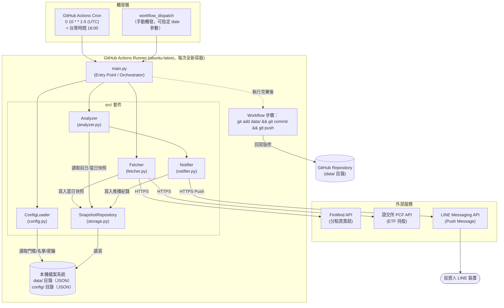
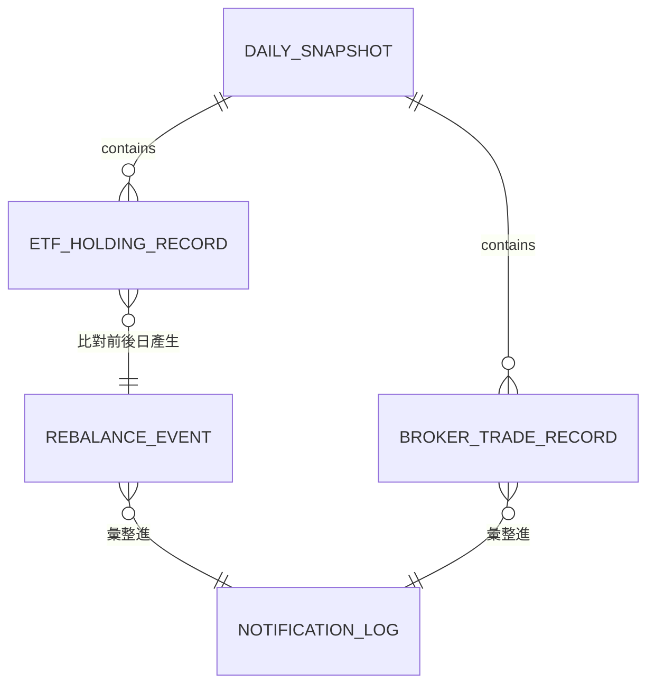
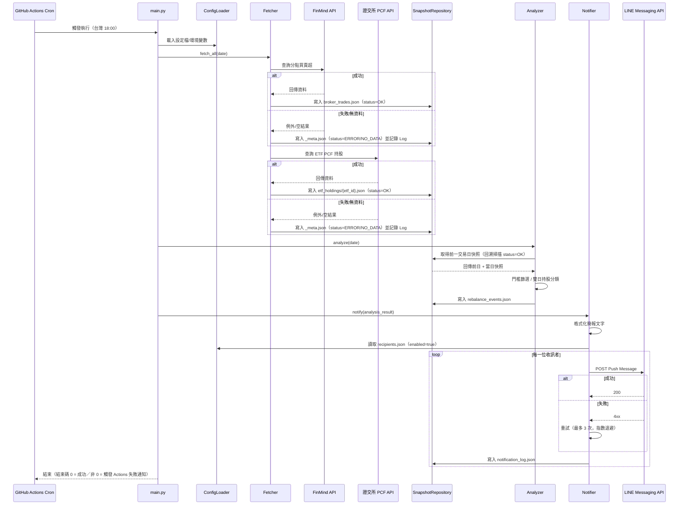

# SD-籌碼監控推播引擎-系統設計書

| 項目 | 內容 |
| :--- | :--- |
| 文件類型 | 系統設計書（SD，技術性文件） |
| 設計依據 | [SA-籌碼監控推播引擎-功能模組分析.md](../../analysis/requirements/SA-籌碼監控推播引擎-功能模組分析.md) |
| 對象讀者 | SD / 開發人員 / 維護人員 |
| 建立日期 | 2026-07-29 |
| 作者 | Claude Code（依 Roy Chiang 確認之設計方向整理） |
| 套件歸屬 | 全新（greenfield）專案 `FinanceTracker`，單一 Python 套件 `src/`，無跨套件相依 |

### 與 SA 文件的關鍵差異對照

SA 文件第六章列出多項「SD 階段待細化事項」，本文件為對應決策結果，彙整如下，細節見各章節：

| SA 待決定事項 | 本文件決策 | 對應章節 |
| :--- | :--- | :--- |
| 快照資料實際儲存方式 | 採用 **Repo 內 `data/` 目錄，JSON 檔案**，由 GitHub Actions 執行後自動 `git commit` 回寫；**不部署資料庫** | §二 |
| 推播失敗重試策略 | 有限次數重試（3 次、指數退避）後放棄；失敗以非 0 結束碼讓 GitHub Actions Job 失敗，借用 **GitHub 內建失敗通知信** 通知維運人員，不另建告警管道 | §五 |
| LINE User/Group 清單管理方式 | 版控中的設定檔 `config/recipients.json`，由維運人員以 PR/commit 方式增減 | §四、§五 |
| 調倉幅度門檻粒度 | 全域預設值 + 可依 ETF 代碼覆寫，設定檔 `config/thresholds.json` | §二、§四 |
| 是否需要輔助 CLI/手動觸發介面 | 需要：`main.py` 支援 `--date` 參數補跑指定日期；GitHub Actions 另提供 `workflow_dispatch` 手動觸發 | §四、§五 |
| PCF API 主動/被動 ETF 欄位差異 | 尚待實際串接驗證，列入 §七 待確認事項 | §七 |
| 分點名稱清單維護方式 | 靜態設定檔 `config/broker_branches.json`，人工維護 | §二、§四 |

---

## 一、系統架構與部署環境

### 設計要點

| 項目 | 設計 |
| :--- | :--- |
| 執行型態 | 無伺服器批次腳本（非常駐服務、無對外開放之 API 端點），單次執行完畢即結束容器 |
| 儲存策略 | 不部署資料庫；以版控內 JSON 檔案作為唯一持久化媒介（詳見 §二） |
| 對外攻擊面 | 本系統不對外提供任何 inbound 端點，僅以 outbound HTTPS 呼叫三個外部服務，攻擊面極小 |
| 密鑰管理 | 一律透過環境變數注入（本機 `.env` / GitHub Repository Secrets），程式碼與版控中不得出現明文金鑰 |

### 架構圖



**設計說明：** `git commit/push` 刻意放在 GitHub Actions **workflow YAML 步驟**而非 Python 程式內，原因：(1) Python 主邏輯不需持有 repo 寫入權限相關的 git 設定，降低程式複雜度；(2) 若當次執行分析/推播階段失敗，仍可視情況選擇是否提交當日已抓取的快照，兩者責任分離更利於除錯。

### 環境規格

本專案規模小、無多環境並行開發需求，僅區分「本機開發」與「正式排程」兩種執行環境：

| 環境 | 用途 | 執行方式 | 連線設定來源 | 相依套件版本管理 |
| :--- | :--- | :--- | :--- | :--- |
| 本機開發（Dev） | 開發、單元測試、手動補跑特定日期 | `python main.py --date 2026-07-28` | 專案根目錄 `.env`（`.env.example` 為範本，`.env` 不進版控） | `requirements.txt`，建議搭配 `venv` |
| 正式排程（Prod） | 每交易日自動執行 | GitHub Actions `ubuntu-latest`，Python 3.11（於 workflow 以 `actions/setup-python` 固定版本） | GitHub Repository Secrets 注入為環境變數 | 同一份 `requirements.txt`，Workflow 內 `pip install -r requirements.txt` |

> 本專案無獨立 QA/UAT 環境；因無資料庫、無需資料遷移，本機與正式環境行為理論上一致，僅資料來源（是否為當日真實交易日）不同。

### 安全設計

| 項目 | 設計 |
| :--- | :--- |
| 密鑰管理 | `FINMIND_TOKEN`、`LINE_CHANNEL_ACCESS_TOKEN`、`LINE_CHANNEL_SECRET` 一律透過環境變數注入；本機以 `.env`（`python-dotenv` 讀取，已加入 `.gitignore`），雲端以 GitHub Repository Secrets 對應為 Actions 環境變數 |
| 傳輸安全 | 對 FinMind、證交所、LINE 三者一律使用 HTTPS，不接受降級為 HTTP |
| 存取控制 | 本系統無使用者登入機制；LINE 收訊名單（`config/recipients.json`）以「白名單」方式控制推播對象，僅推送給名單內 User/Group ID，不接受動態訂閱 |
| 對外暴露面 | 不開放任何 inbound Port/API 端點；GitHub Actions Runner 為暫時性容器，執行完畢即銷毀，無常駐攻擊面 |
| 資料敏感性 | 快照資料（分點買賣超、ETF 持股）為市場公開資訊，非個資，可安全存放於版控（含 public repo 情境） |
| 稽核軌跡 | 因快照與推播紀錄皆以 git commit 方式回寫，天然具備版本歷史與異動可追溯性，不需另建稽核表 |

---

## 二、資料模型設計

### 設計要點

| 項目 | 設計 | 理由 |
| :--- | :--- | :--- |
| 儲存媒介 | 不使用資料庫，改以 **JSON 檔案 + Git 版控歷史** 作為持久化層 | 單次批次執行、資料量小（詳見下方容量評估）、追求零額外服務成本與零維運負擔，與 SA 文件「低成本、零維護」設計原則一致 |
| 檔案角色對應 SA 概念資料模型 | SA 文件 ERD 中的 5 個實體（`DAILY_SNAPSHOT`／`BROKER_TRADE_RECORD`／`ETF_HOLDING_RECORD`／`REBALANCE_EVENT`／`NOTIFICATION_LOG`）各自對應一種 JSON 檔案類型，欄位定義詳見下方檔案結構規格 | 延續 SA 概念模型，僅將「資料表」具象化為「檔案」 |
| 分析結果是否落地保存 | `REBALANCE_EVENT`（換倉分類結果）雖為 Analyzer 運算的中介產物，仍額外落地為 `data/reports/{date}/rebalance_events.json` | 提供除錯與事後稽核依據（例如「上次推播的判斷依據」可回溯），成本僅為多一個小檔案 |
| 資料保留策略 | 目前**不主動清除**歷史快照，永久保留於版控 | 容量評估：每交易日快照＋報告合計約數十 KB，全年（約 250 交易日）估計 < 20MB，多年累積仍在可接受範圍；待監控標的（ETF／分點）數量大幅擴增時再評估封存策略（列入 §七 待確認事項，非本次阻塞項） |
| 前一交易日判定邏輯 | 不额外維護「交易日曆」資料檔；改由 `SnapshotRepository` 掃描 `data/snapshots/` 目錄，取「今日之前、且 `status = OK`」的最新一筆日期作為比對基準 | 天然排除假日/颱風假（當日無 `OK` 快照即不會被選為比對基準），不需另外維護交易日曆表 |

### ERD（概念層，對應檔案關聯）



> 本 ERD 與 SA 文件第三章一致，本文件僅補充「每個實體對應哪一份實體檔案、欄位型別與存放路徑」等落地細節。

### 檔案總覽

| # | 檔案類型（對應 SA 實體） | 路徑樣式 | 本次動作 |
| :--- | :--- | :--- | :--- |
| 1 | DAILY_SNAPSHOT（每日狀態中繼資料） | `data/snapshots/{date}/_meta.json` | 🔴新增 |
| 2 | BROKER_TRADE_RECORD（分點買賣超） | `data/snapshots/{date}/broker_trades.json` | 🔴新增 |
| 3 | ETF_HOLDING_RECORD（ETF 持股） | `data/snapshots/{date}/etf_holdings/{etf_id}.json` | 🔴新增 |
| 4 | REBALANCE_EVENT（換倉分析結果） | `data/reports/{date}/rebalance_events.json` | 🔴新增 |
| 5 | NOTIFICATION_LOG（推播紀錄） | `data/reports/{date}/notification_log.json` | 🔴新增 |
| 6 | 設定檔：門檻 | `config/thresholds.json` | 🔴新增 |
| 7 | 設定檔：LINE 收訊名單 | `config/recipients.json` | 🔴新增 |
| 8 | 設定檔：分點名稱對照表 | `config/broker_branches.json` | 🔴新增 |
| 9 | 設定檔：監控標的清單 | `config/watchlist.json` | 🔴新增 |

### 欄位規格體例說明

以下每個檔案類型以表格列出欄位規格，欄位定義：`#`（序號）／`Field Name`（欄位名）／`Description`（說明）／`Data Type`（JSON 型別）／`Length`（適用字串時的建議上限，供欄位驗證參考，非強制 Schema 限制）／`Default`（預設值）／`非空值`（是否必填）／`PK`（是否為該檔案內陣列元素的識別鍵組成欄位）／`FK`（是否參照其他檔案/設定檔）／`Reference`／`備註`。

---

### 1. DAILY_SNAPSHOT — `data/snapshots/{date}/_meta.json`

**說明：** 記錄當日兩個資料源（FinMind、TWSE PCF）的抓取狀態，供 Analyzer 判斷「今日是否為有效交易日」以及「前一交易日」回溯查找使用。

| # | Field Name | Description | Data Type | Length | Default | 非空值 | PK | FK | Reference | 備註 |
| :--- | :--- | :--- | :--- | :--- | :--- | :--- | :--- | :--- | :--- | :--- |
| 1 | snapshot_date | 快照日期 | string (date, `YYYY-MM-DD`) | 10 | — | Y | Y | — | — | 亦為所在目錄名稱，需一致 |
| 2 | sources | 各資料源狀態物件 | object | — | — | Y | — | — | — | key 為 `FINMIND` / `TWSE_PCF` |
| 2.1 | sources.{source}.status | 該資料源狀態 | string (enum) | — | — | Y | — | — | 見下方 enum 定義 `SnapshotStatus` | — |
| 2.2 | sources.{source}.fetched_at | 抓取完成時間 | string (datetime, ISO 8601) | — | — | N | — | — | — | `status = NO_DATA`/`ERROR` 時可為 null |
| 2.3 | sources.{source}.error_message | 失敗原因摘要 | string | 500 | null | N | — | — | — | 僅 `status = ERROR` 時填寫 |
| 3 | is_trading_day | 綜合判定當日是否為有效交易日 | boolean | — | — | Y | — | — | — | 任一資料源 `status = OK` 即視為 `true` |

---

### 2. BROKER_TRADE_RECORD — `data/snapshots/{date}/broker_trades.json`

**說明：** 當日 `config/watchlist.json` 內指定股票 × 分點組合的買賣超原始資料，陣列結構。

| # | Field Name | Description | Data Type | Length | Default | 非空值 | PK | FK | Reference | 備註 |
| :--- | :--- | :--- | :--- | :--- | :--- | :--- | :--- | :--- | :--- | :--- |
| 1 | trade_date | 交易日期 | string (date) | 10 | — | Y | Y | — | — | 與所在目錄日期一致 |
| 2 | stock_id | 股票代碼 | string | 10 | — | Y | Y | — | — | 例：`2330` |
| 3 | stock_name | 股票名稱 | string | 50 | — | Y | — | — | — | — |
| 4 | broker_name | 分點名稱 | string | 50 | — | Y | Y | Y | `config/broker_branches.json`（`name`） | 例：`凱基-台北` |
| 5 | buy_volume | 買進張數 | int | — | — | Y | — | — | — | 單位：張 |
| 6 | sell_volume | 賣出張數 | int | — | — | Y | — | — | — | 單位：張 |
| 7 | net_volume | 買賣超張數 | int | — | — | Y | — | — | — | `buy_volume - sell_volume`，寫入時即算好，避免每次讀取重算 |

---

### 3. ETF_HOLDING_RECORD — `data/snapshots/{date}/etf_holdings/{etf_id}.json`

**說明：** 單一 ETF 當日完整成分股清單，每檔監控 ETF 各自一個檔案（依 `etf_id` 拆檔，避免單一巨大檔案且利於 diff 閱讀）。

| # | Field Name | Description | Data Type | Length | Default | 非空值 | PK | FK | Reference | 備註 |
| :--- | :--- | :--- | :--- | :--- | :--- | :--- | :--- | :--- | :--- | :--- |
| 1 | snapshot_date | 快照日期 | string (date) | 10 | — | Y | Y | — | — | — |
| 2 | etf_id | ETF 代碼 | string | 10 | — | Y | Y | Y | `config/watchlist.json`（`etfs[]`） | 例：`0050` |
| 3 | component_stock_id | 成分股代碼 | string | 10 | — | Y | Y | — | — | — |
| 4 | component_name | 成分股名稱 | string | 50 | — | Y | — | — | — | — |
| 5 | holding_shares | 持股股數 | int | — | — | Y | — | — | — | 單位：股（非張），與 PCF 原始單位一致 |

---

### 4. REBALANCE_EVENT — `data/reports/{date}/rebalance_events.json`

**說明：** Analyzer 比對前一交易日與當日 `ETF_HOLDING_RECORD` 後的分類結果，僅保留達門檻／需納入報告的事件（略過的「無顯著變動」不落地，避免檔案膨脹）。

| # | Field Name | Description | Data Type | Length | Default | 非空值 | PK | FK | Reference | 備註 |
| :--- | :--- | :--- | :--- | :--- | :--- | :--- | :--- | :--- | :--- | :--- |
| 1 | event_date | 事件判定日期（即當日） | string (date) | 10 | — | Y | Y | — | — | — |
| 2 | etf_id | ETF 代碼 | string | 10 | — | Y | Y | Y | `config/watchlist.json`（`etfs[]`） | — |
| 3 | component_stock_id | 成分股代碼 | string | 10 | — | Y | Y | — | — | — |
| 4 | component_name | 成分股名稱 | string | 50 | — | Y | — | — | — | — |
| 5 | event_type | 事件類型 | string (enum) | — | — | Y | — | — | 見下方 enum 定義 `RebalanceEventType` | — |
| 6 | prev_shares | 前一交易日持股股數 | int | — | 0 | Y | — | — | — | 新建倉時為 0 |
| 7 | curr_shares | 當日持股股數 | int | — | 0 | Y | — | — | — | 完全清倉時為 0 |
| 8 | change_pct | 變動百分比 | float | — | null | N | — | — | — | 新建倉/完全清倉時為 null（分母為 0，無意義） |

---

### 5. NOTIFICATION_LOG — `data/reports/{date}/notification_log.json`

**說明：** 記錄當日推播嘗試結果，供事後排查「有沒有推成功」與稽核歷史簡報內容。

| # | Field Name | Description | Data Type | Length | Default | 非空值 | PK | FK | Reference | 備註 |
| :--- | :--- | :--- | :--- | :--- | :--- | :--- | :--- | :--- | :--- | :--- |
| 1 | sent_at | 推播嘗試時間 | string (datetime, ISO 8601) | — | — | Y | Y | — | — | — |
| 2 | recipient_id | 收訊 User/Group ID | string | 50 | — | Y | Y | Y | `config/recipients.json`（`id`） | — |
| 3 | message_content | 推播內容全文 | string | 5000 | — | Y | — | — | — | 即 SA §3.3 簡報格式產出結果 |
| 4 | send_status | 送出結果 | string (enum) | — | — | Y | — | — | 見下方 enum 定義 `SendStatus` | — |
| 5 | retry_count | 實際重試次數 | int | — | 0 | Y | — | — | — | 0 表示第一次即成功 |
| 6 | error_message | 失敗原因摘要 | string | 500 | null | N | — | — | — | 僅 `send_status = FAILED` 時填寫 |

---

### 設定檔規格（非快照資料，但同屬資料模型範疇）

#### `config/thresholds.json`

| # | Field Name | Description | Data Type | 非空值 | 備註 |
| :--- | :--- | :--- | :--- | :--- | :--- |
| 1 | default.broker_net_volume | 分點買賣超預設門檻（張） | int | Y | 例：500 |
| 2 | default.etf_rebalance_pct | ETF 調倉幅度預設門檻（%） | float | Y | 例：10.0 |
| 3 | overrides.{etf_id}.etf_rebalance_pct | 個別 ETF 覆寫門檻 | float | N | 未設定則採用 `default` 值 |

#### `config/recipients.json`

| # | Field Name | Description | Data Type | 非空值 | 備註 |
| :--- | :--- | :--- | :--- | :--- | :--- |
| 1 | recipients[].id | LINE User ID 或 Group ID | string | Y | — |
| 2 | recipients[].type | 對象類型 | string (enum: `USER` / `GROUP`) | Y | — |
| 3 | recipients[].label | 備註名稱（供維運人員辨識，不會出現在推播內容） | string | N | — |
| 4 | recipients[].enabled | 是否啟用推播 | boolean | Y | 停用時保留紀錄但暫停推送，避免直接刪除歷史設定 |

#### `config/broker_branches.json`

| # | Field Name | Description | Data Type | 非空值 | 備註 |
| :--- | :--- | :--- | :--- | :--- | :--- |
| 1 | branches[].code | FinMind 分點代碼 | string | Y | — |
| 2 | branches[].name | 中文分點名稱 | string | Y | 對應 `BROKER_TRADE_RECORD.broker_name` |

#### `config/watchlist.json`

| # | Field Name | Description | Data Type | 非空值 | 備註 |
| :--- | :--- | :--- | :--- | :--- | :--- |
| 1 | stocks[] | 監控股票代碼清單（分點買賣超用） | array<string> | Y | — |
| 2 | brokers[] | 監控分點名稱清單（需存在於 `broker_branches.json`） | array<string> | Y | — |
| 3 | etfs[] | 監控 ETF 代碼清單 | array<string> | Y | — |

### Enum 定義

```python
# src/models.py（概念定義，實際實作型別由開發階段決定）

class SnapshotStatus(str, Enum):
    OK = "OK"              # 成功取得當日資料
    NO_DATA = "NO_DATA"    # 假日/休市，來源無資料（非錯誤）
    ERROR = "ERROR"        # API 呼叫異常/逾時等非預期失敗

class RebalanceEventType(str, Enum):
    ADDITION = "ADDITION"      # 新建倉
    DELETION = "DELETION"      # 完全清倉
    REBALANCE = "REBALANCE"    # 調倉加減碼

class SendStatus(str, Enum):
    SUCCESS = "SUCCESS"
    FAILED = "FAILED"
```

### 索引與查詢設計彙整

> 本專案無資料庫索引概念，以下彙整「檔案命名/目錄結構」如何取代索引以支援對應查詢情境：

| 檔案/目錄設計 | 取代的查詢情境 | 對應 UC |
| :--- | :--- | :--- |
| `data/snapshots/{date}/` 以日期分目錄 | 依日期快速定位/覆寫當日快照，不需掃描全部歷史檔案 | UC1、UC2 |
| `data/snapshots/{date}/etf_holdings/{etf_id}.json` 以 ETF 代碼拆檔 | 只需比對單一 ETF 前後日檔案，不需載入其他 ETF 資料 | UC5 |
| `data/snapshots/` 目錄依日期字串排序（`YYYY-MM-DD` 可直接字典序排序） | 尋找「今日之前最近一筆 `status=OK` 快照」＝「前一交易日」 | UC5、比對基準邏輯（SA §一） |

### 資料搬移／初始資料匯入

本文件無搬移章節：專案為全新 greenfield 系統，無既有資料庫或歷史資料需要搬移。初始資料匯入僅涉及**設定檔的首次建立**（`config/thresholds.json`、`config/recipients.json`、`config/broker_branches.json`、`config/watchlist.json`），由維運人員於首次部署時手動建立並 commit 進版控，非資料搬移範疇。

---

## 三、前端開發規格

**本章節不適用。** 本系統為無使用者介面的無伺服器批次腳本，不包含任何網頁/App 前端畫面；輸出介面為 LINE 推播訊息（純文字簡報），其格式規格已於 SA 文件 §3.3 定義、本文件 §四 API 契約中列出 Request/Response 結構，不另設前端章節。若未來新增維運後台（例如網頁化管理 `config/recipients.json`），屆時再補充本章節。

---

## 四、程式元件與介面實作

### 業務邏輯（對應 SA FR）

| FR | 業務規則 | 程式落地方式 |
| :--- | :--- | :--- |
| FR-1.1 / FR-1.2 | 僅抓取 `config/watchlist.json` 內指定之股票/分點/ETF 組合，非全市場資料 | `Fetcher` 於呼叫外部 API 前先讀取 `ConfigLoader.get_watchlist()` 決定抓取範圍 |
| FR-1.3 | 單一資料源失敗不得中斷整體流程 | `Fetcher` 內以 per-source try/except 包裹，失敗寫入 `DAILY_SNAPSHOT.sources.{source}.status = ERROR` 並繼續下一來源，不向上拋出未捕捉例外 |
| FR-2.1 | 分點買賣超依門檻篩選 | `Analyzer.BrokerFilter` 讀取 `config/thresholds.json.default.broker_net_volume`，過濾 `abs(net_volume) >= threshold` |
| FR-2.2 | ETF 雙日持股分類（新建倉/清倉/調倉） | `Analyzer.RebalanceClassifier` 依 SA §3.2 判定流程圖規則實作，門檻讀取 `thresholds.json`（含 `overrides`） |
| FR-3.1 | 簡報格式化 | `Notifier.MessageFormatter` 依 SA §3.3 簡報格式草案組字串，含標的代碼/名稱/買賣超張數/變化量 |
| FR-3.2 | LINE Push | `Notifier.LineClient` 呼叫 LINE Messaging API，收訊對象讀取 `config/recipients.json` 中 `enabled = true` 者 |

### 內部元件設計

| 元件 | 職責 | 異動類型 |
| :--- | :--- | :--- |
| `main.py` | 進入點；解析 CLI 參數（`--date`、`--dry-run`）；依序呼叫 Fetcher → Analyzer → Notifier；統一例外邊界（未預期例外於此層記錄 Log 並以非 0 結束碼結束，觸發 GitHub Actions 失敗通知） | 🔴新增 |
| `src/config.py` (`ConfigLoader`) | 讀取 `config/*.json` 與環境變數，提供型別化存取介面 | 🔴新增 |
| `src/fetcher.py` (`Fetcher`, `FinMindClient`, `TwsePcfClient`) | 對接 FinMind／證交所 PCF API，含逾時、例外捕捉、休市判斷 | 🔴新增 |
| `src/analyzer.py` (`BrokerFilter`, `RebalanceClassifier`) | 門檻篩選、雙日持股比對分類 | 🔴新增 |
| `src/notifier.py` (`MessageFormatter`, `LineClient`) | 簡報格式化、LINE Push 呼叫與重試 | 🔴新增 |
| `src/storage.py` (`SnapshotRepository`) | 讀寫 `data/snapshots/`、`data/reports/` 下所有 JSON 檔案；封裝「取得前一交易日」邏輯 | 🔴新增 |
| `src/models.py` | 定義 §二所述之 Enum 與資料結構（dataclass/TypedDict） | 🔴新增 |

### 現行（As-Is）API 規格摘要

不適用：本專案為全新 greenfield 系統，無既有內部 API 可沿用，亦不對外提供任何 HTTP 端點。以下「API 契約」章節描述的皆為**本系統作為呼叫方**去串接的三個外部第三方服務。

### API 契約（外部服務整合介面）

| # | 服務 | Method / Endpoint（概念） | 用途 | 呼叫方 | 認證方式 |
| :--- | :--- | :--- | :--- | :--- | :--- |
| 1 | FinMind API | `GET /api/v4/data`（`dataset=TaiwanStockTradingDailyReport` 或對應分點資料集，實際 dataset 名稱於開發階段依 FinMind 官方文件確認） | 抓取分點買賣超 | `FinMindClient` | Query 帶 `token`（來自 `FINMIND_TOKEN`） |
| 2 | 證交所 PCF API | `GET`（ETF 每日申購/贖回清單，實際路徑依 ETF 為主動/被動型態可能不同，見 §七 待確認事項） | 抓取 ETF 成分股與股數 | `TwsePcfClient` | 通常為公開端點，無需金鑰（若需金鑰則比照 `FINMIND_TOKEN` 模式注入） |
| 3 | LINE Messaging API | `POST https://api.line.me/v2/bot/message/push` | 推播簡報訊息 | `LineClient` | Header `Authorization: Bearer {LINE_CHANNEL_ACCESS_TOKEN}` |

**LINE Push 請求/回應摘要：**

Request：
```json
{
  "to": "{recipient_id}",
  "messages": [
    { "type": "text", "text": "{簡報全文，依 SA §3.3 格式}" }
  ]
}
```

Response（成功）：HTTP `200`，空物件 `{}`
Response（失敗，如額度用盡/ID 無效）：HTTP `4xx`，包含 `message` 欄位描述錯誤原因 → 對應寫入 `NOTIFICATION_LOG.error_message`

### 時序圖：每日排程主流程



---

## 五、維護與例外處理

### 錯誤碼彙整

| 代碼 | 觸發情境 | 對應處理方式 |
| :--- | :--- | :--- |
| `FETCH_FINMIND_ERROR` | FinMind API 呼叫逾時/回傳非預期格式 | 記錄 Log，`DAILY_SNAPSHOT.sources.FINMIND.status = ERROR`，略過分點買賣超分析，其餘流程照常執行 |
| `FETCH_FINMIND_NO_DATA` | 當日為假日/颱風假，FinMind 回傳空結果 | 記錄 Log，`status = NO_DATA`（非錯誤），不計入告警 |
| `FETCH_TWSE_ERROR` | 證交所 PCF API 呼叫逾時/格式異常 | 同上，僅影響 ETF 換倉分析區塊 |
| `FETCH_TWSE_NO_DATA` | 當日無 PCF 資料公布 | 記錄 Log，`status = NO_DATA` |
| `NO_PREV_SNAPSHOT` | 回溯掃描 `data/snapshots/` 找不到任何 `status=OK` 的歷史快照（如系統首次執行） | 記錄 Log，Analyzer 略過雙日比對（無基準可比），僅執行分點門檻篩選部分；不視為錯誤，於簡報中註明「今日為首次執行或無可比對基準」 |
| `LINE_PUSH_FAILED` | LINE API 回傳 4xx/5xx，或重試 3 次後仍失敗 | 記錄 Log 與 `NOTIFICATION_LOG.send_status=FAILED`；**不再重試**（避免觸發 LINE 頻率限流），改由 `main.py` 以非 0 結束碼結束該次執行，觸發 GitHub Actions 內建失敗通知信提醒維運人員 |
| `CONFIG_INVALID` | `config/*.json` 格式錯誤或必填欄位缺漏 | 於 `main.py` 啟動階段即檢查並中止執行（此為設定錯誤，非當日資料問題，不應靜默略過） |

### 排程／SP 清單

| 名稱 | 觸發頻率 | 用途 | 異動說明 |
| :--- | :--- | :--- | :--- |
| `.github/workflows/daily-chip-monitor.yml`（`schedule`） | Cron `0 10 * * 1-5`（週一至週五 UTC 10:00 = 台灣 18:00） | 每日自動執行 Fetcher → Analyzer → Notifier 全流程，並於執行後 commit `data/` 變更回 repo | 🔴新增 |
| 同一 workflow 檔（`workflow_dispatch`） | 手動觸發，可帶入 `date` input 參數 | 供維運人員補跑遺漏的假日資料，或重新執行失敗的交易日 | 🔴新增 |

> 本專案無資料庫，故無 Stored Procedure；無其他排程工作。

### 例外處理原則

| 情境 | 處理策略 |
| :--- | :--- |
| 外部資料源（FinMind／證交所）逾時或格式異常 | 單一來源失敗不中斷全局；記錄 Log 並標記該來源狀態，其餘可用資料仍照常分析與推播（見 SA §一「例外容錯策略」） |
| LINE 推播失敗 | 有限次數重試（3 次、間隔 5s/15s/30s 指數退避）後放棄，不無限重試以避免觸發 LINE 官方限流；最終失敗透過 GitHub Actions 執行結果（非 0 結束碼）借助其內建 Email 通知機制告知維運人員，不另建告警管道（零成本原則） |
| 設定檔錯誤 | 視為部署/設定問題而非當日資料問題，啟動階段即中止並清楚報錯，不嘗試「猜測」預設值靜默帶過 |
| Git commit/push 步驟失敗（如版本衝突） | 屬 workflow 層級問題；因每日僅單一排程執行、极少並行寫入，若發生衝突以 Actions 失敗通知處理，非本次 Python 程式邏輯需處理範疇 |

---

## 六、待確認事項

| # | 項目 | 待誰確認 | 確認結果 |
| :--- | :--- | :--- | :--- |
| 1 | 證交所 PCF API 於主動式 ETF（如 00980A）與被動式 ETF（如 0050）之端點路徑/回傳欄位是否一致 | 開發人員（實際串接測試後確認） | 待確認 |
| 2 | FinMind 分點代碼與中文名稱完整對照表取得方式（是否有官方 API 可查，或僅能人工維護 `config/broker_branches.json`） | 開發人員 | 待確認 |
| 3 | 歷史快照資料量若隨監控標的（ETF/分點）數量大幅擴增，是否需改採封存或改變儲存媒介（見 §二 資料保留策略評估） | Roy Chiang（產品/維運面決策） | 待確認（目前評估容量無虞，非本次阻塞項） |
| 4 | LINE Push 是否需支援 Flex Message（圖文卡片）以提升可讀性，或維持純文字簡報即可 | Roy Chiang | 待確認（目前依 SA §3.3 採純文字） |

---

## 七、來源檔案索引

- [SA-籌碼監控推播引擎-功能模組分析.md](../../analysis/requirements/SA-籌碼監控推播引擎-功能模組分析.md)（本文件之設計依據）
- `f:\projects\FinanceTracker\main.py`（現為空檔，待依 §四 元件設計實作）
- `f:\projects\FinanceTracker\requirements.txt`（現為空檔）
- `f:\projects\FinanceTracker\.env.example`（現為空檔，待補上 `FINMIND_TOKEN`／`LINE_CHANNEL_ACCESS_TOKEN`／`LINE_CHANNEL_SECRET` 範例）
- `f:\projects\FinanceTracker\src\__init__.py`
